<h1 align="center">Learn JavaScript</h1>

<h6 align="center">(by ,  - </h6>
<!--~~~~~~~~~~~~~~~~~~~~~~~~~~~~~~~~~~~~~~~~~~~~~~~~~~~~~~~~~~~~~~~~~~~~~~~~~~~~~~~~~~~~~~~~~~~~-->
<!--~~~~~~~~~~~~~~~~~~~~~ readme.md of learn-js.bauska.org ~~~~~~~~~~~~~~~~~~~~~~-->
<!--~~~~~~~~~~~~~~~~~~~~~~~~~~~~~~~~~~~~~~~~~~~~~~~~~~~~~~~~~~~~~~~~~~~~~~~~~~~~~~~~~~~~~~~~~~~~-->
<!--~~~~~~~~~~~~~~~~~~~~~~~~~~~~~~~~~ 06/07.  (##) ~~~~~~~~~~~~~~~~~~~~~~~~~~~~~~~~~~-->

  

<!-- {width="17.88888888888889in" height="1.5902777777777777in"} -->
<!-- {width="17.84722222222222in" height="1.5902777777777777in"} -->
<!-- {width="11.596264216972878in" height="4.211161417322835in"} -->
>
> Table of Contents

[JavaScript Statements]

[Examples of JavaScript Statements :]

1.  [. Variable Declaration :]

2.  [. Conditional Statement :]

3.  [. Loops :]

<h2 id="JSSyntax">JavaScript Syntax</h2>

[Examples of JavaScript Syntax :]

1.  [. Function Definition :]

2.  [. Object Literal :]

3.  [. Arrav Declaration :]

<h2 id="JSComments">JavaScript Comments</h2>

[Examples of TavaScript Comments :]

1.  [. Single Line Comment :]

2.  [. Multi - line Comment :]

3.  [. Commentina Out Code :]

[JavaScript Variables]

  
<!-- {width="9.6875in" height="11.805555555555555in"} -->

> [Examples of JavaScript Variables :]

  
<!-- (./images/image010.jpg){width="5.221176727909011in" > height="0.29175196850393703in"} -->

2.  [. String Variable :]

3.  [. Obiect Variable :]

[JavaScript let]

> [Example of let in JavaScript :]

[JavaScript const]

> [Example of const in JavaScript :]

[JavaScript Operators]

> [Examples of JavaScript Operators :]

1.  [Arithmetic Operators :]

2.  [. Comparison Operators :]

3.  [. Logical Operators :]

> [JS Arithmetic]
>
> [Examples of IS Arithmetic :]
>
> [Addition :]
>
> [Subtraction :]

  
<!-- {width="9.194444444444445in" height="11.805555555555555in"} -->

> [Multiplication :]
>
> [Division :]
>
> Modulus ( Remainder

[JS Assignment]

> [Examples of IS Assignment :]
>
> [Assigning a Value to a Variable :]
>
> [Assigning the Result cf an Expression :]

[JS Data Types]

> [Examples of IS Data Tvpes :]
>
> [Primitive Data Tvpes :]
>
> [Complex Data Tvpes :]

[JS Functions]

> [Examples of IS Functions :]
>
> [Function Declaration :]
>
> [Function Call :]
>
> [Arrow Function :]
>
> Objects

  
<!-- {width="9.243055555555555in"height="11.805555555555555in"} -->

> Objects :
>
> [Obiect Declaration :]
>
> [Accessing Object Properties :]
>
> [Calling Obiect Method :]

[JS Events]

> [Examples of IS Events :]
>
> [Click Event :]
>
> [Input Event :]

[JS Strings]

> [Examples of IS Strings :]
>
> [Declaring a String Variable :]
>
> [Concatenating Strings :]

[JS String Methods]

> [Examples of IS String Methods :]
>
> [toUpperCase () Method :]
>
> [substring ( ) Method :]
>
> String Search

{width="9.902777777777779in"
height="11.805555555555555in"}

> Objects :
>
> [Obiect Declaration :]
>
> [Accessing Object Properties :]
>
> [Calling Obiect Method :]

[JS Events]

> [Examples of IS Events :]
>
> [Click Event :]
>
> [Input Event :]

[JS Strings]

> [Examples of IS Strings :]
>
> [Declaring a String Variable :]
>
> [Concatenating Strings :]

[JS String Methods]

> [Examples of IS String Methods :]
>
> [toUpperCase () Method :]
>
> [substring ( ) Method :]
>
> String Search

  
<!-- {width="9.902777777777779in" height="11.805555555555555in"} -->

> String Search :
>
> [indexOf () Method :]
>
> [includes () Method :]

[JS String Templates]

> [Examples of IS String Templates :]
>
> [Basic Template Literal :]
>
> [Multi - line Template Literal :]

[JS Numbers]

> [Examples of IS Numbers :]
>
> [Whole Numbers :]
>
> [Decimal Numbers :]
>
> [Scientific Notation :]

[JS Biglnt]

> [Examples of IS Biglnt :]
>
> [Creating a Biglnt :]
>
> [Performing Operations with Biglnt :]
>
> [Number Methods]

  
<!-- {width="9.430555555555555in" height="11.805555555555555in"} -->

> Number Methods :
>
> [toFixed () Method :]
>
> [parselnt ( ) Method :]

[JS Number Properties]

> [Examples of IS Number Properties :]
>
> [Number MAX VALUE Propertv :]
>
> [Number . MIN VALUE Propertv :]

[JS Arrays]

> [Examples of IS Arrays :]
>
> [Declaration :]
>
> [Accessing Elements :]
>
> [Modifving Elements :]

[JS Array Methods]

> [Examples of IS Arrav Methods :]
>
> [push () Method :]
>
> [pop ( ) Method :]
>
> [splice ( ) Method :]

  
<!-- {width="9.527777777777779in" height="11.805555555555555in"} -->

[JS Array Sort]

[Examples Arrav Sort :]

> [Sorting Numbers :]
>
> [Sorting Strings :]

[JS Array Iteration]

> [Examples of IS Arrav Iteration :]
>
> [forEach ( ) Method :]
>
> [map () Method :]

[JS Array Const]

> [Examples of IS Arrav Const :]

[JS Dates]

> [Examples of IS Dates :]
>
> [Creating a Date Obiect :]
>
> [Creating a Specific Date :]

[JS Date Formats]

> [Examples of IS Date Formats :]
>
> [Formatting to String :]

  
<!-- {width="9.993055555555555in" height="11.805555555555555in"} -->

> [Formatting to Locale String :]

[JS Date Get Methods]

[Examples of TS Date Get Methods :]

> [getFullYear ( ) Method :]
>
> [getMonth ( ) Method :]

[JS Date Set Methods]

[Examples of TS Date Set Methods :]

> [setFullYear () Method :]
>
> [setMonth () Method :]

[JS Math]

> [Examples of IS Math :]
>
> [Math . PI Propertv :]
>
> [Math . sqrt Method :]

[JS Random]

> [Examples of IS Random :]
>
> [Generating Random Number :]
>
> [Generating Random Integer :]

  
<!-- {width="9.784722222222221in" height="11.805555555555555in"} -->

[JS Booleans]

> [Examples of IS Booleans :]
>
> [Declaration :]
>
> [Comparison :]

[JS Comparisons]

> [Examples of IS Comparisons :]

Equalitv Operator j.\' Strict Equalitv Operator j:

[JS If Else]
> [Examples of IS If Else :]
>
> [Basic if else :]
>
> [Nested if \... else :]

[JS Switch]

> [Examples of IS Switch :]
>
> [Basic switch] •
>
> [JS Loop For]
>
> [Examples of TS Loop For :]

  
<!-- {width="9.57638888888889in" height="11.805555555555555in"} -->

> [Basic for Loop :]
>
> [Looping Arrav Elements :]

<h2 id="JSLoop">JS Loop For In</h2>

> [Examples of IS Loop For In :]
>
> [Iterating Object Properties :]
>
> [JS Loop For Of]
>
> [Examples of IS Loop For Of :]
>
> [Iterating Over Array Elements :]

  
<!-- {width="5.213582677165354e-2in" height="3.125984251968504e-2in"}[JS Loop While] -->

> [Examples of IS Loop While :]
>
> [Basic while Loop :]
>
> [JS Break]
>
> [Examples of IS Break :]
>
> [Using break in a Loop :]

[JS Iterables]

> [Examples of IS Iterables :]
>
<!--~~~~~~~~~~~~~~~~~~~~~~~~~~~~~~~~~~~~~~~~~~~~~~~~~~~~~~~~~~~~~~~~~~~~~~~~~~~~~~~~~~~~~~~~~~~~-->
<!--~~~~~~~~~~~~~~~~~~~~~~~~~~~~~ 20. (xx) ~~~~~~~~~~~~~~~~~~~~~~~~~~~~~~-->
<!--~~~~~~~~~~~~~~~~~~~~~~~~~~~~~~~~~~~~~~~~~~~~~~~~~~~~~~~~~~~~~~~~~~~~~~~~~~~~~~~~~~~~~~~~~~~~-->

  
<!-- [Using Iterables with for > of]{width="5.213582677165354e-2in" > height="5.209864391951006e-2in"} -->
<!--~~~~~~~~~~~~~~~~~~~~~~~~~~~~~~~~~~~~~~~~~~~~~~~~~~~~~~~~~~~~~~~~~~~~~~~~~~~~~~~~~~~~~~~~~~~~-->
<!--~~~~~~~~~~~~~~~~~~~~~~~~~~~~~ 21. (xx) ~~~~~~~~~~~~~~~~~~~~~~~~~~~~~~-->
<!--~~~~~~~~~~~~~~~~~~~~~~~~~~~~~~~~~~~~~~~~~~~~~~~~~~~~~~~~~~~~~~~~~~~~~~~~~~~~~~~~~~~~~~~~~~~~-->

  

{width="9.722222222222221in"
height="11.805555555555555in"}

[JS Sets]

> [Examples of IS Sets :]
>
> [Creating a Set :]
>
> [Iterating Over a Set :]

[JS Maps]

> [Examples of IS Maps :]
>
> [Creating a Map :]
>
> [Iterating Over a Map :]
<!--~~~~~~~~~~~~~~~~~~~~~~~~~~~~~~~~~~~~~~~~~~~~~~~~~~~~~~~~~~~~~~~~~~~~~~~~~~~~~~~~~~~~~~~~~~~~-->
<!--~~~~~~~~~~~~~~~~~~~~~~~~~~~~~ 22/23. (xx) ~~~~~~~~~~~~~~~~~~~~~~~~~~~~~~-->
<!--~~~~~~~~~~~~~~~~~~~~~~~~~~~~~~~~~~~~~~~~~~~~~~~~~~~~~~~~~~~~~~~~~~~~~~~~~~~~~~~~~~~~~~~~~~~~-->

  

<!-- {width="6.25e-2in" {width="6.25e-2in" height="2.083880139982502e-2in"}[JS Typeof] -->

> [Examples of IS Tvpeof :]
>
> [Using tvpeof :]

[JS Type Conversion]

> [Examples of IS Tvpe Conversion]
>
> [String to Number : Number to String :]
>
> [JS Bitwise]
>
> [Examples of IS Bitwise :]
<!--~~~~~~~~~~~~~~~~~~~~~~~~~~~~~~~~~~~~~~~~~~~~~~~~~~~~~~~~~~~~~~~~~~~~~~~~~~~~~~~~~~~~~~~~~~~~-->
<!--~~~~~~~~~~~~~~~~~~~~~~~~~~~~~ 24. (xx) ~~~~~~~~~~~~~~~~~~~~~~~~~~~~~~-->
<!--~~~~~~~~~~~~~~~~~~~~~~~~~~~~~~~~~~~~~~~~~~~~~~~~~~~~~~~~~~~~~~~~~~~~~~~~~~~~~~~~~~~~~~~~~~~~-->

  
<!-- (./images/image024.jpg){width="9.875in" height="11.805555555555555in"} -->

> [Bitwise AND Operator :]
>
> [Bitwise OR Operator :]
>
> [JS RegExp]
>
> [Examples of IS RegExp :]
>
> [Creating a Reeular Expression :]
>
> [Testing a String with RegExp :]

[JS Precedence]

> [Examples of TS Precedence :]
>
> [Arithmetic Precedence :]

[JS Errors]

> [Examples of IS Errors :]
>
> [Svntax Error :]
>
> [Reference Error :]

## [JS Scope]

> [Examples of IS Scope :]
>
> [Global Scope :]

[JS Hoisting]
<!--~~~~~~~~~~~~~~~~~~~~~~~~~~~~~~~~~~~~~~~~~~~~~~~~~~~~~~~~~~~~~~~~~~~~~~~~~~~~~~~~~~~~~~~~~~~~-->
<!--~~~~~~~~~~~~~~~~~~~~~~~~~~~~~ 25. (xx) ~~~~~~~~~~~~~~~~~~~~~~~~~~~~~~-->
<!--~~~~~~~~~~~~~~~~~~~~~~~~~~~~~~~~~~~~~~~~~~~~~~~~~~~~~~~~~~~~~~~~~~~~~~~~~~~~~~~~~~~~~~~~~~~~-->

  
<!-- (./images/image025.jpg){width="9.743055555555555in" height="11.805555555555555in"} -->

> [Examples IS Hoisting :]
>
> [Variable Hoisting :]
>
> [Function Hoisting :]

[JS Strict Mode]

> [Examples of IS Strict Mode :]
>
> [Enabling Strict Mode :]
>
> [using Strict Mode Inside a Function :]

[JS this Keyword]

> [Examples of IS this Kevword :]
>
> [Using this in an Obiect :]

### [JS Arrow Function]

> [Examples of IS Arrow Function :]
>
> [Basic Arrow Function :]
>
> [Arrow Function with Multiple Lines :]
>
> [JS Classes]
>
> [Examples of IS Classes :]
>
> [Class Declaration :]
<!--~~~~~~~~~~~~~~~~~~~~~~~~~~~~~~~~~~~~~~~~~~~~~~~~~~~~~~~~~~~~~~~~~~~~~~~~~~~~~~~~~~~~~~~~~~~~-->
<!--~~~~~~~~~~~~~~~~~~~~~~~~~~~~~ 26. (xx) ~~~~~~~~~~~~~~~~~~~~~~~~~~~~~~-->
<!--~~~~~~~~~~~~~~~~~~~~~~~~~~~~~~~~~~~~~~~~~~~~~~~~~~~~~~~~~~~~~~~~~~~~~~~~~~~~~~~~~~~~~~~~~~~~-->

  
<!-- (./images/image026.jpg){width="9.347222222222221in" height="11.805555555555555in"} -->

[JS Modules]

> [Examples IS Modules : Exporting a Module :]
>
> [Importing a Module :]

# JS JSON

> [Examples of IS ISON :]
>
> [Parsing ISON :]
>
> [Stringifv Obiect to ISON :]

[JS Debugging]

> [Examples of IS Debugging :]
>
> [Using console . log ( ) for Debugging :]
>
> [Using Browser Developer Tools :]

[JS Style Guide]

> [Examples of IS Stvle Guide :]
>
> [Naming Conventions :]
>
> [Indentation :]

[JS Best Practices]
<!--~~~~~~~~~~~~~~~~~~~~~~~~~~~~~~~~~~~~~~~~~~~~~~~~~~~~~~~~~~~~~~~~~~~~~~~~~~~~~~~~~~~~~~~~~~~~-->
<!--~~~~~~~~~~~~~~~~~~~~~~~~~~~~~ 27. (xx) ~~~~~~~~~~~~~~~~~~~~~~~~~~~~~~-->
<!--~~~~~~~~~~~~~~~~~~~~~~~~~~~~~~~~~~~~~~~~~~~~~~~~~~~~~~~~~~~~~~~~~~~~~~~~~~~~~~~~~~~~~~~~~~~~-->

  
<!-- ./images/image027.jpg){width="9.222222222222221in" height="11.805555555555555in"} -->

> [Examples TS Best Practices :]
>
> [Use Meaningful Variable Names :]
>
> [Avoid Global Variables :]

[JS Mistakes]

> [Examples of IS Mistakes :]
>
> [Missing Semicolon :]
>
> [Uninitialized Variables :]

[JS Performance]

> [Examples of TS Performance :]
>
> [Reduce DOM Manipulations :]
>
> [Use EffcientAl orithms :]

[JS Reserved Words]

> [Examples of IS Reserved Words :]
>
> [let const function class etc .]

[JS Objects]

> [Object Definitions :]
>
> [Creating an Obiect Literallv :]

{width="9.604166666666666in"
height="11.805555555555555in"}

> [using the Obiect Constructor :]

[Obiect Properties]

> [Obiect Properties Examples :]
>
> [Accessing Obiect Properties :]
>
> [Adding or Modifving Properties :]

[Obiect Methods]

> [Obiect Methcds Examples :]
>
> [Accessing Obiect Methods :]
>
> [Adding Methods to an Obiect :]

[Obiect Display]

> [Obiect Displav Examples :]
>
> [Using console . Ice O:]
>
> [Stringifv with ISON :]

[Obiect Accessors]

> [Obiect Accessors Examples :]
>
> [using Getters and Setters :]

[Object Constructors]

{width="9.645833333333334in"
height="11.805555555555555in"}

> [Obiect Constructors Examples :]
>
> [Vsing Constructor Functions :]

[Obiect Prototypes]

> [Obiect Protctvpes Examples :]
>
> [Adding Methods to the Protctvpe :]

[Obiect Iterables]

> [Obiect Iterables Examples : Using for .. . in Loop :]
>
> {width="6.253062117235346e-2in"
> height="6.251859142607175e-2in"}{width="5.21084864391951e-2in"
> height="4.167979002624672e-2in"}[Ušing Obiect . kevs O:]

[Obiect Sets]

> [Obiect Sets Examples :]
>
> [Creating a Set :]
>
> [Checking Set Membership :]

[Obiect Maps]

> [Obiect Maps Examples :]
>
> [Creating a Map :]
>
> [Getting Values from a Map]

{width="9.54861111111111in"
height="11.805555555555555in"}

[Object Reference]

> [Object Reference Examples]
>
> [Referencing an Obiect :]
>
> [Changing Obiect through Reference :]

[JS Functions]

> [Function Definitions :]
>
> [Function Declaration :]
>
> [Function Expression :]
>
> [Arrow Function :]
>
> [Function Parameters]
>
> [Function Parameters Examples :]
>
> [Single Parameter :]
>
> [Multiple Parameters :]
>
> [Function Invocation]
>
> [Function Invocation Examples :]
>
> [Calling a Function :]

[Function Call]

{width="9.38888888888889in"
height="11.805555555555555in"}

> [Function Call Examples]

  -----------------------------------------------------------------------
  Using call
  -----------------------------------------------------------------------

  -----------------------------------------------------------------------

[Function Apply]

> [Function Applv Examples :]

  -----------------------------------------------------------------------
  Using applv
  -----------------------------------------------------------------------

  -----------------------------------------------------------------------

> [Function Bind]
>
> [Function Bind Examples :]

bind

[Function Closures]

> [Function Closures Examples :]

[Closure Example :]

[JS Classes]

> [Class Intro :]
>
> [Class Declaration :]
>
> [Creating Instances :]

[Class Inheritance]

> [Class Inheritance Example :]

{width="10.11111111111111in"
height="11.805555555555555in"}

> [Extending a Class]
>
> [Using Inherited Methods :]

[Class Static]

> [Class Static Example :]
>
> [Adding a Static Method :]

## [JS Async]

> [JS Callbacks]
>
> [Callbacks Example :]

### [JS Asynchronous]

> [Asynchronous Example :]

[JS Promises]

> [Promises Example :]
>
> [Creating a Promise :]
>
> [IS Asvnc / Await]
>
> [Asvnc / Await Example :]
>
> [Using Asvnc / Await :]
>
> [JS HTML DOM]

{width="10.090277777777779in"
height="11.805555555555555in"}

[DOM Intro :]

> [Accessing an Element bv ID :]

[DOM Methods]

> [Changing Element Content :]

## [DOM Document]

> [Accessing Document Properties :]

[DOM Elements]

       Element Stvles :

# DOM HTML

> [Changing HTML Attributes :]

[DOM Forms]

> [Accessing Form Elements :]

## [DOM CSS]

> [Changing CSS Classes :]

### [DOM Animations]

> [Animating an Element :]

[DOM Events]

> [Click Event Handling :]

{width="9.645833333333334in"
height="11.805555555555555in"}

> [DOM Event Listener]
>
> [Mouseover Event Handling :]
>
> [DOM Navigation]
>
> [Traversing Child Elements :]

### [DOM Nodes]

> [Creating a New Node :]
>
> [DOM Collections]
>
> [Accessing Collection Elements :]
>
> [DOM Node Lists]
>
> [Accessing Node List Elements :]

[JS Browser BOM]

> [JS Window]
>
> [Accessing Window Properties :]
>
> [JS Screen]
>
> [Accessing Screen Properties :]
>
> [JS Location]
>
> [Accessing Location Information :]
>
> [JS History]

{width="9.61111111111111in"
height="11.805555555555555in"}

> [Accessing Historv Methods :]
>
> [JS Navigator]
>
> [Accessing Navigator Properties :]
>
> [JS Popup Alert]
>
> [Displaving an Alert :]
>
> [JS Timing]
>
> Using setTimeout

  -----------------------------------------------------------------------
  Using setlnterval                                                  
  ------------------------------------------------------------------ ----

  -----------------------------------------------------------------------

> [JS Coclcies]
>
> [Setting a Cookie :]
>
> [Accessing a Cookie :]

### [JS web APIs]

> [Web API Intro]
>
> [Accessing the Web API :]
>
> [Web Forms API]
>
> [Accessing Form Elements :]
>
> [Web History API]
>
> [Changing Browser Historv :]

{width="9.680555555555555in"
height="11.805555555555555in"}

> [Web Storage API]
>
> [Using localStorage :]
>
> [web Worker API]
>
> [Creating a Web Worker :]
>
> [Web Fetch API]
>
> [Making a GET Request :]
>
> [Web Geolocation API]
>
> [Getting User\'s Location :]
>
> [JS AJAX]

#### [AJAX Intro]

> [Simple AJAX Request :]
>
> [AJAX XMLHttp using XMLHttpRequest :]
>
> [AJAX Request]
>
> [Sending POST Request :]
>
> [AJAX Response]
>
> [Handling ISON Response :]
>
> [AJAX XML File]

{width="10.083333333333334in"
height="11.805555555555555in"}

> [Fetching XML File :]

[AJAX PHP]

> [Handling AIAX in PHP :]

### [AJAX ASP]
with ASP :
[AJAX Database]

[Database Interaction with ATAX :]

[AJAX Applications]

> [Real - time Chat Application :]

[AJAX Examples]

> [AIAX Example 1 :]
>
> [AIAX Example 2 :]
>
> [AIAX Example 3 :]
>
> [AIAX Example 4 :]
>
> [AJAX Example 5 :]
>
> [AIAX Example 6 :]

#### [Dvnamic Content Loading]

[Form Submission with AJAX]

> [Fetching ISON Data]

 > Example 7 :  | Autocomplete Search

[Image Gallerv with ATAX]

{width="8.618055555555555in"
height="11.805555555555555in"}

> [AJAX Example 8 : Live Data Update]
>
> [AIAX Example 9 : Infinite Scroll]
>
> [ATAX Example 10 : File Upload with Progress Bar]
>
> [AIAX Example 11 : Displaving Time Dvnamicallv]

### [JS JSON]

#### [ISON Intro]

> [Example of ISON Data :]
>
> [ISON Syntax]
>
> [Example of ISON Svntax :]

#### [JSON vs XML]

> [Example Comparison between ISON and XML :]
>
> [ISON Data Types]
>
> [Example of Different Data Tvpes in ISON :]

#### [ISON Parse]

> [Example of ISON Parsing :]
>
> [JSON Stringify]
>
> [Example of ISON Stringification :]
>
> [ISON Objects]

{width="8.45138888888889in"
height="11.805555555555555in"}

> [Example of a ISON Obiect :]
>
> [ISON Arrays]
>
> [Example of a ISON Arrav :]
>
> [ISON Server]
>
> [Example of ISON Data from a Server :]
>
> [JSON PHP]
>
> [Example of Encoding and Decoding ISON in PHP :]
>
> [ISON HTML]
>
> [Example of Usine ISON Data in HTML :]

#### [ISON JSONP]

> [Example of ISONP Request :]

1.  [. Creating a ISON Obiect :]

2.  [. Accessing ISON Obiect Properties :]

3.  [. Nested ISON Obiects :]

4.  [. ISON Arrav of Obiects :]

5.  [. Converting TSON to String :]

6.  [. Parsing ISON String to Object :]

{width="8.5625in"
height="11.805555555555555in"}

7.  . Fetching ISON Data from URL ( using Fetch API

8.  [. Displaving ISON Data Dvnamicallv in HTML :]

9.  [. Handling ISON Data in Forms :]

10. . [Stringifving and Parsing a More Complex Obiect]

> [1 1 . Filtering ISON Arrav Data :]

12. . [Updating ISON Object Properties :]

13. [. Removing a Propertv from ISON Object :]

14. {width="0.28136373578302715in"
    height="0.3542705599300087in"}{width="0.5002012248468941in"
    height="4.167869641294838e-2in"}{width="2.0842082239720033e-2in"
    height="4.167869641294838e-2in"}{width="0.10420931758530183in"
    height="0.270913167104112in"}• [Using ISON with Local Storage
    :]

> [1 5 . Handling TSON Date Strings :]

16. [. Using ISON in Asvnchronous Functions :]

17. [. ISON Serialization with Custom Functions :]

18. . Handling TSON Data from an API ( Using Axios

19. [. Merging ISON Obiects :]

20. [. Mappinz ISON Data to Another Structure :]

[JavaScript vs iOuery : A Comprehensive Comparison]

> [JavaScript Overview]

{width="8.04861111111111in"
height="11.805555555555555in"}

> [Example of JavaScript Functionalitv :]

[jQuery Overview]

> [Example ofiOuerv Functionalitv : Differences Between JavaScript and
> jQuery]

1.  [. Svntax :]

2.  [. DOM Manipulation :]

3.  [Browser Compatibilitv :]

4.  [. Learning Curve :]

[jQuery Selectors]

> [Example of iOuerv Selectors :]

[jQuery HTML Manipulation]

> [Example of iOuerv HTML Manipulation :]

##### [jOuery CSS Manipulation]

> [Example ofiOuerv CSS Manipulation :]

[jQuery DOM Traversal]

> [Example of iOuerv DOM Traversal :]

##### [Conclusion]

1.  [. Selecting an Element bv ID :]

{width="9.125in"
height="11.805555555555555in"}

2.  [. Selecting Multiple Elements bv Class :]

3.  [. Adding Event Listeners :]

4.  [. Handling Document Readv Event :]

5.  [. Creating a New Element :]

6.  [. Removine an Element :]

7.  [. Manipulating CSS Class :]

8.  [. Changing Text Content :]

9.  [. Hidinz an Element :]

10. [. Fading In an Element :]

[1 1 . AIAX GET Request :]

[12 . AIAX POST Request :]

[1 3 . Getting Attribute Value :]

> [14 . Setting Attribute Value :]
>
> [1 5 . Getting Form Values :]

16. [. Checking Checkbox State :]

17. [. Iteratine Over NodeList :]

{width="9.090277777777779in"
height="11.805555555555555in"}

18. [. Handling Form Submission :]

19. [. Animating Element :]

20. [. Changing Background Color on Click :]

[JavaScript Graphics Libraries : Explained]

1.  [. JavaScript Graphics]

2.  [. IS Canvas]

3.  [. IS Plotlv]

> {width="0.469174321959755in"
> height="0.2500732720909886in"}IS Chart is

5.  [. IS Google Chart]

6.  [. IS D3 . is]

> [Conclusion]
>
> [Canvas Examples :]
>
> [Plotlv Examples :]
>
> [Chart . is Examples
> :]{width="1.0426509186351705e-2in"
> height="3.125984251968504e-2in"}
>
> [Google Charts Examples :]
>
> [D3 . is Examples :]

{width="8.993055555555555in"
height="11.805555555555555in"}

[Canvas Examples :]

> [Plotlv Examples :]
>
> [Chart . is Examples :]

[Google Charts Examples :]

> [D3 . is Examples :]
>
> [Basic Examples :]

[String Manipulation :]

[Arrav Manipulation :]

> [Functions :]

[Obiect Manipulation :]

[Loops and Iterations :]

[Error Handling :]

[Asvnchronous JavaScript :]

[DOM Manipulation :]

> [Regular Expressions :]

[Advanced Functions]

{width="10.069444444444445in"
height="11.805555555555555in"}

[Advanced Arrav Manipulation :]

[Advanced Obiect Manipulation :]

[Advanced Loops and Iterations :]

[Promises and Asvnc / Await :]

[Advanced DOM Manipulation :]

[ES6 + Features :]

[Error Handling and Regular Expressions :]

> [Advanced Functions and Functionalitv :]

[Advanced Arrav Manipulation :]

[Advanced Object Manipulation : Advanced Loops and Iterations
:]

[Advanced Error Handling :]

[Advanced Object Manipulation :]

[Advanced Arrav Manipulation :]

[Advanced Functicnalitv : Advanced Error Handling]

{width="9.07638888888889in"
height="11.805555555555555in"}

[ES6 + Features :]

[Advanced Functions and Operations :]

[Advanced Arrav Manipulation :]

[Advanced Object Manipulation :]

[Advanced Promises and Asvnc / Await :]

[ES6 + Features :]

[Advanced Functions and Operations :]

[Advanced Arrav Manipulation :]

[Advanced Object Manipulation :]

[Advanced Promises and Asvnc / Await :]

[ES6 + Features :]

[Advanced Functions and Operations :]

[Advanced Arrav Manipulation :]

[Advanced Obiect Manipulation :]

[Advanced Promises and Asvnc / Await :]

[ES6 + Features]

{width="9.131944444444445in"
height="11.805555555555555in"}

[Advanced Functions and Operations :]

[Advanced Arrav Manipulation :]

[Advanced Object Manipulation :]

[Advanced Promises and Asvnc / Await :]

[ES6 + Features :]

[Advanced Functions and Operations :]

[Advanced Arrav Manipulation :]

[Advanced Obiect Manipulation :]

[Advanced Promises and Async / Await : ES6 + Features :]

[Advanced Functions and Operations :]

[Advanced Arrav Manipulation :]

[Advanced Object Manipulation :]

[Advanced Promises and Asvnc / Await : ES6 + Features :]

[Advanced Functions and Operations :]

{width="9.180555555555555in"
height="11.805555555555555in"}

[Advanced Array Manipulation :]

[Advanced Obiect Manipulation :]

[Advanced Promises and Asvnc / Await :]

[ES6 + Features :]

[Advanced Functions and Operations :]

[Advanced Arrav Manipulation :]

[Advanced Obiect Manipulation :]

[Advanced Promises and Asvnc / Await :]

[ES6 + Features :]

[Advanced Functions and Operations :]

[Advanced Arrav Manipulation :]

[Advanced Obiect Manipulation :]

[Advanced Promises and Asvnc / Await :]

[ES6 + Features :]

[Advanced DOM Manipulation :]

[DOM Traversal and Manipulation :]

{width="9.13888888888889in"
height="11.805555555555555in"}

[Advanced Event Handling :]

> [DOM Content Manipulation :]

[Input Event Handling :]

[Form Validation and Submission :]

##### [Advanced Input Handling]{width="7.298118985126859e-2in" height="0.18755468066491687in"}

> [DOM Obiect Creation and Manipulation :]

[Advanced Obiect Manipulation :]

[Stvling HTML Obiects :]

> [Event Handling and Interaction :]

[Advanced Content Manipulation :]

[Event Handling :]

[Event Delegation and Bubbling :]

[Window and Docurnent Events :]

> [Form Events :]

[Browser Object Model ( BOM ) Manipulation :]

[Navigator Obiect Exploration :]

{width="8.743055555555555in"
height="11.805555555555555in"}

> [Location Obiect Manipulation :]
>
> [Screen Obiect Attributes :]
>
> [Installing JavaScript :]
>
> [Setting Up Visual Studio Code for JavaScript Development
> :]
>
> [Conclusion :]

# Statements

> JavaScript statements are individual commands or instructions that the
> browser executes . They form the logic of a program and can be simple
> or complex .

Examples ofJavaScript Statements :

> I Variable Declaration :
>
> javascript code let x; // Declaring a variable ^i^x^i^

2.  . Conditional Statement :

> javascript code

{width="1.9166666666666667in"
height="0.2604932195975503in"}

> // Executed if x is equal to 5 console . log ( is 5\' ) ;
>
> } else {
>
> // Executed if x is not equal to 5 console . log ( \'x is not 5 ) ;

3.  Loops :

> javascript code for ( let i O; i \< 5; i + + ) { // Executed 5 times
> console . log ( i ) ;

## Syntax

> JavaScript syntax refers to the rules that define the structure of
> valid JavaScript code . It includes rules for writing statements,
> variables, and functions in a way that the interpreter or browser can
> understand . Examples ofJavaScript Syntax :

1.  Function Definition :

> javascript code function greet ( name ) { return \'Hello, name
> +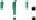{width="0.375in"
> height="0.20839457567804023in"}

2.  . Object Literal {width="6.25e-2in"
    height="0.15629593175853018in"}javascript code const person
    firstName : \'John\', lastName \'Doe\', age 30

3.  Array Declaration :

> javascript code constnumbers
> \[{width="0.8020833333333334in"
> height="0.2500732720909886in"}

### Comments

> Comments in JavaScript are used to add explanatory notes within the
> code They are ignored by the interpreter and are only meant for human
> readers
> {width="4.1666666666666664e-2in"
> height="4.167869641294838e-2in"}

Examples ofJavaScript Comments :

1.  Single Line Comment :

> javascript code
>
> // This is a single line comment

2.  . Multi - line Comment :

> javascript code

This is a multi - line comment

3.  Commenting Out Code :

> javascript code
>
> // This code won\'t be executed
>
> // const x 10;

#### JavaScript Variables

> Variables in JavaScript are used to store data values . They can hold
> various types of data such as numbers, strings, objects, and more ,

Examples ofJavaScript Variables :

1.  Declaring and Assigning a Variable :

> javascript code let age = 25; // Declaring \'age^i^ and assigning a
> value of 25

2.  . String Variable :

> javascript code let name \'Alice\'; // A variable holding a string
> value

3.  Object Variable :

> javascript code let person {name : \'Bob, age : 30 // A variable
> holding an object

#### JavaScript let

> The let keyword is used to declare variables in JavaScript . It allows
> the declared variable to be reassigned a new value if
> needed{width="6.25e-2in"
> height="4.167869641294838e-2in"}

Example of let in JavaScript :

> java script code let x 5;
>
> 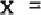{width="0.4270833333333333in"
> height="0.15629593175853018in"}10; // Reassigning \'x\' to a new value

#### JavaScript const

> The const keyword is used to declare constants in JavaScript . Once
> assigned, the value of a const cannot be
> changed{width="5.2083333333333336e-2in"
> height="4.167869641294838e-2in"}

Example of const in JavaScript :

> java script code const PI = 3 . 14159; // Declaring a constant PI
>
> // PI - - 3; // This will throw an error as reassignment is not
> allowed

#### JavaScript Operators

> JavaScript operators are symbols used to perform operations on
> operands, such as arithmetic operations, assignment, comparison,
> logical operations, etc .

Examples ofJavaScript Operators :

1.  . Arithmetic Operators :

> javascript code let a = 10; let b
> {width="0.5104166666666666in"
> height="0.19797462817147857in"}let sum = a + b; // Addition let
> difference = a - b; // Subtraction let product = a \* b; //
> Multiplication let quotient = a / b; // Division

2.  . Comparison Operators :

javascript code let x 5; let
y{width="0.6770833333333334in"
height="0.2500732720909886in"}

| console . log ( x             | > y ) ; // Equality check            |
| {width="0.125in" |                                      |
| height="2.08398950131         |                                      |
| 2336e-2in"}{width="0.125in" |                                      |
| heig                          |                                      |
| ht="3.1258748906386705e-2in"} |                                      |
| {width="0.125in" |                                      |
| height                        |                                      |
| ="4.167869641294838e-2in"}![] |                                      |
| (./images/image072.jpg){ |                                      |
| width="0.10416666666666667in" |                                      |
| hei                           |                                      |
| ght="2.083989501312336e-2in"} |                                      |
| ![]                           |                                      |
| (./images/image073.jpg){ |                                      |
| width="0.10416666666666667in" |                                      |
| height                        |                                      |
| ="2.083989501312336e-2in"}![] |                                      |
| (./images/image074.jpg){ |                                      |
| width="0.10416666666666667in" |                                      |
| hei                           |                                      |
| ght="4.167869641294838e-2in"} |                                      |

| console . log ( x             | y\) ; // Inequality check            |
| {wi |                                      |
| dth="4.1666666666666664e-2in" |                                      |
| height="                      |                                      |
| 4.167869641294838e-2in"}{wi |                                      |
| dth="4.1666666666666664e-2in" |                                      |
| he                            |                                      |
| ight="0.15629593175853018in"} |                                      |
| {width="0.125in" |                                      |
| height="2.08398950131         |                                      |
| 2336e-2in"}{width="0.125in" |                                      |
| hei                           |                                      |
| ght="4.167869641294838e-2in"} |                                      |
| {width="0.125in" |                                      |
| height="2.08398950131         |                                      |
| 2336e-2in"}{width="0.125in" |                                      |
| hei                           |                                      |
| ght="4.167869641294838e-2in"} |                                      |

> console . log ( x y) ; // Greater than console . log ( x \< y) ; //
> Less than

3.  Logical Operators :

> javascript code let p true; let q false; console . log ( p &&q); //
> Logical AND console . log ( p Il q ) ; // Logical OR console . log (!
> p ) ; // Logical NOT
>
> This comprehensive guide covers various aspects of JavaScript
> statements, syntax, comments, variables ( let and const ) , and
> operators, offering examples and explanations to aid understanding ,

## JS Arithmetic

> JavaScript provides arithmetic operators to perform mathematical
> calculations on numbers ,

Examples ofJS Arithmetic :

> Addition :
>
> javascript code let sum = 5 4 3• // sum = 8
>
> Subtraction :
>
> javascript code let difference = 10 - 4; // difference 6
>
> Multiplication :
>
> javascript code let product 7; // product 42
>
> Division {width="6.25e-2in"
> height="0.14587598425196852in"}java script code let quotient = 20/ 5;
> // quotient = 4
>
> Modulus ( Remainder ):
>
> javascript code let remainder = 15 % 4; //
> remainder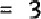{width="0.4270833333333333in"
> height="0.19797462817147857in"}

### JS Assignment

> In JavaScript, the assignment operator (z) is used to assign values to
> variables . Examples ofJS Assignment :
>
> Assigning a Value to a Variable :
>
> javascript code let x = 10; // Assigning the value 10 to variable •x\'
>
> Assigning the Result of an Expression :
>
> javascript code let y = x 4 5; // Assigning the result of an
> expression to ^l^y^r^

#### JS Data Types

> JavaScript has several data types that define the kinds of values it
> can work with . Examples ofJS Data Types : Primitive Data Types :

{width="4.1666666666666664e-2in" height="4.167869641294838e-2in"} Number : letnum - 10;

-   String : let text - \'Hello\';

-   Boolean : let isTrue true;

-   Undefined let value;

-   Null T. let emptyValue null;

> Complex Data Types :

-   Object . let person = (name : \'Alice\', age : 25 1;

-   Array: let numbers \[ 1, 2, 3, 41 5 \] ;

## JS Functions

> Functions in JavaScript are reusable blocks of code that perform a
> specific task when called .

Examples ofJS Functions :

> Function Declaration :
>
> javascript code function greet ( name ) { return \'Hello, + name
> +{width="0.375in"
> height="0.20839457567804023in"}
>
> Function Call {width="6.25e-2in"
> height="0.15629593175853018in"}javascript code let message = greet (
> \'John\' ) ; // message = \'Hello, John ! \'
>
> Arrow Function :
>
> javascript code const multiply ( a, b ) = \> a
> 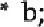{width="0.4583333333333333in"
> height="0.2813331146106737in"}let result multiply ( 5, 3 ) ; // result
> 15

### JS Objects

> Objects in JavaScript are containers for named values called
> properties and methods . Examples ofJS Objects :
>
> Object Declaration :
>
> javascript code let person { name : \'Alice\', age : 30,
>
> greet : function
> {width="0.4166666666666667in"
> height="0.2604932195975503in"}return \'Helloj my name is ^i^ -v this .
> name 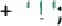{width="0.6458333333333334in"
> height="0.270913167104112in"}
>
> Accessing Object Properties :
>
> javascript code console . log ( person . name ) ; // Output : Alice
>
> Calling Object Method :
>
> javascript code console . log ( person greet ; // Output : Hello, my
> name is Alice !

# JS Events

> JavaScript events are actions that occur when a user interacts with a
> web page, like clicking a button or typing in a form
> field{width="4.1666666666666664e-2in"
> height="4.167869641294838e-2in"}

Examples ofJS Events :

> Click Event :
>
> javascript code document . getElementById ( \'myButton\' ).
> addEventListener ( \'click\', function
> 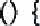{width="0.4166666666666667in"
> height="0.270913167104112in"}console . log ( \'Button clicked ! ) ;
>
> Input Event :
>
> javascript code
>
> document . getElementById ( \'mylnput^i^ addEventListener ( \'input\',
> function 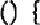{width="0.4166666666666667in"
> height="0.2604932195975503in"}console . log ( \'Input changed ! ^i^ )
> •

## JS Strings

> Strings in JavaScript are sequences of characters enclosed in single
> or double quotes
> {width="4.1666666666666664e-2in"
> height="4.167869641294838e-2in"}Examples ofJS Strings :
>
> Declaring a String Variable :
>
> javascript code let message = \"Helloj World
> !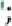{width="0.125in"
> height="0.270913167104112in"}
>
> Concatenating Strings :
>
> javascript code let greeting \'Hello, ^I^; let name \'Alice\'; let
> welcomeMessage greeting + name; // welcomeMessage - \'Hello, Alice

### JS String Methods

> JavaScript provides various methods to manipulate strings . Examples
> ofJS String Methods :
>
> toUpperCase () Method :
>
> javascript code let text = \'hello\';
>
> let upperCaseText = text . toUpperCase () ; // upperCaseText = \'HELLO
> substring () Method :
>
> javascript code let sentence - This is a sentence\'; let subSentence
> sentence . substring( 5, 10 ) ; // subSentence - \'is a \'

### JS String Search

> JavaScript provides methods to search for substrings within a string .
> Examples ofJS String Search :
>
> indexOf () Method :

javascript code let text = \'Hello, World ! \'i let position text .
indexOf ( \'Worldl ) ; // position = 7 includes Method :

> javascript code let sentence This is a sentence\'; let containsWord
> sentence . includes ( \'sentence\' ) ; // containsWord true

#### JS String Templates

> Template literals allow embedding expressions and variables into
> strings
> {width="5.2083333333333336e-2in"
> height="4.167869641294838e-2in"}Examples ofJS String Templates :
>
> Basic Template Literal :
>
> javascript code let name = \'Alice\'; let message = Hello, \${name) •
> // message = \*Hello, Alice !
> {width="3.125e-2in"
> height="0.10419728783902012in"}
>
> Multi - line Template Literal :
>
> javascript code let multiLineMessage -
>
> This is a multi - line message
> .{width="6.25e-2in"
> height="0.20839457567804023in"}

#### JS Numbers

> JavaScript handles numeric data using the number data type .
>
> Examples ofJS Numbers :
>
> Whole Numbers :
>
> javascript code let integerNumber
> {width="0.6770833333333334in"
> height="0.2500732720909886in"}Decimal Numbers :
>
> javascript code let decimalNumber 3 .
> 14{width="5.2083333333333336e-2in"
> height="5.209864391951006e-2in"}
>
> Scientific Notation :
>
> javascript code let scientificNumber = 2e3; // scientificNumber \--
> 2000

##### JS Biglnt

> Biglnt is a numeric data type in JavaScript that can represent
> integers with arbitrary
> precision{width="6.25e-2in"
> height="4.167869641294838e-2in"}

Examples ofJS Biglnt :

> Creating a Biglnt :
>
> javascript code let bigNumber 123456789012345678901234567890n;
>
> Performing Operations with Biglnt :
>
> javascript code let bigSum = bigNumher In;

###### JS Number Methods

> JavaScript provides methods for performing operations and
> manipulations with numbers . Examples ofJS Number Methods :
>
> toFixed () Method :
>
> java script code let number = 3. 14159; let roundedNumber = number .
> toFixed ( 2 ) ; // roundedNumber = ^i^ 3 • 14
> {width="2.0833333333333332e-2in"
> height="0.10419838145231847in"}parselnt () Method :

javascript code let stringNumber \'42; let parsedNumber = parselnt (
stringNumber) ; // parsedNumber 42

#### JS Number Properties

> JavaScript has some built - in properties associated with numbers .
> Examples ofJS Number Properties :
>
> Number . MAX_VALUE Property :
>
> javascript code console . log ( Number . MAX_VALUE); // Output: 1 .
> 7976931348623157e 308

Number . MIN_VALUE Property :

> javascript code console . log ( Number . MIN_VALUE // Output: 324
>
> This comprehensive guide covers various aspects of JavaScript,
> including arithmetic operations, assignment, data types, functions,
> objects, events, strings, string methods, string search, string
> templates, numbers, Biglnt, number methods, and number properties,
> providing examples and explanations for each topic .

##### JS Arrays

> Arrays in JavaScript are used to store multiple values in a single
> variable . Examples ofJS Arrays :
>
> Declaration {width="6.25e-2in"
> height="0.15629593175853018in"}java script code let numbers 1, 2, 3,
> \] ; // Array of numbers let fruits \'apple\', \'banana\', \'orange\'
> I ; // Array of strings
>
> Accessing Elements :
>
> javascript code console . log ( fruits I O \]) ; // Output : \'apple\'
>
> Modifying Elements :
>
> javascript code fruits \[ 1 \| = \'grapes\'; // Changing banana\' to
> \'grapes\'

{width="8.722222222222221in"
height="11.805555555555555in"}

##### JS Array Methods

> JavaScript provides various methods to manipulate arrays effciently .
> Examples ofJS Array Methods :
>
> push () Method :
>
> javascript code fruits . push ( \'melonl ) ; // Adds Imelonl to the
> end of the array pop Method :
>
> javascript code let removedFruit = fruits . POP ) ; // Removes and
> returns the last element ( \'melon\' ) splice () Method :
>
> javascript code numbers splice ( 2, 1 ) ; // Removes 1 element at
> index 2 ( removes 131 )

###### JS Array Sort

> JavaScript offers methods to sort arrays in various ways
> {width="3.125e-2in"
> height="4.167869641294838e-2in"}Examples ofJS Array Sort :
>
> Sorting Numbers :
>
> java script code numbers . sort (( a, b )
> =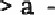{width="0.5729166666666666in"
> height="0.15629593175853018in"}b ) // Ascending order
>
> Sorting Strings {width="6.25e-2in"
> height="0.15629593175853018in"}javascript code fruits . sortO ; //
> Alphabetical order

## JS Array Iteration

> Array iteration involves looping through arrays to perform operations
> on each element . Examples ofJS Array Iteration :
>
> forEach () Method :
>
> javascript code numbers . fcrEach ( number
> 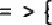{width="0.5416666666666666in"
> height="0.2604932195975503in"}console . log ( number ) ;
>
> map () Method :
>
> javascript code let doubledNumbers numbers . map ( number \> number \*
> 2 );

### JS Array Const

> Arrays declared with const can\'t be reassigned but their elements can
> be modified .

Examples ofJS Array Const :

> javascript code constweekdays = \[ \'Monday\', \'Tuesday\',
> \'Wednesday\' I ; weekdays \| 1 \| = \'Thursday\'; // Modifying an
> element is allowed
>
> // weekdays = \'Monday\', \'Thursday\', ^i^Wednesday\' \] ; // This
> will throw an error

#### JS Dates

> JavaScript provides a Date object to work with dates and times
> {width="4.1666666666666664e-2in"
> height="4.167869641294838e-2in"}Examples ofJS Dates :
>
> Creating a Date Object :
>
> javascript code let currentDate = new
> Date{width="0.3229166666666667in"
> height="0.2604932195975503in"}// Current date and time
>
> Creating a Specific Date :
>
> javascript code let specificDate new Date ( \'2023 - 12 - 31\' ) ; //
> December 31, 2023

### JS Date Formats

> Date formatting in JavaScript involves converting dates to different
> formats . Examples ofJS Date Formats :
>
> Formatting to String
> {width="6.25e-2in"
> height="0.15629593175853018in"}java script code let dateString =
> specificDate . toDateString ; // Convert to a human - readable string
>
> Formatting to Locale String :
>
> javascript code let localeString specificDate . toLocaleString () ; //
> Convert to local date and time string

#### Date Get Methods

> JavaScript Date object provides various methods to retrieve specific
> date
> components{width="4.1666666666666664e-2in"
> height="4.167869641294838e-2in"}

Examples ofJS Date Get Methods :

> getFu11Year () Method
> {width="6.25e-2in"
> height="0.14587598425196852in"}javascript code let year = specificDate
> . getFullYearO; // Get the year ( 2023 ) getMonth () Method :
>
> javascript code let month = specificDate . getMonth ; // Get the month
> ( 11 for December )

#### JS Date Set Methods

> JavaScript Date object also has methods to set specific date
> components .

Examples ofJS Date Set Methods :

> setFuIIYear () Method :
>
> javascript code specificDate . setFullYear ( 2024 ) ; // Set the year
> to 2024 setMonth () Method :
>
> javascript code specificDate . setMonth ( O ) ; // Set the month to
> January ( O index )

#### Math

> JavaScript Math object provides mathematical constants and functions
> {width="4.1666666666666664e-2in"
> height="4.167869641294838e-2in"}

Examples ofJS Math :

> Math . PI Property :
>
> javascript code let piValue = Math . PI; // Value ofPl (3 .
> 141592653589793 )
>
> Math . sqrt () Method :
>
> javascript code let squareRcot Math . sqrt ( 25 ) ; // Square root of
> 25 ( 5 )

##### JS Random

> JavaScript Math . random () generates pseudo - random numbers .

Examples ofJS Random :

> Generating Random Number :
>
> javascript code let randomNumber = Math . random \' // Random number
> between O and 1
>
> Generating Random Integer :
>
> javascript code let randomlnteger = Math . floor ( Math . random 10 )
> ; // Random integer between O and 9

##### Booleans

> Booleans in JavaScript represent true or false values . Examples ofJS
> Booleans :
>
> Declaration :

javascript code let isTrue = true
{width="6.25e-2in"
height="5.209864391951006e-2in"}let isFalse = false; Comparison :

> javascript code let greaterThan // true let equalTo 5 5; // true

#### JS Comparisons

> JavaScript offers various comparison operators to compare values .
> Examples ofJS Comparisons :
>
> ==( Equality Operator ):
>
> javascript code console . log ( 5 ) ; // true ( coerces types )
>
> 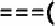{width="0.5729166666666666in"
> height="0.270913167104112in"}Strict Equality Operator ):
>
> javascript code console . log ( 5
> {width="0.4166666666666667in"
> height="8.335739282589676e-2in"}151 ) ; // false ( compares both value
> and type )
>
> This comprehensive guide covers various aspects of JavaScript
> including arrays, array methods, array sort, array iteration; array
> const, dates, date formats, date get methods, date set methods, math,
> random, booleans, and comparisons, providing examples and explanations
> for each topic .

##### JS If Else

> The if else statement in JavaScript executes a block of code if a
> specified condition is true and another block of code if the condition
> is false
> {width="4.1666666666666664e-2in"
> height="4.167869641294838e-2in"}

Examples ofJS If Else :

Basic if else :

> java script code let num = 10;
>
> If ( num \> O) { console . log ( \"Number is
> positive\'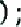{width="0.21875in"
> height="0.2813331146106737in"}
>
> ) else f console . log ( \'Number is not
> positive\'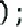{width="0.22916666666666666in"
> height="0.2813331146106737in"}
>
> Nested if \... else:
>
> javascript code let x 5; if (x \> O) { console .
> log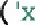{width="0.3645833333333333in"
> height="0.2604932195975503in"}is
> positive\'{width="0.22916666666666666in"
> height="0.270913167104112in"}
>
> } else if ( x \< O )
> {width="8.333333333333333e-2in"
> height="0.2604932195975503in"}console log
> {width="8.333333333333333e-2in"
> height="0.2604932195975503in"} \"x is
> negativel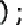{width="0.22916666666666666in"
> height="0.2604932195975503in"}
>
> ) else f console . log ( is zeroi ) ;

#### JS Switch

> The switch statement in JavaScript executes different actions based on
> different conditions
> {width="4.1666666666666664e-2in"
> height="4.167869641294838e-2in"}Examples ofJS Switch :
>
> Basic switch :
>
> javascript code let day
> {width="0.5104166666666666in"
> height="0.2500732720909886in"}switch ( day ) \[ case 1
> {width="4.1666666666666664e-2in"
> height="0.13545603674540682in"}console . log ( iMonday• ) ; break;
> case 2 :
>
> console . log ( ^i^ Tuesday ) ; break; default :
>
> console . log ( Other day\' ) ;

##### JS Loop For

> The for loop in JavaScript repeatedly executes a block of code until a
> specified condition evaluates to false
> {width="4.1666666666666664e-2in"
> height="4.167869641294838e-2in"}

Examples of JS Loop For :

Basic for Loop :

> javascript code for ( let i = + + ) I console . log ( i) ;
>
> Looping Array Elements :
>
> javascript code let arr \'applet, banana\', \'orange\' \] ; for ( let
> i O; i \< arr . length; i ++) { console . log ( arr \[ i \]) ;

##### JS Loop For In

> The for \... in loop in JavaScript iterates over the enumerable
> properties of an object .

Examples ofJS Loop For In :

Iterating Object Properties
{width="6.25e-2in"
height="0.15629702537182852in"}javascript code let person = { name :
IAIiceI, age 30, gender : female\'

> for ( let prop in person ) { console . log ( prop + person \[ prop l)
> ;

##### JS Loop For Of

> The for of loop in JavaScript iterates over iterable objects such as
> arrays, strings, etc
> {width="4.1666666666666664e-2in"
> height="4.167869641294838e-2in"}Examples ofJS Loop For Of :
>
> Iterating Over Array Elements :
>
> java script code let numbers
> {width="1.8125in"
> height="0.2813331146106737in"}for ( let num of numbers ) f console .
> log ( num ) ;

##### JS Loop While

> The while loop in JavaScript executes a block of code while a
> specified condition is true
> {width="4.1666666666666664e-2in"
> height="4.167979002624672e-2in"}Examples ofJS Loop While :

Basic while Loop :

> java script code let count = o; while ( count \<
> 5{width="0.3229166666666667in"
> height="0.26049431321084865in"}
>
> console . log ( count) ;
>
> {width="1.3020833333333333in"
> height="0.21881452318460193in"}

##### JS Break

> The break statement in JavaScript terminates the current loop or
> switch statement
> {width="4.1666666666666664e-2in"
> height="4.167869641294838e-2in"}Examples ofJS Break :
>
> Using break in a Loop :
>
> javascript code
>
> for ( let 1
> {width="2.2604166666666665in"
> height="0.2813331146106737in"}if ( i 5) {
>
> break;
>
> console . log ( i ) ;

### JS Iterables

> Iterables in JavaScript are objects that can be iterated over using
> loops {width="4.1666666666666664e-2in"
> height="4.167979002624672e-2in"}Examples ofJS Iterables :
>
> Using Iterables with for of :
>
> javascript code let iterable = I 10, 20,
> 30{width="0.19791666666666666in"
> height="0.2813331146106737in"}
>
> for ( let value of iterable ) { console . log ( value ) ;

#### JS Sets

> Sets in JavaScript are collections of unique values
> {width="4.1666666666666664e-2in"
> height="4.167869641294838e-2in"}Examples ofJS Sets :
>
> Creating a Set :
>
> javascript code let mySet = new Set () ; mySet . add ( 1
> {width="0.21875in"
> height="0.2813331146106737in"}mySet . add ( 2
> {width="0.21875in"
> height="0.2813331146106737in"}mySet . add ( 3
> {width="0.21875in"
> height="0.2813331146106737in"}Iterating Over a Set :
>
> java script code for ( letitem of mySet)
> {width="8.333333333333333e-2in"
> height="0.26049431321084865in"}console log ( item ) ;

##### JS Maps

> Maps in JavaScript are collections of key - value pairs where keys can
> be any type .

Examples ofJS Maps :

> Creating a Map {width="6.25e-2in"
> height="0.14587598425196852in"}javascript code let myMap = new Map ;
> myMap . set ( \'key 1\', \'valueli ) ; myMap . set ( ikey2i, \'value2i
> ) ;
>
> Iterating Over a Map :
>
> javascript code for ( let \[ key, value I of myMap ) { console . log (
> key \_ • value ) ;

##### JS Typeof

> The typeof operator in JavaScript returns the data type of its operand
> . Examples ofJS Typeof :
>
> Using typeof :
>
> javascript code console . log ( typeof5 ) // Output : \'numberl
> console . log ( typeof\'Hello\' ) ; // Output : \'string\' console .
> log ( typeoftrue ) ; // Output : boolean\'

###### JS Type Conversion

> Type conversion in JavaScript involves converting values from one data
> type to another . Examples ofJS Type Conversion :
>
> String to Number :
>
> javascript code let strNumber = \'10
> {width="0.11458333333333333in"
> height="0.1146172353455818in"}let num = parselnt ( strNumber ) ;
>
> Number to String {width="6.25e-2in"
> height="0.15629593175853018in"}javascript code let number
> {width="0.6979166666666666in"
> height="0.19797462817147857in"}let str = number .
> toString{width="0.3229166666666667in"
> height="0.270913167104112in"}

###### JS Bitwise

> Bitwise operators in JavaScript perform operations on the binary
> representations of numeric values .

Examples ofJS Bitwise :

> Bitwise AND Operator :
>
> javascript code let result 5 & 3; // Output: 1

Bitwise OR Operator {width="6.25e-2in"
height="0.15629702537182852in"}javascript code let result 5 1 3; //
Output: 7

####### JS RegExp

> Regular expressions in JavaScript are used for pattern matching within
> strings . Examples ofJS RegExp :
>
> Creating a Regular Expression :
>
> javascript code let pattern = / hello / i; // Case - insensitive
> \'hello^i^
>
> Testing a String with RegExp :
>
> javascript code let str = \'Hello, World
> !{width="0.11458333333333333in"
> height="0.2604932195975503in"}
>
> console . log ( pattern . test ( str )) ; // Output : true

###### JS Precedence

> Operator precedence in JavaScript determines the order of operations
> in an expression .

Examples of JS Precedence :

> Arithmetic Precedence :
>
> java script code let result 5 3\* 2; // Output: 11 ( Multiplication
> has higher precedence )

##### JS Errors

> Errors in JavaScript can be generated when an incorrect code is
> encountered during execution .

Examples ofJS Errors :

> Syntax Error :
>
> javascript code let x = 10
>
> This will throw a syntax error due to the missing semicolon .
>
> Reference Error :
>
> javascript code console . log ( undefinedVariable ) ;
>
> This will throw a reference error as undefinedVariable is not defined
> .

###### JS Scope

> Scope in JavaScript defines the visibility and accessibility of
> variables . Examples ofJS Scope :
>
> Global Scope {width="6.25e-2in"
> height="0.15629593175853018in"}javascript code let globalVar Il am
> global\';
>
> function test f console . log ( globalVar ) ; // Accessible inside
> function
>
> console . log ( globalVar ) ; // Accessible outside function

### JS Hoisting

> Hoisting in JavaScript allows variables and functions to be used
> before they are declared Examples ofJS Hoisting :
>
> Variable Hoisting :
>
> javascript code console . log ( myVar ) ; // Outputs : undefined
> varmyVar \-- 10; Function Hoisting :

javascript code sayHellc ; // Outputs : \'Hello\' function sayHello
{width="0.4166666666666667in"
height="0.2604932195975503in"}console . log ( \'Hello\' ) ;

## JS Strict Mode

> Strict mode in JavaScript enforces stricter rules and better error
> handling . Examples ofJS Strict Mode :
>
> Enabling Strict Mode
> {width="6.25e-2in"
> height="0.15629593175853018in"}javascript code \'use strict\';
>
> Using Strict Mode Inside a Function
> {width="6.25e-2in"
> height="0.15629593175853018in"}javascript code function myFunction {
>
> \'use strict\';
>
> // Strict mode only applies inside this function

### JS this Keyword

> The this keyword in JavaScript refers to the object it belongs to .
> Examples ofJS this Keyword :
>
> Using this in an Object
> {width="6.25e-2in"
> height="0.15629593175853018in"}javascript code let person = { name :
> \'Alice\', greet : function
> {width="0.4166666666666667in"
> height="0.26049431321084865in"}console . log ( \'Hello, my name is \'
> this . name ) ;
>
> person . greet ; // Outputs : \'Hello, my name is Alice\'

### JS Arrow Function

Arrow functions in JavaScript provide a concise syntax for writing
functions .

Arrow Function :

> Basic Arrow Function :
>
> javascript code let multiply = ( aj b) = s a \* b;
>
> Arrow Function with Multiple Lines
> {width="6.25e-2in"
> height="0.15629593175853018in"}javascript code let greet ( name ) \> {
> return \'Hello, \' + name +
> {width="0.375in"
> height="0.2604932195975503in"}

#### JS Classes

> Classes in JavaScript provide a way to create objects using a
> blueprint .

Examples ofJS Classes :

> Class Declaration :
>
> javascript code class Person { constructor ( name ) { this . name
> name;
>
> greet () { console . log ( \'Hello, my name is \' this . name ) ;
>
> let alice = new Person ( \'Alice\'
> {width="0.21875in"
> height="0.2604932195975503in"}alice . greet ; // Outputs : \'Hello, my
> name is Alice\'

#### JS Modules

> Modules in JavaScript allow splitting code into separate files or
> modules for better organization
> {width="4.1666666666666664e-2in"
> height="4.167869641294838e-2in"}Examples ofJS Modules :
>
> Exporting a Module {width="6.25e-2in"
> height="0.14587598425196852in"}javascript code // Module . js export
> function greet ( name) { console . log ( \'Hello, i 4
> name{width="0.8854166666666666in"
> height="0.2813331146106737in"}
>
> Importing a Module :
>
> java script code // Main . js import \[ greet } from ./ Module . js\';
> greet ( \'Alice\' ) ; // Outputs : \'Hello, Alice ! I

##### JS JSON

> JSON ( JavaScript Object Notation ) is a lightweight data interchange
> format .
>
> JSON :
>
> Parsing JSON :

javascript code let jsonStr = name Alice j age u: 30)^i^; let obj = JSON
. parse ( jsonStr ) ; console . log ( obj . name ) ; // Output :
\'Alice\'

> Stringify Object to JSON :
>
> javascript code let obj {name : Alice\', age: 30 l; let jsonString =
> JSON . stringify (obj ) ;

#### JS Debugging

> Debugging in JavaScript involves identifying and fixing errors or
> issues in the code . Examples ofJS Debugging :
>
> Using console . log () for Debugging :

javascript code let x 5; console . log ( x ) ;

> Using Browser Developer Tools :
>
> Inspect elements, view console logs, set breakpoints, etc .

#### JS Style Guide

> A JavaScript style guide defines a set of rules and conventions for
> writing clean and maintainable code . Examples ofJS Style Guide :
>
> Naming Conventions :
>
> Use camelCase for variable and function names .
>
> Indentation :
>
> Use consistent spaces or tabs for indentation .

#### JS Best Practices

> Best practices in JavaScript ensure code quality, readability, and
> maintainability . Examples ofJS Best Practices :
>
> Use Meaningful Variable Names :
>
> javascript code letd new Date () ; // Instead, use let currentDate new
> Date () ;
>
> Avoid Global Variables :
>
> Encapsulate code to avoid polluting the global scope .

#### JS Mistakes

> Common mistakes in JavaScript and how to avoid thern .
>
> Mistakes :
>
> Missing Semicolon :
>
> javascript code let x = 5
>
> Remember to add a semicolon at the end of the
> statement{width="4.1666666666666664e-2in"
> height="4.167869641294838e-2in"}
>
> Uninitialized Variables :

javascript code let y; console . log ( y) ; // Outputs : undefined

#### JS Performance

> Improving performance in JavaScript involves optimizing code for speed
> and emciency . Examples ofJS Performance :
>
> Reduce DOM Manipulations :
>
> Combine multiple DOM updates into one to reduce reflows .
>
> Use Eficient
> Algorithms{width="6.25e-2in"
> height="0.15629593175853018in"}
>
> Choose algorithms that have better time complexity for operations .

##### JS Reserved Words

> Reserved words in JavaScript have special meanings and cannot be used
> as identifiers ( variable or function
> names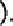{width="0.13541666666666666in"
> height="0.270913167104112in"}

Examples ofJS Reserved Words :

> let , const function class , etc .
>
> This comprehensive guide covers a wide range of JavaScript topics
> including conditional statements, loops, data structures, type
> handling, advanced features, error handling, best practices, common
> mistakes, and performance optimization . JS Objects
>
> Objects in JavaScript are collections of key - value pairs . They
> store data as properties ( variables ) and functionality as methods (
> functions{width="0.15625in"
> height="0.2604932195975503in"}

Object Definitions :

> Creating an Object Literally :
>
> javascript code let person = f name : \'Alice% age 30, greet :
> function {width="0.4166666666666667in"
> height="0.26049431321084865in"}return \'Helloj my name is ^i^ -v this
> . name;
>
> Using the Object Constructor :
>
> javascript code let car new Object O;
>
> car . brand = \'Toyota\'; car . model = \'Camry\'; Object Properties
>
> Properties in JavaScript objects are variables that hold values
> {width="4.1666666666666664e-2in"
> height="4.167869641294838e-2in"}Object Properties Examples :
>
> Accessing Object Properties :
>
> javascript code console . log ( person name ) // Accessing property
> \'namet
>
> Adding or Modifying Properties :
>
> javascript code car . color \'blue\'; // Adding property \'color\' car
> . model \'Corolla\'; // Modifying property \'model\'

##### Object Methods

> Methods in JavaScript objects are functions that define behavior .
> Object Methods Examples :
>
> Accessing Object Methods
> {width="6.25e-2in"
> height="0.15629593175853018in"}javascript code console . log ( person
> . greet ; // Accessing method greet\'
>
> Adding Methods to an Object :
>
> java script code
>
> car . start = function return \'Car started\'; l;

###### Object Display

> Displaying objects in JavaScript can be done using various methods .
> Object Display Examples :
>
> Using console . log {width="0.25in"
> height="0.2604932195975503in"}javascript code console . log ( person )
> ; // Output the entire object
>
> Stringify with JSON :
>
> javascript code let carString JSON . stringify ( car ) ; console . log
> ( carString ) ; // Output the string representation of the object

#### Object Accessors

> Accessors in JavaScript objects provide a way to get and set the
> values of object properties . Object Accessors Examples :
>
> Using Getters and Setters :
>
> javascript code let user --- firstName : \'John\',
>
> lastName : \'Doe\', get fullName () f return this . firstName + + this
> lastName;
>
> set fullName ( name ) f let parts = name . split ; this . firstName =
> parts \[ O {width="0.1875in"
> height="0.2813331146106737in"}this . lastName = parts \[ 1 \] ;

console . log ( user. fullName ) ; // Output : John Doe\' user .
fullName = \'Alice Smith\'; // Setting fiillName using setter console .
log ( user. firstName ) ; // Output : \'Alice\'

### Object Constructors

> Constructors in JavaScript are functions used for creating objects and
> setting initial values
> {width="6.25e-2in"
> height="4.167869641294838e-2in"}Object Constructors Examples :
>
> Using Constructor Functions :
>
> javascript code function Person ( name, age ) { this . name name; this
> . age age; this . greet = function
> 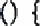{width="0.4166666666666667in"
> height="0.270913167104112in"}return \'Helloj my name is ^i^ -v this .
> name;
>
> let newPerson \* new Person ( \'Bob\', 25
> 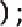{width="0.22916666666666666in"
> height="0.2813331146106737in"}console . log ( newPerson . greet ()) ;
> // Output : \'Hello, my narne is Bob\'

### Object Prototypes

> Prototypes in JavaScript are a mechanism to share properties and
> methods between objects . Object Prototypes Examples :
>
> Adding Methods to the Prototype :
>
> javascript code
>
> Person . prototype . info function
> 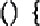{width="0.4166666666666667in"
> height="0.270913167104112in"}return \'Name: + this . name +
> 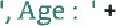{width="1.2083333333333333in"
> height="0.270913167104112in"} this . age;
>
> console . log ( newPerson . info ()) ; // Output: \'Name : Bob, Age
> 251

#### Object Iterables

> Iterables in JavaScript are objects that can be iterated using loops .

Object Iterables Examples :

> Using for \... in Loop :
>
> javascript code
>
> for ( let key in person ) { console . log ( key person \[ key l) ;
>
> Using Object . keys C):
>
> java script code let keys = Object . keys ( person ) ; // Get an array
> of object keys

##### Object Sets

> Sets in JavaScript are collections of unique values .

Object Sets Examples :

> Creating a Set :
>
> javascript code let mySet = new Set ; mySet . add ( 1
> {width="0.21875in"
> height="0.27091207349081364in"}mySet . add ( 2
> {width="0.21875in"
> height="0.270913167104112in"}mySet . add (
> 3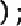{width="0.21875in"
> height="0.270913167104112in"}
>
> Checking Set Membership :
>
> javascript code console . log ( mySet . has ( 2 )) ; // Output : true

##### Object Maps

> Maps in JavaScript are collections of key - value pairs where keys can
> be any type .

Object Maps Examples :

> Creating a Map {width="6.25e-2in"
> height="0.14587598425196852in"}javascript code let myMap = new Map ;
> myMap . set ( ikeyli, \'valueli ) ; myMap . set ( ikey2\', ivalue2i )
> ; Getting Values from a Map :
>
> javascript code console . log ( myMap . get ( \'key Il )) ; // Output
> : \'value?

##### Object Reference

> In JavaScript, objects are stored and passed by reference . Object
> Reference Examples :
>
> Referencing an Object :

javascript code let objectl - {name: \'John\'\]
{width="5.2083333333333336e-2in"
height="0.19797462817147857in"}let object2 = objectl; // object2 points
to the same object as objectl

> Changing Object through Reference :

javascript code object2 name = \'Alice\'; console . log ( objectl . name
) ; // Output : \'Alice\'

> This comprehensive guide covers various aspects of JavaScript objects,
> including definitions, properties, methods, display, accessors,
> constructorsj prototypes, iterables, sets; maps, and object
> references, with examples and explanations for each concept .

#### JS Functions

> Functions in JavaScript are reusable blocks of code that perform a
> specific task when
> called{width="4.1666666666666664e-2in"
> height="4.167869641294838e-2in"}

Function Definitions :

> Function Declaration :
>
> javascript code function greet () \[ return \'Hello ! \'i

Function Expression {width="6.25e-2in"
height="0.15629593175853018in"}javascript code let greet function {
return \'Hello
!{width="0.11458333333333333in"
height="0.1146172353455818in"}

> Arrow Function :
>
> javascript code let greet \> {
>
> return \'Hello ! \';

#### Function Parameters

> Function parameters are placeholders for values that a function will
> receive when it\'s called
> {width="4.1666666666666664e-2in"
> height="4.167869641294838e-2in"}Function Parameters Examples :
>
> Single Parameter :
>
> javascript code function greet ( name ) { return \'Hello, + name
> +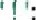{width="0.375in"
> height="0.20839457567804023in"}
>
> Multiple Parameters {width="6.25e-2in"
> height="0.15629593175853018in"}javascript code function sum ( a, b) {
> return{width="0.7916666666666666in"
> height="0.16671587926509188in"}

#### Function Invocation

> Function invocation means calling a function to execute its code .
> Function Invocation Examples :
>
> Calling a Function :
>
> javascript code greet O ; // Function call let result sum ( 5, 3 ) ;
> // Function call with arguments

##### Function Call

> The call () method in JavaScript allows a function to be called with a
> specified this value and arguments provided individually .

Function Call Examples :

> Using call {width="0.25in"
> height="0.2604932195975503in"}javascript code function greet () \[
> return \'Hello, + this . name + t\'
> !{width="0.11458333333333333in"
> height="0.1146172353455818in"}
>
> let person { name : \'Alice\'
> 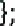{width="0.15625in"
> height="0.270913167104112in"}let message greet . call ( person) ;

##### Function Apply

> The apply () method in JavaScript allows a function to be called with
> a specified this value and arguments provided as an
> array{width="5.2083333333333336e-2in"
> height="4.167979002624672e-2in"}

Function Apply Examples :

> Using apply C):
>
> javascript code function greet ()
> 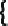{width="8.333333333333333e-2in"
> height="0.270913167104112in"}return \'Hello, + this . name +
> {width="0.375in"
> height="0.2604932195975503in"}
>
> let person name
> 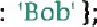{width="1.0104166666666667in"
> height="0.2813331146106737in"}let args = \[l ; let message = greet .
> apply ( person, args ) ;

##### Function Bind

> The bind () method in JavaScript creates a new function that, when
> called, has its this keyword set to a specified value . Function Bind
> Examples :
>
> Using bind C):
>
> javascript code function greet () \[ return \'Hello, \' + this . name
> +{width="0.375in"
> height="0.20839457567804023in"}
>
> let person {name: \'Charlie\'
> 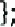{width="0.15625in"
> height="0.2813331146106737in"}let newGreet greet . bind (person ) ;
> let message = newGreet () ;

##### Function Closures

> Closures in JavaScript are functions that retain access to variables
> in the scope where they were defined , Function Closures Examples :
>
> Closure Example :
>
> javascript code function outerFunction let outerVariable = \'I am from
> the outer function\';
>
> function innerFunction () { console . log ( outerVariable ) ;
>
> return innerFunction;
>
> let closure = outerFunction
> {width="4.1666666666666664e-2in"
> height="4.167869641294838e-2in"}closure () ; // Output : il am from
> the outer functioni
>
> This comprehensive guide covers various aspects of JavaScript
> functions, including definitions, parameters, invocation, call, apply,
> bind, and closures, with examples and explanations for each concept
> {width="4.1666666666666664e-2in"
> height="4.167869641294838e-2in"}

###### JS Classes

> Classes in JavaScript provide a way to create objects using a
> blueprint Class Intro : Class Declaration :
>
> javascript code class Animal constructor ( name, age ) { this . name =
> name;
>
> this age = age;
>
> sound () f return \'Animal sound\';
>
> Creating Instances {width="6.25e-2in"
> height="0.15629593175853018in"}javascript code let dog = new Animal(
> \'Buddy\', 3 ) ; console . log ( dog . sound ; // Output : \'Animal
> soundl

## Class Inheritance

> Inheritance in JavaScript classes allows a subclass to inherit
> properties and methods from a superclass .

Class Inheritance Example :

> Extending a Class :
>
> javascript code class Dog extends Animal { constructor ( name, age,
> breed ) \[ super ( name, age ) ; this . breed breed;
>
> sound () f return ^i^Woof
> !{width="0.11458333333333333in"
> height="0.1146172353455818in"}
>
> Using Inherited Methods :

javascript code let puppy = new Dog ( \'Max\', 1, \'Labrador\' ) ;
console . log ( puppy. sound ; // Output \'Woof !
{width="4.1666666666666664e-2in"
height="9.377734033245844e-2in"}

### Class Static

> Static methods in JavaScript classes are called on the class itself
> rather than on instances of the class .
>
> Class Static Example :
>
> Adding a Static Method :
>
> javascript code class Calculator static add ( a, b) { returna 4 b;
>
> let result = Calculator . add ( 5, 3
> {width="0.21875in"
> height="0.2813331146106737in"}console . log ( result) ; // Output: 8

### JS Async

> Asynchronous programming in JavaScript involves handling operations
> that don\'t execute immediately .

JS Callbacks

> Callbacks in JavaScript are functions passed as arguments to another
> function to be executed later
> {width="4.1666666666666664e-2in"
> height="4.167869641294838e-2in"}
>
> Callbacks Example :
>
> javascript code function fetchData ( callback ) { setTimeout = \> let
> data = \'Some data\'; callback ( data ) ;
>
> 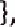{width="0.15625in"
> height="0.2813331146106737in"}2000 ) ;
>
> function processData ( data ) { console . log ( \'Data received + data
> ) ;
>
> fetchData ( processData ) ; // Output after 2 seconds \'Data received
> : Some data\'

#### JS Asynchronous

> Asynchronous operations in JavaScript allow non - blocking execution
> of code
> {width="4.1666666666666664e-2in"
> height="4.167979002624672e-2in"}
>
> Asynchronous Example :
>
> javascript code console . log (
> \'Start\'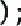{width="0.21875in"
> height="0.270913167104112in"}
>
> setTimeout (O = \>
> 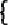{width="8.333333333333333e-2in"
> height="0.2604932195975503in"}
>
> console . log ( \'Inside setTimeout\' ) ;

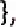{width="0.16666666666666666in" height="0.2813331146106737in"}2000 ) ; 

> console . log ( \'End\' ) ;
>
> // Output : \'Start\', \'End\', \'Inside setTimeoutI ( After 2 seconds
> ) JS Promises
>
> Promises in JavaScript represent a value that might not be available
> yet but will resolve or reject in the future .

Promises Example :

> Creating a Promise :
>
> javascript code let myPromise \* new Prornise (( resolve, reject ) \>
> { setTimeout (O \>
> {width="8.333333333333333e-2in"
> height="0.270913167104112in"}resolve ( \'Promise
> resolvedl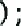{width="0.21875in"
> height="0.270913167104112in"}
>
> 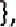{width="0.16666666666666666in"
> height="0.2813331146106737in"} 2000 ) ;
>
> myPromise . then result) = \>
> {width="8.333333333333333e-2in"
> height="0.2604932195975503in"}console . log ( result) ; // Output
> after 2 seconds : \'Promise resolved\'

#### JS Async / Await

> Async / await in JavaScript provides a more synchronous way to write
> asynchronous code using promises .

Async / Await Example :

Using Async / Await :

> javascript code async function fetchData { return new Promise resolve
> ) 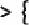{width="0.3020833333333333in"
> height="0.2604932195975503in"}setTimeout(Oof resolve ( \'Data
> fetched\' ) ; l,2000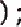{width="0.21875in"
> height="0.2813331146106737in"}

async function processData () { let data await fetchData () ; console .
log ( data ) ; // Output after 2 seconds : Data fetched\'

> processDatao;
>
> This comprehensive guide covers JavaScript classes, including an
> introduction to classes, inheritance, and static methods, as well as
> asynchronous programming concepts such as callbacks, asynchronous
> operations, promises, and async / await, with examples and
> explanations for each concept .

##### JS HTML DOM

> JavaScript interacts with HTML documents through the Document Object
> Model ( DOM ) , representing the document as a tree structure .

DOM Intro :

> Accessing an Element by ID :
>
> html code
> {width="0.11458333333333333in"
> height="0.1250371828521435in"} ! DOCTYPE html\>
> {width="0.11458333333333333in"
> height="0.1250371828521435in"}html \> ebodY\>
>
> \<hl id heading \>Welcome to the DOM\< / hl \>
>
> \< script\> let element document . getElementById (I\' heading l\') ;
> console . log ( element . innerHTML ) ; // Output : \'Welcome to the
> DOM\'
>
> \< / script\>
>
> {width="0.11458333333333333in"
> height="0.12503608923884516in"} / bodY\>
>
> {width="0.11458333333333333in"
> height="0.1250371828521435in"} / html\>

###### DOM Methods

> DOM methods provide various ways to manipulate HTML elements
> {width="4.1666666666666664e-2in"
> height="4.167979002624672e-2in"}
>
> Changing Element Content :
>
> html code
> {width="0.11458333333333333in"
> height="0.12503608923884516in"} ! DOCTYPE html\>
> {width="0.11458333333333333in"
> height="0.12503608923884516in"}html \>
>
> epid - ^i^\' demo \>This is a paragraph . \<
> /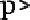{width="0.3125in"
> height="0.20839457567804023in"}
>
> \<script\> document . getE1ementById (Il demo \"). innerHTML = \" This
> is a new paragraph
>
> \< / script\>
>
> \< / bodY\>
>
> \< / html\>

####### DOM Document

> The document object represents the entire HTML document .
>
> {width="4.1666666666666664e-2in"
> height="9.377734033245844e-2in"}{width="4.1666666666666664e-2in"
> height="9.377734033245844e-2in"}{width="6.25e-2in"
> height="5.209864391951006e-2in"}{width="4.1666666666666664e-2in"
> height="4.167869641294838e-2in"}{width="6.25e-2in"
> height="8.335739282589676e-2in"}Accessing Document
> Properties{width="6.25e-2in"
> height="0.15629593175853018in"}
>
> html code
>
> \< ! DOCTYPE html\>
>
> \< html \>
>
> escript\> console . log ( document . title ) ; // Output : Document
> title console . log ( document . URL ) ; // Output : Document URL
>
> {width="0.11458333333333333in"
> height="0.12503608923884516in"} / scripts
>
> \< / bodY\> html\>

###### DOM Elements

> Elements in the DOM represent HTML tags .
>
> Changing Element Styles :
>
> html code
>
> {width="0.11458333333333333in"
> height="0.1250371828521435in"} ! DOCTYPE html\>
> {width="0.11458333333333333in"
> height="0.1250371828521435in"}html \>
>
> \<Pid demo \" \>This is a paragraph . \<
> /{width="0.3125in"
> height="0.20839457567804023in"}
>
> \< script\> let element document . getElementById demo
> {width="0.3125in"
> height="0.2604932195975503in"}element . style . color red ; element .
> style . fontSize = 20px ;
>
> \< / script\>
>
> {width="0.11458333333333333in"
> height="0.1250371828521435in"} / bodY\>
>
> {width="0.11458333333333333in"
> height="0.1250371828521435in"} / html\>

###### DOM HTML

> The DOM HTML includes properties that deal with the HTML content .
>
> Changing HTML Attributes :
>
> html code
>
> {width="0.11458333333333333in"
> height="0.12503608923884516in"} ! DOCTYPE html\>
>
> html \>
>
> \
>
> \< script\> let image = document . getElementById (41 mylmage
> {width="0.3125in"
> height="0.270913167104112in"}image . src new_image .
> jpg{width="0.22916666666666666in"
> height="0.2500732720909886in"}
>
> \< / script\>
>
> {width="0.11458333333333333in"
> height="0.1250371828521435in"} / body)
>
> {width="0.11458333333333333in"
> height="0.1250371828521435in"} / html\>

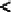{width="0.11458333333333333in" height="0.1250371828521435in"}{width="2.0833333333333332e-2in" height="9.377843394575679e-2in"}{width="2.0833333333333332e-2in" height="8.335739282589676e-2in"}DOM Forms

The DOM allows rnanipulation of HTML forms .

> Accessing Form Elements :
>
> html code
>
> {width="0.11458333333333333in"
> height="0.1250371828521435in"} ! DOCTYPE html\>
> {width="0.11458333333333333in"
> height="0.1250371828521435in"}html \>
>
> \<form id a\" myForm \>

\<input type text \" id username name - username

> \<input type submit value z\" Submit \> form\>

{width="7.895833333333333in"
height="11.805555555555555in"}

> \< script\> let form = document . getE1ementById (t\' myForm • let
> username = form . elements username value;
>
> {width="0.1146314523184602in"
> height="0.1250371828521435in"} / script\>
>
> \< / bodY\>
>
> \< / html\>

####### DOM CSS

> The DOM CSS allows manipulation of CSS styles .
>
> Changing CSS Classes :

html code

> \< ! DOCTYPE html\>
>
> \< html \>
>
> \<Pid demo \> This is a paragraph . \<
> /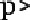{width="0.31263232720909884in"
> height="0.20839457567804023in"}
>
> escript\> let element = document . getE1ementById demo
> {width="0.31263232720909884in"
> height="0.26049431321084865in"}element classList . add (\'i new -
> class \")
> {width="4.168416447944007e-2in"
> height="4.167979002624672e-2in"}
>
> {width="0.11463254593175853in"
> height="0.12503608923884516in"} / script\>
>
> \< / bodY\> html\>

{width="8.48611111111111in"
height="11.805555555555555in"}

######## DOM Animations

> The DOM supports creating simple
> animations{width="6.25e-2in"
> height="4.167869641294838e-2in"}
>
> Animating an Element :
>
> html code
>
> {width="0.11458333333333333in"
> height="0.1250371828521435in"} ! DOCTYPE html\>
> {width="0.11458333333333333in"
> height="0.1250371828521435in"}html \>

\<d1V id box \'l style width : IOOpx;height : IOOpx;background - color :
red;position relative; \" / diV\>

> \< script\> let elem = document . getElementById (Il box ; let pos
> 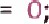{width="0.5104166666666666in"
> height="0.2500732720909886in"}let id setlnterval ( frame, 10 ) ;
>
> function frame ()
> {width="8.333333333333333e-2in"
> height="0.270913167104112in"}{width="0.3333333333333333in"
> height="0.26049431321084865in"}pos 350) f clearlnterval ( id) ;
>
> elem style . top = pos -v \'px^i^ ; elem style . left = pos + ^i^ px ;
> 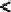{width="0.11458333333333333in"
> height="0.1250371828521435in"} / script\>
>
> \< / bodY\>
>
> \< / html\>

DOM Events

> Events in the DOM represent interactions by users or by the browser .
>
> Click Event Handling :

html code

> \< ! DOCTYPE html\>
>
> \< html \>
>
> \<button id z\" myButton ^l^ \' \>Click me\< / button\>
>
> \< script\> document . getE1ementById (i\' myButton \").
> addEventListener ( \' click , function f alert (i\' Button clicked \")
> ;

######### D;

> {width="0.11458333333333333in"
> height="0.12503608923884516in"} / script\>
>
> \< / bodY\>
>
> \< / html\>

DOM Event Listener

> The addEventListener method is used to attach an event to an element .
>
> Mouseover Event Handling :

html code

> \< ! DOCTYPE html\>
>
> \< html \>
>
> ed1V id myDiv ^i^\' \>Mouse over mec / diV\>
>
> \<script\> document . getElementById (I\' myDiv n). addEventListener
> (\'l mouseover \" function
> 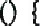{width="0.4166666666666667in"
> height="0.270913167104112in"}alert (I\' Mouse over event triggered Il)
> ;
>
> \< / script\>
>
> \< / bodY\>
>
> \< / html\>

######## DOM Navigation

> The DOM allows navigation between elements Traversing Child Elements :

html code

> \< ! DOCTYPE html\>
>
> \< html \>
>
> eul id myList \>
>
> {width="2.489582239720035in"
> height="1.156590113735783in"}
>
> \<script\> let list document . getElementById (VI myList
> 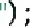{width="0.3125in"
> height="0.2813331146106737in"}let items = list . getElementsByTagName
> (\" li 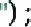{width="0.3229166666666667in"
> height="0.2813331146106737in"}console . log ( items . length ) ; //
> Output : 3
>
> \< / script\>
>
> \< / bodY\>
>
> \< / html\>

######### DOM Nodes

> Nodes are the fundamental building blocks in the DOM .
>
> Creating a New Node :

html code

> \< ! DOCTYPE html\>
>
> \< html \>

edivid myDiv / divs

> \<script\> let node = document . createE1ement (I\' p \'I) ;

{width="8.604166666666666in"
height="11.805555555555555in"}

> let textNode = document . createTextNode (i\' New paragraph U) ; node
> appendChild ( textNode ) ; document . getElementById myDiv \").
> appendChild ( node ) ;
>
> {width="0.11458333333333333in"
> height="0.1250371828521435in"} / script\>
>
> \< / bodY\>
>
> \< / html\>

######### DOM Collections

> Collections in the DOM are arrays of HTML elements .
>
> Accessing Collection Elements :

html code

> \< ! DOCTYPE html\>
>
> \< html \>
>
> \<p\>Click the button to get the collection length . \< /
> 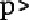{width="0.3020833333333333in"
> height="0.20839457567804023in"}ebutton onclick getLength \>Get
> Collection Length\< / buttons
>
> \<script\> function getLength () { let elements document . links;
> alert (I\' Number of links : + elements . length) ;
>
> \< / script\>
>
> {width="0.11458333333333333in"
> height="0.1250371828521435in"} / bodY\>
>
> {width="0.11458333333333333in"
> height="0.12503608923884516in"} / html\>
>
> DOM Node Lists
>
> Node lists in the DOM are similar to collections and contain nodes or
> elements .
>
> Accessing Node List Elements :
>
> html code
>
> {width="0.11458333333333333in"
> height="0.1250371828521435in"} ! DOCTYPE html\>
> 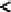{width="0.11458333333333333in"
> height="0.1250371828521435in"}html \>
>
> \<Pid demo \>This is a paragraph . \<
> /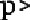{width="0.3125in"
> height="0.20839457567804023in"}
>
> \< script\> let nodeList document . querySelectorAll (L\' #demo
> {width="0.3229166666666667in"
> height="0.270913167104112in"}console . log ( nodeList I O l. innerHTML
> ) ; // Output : \'This is a paragraph .
> {width="3.125e-2in"
> height="9.377734033245844e-2in"}
>
> \< / script\>
>
> {width="0.11458333333333333in"
> height="0.1250371828521435in"} / bodY\>
>
> {width="0.11458333333333333in"
> height="0.12503608923884516in"} / html\>
>
> This comprehensive guide covers JavaScript\'s HTML DOM, including an
> introduction to the DOM, methods, document, elements, HTML forms, CSS,
> animations, events, event listeners, navigation, nodes, collections,
> and node lists, with examples and explanations for each topic .

##### JS Browser BOM

> The Browser Object Model ( BOM ) in JavaScript represents the browser
> window and its
> components{width="5.2083333333333336e-2in"
> height="4.167869641294838e-2in"}

###### JS Window

> The window object is the global object in a browser\'s JavaScript
> environment .
>
> Accessing Window Properties :
>
> javascript code console . log ( window . innerHeight ) ; // Output :
> Inner height of the window console . log ( window . innerWidth ) ; //
> Output : Inner width of the window

###### JS Screen

> The screen object represents the screen of a device .
>
> Accessing Screen Properties :
>
> javascript code console . log ( screen . width ) ; // Output: Screen
> width in pixels console . log ( screen . height ) ; // Output : Screen
> height in pixels

###### JS Location

> The location object contains information about the current URL .
>
> Accessing Location Information :
>
> java script code console . log ( location . href ) ; // Output : Full
> URL ofthe current page console . log ( location hostname ) ; // Output
> Hostname of the current URL

###### JS History

> The history object contains the browsing history of the window .
>
> Accessing History Methods :
>
> javascript code history. back () ; // Go back to the previous page
> history. forward () ; // Go forward to the next page

####### JS Navigator

> The navigator object contains information about the browser .
>
> Accessing Navigator Properties :
>
> javascript code console . log ( navigator . userAgent ) ; // Output :
> User - Agent header of the browser console . log ( navigator .
> platform ) ; // Output : Platform of the browser

####### JS Popup Alert

> Popup alerts in JavaScript display messages to users .
>
> Displaying an Alert :
>
> javascript code alert This is an alert
> message{width="0.3229166666666667in"
> height="0.2813331146106737in"}

###### JS Timing

> JavaScript\'s timing functions allow scheduling of code execution .
>
> Using setTimeout {width="0.25in"
> height="0.2604932195975503in"}javascript code setTimeout
> 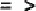{width="0.375in"
> height="0.1146172353455818in"}console . log (l\' Delayed message I\')
> ;
>
> 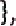{width="0.16666666666666666in"
> height="0.270913167104112in"}2000 ) ; // Execute after 2 seconds
>
> Using setlnterval
> {width="0.2604166666666667in"
> height="0.270913167104112in"}javascript code setlnterval
> 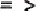{width="0.375in"
> height="0.1146172353455818in"}console . log (l\' Repeated message \'J)
> ;
>
> 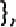{width="0.16666666666666666in"
> height="0.2813331146106737in"}3000 ) ; // Execute every 3 seconds

####### JS Cookies

> Cookies in JavaScript store small pieces of information on the
> client\'s machine .
>
> Setting a Cookie :
>
> javascript code document . cookie username John Doe; expires - - Thu,
> 18 Dec 2023 12 : OO : OO UTC; path z/\" ;
>
> Accessing a Cookie :
>
> javascript code let username = document cookie . split ( o l. split (
> {width="1.0208333333333333in"
> height="0.2604932195975503in"}console . log ( username ) ; // Output :
> \'John Doe\'

This comprehensive guide covers JavaScript\'s Browser Object Model ( BOM
) , including the window object, screen, location, history, navigat0%
popup alerts; timing functions, and cookies, with examples and
explanations for each concept
{width="4.1666666666666664e-2in"
height="4.167869641294838e-2in"}

###### JS Web APIs

> Web APIs are sets of tools and interfaces provided by web browsers to
> interact with various functionalities of the browser or device
> {width="4.1666666666666664e-2in"
> height="4.167869641294838e-2in"}

####### Web API Intro

> Web APIs enable web developers to access various browser features and
> functionalities .
>
> Accessing the Web API :
>
> javascript code
>
> // Example : Using the Geolocation API if (\'i geolocation in
> navigator ) f navigator. geolocation . getCurrentPosition (( position
> ) = \> {width="8.333333333333333e-2in"
> height="0.2604932195975503in"}console . log (i Latitude : position
> coords latitude ) ; console . log (\'i Longitude : , position . coords
> longitude ) ;

######## D;

Web Forms API

> The Web Forms API provides methods and properties to manipulate HTML
> form elements .
>
> Accessing Form Elements :
>
> java script code let form = document . getElementById (\'i myForm v)
> {width="5.2083333333333336e-2in"
> height="0.18755468066491687in"}letinputFie1d = form . elements \[i\'
> username ; console . log ( inputField value ) ;

####### Web History API

> The Web History API allows manipulation ofthe browser\'s history .
>
> Changing Browser History :
>
> javascript code window . history. pushState ( { page 1 Title , ?page =
> 1 I) ;

######## Web Storage API

> The Web Storage API provides methods to store data in the browser .
>
> Using localStorage :
>
> javascript code localStorage . setltem (\'i key \'^i^\' value
> 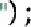{width="0.3229166666666667in"
> height="0.2813331146106737in"}let data = localStorage . getltem (0
> key{width="0.3125in"
> height="0.2813331146106737in"}

web Worker API

> The Web Worker API enables running scripts in the background to handle
> time - consuming tasks without blocking the
>
> UI .
>
> Creating a Web Worker :
>
> javascript code // worker js self. onmessage = function ( event) f
> console . log (t\' Message received from the main script • event data
> ) ; self. postMessage (0 Message from worker \")
> {width="5.2083333333333336e-2in"
> height="0.19797462817147857in"}l;
>
> // main . js let worker = new Worker ( ^i^\' worker js
> {width="0.3125in"
> height="0.2813331146106737in"}worker onmessage = function ( event) {
> console . log (t\' Message received from worker , event . data ) ;
>
> worker . postMessage (\'i Message from main \") j

######## web Fetch API

> The Fetch API provides a way to make HTTP requests .
>
> Making a GET Request :
>
> javascript code fetch (^i^\' https api example com / data \")
>
> . then (( response ) ---- \> response . json 0)
>
> . then (( data ) = \> console . log ( data ))
>
> . catch error ) \-- \> console . log (t\' Error , error )) ;

######## Web Geolocation API

> The Geolocation API retrieves geographical information about the
> user\'s device .
>
> Getting User\'s Location :
>
> javascript code navigator . geolocation . getCurrentPosition ((
> position ) =
> {width="0.3020833333333333in"
> height="0.2604932195975503in"}console . log (\" Latitude : \'^i^ ,
> position . coords . latitude ) ; console . log (\" Longitude ,
> position coords longitude ) ; This comprehensive guide covers various
> Web APIs in JavaScript, including an introduction to Web APIs. Web
> Forms API, Web History APL Web Storage API, Web Worker API, Web Fetch
> API, and Web Geolocation API, with examples and explanations for each
> concept .

JS AJAX

> AJAX ( Asynchronous JavaScript and XML) is a technique used to send
> and receive data asynchronously between a web browser and a
> server{width="4.1666666666666664e-2in"
> height="4.167869641294838e-2in"}

######### AJAX Intro

> AJAX allows web pages to update content without reloading the entire
> page .
>
> Simple AJAX Request :
>
> javascript code letxhttp = new XMLHttpRequest
> {width="0.3125in"
> height="0.2813331146106737in"}xhttp . onreadystatechange = function0 1
> if ( this . readyState 4 this . status 200)
> {width="8.333333333333333e-2in"
> height="0.2604932195975503in"}document . getElementById demo \").
> innerHTML = this responseText;
>
> xhttp . open GET \" ajax_info . txt , true
> {width="0.21875in"
> height="0.2813331146106737in"}xhttp . send () ;

AJAX XMLHttp

> The XMLHttpRequest object ( XHR ) is a core component of AJAX used to
> exchange data between a web browser and a server .
>
> Using XMLHttpRequest :
>
> javascript code let xhttp new XMLHttpRequest () ; xhttp .
> onreadystatechange function
> {width="0.4166666666666667in"
> height="0.2604932195975503in"}if ( this . readyState 4 this . status
> 200) {width="8.333333333333333e-2in"
> height="0.2604932195975503in"}console . log ( this . responseText ) ;
>
> xhttp . open GET data . txt , true ) ; xhttp . send () ;

AJAX Request

> AJAX requests enable communication between the browser and the server
> .
>
> Sending POST Request :
>
> javascript code let xhttp new XMLHttpRequest () ; xhttp .
> onreadystatechange = function0 1 if (this . readyState 4 this . status
> 200) {width="8.333333333333333e-2in"
> height="0.2604932195975503in"}console . log ( this . responseText ) ;
>
> xhttp . open POST , process . php true )
> {width="6.25e-2in"
> height="0.18755468066491687in"}xhttp . setRequestHeader (\'d Content -
> type \'I , \'i application / x - www - form - urlencoded I\') ; xhttp
> . send (0 name John&age =
> 30{width="0.3125in"
> height="0.270913167104112in"}
>
> Response
>
> Handling AJAX responses involves processing data received from the
> server .
>
> Handling \'SON Response :
>
> javascript code letxhttp = new XMLHttpRequest () ; xhttp .
> onreadystatechange = function
> {width="0.4166666666666667in"
> height="0.2604932195975503in"}if ( this readyState 4 this . status
> 200) {width="8.333333333333333e-2in"
> height="0.2604932195975503in"}let data = JSON . parse ( this .
> responseText ) ; console . log ( data ) ;
>
> xhttp . open GET \" data json ^i^ \' , true ) ; xhttp . send () ;

######### AJAX XML File

> AJAX can be used to fetch and handle XML files .
>
> Fetching XML File :
>
> javascript code let xhttp = new XMLHttpRequest
> {width="0.3125in"
> height="0.2813331146106737in"}xhttp . onreadystatechange = function
> {width="0.4166666666666667in"
> height="0.2604932195975503in"}if ( this . readyState 4 this . status
> 200) {width="8.333333333333333e-2in"
> height="0.2604932195975503in"}let xmlDoc = this responseXML;
>
> console . log ( xmlDoc ) ;
>
> xhttp . open GET \" data . xml \" , true ) ; xhttp . send () ;

######### AJAX PHP

> AJAX can interact with server - side technologies like PHP to exchange
> data {width="4.1666666666666664e-2in"
> height="4.167869641294838e-2in"}
>
> Handling AJAX in PHP :
>
> javascript code letxhttp = new XMLHttpRequest () ; xhttp .
> onreadystatechange = function0 1 if ( this readyState 4 this . status
> 200) { console . log this . responseText) ;
>
> xhttp . open \" GET \" \' process php \" , true
> {width="0.21875in"
> height="0.2604932195975503in"}xhttp . send () ; php code
>
> // process php
>
> {width="0.11458333333333333in"
> height="0.12503608923884516in"}? php echo Hello from
> PHP{width="0.2916666666666667in"
> height="0.20839457567804023in"}
>
> ASP
>
> SimilarlY% AJAX can communicate with server - side technologies like
> ASP .
>
> AJAX with ASP :
>
> javascript code letxhttp = new XMLHttpRequest () ; xhttp .
> onreadystatechange = function
> {width="0.4166666666666667in"
> height="0.2604932195975503in"}if ( this readyState 4 this . status
> 200) {width="8.333333333333333e-2in"
> height="0.2604932195975503in"}
>
> console . log this . responseText) ;
>
> 1
>
> xhttp . open \" GET \" \' process . asp , true
> {width="0.21875in"
> height="0.2813331146106737in"}xhttp . send () ; asp code
> {width="0.25in"
> height="9.377734033245844e-2in"}process asp \--
>
> Response . Write (i\' Hello from ASP ! ii )

######### AJAX Database

> AJAX can be used to interact with databases on the server .
>
> Database Interaction with AJAX :
>
> javascript code letxhttp = new XMLHttpRequest
> {width="0.3125in"
> height="0.2813331146106737in"}xhttp . onreadystatechange = function
> {width="0.4166666666666667in"
> height="0.2604932195975503in"}if ( this . readyState 4 this . status
> 200) {width="8.333333333333333e-2in"
> height="0.2604932195975503in"}console . log this . responseText) ;
>
> xhttp . open GET \" , fetch_data . php true )
> {width="7.291666666666667e-2in"
> height="0.20839457567804023in"}xhttp . send () ; php code
>
> // fetch_data . php
>
> {width="0.11458333333333333in"
> height="0.12503608923884516in"}? php
>
> // Fetch data from database and return as JSON

######### AJAX Applications

> AJAX enables building interactive web applications with real - time
> data .
>
> Real - time Chat Application :
>
> javascript code setlnterval (O = \> {
>
> // Fetch new messages and update chat interface l, 5000 ) ;

######### AJAX Examples

> Here are more examples demonstrating various AJAX functionalities .
>
> Example 1 :
>
> javascript code
>
> // Fetch weather data from an API and display on a webpage
>
> AJAX Example 2 :
>
> javascript code
>
> // Fetch user - specific data and update profile information
> dynamically
>
> This comprehensive guide covers AJAX ( Asynchronous JavaScript and
> XML) , including an introduction to AJAX, using XMLHttp, making AJAX
> requests and handling responses, fetching XML files, interacting with
> server - side technologies like PHP and ASP, working with databases,
> building AJAX applications, and providing examples and explanations
> for each concept .
>
> AJAX Example 3 : Dynamic Content Loading
>
> HTML :
>
> html code \< ! DOCTYPE html\>
>
> \< html \>
>
> \< head\>
>
> \<title\>AJAX Dynamic Content\< / title\>
>
> \< script\> function loadContent () \[ let xhttp = new XMLHttpRequest
> () ; xhttp . onreadystatechange = function
> {width="0.4166666666666667in"
> height="0.2604932195975503in"}if( this . readyState 4 this . status
> 200 ) \[ document . getElementById (\'l dynamicContent \"). innerHTML
> this . responseText;
>
> xhttp . open (\'^i^ GET content . html , true
> {width="0.21875in"
> height="0.2813331146106737in"}xhttp .
> send{width="0.3125in"
> height="0.2813331146106737in"}
>
> {width="0.11458333333333333in"
> height="0.1250371828521435in"} / script\>
>
> {width="0.11458333333333333in"
> height="0.1250371828521435in"} / heads
>
> \<button onclick z\" loadContent \>Load Content\< / button\>

{div id dynamicContent / dip

> {width="0.11458333333333333in"
> height="0.12503608923884516in"} / bodY\>

{width="0.11458333333333333in"
height="0.1250371828521435in"} / html\> content . html ( Sample Content
):

> html code
>
> \<h2\>Welcome to Dynamic Content\< / h2\>
>
> \<p\>This content was loaded dynamically using AJAX . \< / ps
>
> This example demonstrates a simple button that triggers an AJAX
> request to load content from an external HTML file and displays it on
> the webpage without refreshing the entire page .
>
> AJAX Example 4 : Form Submission with AJAX
>
> HTML :
>
> html code
>
> {width="0.11458333333333333in"
> height="0.1250371828521435in"} ! DOCTYPE html\>
> {width="0.11458333333333333in"
> height="0.1250371828521435in"}html \>
>
> ehead\>
>
> \<title\>AJAX Form Submission \< / title\>
>
> •script\> function submitForm let formData = new FormData ( document .
> getElementById (t^i^ myForm
> {width="0.4375in"
> height="0.2604932195975503in"}let xhttp = new XMLHttpRequest ; xhttp .
> onreadystatechange = function
> {width="0.4166666666666667in"
> height="0.2604932195975503in"}if( this readyState 4 this status 200 )
> \[ document . getElementById (\'i response \" innerHTML = this .
> responseText;
>
> xhttp . open POST , processForm . php t\' , true
> {width="0.23958333333333334in"
> height="0.2604932195975503in"}xhttp . send ( formData ) ;
>
> {width="0.11458333333333333in"
> height="0.1250371828521435in"} / scripts
>
> {width="0.11458333333333333in"
> height="0.12503608923884516in"} / heads
>
> {form id myForm i{width="0.25in"
> height="0.16671587926509188in"}
>
> \<input type text name username placeholder Username \>
>
> \<input type password t\' name password placeholder Password
> {width="0.3020833333333333in"
> height="0.1667147856517935in"}\<button type button onclick submitForm
> / button\>
>
> {width="0.11458333333333333in"
> height="0.12503608923884516in"} / form\>

{width="0.3020833333333333in"
height="0.21881452318460193in"}IV id response \'i / divs

> {width="0.11458333333333333in"
> height="0.1250371828521435in"} / bodY\>

{width="0.11458333333333333in"
height="0.1250371828521435in"} / html\> processForm php ( Server - side
Processing
{width="0.14583333333333334in"
height="0.2292344706911636in"}php code

> \< ? php

{width="0.34375in"
height="0.2604932195975503in"}\$\_SERVER \[l\' REQUEST_METHOD \'I\]
POST{width="0.4166666666666667in"
height="0.270913167104112in"}

> \$username \$\_POST username
> \"l{width="7.291666666666667e-2in"
> height="0.18755468066491687in"}
>
> \$password \$\_POST \[ l\'
> password{width="0.3020833333333333in"
> height="0.270913167104112in"}
>
> // Perform validation or database operations echo Form submitted
> successfully by
> \$username{width="0.2916666666666667in"
> height="0.2604932195975503in"}

} else { echo Invalid request •

> This example demonstrates a form submission using AJAX . When the form
> is submitted, the data is sent asynchronously to a server - side PHP
> script for processing . The response from the server is displayed on
> the webpage without refreshing the entire page .
>
> AJAX Example 5 : Fetching JSON Data
>
> JavaScript :
>
> javascript code fetch ( \'data jsont
> {width="8.333333333333333e-2in"
> height="0.2604932195975503in"}
>
> . then ( response = \> response . json 0)
>
> . then ( data = { console . log ( data ) ;
>
> // Process and use the retrieved JSON data
>
> . catch ( error = \> console . error ( \'Error : error )) ; data json
> ( Sample JSON Data ):

json code

> {width="8.333333333333333e-2in"
> height="9.377734033245844e-2in"}name ^i^\': John Doe
> {width="0.22916666666666666in"
> height="0.2604932195975503in"}{width="8.333333333333333e-2in"
> height="9.377734033245844e-2in"}age 30,
>
> \" city n: New York \"
>
> This example utilizes the Fetch API to make an AJAX request to fetch
> JSON data from a file . Upon successful retrievål, the JSON data is
> processed and used within the JavaScript code .
>
> These additional examples showcase various use cases of AJAX, such as
> loading dynamic content, form submission without page refresh, and
> fetching and using JSON data asynchronously .
>
> AJAX Example 6 : Image Gallery with AJAX
>
> HTML :
>
> html code
>
> {width="0.11458333333333333in"
> height="0.12503608923884516in"} ! DOCTYPE html\>
> {width="0.11458333333333333in"
> height="0.12503608923884516in"}html \>
>
> \<title\>AJAX Image Gallery\< / title)
>
> •script\> function
> loadlmages{width="0.4166666666666667in"
> height="0.26049431321084865in"}
>
> let xhttp = new XMLHttpRequest ; xhttp onreadystatechange = function
> {width="0.4166666666666667in"
> height="0.2604932195975503in"}if( this readyState 4 this . status 200
> ) \[ let images = JSON . parse ( this . responseText ) ; let gallery =
> document . getElementById imageGallery t\') ; images . forEach ( img =
> { let imageNode = document . createElement (i\' img \" ; imageNode .
> src = img url; gallery appendChild ( imageNode ) ;
>
> {width="0.7708333333333334in"
> height="1.1982699037620297in"}
>
> xhttp . open (0 GET o , images . json \" , true ) ; xhttp .
> send{width="0.3125in"
> height="0.2813331146106737in"}
>
> \< / script\>
>
> {width="0.11458333333333333in"
> height="0.12503608923884516in"} / heads
>
> \<body onload loadlmages{width="0.5in"
> height="0.2604932195975503in"}

{width="0.3020833333333333in"
height="0.21881452318460193in"}IV id imageGallery \" / diV\>

> {width="0.11458333333333333in"
> height="0.12503608923884516in"} / bodY\>

{width="0.11458333333333333in"
height="0.12503608923884516in"} / html\> images . json ( Sample Image
Data in JSON Format ):

> json code
>
> {width="8.333333333333333e-2in"
> height="0.10419728783902012in"}url imagel . jpg ,
> {width="8.333333333333333e-2in"
> height="0.10419728783902012in"}caption i\'. Image
> 1{width="8.333333333333333e-2in"
> height="0.10419728783902012in"}
>
> {width="8.333333333333333e-2in"
> height="0.10419728783902012in"}url i\': image2 . jpg
> {width="0.21875in"
> height="0.270913167104112in"}{width="8.333333333333333e-2in"
> height="0.10419728783902012in"}caption it. Image
> 2{width="8.333333333333333e-2in"
> height="0.10419728783902012in"}
>
> // Add more image objects as needed
>
> This example demonstrates loading images dynamically into an image
> gallery on a webpage using AJAX . The images and their respective URLs
> are stored in a JSON file, which is fetched asynchronously, and the
> images are displayed in the gallery .
>
> AJAX Example 7 : Autocomplete Search
>
> HTML :

html code

> \< ! DOCTYPE html\>
>
> \< html \>
>
> \<head\>
>
> \<title\>Autocomplete Search\< / title\>
>
> \<script\> function search () { let query = document . getElementById
> searchlnput value; fetch ( \' search . php?q \$(query} \'
> {width="8.333333333333333e-2in"
> height="0.270913167104112in"}

-   then ( response = \> response . json 0)
    {width="4.1666666666666664e-2in"
    height="4.167869641294838e-2in"} then ( data = \> { let results =
    document . getElementById (\'i searchResults \")
    {width="7.291666666666667e-2in"
    height="0.20839457567804023in"}results . innerHTML =
    {width="0.16666666666666666in"
    height="0.1146172353455818in"}data forEach ( item = \>
    {width="8.333333333333333e-2in"
    height="0.2604932195975503in"}let listltem = document .
    createE1ement (\'i li ; listltem textContent = item name; results .
    appendChild ( listltem ) ;

-   catch ( error = console . error ( \'Error : t, error ;

> \< / script\>
>
> {width="0.11458333333333333in"
> height="0.1250371828521435in"} / heads
>
> \<input type text id searchlnput onkeyup search (Y\' placeholder
> Search {width="0.5208333333333334in"
> height="0.20839566929133857in"}cul id searchResu1ts /
> {width="0.4166666666666667in"
> height="0.21881452318460193in"}{width="0.11458333333333333in"
> height="0.12503608923884516in"} / bodY\>

{width="0.11458333333333333in"
height="0.12503608923884516in"} / html\> search php ( Server - side
Script Handling Search ):

> php code
>
> \< ? php
>
> \$searchTerm = \$\_GET I \'q\' \] ; // Get search query
>
> // Perform database or data search operations based on the query and
> return results
>
> \$results = {width="6.25e-2in"
> height="0.26049431321084865in"}{width="0.14583333333333334in"
> height="0.2604932195975503in"}name \> Result \| 4\'\] ,
> {width="0.14583333333333334in"
> height="0.2604932195975503in"}name \> Result 2 ^il^ l ,
>
> // Add more search results as needed
>
> echojson_encode ( \$results ) ; // Return results as JSON
>
> This example demonstrates an autocomplete search feature using AJAX .
> As the user types in the search input field, an AJAX request is made
> to a server - side PHP script ( search . php) that processes the
> search query and returns matching results in JSON format, which are
> then displayed as autocomplete suggestions
> {width="4.1666666666666664e-2in"
> height="4.167869641294838e-2in"}
>
> These additional examples showcase different functionalities of AJAX,
> such as creating an image gallery dynamically and implementing an
> autocomplete search feature, using asynchronous data fetching and
> manipulation on a webpage .
>
> AJAX Example 8 : Live Data Update
>
> HTML :

html code

> \< ! DOCTYPE html\>
>
> \< html \>
>
> \<head\>
>
> \<title\>Live Data Update\< / title\>
>
> \<script\> function updateData () { setlnterval
> {width="0.3541666666666667in"
> height="0.11461614173228346in"}fetch ( \'live_data , php•
> {width="8.333333333333333e-2in"
> height="0.270913167104112in"}
>
> . then ( response = response json0)
> {width="4.1666666666666664e-2in"
> height="4.167869641294838e-2in"} then ( data = \[ document .
> getElementById ( ^i^ liveData\' inner Text = data . value;
>
> . catch ( error = \> console . error ( \'Error : j, error ;
>
> {width="0.14583333333333334in"
> height="0.2813331146106737in"}5000 ) ; // Update every 5 seconds
>
> window . onload = updateData;
>
> {width="0.11458333333333333in"
> height="0.1250371828521435in"} / scripts
>
> {width="0.11458333333333333in"
> height="0.12503608923884516in"} / heads

{width="0.8333333333333334in"
height="0.21881452318460193in"}Data \< spanid liveData / span\>\< /
h{width="0.2916666666666667in"
height="0.1875557742782152in"}

> {width="0.11458333333333333in"
> height="0.1250371828521435in"} / bodY\>
>
> {width="0.11458333333333333in"
> height="0.1250371828521435in"} / html\> live_data . php ( Server -
> side Script Providing Live Data
> {width="0.13541666666666666in"
> height="0.21881452318460193in"}php code
>
> \< ? php
>
> // Simulate live data update
>
> \$data \[ \'value\' \> rand ( 1, 100 ; // Generate random value echo
> json_encode ( \$data ) ; // Return live data as JSON
>
> This example demonstrates updating live data on a webpage at regular
> intervals using AJAX . The JavaScript function updateData uses
> setlnterval to fetch updated data from the server - side PHP script (
> live_data . php ) every 5 seconds and displays it on the webpage .
>
> AJAX Example 9 : Infinite Scroll
>
> HTML : html code
>
> \< ! DOCTYPE html\>

\< html \>

> \<head\>
>
> \<title\>lnfinite Scroll\< / titles
>
> \< style \>
>
> {width="4.1701662292213476e-2in"
> height="4.167869641294838e-2in"}{width="4.1701662292213476e-2in"
> height="4.167869641294838e-2in"}{width="8.340332458442695e-2in"
> height="0.270913167104112in"}#content height : 200px; overflow - y:
> scroll;
>
> \< / style\> \<script\> let page
> {width="0.510845363079615in"
> height="0.2500732720909886in"}function loadMoreContent { let content
> document . getElementById ( \'content\' ) let scrollHeight content .
> scrollHeight; let scrollTop content . scrollTop; let offsetHeight
> content . offsetHeight; if( scrollHeight - scrollTop offsetHeight) {
> fetch ( content , php?page \${page} ) then ( response \> response text
> C)) then ( data \>

{width="8.38888888888889in"
height="11.805555555555555in"}

> content . innerHTML +- data; page +4 .
>
> . catch ( error = \> console . error \'Error : , error )) ;
>
> window . onscroll = loadMoreContent;
> {width="0.11458333333333333in"
> height="0.1250371828521435in"} / script\>
>
> {width="0.11458333333333333in"
> height="0.1250371828521435in"} / heads
>
> {width="0.3020833333333333in"
> height="0.21881452318460193in"}IV id content t\' onscroll
> loadMoreContent (Y^i^ {width="0.125in"
> height="0.12503608923884516in"}
>
> \< !\-- Initially loaded content \-- \>

######## \< / dip

> {width="0.11458333333333333in"
> height="0.1250371828521435in"} / bodY\>

{width="0.11458333333333333in"
height="0.1250371828521435in"} / html\> content . php ( Server - side
Script Providing Content
{width="0.14583333333333334in"
height="0.22923337707786526in"}php code

> \< ? php
>
> \$page = \$\_GET I \'page\' I ; // Get page number
>
> \$limit= 10; // Number of items per page

\$start --- \$page- 1 \$limit; // Calculate starting index

> // Fetch content based on page number and limit
>
> // Example : \$results = fetchDataFromDatabase ( \$start, \$limit ) ;
>
> // Generate sample content for demonstration
>
> \$results = range ( \$start 1, \$start + \$limit ) ; foreach (
> \$results as \$result) { echo cp\>ltem \$result\<
> /{width="0.6458333333333334in"
> height="0.270913167104112in"}
>
> This example demonstrates an infinite scroll functionality using AJAX
> . As the user scrolls down the pagej the loadMoreContent function
> detects when the user reaches the bottom of the content area and
> triggers an AJAX request to fetch more content ( content . php ) from
> the server - side PHP script, which is then dynamically appended to
> the existing content on the webpage
> {width="4.1666666666666664e-2in"
> height="4.167869641294838e-2in"}
>
> These additional examples showcase different functionalities of AJAX,
> such as live data updates and implementing infinite scroll behavior on
> a webpage, demonstrating how AJAX can be used to fetch and display
> data dynamically without page reloads .
>
> AJAX Example 10 File Upload with Progress Bar
>
> HTML :

html code

> \< ! DOCTYPE html\>
>
> \< html \>
>
> \<head\>
>
> \<title\>File Upload with Progress\< / title\>
>
> \<script\> function uploadFile { let filelnput document .
> getElementById ( \'filelnput\' ) ; let file filelnput . files I O ;
>
> let formData = new FormData ; formData . append ( file\', file ) ;
>
> let xhr = new XMLHttpRequest () ; xhr . open ( \'POST\', \'upload .
> phpl, true ) {width="6.25e-2in"
> height="0.20839457567804023in"}xhr , upload . onprogress function ( e
> ) { {width="0.3333333333333333in"
> height="0.270913167104112in"}e lengthComputab1e ) { let
> percentComplete ( e . loaded / e . total ) \* 100; document .
> getElementById ( \'progressBar\' style . width percentComplete
> +{width="0.5729166666666666in"
> height="0.2604932195975503in"}
>
> Xhr . onload function if( xhr . status
> {width="0.9583333333333334in"
> height="0.19797462817147857in"}alert ( \'File uploaded successfully !
> ) ;
>
> alert ( \'Error uploading file
> ,{width="0.3333333333333333in"
> height="0.2813331146106737in"}
>
> xhr . send ( formData ) ;
>
> \< / scripts
>
> \< / heads
>
> \<input type file \" id filelnput \" \>
>
> \<button onclick uploadFile (YI \>Upload\< / button\>
>
> \

\

{width="0.11458333333333333in" height="0.12503608923884516in"} / dip

> {width="0.11458333333333333in"
> height="0.1250371828521435in"} / bodY\>

{width="0.11458333333333333in"
height="0.1250371828521435in"} / html\> upload php ( Server - side
Script for File Upload ):

> php code \< ? php
>
> {width="0.34375in"
> height="0.2604932195975503in"}\$\_SERVER I \'REQUEST_METHOD I TOSTI
> isset ( \$\_FILES \[ \'file\' l)) { \$targetDir = \'uploads / I;
>
> \$targetFile = \$targetDir . basename ( \$\_FILES \[ \'file\' Inamel
> l) {width="6.25e-2in"
> height="0.18755468066491687in"}if ( move_uploaded_file ( \$\_FILES \[
> \*filet Il \'tmp_name• I \$targetFile )) \[ echo \'File uploaded
> successfully ! I;
>
> } else \[ echo \'Error uploading file
> .{width="0.10416666666666667in"
> height="0.2604932195975503in"}

{width="0.2708333333333333in"
height="1.156590113735783in"}

> This example demonstrates a file upload functionality using AJAX with
> a progress bar . When a user selects a file and clicks the Upload I\'
> button, the file is uploaded asynchronously to the server using an
> XMLHttpRequest . The progress bar visually indicates the upload
> progress .
>
> AJAX Example 11 : Displaying Time Dynamically
>
> HTML :
>
> html code
>
> {width="0.11458333333333333in"
> height="0.12503608923884516in"} ! DOCTYPE html\>
> {width="0.11458333333333333in"
> height="0.12503608923884516in"}html \>
>
> \<title\>Displaying Time Dynamically\< / title\>
>
> •script\> function displayTime () { let timeDisp1ay = document .
> getE1ementById ( \'timeDisplay^i^ ) ; setlnterval
> {width="0.3541666666666667in"
> height="0.10419728783902012in"}fetch ( \'getTime php ^i^ )
> {width="4.1666666666666664e-2in"
> height="4.167869641294838e-2in"}then ( response = response text C))
>
> . then ( data = \[ timeDisplay. innerHTML = data;
>
> . catch ( error = \> console . error ( \'Error : i, error ;
>
> {width="0.14583333333333334in"
> height="0.2813320209973753in"}1000 ) ; // Update every second
>
> window . onload = displayTime;
> {width="0.11458333333333333in"
> height="0.12503608923884516in"} / script\>
>
> {width="0.11458333333333333in"
> height="0.12503608923884516in"} / heads

Chl \>Current Time (span id timeDisplay / span\>\< / 111b

> {width="0.11458333333333333in"
> height="0.1250371828521435in"} / bodY\>
>
> {width="0.11458333333333333in"
> height="0.1250371828521435in"} / html\>

getTime . php ( Server - side Script to Get Current Time ):

> php code
>
> \< ? php echo date ( \'h : i : s A\' ) ; // Return current time
>
> This example demonstrates dynamically displaying the current time on a
> webpage using AJAX . The displayTime function fetches the current time
> from the server - side PHP script ( getTime . php ) at intervals of
> one second and updates the time display on the webpage .
>
> These examples showcase different functionalities of AJAX, including
> file uploads with progress tracking and displaying dynamic content (
> such as current time ) on a webpage . AJAX allows for seamless
> interactions between the client and server without page reloads,
> enhancing user experience and providing dynamic content updates .

####### JS JSON

> JSON ( JavaScript Object Notation ) is a lightweight data interchange
> format that is easy for humans to read and write and easy for machines
> to parse and generate . It is commonly used to transmit data between a
> server and a web application .

######## JSON Intro

> JSON serves as a language - independent data format derived from
> JavaScript object literals It\'s widely used for data exchange between
> web servers and web clients
> {width="4.1666666666666664e-2in"
> height="4.167979002624672e-2in"}
>
> Example of JSON Data
> {width="6.25e-2in"
> height="0.15629593175853018in"}json code
>
> {width="8.333333333333333e-2in"
> height="0.10419728783902012in"}name John Doe
> {width="0.22916666666666666in"
> height="0.270913167104112in"}{width="8.333333333333333e-2in"
> height="0.10419728783902012in"}age n: 30, ^i^\" email john@example com
> t\' {width="7.291666666666667e-2in"
> height="0.10419728783902012in"}{width="8.333333333333333e-2in"
> height="0.10419728783902012in"}isStudent i\': false,
> {width="8.333333333333333e-2in"
> height="0.10419728783902012in"}address
> {width="0.15625in"
> height="0.1146172353455818in"}{width="8.333333333333333e-2in"
> height="0.10419728783902012in"}street i\': 123 Main St
> {width="8.333333333333333e-2in"
> height="0.10419728783902012in"}{width="8.333333333333333e-2in"
> height="0.10419728783902012in"}city
> Anytown{width="8.333333333333333e-2in"
> height="0.10419728783902012in"}
>
> l, {width="8.333333333333333e-2in"
> height="0.10419728783902012in"}hobbies reading coding , traveling \"l

######## JSON Syntax

> JSON syntax is derived from JavaScript object notation, consisting of
> key - value pairs enclosed in curly braces O , and values can be
> strings, numbers, objects, arrays, booleans, or null .
>
> Example of JSON Syntax :
>
> json code
>
> \" keyl \'4: valuel {width="0.21875in"
> height="0.270913167104112in"}
>
> \" key2 \'i: 123,
>
> \" key3 \'^i^ : true,
>
> \" key4 \'i: null,
>
> \" key5 \'i: {
> {width="8.333333333333333e-2in"
> height="0.10419728783902012in"}nestedKey \'t:
> nestedValue{width="8.333333333333333e-2in"
> height="0.10419728783902012in"}

{width="8.333333333333333e-2in"
height="0.10419728783902012in"}key6 \": \'i arrayVa1ue1 arrayVälue2
^t^\' \]

######### JSON vs XML

> JSON and XML are both used for data interchange, but JSON is generally
> more lightweight and easier to read and parse than XML .
>
> Example Comparison between JSON and XML :
>
> json code
>
> // JSON
>
> {width="8.333333333333333e-2in"
> height="0.10419728783902012in"}name John , age 25,
> {width="8.333333333333333e-2in"
> height="0.10419728783902012in"}city New
> York{width="8.333333333333333e-2in"
> height="0.10419728783902012in"}
>
> xml code
>
> {width="0.4895833333333333in"
> height="0.16671587926509188in"}XML
> {width="0.4166666666666667in"
> height="0.12503608923884516in"}euser\>
>
> •namesJohn\< / name\>
>
> {width="0.9479166666666666in"
> height="0.2500732720909886in"}/ ago
>
> •citY\>New York\< / citY\>
>
> {width="0.11458333333333333in"
> height="0.12503608923884516in"}
>
> / user)

JSON Data Types

> JSON supports several data types : strings, numbers, booleans,
> objects, arrays, null ,
>
> Example of Different Data Types in JSON :

json code

> \" string Hello, World
> {width="0.2916666666666667in"
> height="0.2604932195975503in"}{width="8.333333333333333e-2in"
> height="9.377734033245844e-2in"}number ^Il^: 42,
>
> \" boolean I\': true,
>
> \" nullValue ^it^: null,
> {width="8.333333333333333e-2in"
> height="9.377734033245844e-2in"}object ( \" key \'l: \" value
> l\'{width="0.14583333333333334in"
> height="0.270913167104112in"}
>
> \" array \[ 1, 2, 3
> {width="5.2083333333333336e-2in"
> height="0.2604932195975503in"}

JSON Parse

> JSON . parse () is a method in JavaScript used to parse JSON data into
> a JavaScript object
> {width="4.1666666666666664e-2in"
> height="4.167869641294838e-2in"}
>
> Example ofJSON Parsing :
>
> javascript code let jsonString - name \" Alice age •r: 28B; letjsonObj
> = JSON . parse ( jsonString ) ; console . log ( jsonObj . name); //
> Output : Alice

######## JSON Stringify

JSON . stringify () is a method in JavaScript used to convert a
JavaScript object into a JSON string .

> Example of JSON Stringification :
>
> javascript code let obj {name Bob age: 30
> {width="0.14583333333333334in"
> height="0.26049431321084865in"}let jsonString = JSON . stringify ( obj
> ) ; console . log (jsonString ) ; // Output : { \'^i^ name Bob , age
> 30)

######### JSON Objects

> JSON objects contain key - value pairs enclosed in curly braces f} .
> Keys must be strings, and values can be of any JSON data type .
>
> Example of a JSON Object :
>
> json code
>
> {width="8.333333333333333e-2in"
> height="0.10419728783902012in"}name Sarah t\' age 35,
> {width="8.333333333333333e-2in"
> height="0.10419728783902012in"}city \'i:
> London{width="7.291666666666667e-2in"
> height="0.10419728783902012in"}

JSON Arrays

> JSON arrays are ordered lists of values enclosed in square brackets
> l\], The values can be of any JSON data type
> {width="4.1666666666666664e-2in"
> height="4.167979002624672e-2in"}
>
> Example of a JSON Array :
>
> json code {width="0.15625in"
> height="0.2604932195975503in"}apple , banana ,
> orange{width="0.14583333333333334in"
> height="0.2604932195975503in"}

######### JSON Server

> JSON is commonly used to transfer data between a server and a web
> client in web development . Servers often provide data in JSON format
> through APIs .
>
> Example of JSON Data from a
> Server{width="6.25e-2in"
> height="0.15629593175853018in"}

json code

> // Received from a server API endpoint
>
> {width="1.1354166666666667in"
> height="1.0211340769903763in"}
>
> title \'I: Sample
> Post{width="0.22916666666666666in"
> height="0.2604932195975503in"}
>
> \" content it: \" This is a sample post content .11

JSON PHP

> In PHP, JSON data can be encoded and decoded using json_encode () and
> json_decode () functions respectively, to convert data to and from
> JSON format .
>
> Example of Encoding and Decoding JSON in PHP
> {width="6.25e-2in"
> height="0.15629593175853018in"}php code
>
> // Encoding PHP array to JSON

\$data array (It name \" Peter\" \" age \> 28 ) ;

> \$jsonData = json_encode ( \$data) ;
>
> // Decoding JSON to PAP array

\$jsonString= name t\': Alice , age \'i: 30}i;

> \$decodedData = json_decode ( \$jsonString, true
> ){width="5.2083333333333336e-2in"
> height="0.20839457567804023in"}

JSON HTML

> JSON data can be used in HTML to dynamically generate content on
> webpages using JavaScript .
>
> Example of Using JSON Data in
> HTML{width="6.25e-2in"
> height="0.15629593175853018in"}
>
> html code {width="0.40625in"
> height="0.21881452318460193in"}id userList
> /{width="0.4166666666666667in"
> height="0.21881452318460193in"}
>
> \< script\> const users
> {width="0.125in"
> height="8.335739282589676e-2in"}{width="0.3125in"
> height="0.2604932195975503in"}name \' John \" age 25 1,
> {width="0.3125in"
> height="0.2604932195975503in"}name Alice \" age 301,
> {width="0.3125in"
> height="0.2604932195975503in"}name Bob \" , age 28

^I^

> const userList = document . getElementByld (\'i userList ; users .
> forEach ( user = \> f let listltem = document . createElement (\'i li
> t\') ; listltem . textContent = \$fuser name} - \${user. age) years
> old , userList . appendChi1d ( listltem ) ;
>
> {width="0.11458333333333333in"
> height="0.1250371828521435in"} / script\>

JSON JSONP

> JSONP ( JSON with Padding) is a technique for requesting JSON data
> from a different domain in web development to bypass the same - origin
> policy limitations .
>
> Example of JSONP Request :
>
> javascript code function handleData ( data ) f console . log ( data )
> ;
>
> let script document . createElement ( \'script\' ) ; script , src
> \'https :// example . com / data?callback handleData\'; document .
> head . appendChild ( script ) ;
>
> This comprehensive guide covers JSON ( JavaScript Object Notation ) in
> detail, including an introduction, syntax, comparison with XML, data
> types, parsing, stringifying, JSON objects and arrays, working with
> JSON in server - side technologies like FHP, HTML, and JSONP, with
> examples and explanations for each topic JSON plays a crucial role in
> data interchange in web development due to its simplicity, ease of
> use, and widespread support .
>
> I Creating aJSON Object :
>
> javascript code let person = {
> {width="8.333333333333333e-2in"
> height="0.10419728783902012in"}name John , age 30, t\' city \'i: i\'
> New York
> {width="8.333333333333333e-2in"
> height="0.10419728783902012in"}l;

2.  . Accessing JSON Object Properties :

> javascript code console . log ( person . name ) ; // Output : John
> console . log ( person . age ) ; // Output : 30

3.  Nested JSON Objects :

> java script code
>
> let employee{width="0.375in"
> height="0.2604932195975503in"}
>
> {width="8.333333333333333e-2in"
> height="0.10419728783902012in"}name Alice
> {width="8.333333333333333e-2in"
> height="0.10419728783902012in"}{width="8.333333333333333e-2in"
> height="8.335739282589676e-2in"}position \'i: Engineer
> {width="0.21875in"
> height="0.270913167104112in"}contact
> {width="5.2083333333333336e-2in"
> height="5.209864391951006e-2in"}{width="8.333333333333333e-2in"
> height="0.10419728783902012in"}email : alice@example com t\'
> {width="5.2083333333333336e-2in"
> height="0.10419728783902012in"}{width="8.333333333333333e-2in"
> height="0.10419728783902012in"}phone \" 123 - 456 -
> 7890{width="8.333333333333333e-2in"
> height="0.10419728783902012in"}

4.  JSON Array of Objects :

> javascript code let
> books{width="0.125in"
> height="8.335739282589676e-2in"}
>
> {width="0.5in"
> height="1.646317804024497in"}\" title .
> \'{width="2.0833333333333332e-2in"
> height="9.377734033245844e-2in"}Book
> 1{width="8.333333333333333e-2in"
> height="9.377734033245844e-2in"}, \" author Author 1
> {width="0.3125in"
> height="0.270913167104112in"}title 0: Book 2
> {width="2.0833333333333332e-2in"
> height="9.377734033245844e-2in"} ,
> {width="7.291666666666667e-2in"
> height="9.377734033245844e-2in"}author Author 2
> {width="0.3125in"
> height="0.270913167104112in"}\"
> title{width="0.3020833333333333in"
> height="0.20839457567804023in"}Book3{width="8.333333333333333e-2in"
> height="9.377734033245844e-2in"}\" author \'l: Author 3
> {width="8.333333333333333e-2in"
> height="9.377734033245844e-2in"}

5.  Converting JSON to String :

> javascript code let jsonString z JSON . stringify ( person ) ; console
> . log (jsonString) ; // Output : { name \" John\' , \" age 1\'• 30, \"
> city New York{width="0.25in"
> height="0.270913167104112in"}

6.  Parsing JSON String to Object :

javascript code let jsonObject = JSON . parse ( name Alice j age •t: 25,
city London y ) ; console . log (jsonObject . name ) ; // Output : Alice

7.  . Fetching JSON Data from URL ( using Fetch API
    {width="0.15625in"
    height="0.2604932195975503in"}javascript code fetch ( \'data .
    json\'{width="8.333333333333333e-2in"
    height="0.2604932195975503in"}

> . then ( response \> response . json C))
>
> . then ( data \> console . log ( data ))
>
> . catch ( error = \> console . error ( \'Error : error )) ;

8.  Displaying JSON Data Dynamically in HTML : javascript code
    letjsonData { \" name \'1: Bob \" , age
    28{width="0.15625in"
    height="0.2813331146106737in"}

> let displayDiv document . getElementById ( \'jsonDataDisplay\' ) ;
> displayDiv. innerHTML = \<p\>Name: \$fjsonData . name}\< / p\>\<p\>Age
> : \$\[jsonData . / •

9.  Handling JSON Data in Forms :

> javascript code let form - document . getElementById ( ImyForm\' ) ;
> form . addEventListener ( \'submit\', function ( event) { event .
> preventDefault () ; let formData = new FormData ( form ) ;
> letjsonObject O; formData . forEach (( value, key ) \> { jsonObject \[
> key I value;
>
> console . log (jsonObject ) ;

10. . Stringifying and Parsing a More Complex Object :

> javascript code let complexObj \[
>
> \" name Sam \" ,
>
> \" age 35,
> {width="8.333333333333333e-2in"
> height="9.377734033245844e-2in"}addresses
> {width="0.15625in"
> height="0.21881452318460193in"}{width="0.3125in"
> height="0.2604932195975503in"}type ^1^\': \" home address 123 Main St
> \" {width="0.15625in"
> height="0.270913167104112in"}{width="0.2916666666666667in"
> height="0.2604932195975503in"}type u: \" work \" , \" address 456
> Business
> Ave{width="0.22916666666666666in"
> height="0.2604932195975503in"}
>
> let complexString = JSON . stringify ( complexObj ) ; let parsedObj =
> JSON . parse ( complexString ) ; console . log ( parsedObj . addresses
> I O l. address ) ; // Output : 123 Main St

11. . Filtering JSON Array Data :

> java script code let
> employees{width="0.28125in"
> height="0.26049431321084865in"}
>
> {width="0.28125in"
> height="1.646317804024497in"}\" name n: \" John , department HR }
> {width="6.25e-2in"
> height="9.377843394575679e-2in"}\" name ^n^ : \" Alice , department
> IT{width="0.3229166666666667in"
> height="0.270913167104112in"}
>
> \" name n: \" Bob \" ,
> department{width="0.8020833333333334in"
> height="0.20839566929133857in"}
>
> let hrEmployees = employees . filter ( employee \-- \> employee
> department HR \')
> {width="5.2083333333333336e-2in"
> height="0.20839566929133857in"}console . log ( hrEmployees ) ; //
> Output : name John
> department{width="2.1875in"
> height="0.2604932195975503in"} name \'i \" Bob
> {width="0.21875in"
> height="0.270913167104112in"}{width="8.333333333333333e-2in"
> height="0.10419728783902012in"}department \'i: HR I \]

12. . Updating JSON Object Properties :

> javascript code let product \[ name Chair price 50
> {width="0.14583333333333334in"
> height="0.2604932195975503in"}product . price 60; console . log (
> product) ; // Output: \[ name \" Chair u price 60)

13. . Removing a Property from JSON Object :

> javascript code let data { \" name \'t: Kate \"age\": 25 }
> {width="4.1666666666666664e-2in"
> height="0.19797462817147857in"}delete data , age; console . log ( data
> ) ; // Output: f \" name .
> Kate{width="0.3229166666666667in"
> height="0.270913167104112in"}

14. Using JSON with Local Storage :

> javascript code let userData = f username i\': user 123 email
> user@example . com {width="0.3125in"
> height="0.2813320209973753in"}localStorage . setltem ( •userData^i^ \$
> JSON . stringify ( userData )) ; let storedData = JSON . parse (
> localStorage . getltem ( iuserData^i^
> {width="0.3333333333333333in"
> height="0.2813320209973753in"}console . log ( storedData email ) ; //
> Output : user@example . com

15. . Handling JSON Date Strings :

> java script code letjsonData date n: 2023 - 12 - 31T08 : OO : OOZ
> {width="0.3229166666666667in"
> height="0.270913167104112in"}let date = new Date (jsonData . date ) ;
> console . log ( date . toDateString ; // Output: Fri Dec 31 2023 16 .
> Using JSON in Asynchronous Functions :
>
> javascript code async function fetchData O
> {width="8.333333333333333e-2in"
> height="0.2604932195975503in"}try \[ let response = await fetch (
> \'data . jsonl {width="0.21875in"
> height="0.270913167104112in"}let data await response . json
> {width="0.3125in"
> height="0.2604932195975503in"}console . log ( data ) ;
>
> } catch ( error) { console . error ( \'Error l, error ) ;
>
> fetchData ;

17. . JSON Serialization with Custom Functions
    {width="6.25e-2in"
    height="0.15629593175853018in"}javascript code let obj - {

> \" name \'l Joe {width="0.21875in"
> height="0.2604932195975503in"}{width="8.333333333333333e-2in"
> height="9.377734033245844e-2in"} birthday n: new Date ( \'1990 - 01 -
> 15TOO : OO : OOZ ) ,
>
> \" toJson function \[ return \" name \${this . name} \" birthday 1\':
> \" \${this . birthday , tolSOString ()
> l\'{width="0.3333333333333333in"
> height="0.2813320209973753in"}
>
> let jsonString obj . toJson
> {width="0.3229166666666667in"
> height="0.270913167104112in"}console . log (jsonString) ; // Output :
> { \" name ^I^ \' . \" Joe \" \" birthday l\' 1990 - 01 - 15TOO : 00 :
> 00 OOOZ{width="0.3020833333333333in"
> height="0.270913167104112in"}

18. . Handling JSON Data from an API ( Using Axios ):

> javascript code axios . get ( lhttps api . example . com / datal )
>
> . then ( response \> console . log ( response . data )) . catch (
> error = \> console . error ( \'Error : error )) ;

19. . Merging JSON Objects :

javascript code let 0b) 1 name \" Tom age ^u^ : 30
{width="0.16666666666666666in"
height="0.270913167104112in"}letobj2 { \" city \'l: Paris , country
France {width="0.3125in"
height="0.2813331146106737in"}let mergedObj \[ • objl, \... obj2
{width="0.15625in"
height="0.2813331146106737in"}console . log ( mergedObj ) ; // Output: {
\" name \'I: \" Tom \" , I\' age
1\'{width="6.25e-2in"
height="0.16671587926509188in"}30,
{width="8.333333333333333e-2in"
height="9.377734033245844e-2in"}

20. Mapping JSON Data to Another Structure :

> javascript code let data = I
>
> {width="1.6666666666666667in"
> height="1.6567366579177603in"}{width="0.3229166666666667in"
> height="1.177428915135608in"}name . Item 1 name \'i: Item 2 name Item
> 3
>
> let mappedData = data . map ( item = \> ( \[ itemld : item . idi
> itemName {width="6.25e-2in"
> height="0.14587707786526685in"}console . log ( mappedData ) ;
>
> // Output: \[ { itemld 1, \"itemName Item 1 Ij itemld ^i^ \': 2,
> {width="8.333333333333333e-2in"
> height="0.10419728783902012in"}itemName Item 3 I
>
> city 1\': Paris \'l country \": ^F^\'
> France{width="0.3020833333333333in"
> height="0.270913167104112in"}
>
> item . name} )) ;

{width="7.291666666666667e-2in"
height="0.10419728783902012in"}itemName Item
2{width="0.9270833333333334in"
height="0.2604932195975503in"}itemld 0: 3,

> These examples showcase different aspects of using JSON in JavaScript,
> including creating, manipulating; parsingj and working with JSON data
> in various scenarios .

### JavaScript vs jQuery : A Comprehensive Comparison

> JavaScript and jQuery are both powerful tools used in web development
> JavaScript is a programming language, while jQuery is a library built
> with JavaScript . Understanding their differences, capabilities, and
> usage scenarios is crucial for developers .

JavaScript Overview

> JavaScript is a versatile programming language primarily used for
> enhancing interactivity on web pages . It\'s a core technology in web
> development, enabling dynamic content updates, user interactions, and
> handling client - side functionalities .
>
> Example of JavaScript Functionality :
>
> javascript code
>
> // JavaScript code to change text color on button click function
> changeColor
> {width="0.4166666666666667in"
> height="0.270913167104112in"}document . getElementById text I\').
> style , color \" blue ,
>
> JavaScript offers native methods and APIs to interact with the
> Document Object Model ( DOM ) and manipulate HTML elements, enabling
> developers to create dynamic web applications .

#### jQuery Overview

> jQueryj on the other hand, is a fast, lightweight JavaScript library
> designed to simplify the process of client - side scripting and DOM
> manipulation It abstracts many complexities of JavaScript and provides
> a concise syntax for common tasks .
>
> Example of jQuery Functionality :
>
> javascript code
>
> // jQuery code to change text color on button click

\$ (\'I #text ^0^ ). CSS (^I^\' color \'l blue \'^l^) ;

> jQuery simplifies common JavaScript tasks, such as event handling,
> animations, AJAX requests, and DOM manipulation, offering a more
> concise syntax compared to native JavaScript . Differences Between
> JavaScript and jQuery
>
> I . Syntax :

-   JavaScript : Uses native syntax and methods provided by the language
    .

-   jQuery : Offers a simpler syntax and concise methods for common
    tasks, making code shorter and more readable ,

2.  DOM Manipulation :

    -   JavaScript : Provides direct DOM manipulation using methods like
        getElementById and querySe1ector
        {width="4.1666666666666664e-2in"
        height="4.167869641294838e-2in"}{width="5.2083333333333336e-2in"
        height="4.167979002624672e-2in"} jQuery : Simplifies DOM
        traversal and manipulation with methods like \$ () allowing
        easier element selection and modification .

3.  Browser Compatibility :

    -   JavaScript : Works across all modern browsers, but handling
        cross - browser compatibility may require additional code .

    -   jQuery: Provides cross - browser compatibility out - of- the -
        box, reducing the need for explicit compatibility
        handling{width="6.25e-2in"
        height="6.251859142607175e-2in"}

4.  Learning Curve :

    -   JavaScript : Requires understanding core language concepts,
        which might have a steeper learning curve for beginners
        {width="4.1666666666666664e-2in"
        height="4.167869641294838e-2in"}{width="4.1666666666666664e-2in"
        height="4.167869641294838e-2in"} jQuery : Offers a simpler
        learning curve due to its concise syntax and abstraction of
        complex JavaScript operations .

#### jQuery Selectors

> jQuery provides powerful selectors that allow developers to effciently
> target and manipulate HTML elements
> {width="4.1666666666666664e-2in"
> height="4.167869641294838e-2in"}
>
> Example of jQuery Selectors :
>
> javascript code
>
> // Selecting elements with class iexample^i^

{width="0.16666666666666666in"
height="0.2604932195975503in"}. example CSS (\'t font - size ^i^
16px{width="0.3229166666666667in"
height="0.2604932195975503in"}

> // Selecting all elements inside \<div\> with ID \'content\' \$ (\"
> #content p addClass highlight \") ; jQuery selectors, similar to CSS
> selectors, enable developers to target elements based on IDs, classes,
> attributes, element types, and more
> {width="4.1666666666666664e-2in"
> height="4.167869641294838e-2in"}jQuery HTML Manipulation
>
> jQuery simplifies HTML content manipulation by providing methods to
> insert, remove, and modify HTML elements and their content .
>
> Example of jQuery HTML Manipulation
> {width="6.25e-2in"
> height="0.15629702537182852in"}javascript code

// Appending a new element to an unordered list

> {width="0.16666666666666666in"
> height="0.2604932195975503in"}ul append (t\' \<li\>New Item\< / t\')
> {width="5.2083333333333336e-2in"
> height="0.20839457567804023in"}
>
> // Changing text content inside a \<div\> element
>
> \$ #content text (I\' Updated
> content{width="0.3125in"
> height="0.270913167104112in"}
>
> With jQuery\'s methods like append, html text and remove , developers
> can effciently modify HTML content on the fly .

#### jQuery CSS Manipulation

> jQuery facilitates CSS maniptilation, allowing changes to element
> styles dynamically .
>
> Example of jQuery CSS Manipulation :
>
> javascript code
>
> // Changing the background color of an element
>
> \$ (\'I #box Il). CSS background - color , #f2f2f2
> \"){width="5.2083333333333336e-2in"
> height="0.18755468066491687in"}
>
> // Toggling a CSS class on an element
>
> \$ (\'I #toggleBtn Il). click ( function {
>
> {width="0.17708333333333334in"
> height="0.2604932195975503in"}#content toggleClass (I\' active \'1) ;
>
> jQueryls css , addClass , removeClass and toggleClass methods simplify
> applying, removing, and toggling CSS styles .

#### jQuery DOM Traversal

> jQuery simplifies DOM traversal, enabling easy navigation between
> elements and their relationships within the
> DOM{width="4.1666666666666664e-2in"
> height="4.167979002624672e-2in"}
>
> Example of jQuery DOM Traversal :
>
> javascript code
>
> // Finding the next sibling element
>
> \$ (\" #current next addClass highlight \'^i^) ;
>
> // Traversing up the DOM to find parent elements
>
> \$ (\" a \'l). closest div Il). addClass (\'I parent - div
> u){width="5.2083333333333336e-2in"
> height="0.20839457567804023in"}

Using methods like next, prev. find, closest and siblings jQuery
provides effcient ways to navigate and manipulate elements within the
DOM .

#### Conclusion

> JavaScript and jQuery each have their strengths and use cases in web
> development . JavaScript is the foundation language that provides
> extensive capabilities for building complex applications . jQuery, as
> a library built on JavaScript, simplifies common tasks, particularly
> DOM manipulation, offering a more concise syntax .
>
> For modern development, JavaScript\'s native features are often
> preferred due to advancements in web standards, while jQuery remains
> relevant for legacy projects or when compatibility with older browsers
> is a concern . Understanding both JavaScript and jQuery empowers
> developers to choose the right tool for the job and build robust,
> interactive web applications .
>
> JavaScript and jQuery in various Examples :
>
> I Selecting an Element by ID :
>
> JavaScript :
>
> javascript code let element = document . getElementById (t\' myElement
> \") ; element . style color = blue ; jQuery :
>
> javascript code
>
> {width="0.16666666666666666in"
> height="0.2604932195975503in"}#myElement \* ^I^). CSS (\'i color blue
> t\') ; 2 . Selecting Multiple Elements by Class :

JavaScr ipt :

> javascript code let elements document . getElementsByClassName (\'t
> myClass \'l) , for ( let i O; i \< elements . length; i +4) { elements
> I i style fontWeight \" bold l\' ,
>
> j Query :
>
> javascript code
> {width="0.22916666666666666in"
> height="0.2604932195975503in"}myClass CSS (t\' font - weight , bold
> \'{width="0.2604166666666667in"
> height="0.2604932195975503in"}
>
> 3 . Adding Event
> Listeners{width="6.25e-2in"
> height="0.15629593175853018in"}

JavaScr ipt :

> java script code document . getElementById (I\' myButton
> addEventListener (\'l click function
> {width="0.4166666666666667in"
> height="0.270913167104112in"}alert Button clicked !\"
> {width="6.25e-2in"
> height="5.209864391951006e-2in"}
>
> j Query :
>
> javascript code
>
> \$ (\" #myButtan on (t\' click \'^i^ function
> {width="0.4166666666666667in"
> height="0.26049431321084865in"}alert (t\' Button clicked l\") •
>
> 4 . Handling Document Ready
> Event{width="6.25e-2in"
> height="0.15629593175853018in"}

JavaScr ipt :

> java script code document . addEventListener (\'l DOMContentLoaded n
> function () {
>
> // Code to execute when DOM is ready
>
> j Query :
>
> javascript code
> {width="8.333333333333333e-2in"
> height="0.2604932195975503in"}document ready (
> function{width="0.4166666666666667in"
> height="0.2604932195975503in"}
>
> // Code to execute when DOM is ready
>
> 5 . Creating a New Element :

JavaScr ipt :

> java script code let newElement = document . createElement (\'I div
> \") {width="7.291666666666667e-2in"
> height="0.19797462817147857in"}newElement . textContent \" New Content
> {width="0.21875in"
> height="0.10419728783902012in"}document . body. appendChild (
> newElement ) ;
>
> j Query :
>
> javascript code
>
> \$ (\'i body 0). append (\'i \<div\>New Content\< / divs \'^i^)
> {width="5.2083333333333336e-2in"
> height="0.20839457567804023in"}
>
> 6 . Removing an Element :

JavaScript :

> javascript code let elementToRemove = document . getElementById (i\'
> toBeRemoved i\') ; elementToRemove . parentNode . removeChild (
> elementToRemove ) ; jQuery :
>
> javascript code
>
> \$ #toBeRemoved \'). remove
> {width="0.3333333333333333in"
> height="0.270913167104112in"}7 Manipulating CSS Class :
>
> JavaScript :
>
> javascript code document . getElementById (\'i myDiv classList . add
> active {width="0.3125in"
> height="0.2604932195975503in"}jQuery :
>
> javascript code
>
> \$ #myDiv addClass (\'I active
> I\'){width="5.2083333333333336e-2in"
> height="0.20839457567804023in"}

8.  Changing Text
    Content{width="6.25e-2in"
    height="0.15629593175853018in"}

> JavaScript :
>
> javascript code document . getElementById (0 mySpan ) textContent =
> Updated Text ,
>
> jQuery :
>
> javascript code
>
> \$ (\" #mySpan text (\'l Updated Text o) ;

9.  Hiding an Element :

> JavaScript :
>
> javascript code document . getE1ementById toHide i). style . display =
> none {width="0.21875in"
> height="0.270913167104112in"}jQuery :
>
> javascript code
>
> \$ #toHide 0). hide () ;

10. . Fading In an
    Element{width="6.25e-2in"
    height="0.15629593175853018in"}

> JavaScript :
>
> javascript code let elementToFade = document . getElementById toFade
> \") ; elementToFade . style . opacity
> {width="0.22916666666666666in"
> height="0.2500732720909886in"}elementToFade style . transition =
> opacity Is {width="0.21875in"
> height="0.270913167104112in"}elementToFade . style . opacity = 1;
> jQuery :
>
> javascript code
>
> \$ #toFade fadeln ( 1000
> ){width="7.291666666666667e-2in"
> height="0.1875557742782152in"}

11. . AJAX GET Request :

> JavaScript :
>
> javascript code let xhr = new XMLHttpRequest () ; xhr.
> onreadystatechange = function
> {width="0.4270833333333333in"
> height="0.26049431321084865in"}if ( this . readyState 4 this . status
> 200 ) { console . log this . responseText) ;

l; xhr. open GET data . txt
{width="0.8333333333333334in"
height="0.270913167104112in"}xhr. send ; jQuery :

> javascript code
>
> \$ . get (\'l data . txt ,function ( data ) { console . log ( data ) ;
>
> 12 . AJAX POST Request :
>
> JavaScript :
>
> java script code let xhr = new XMLHttpRequest () ; xhr. open POST
> saveData true {width="0.21875in"
> height="0.2813331146106737in"}xhr. setRequestHeader Content - Type \"
> , application / json ^i^\') ; xhr. send ( JSON . stringify ( { name :
> John , age : 30 )) ; jQuery :
>
> javascript code

\$ . ajax( \[ url saveData
{width="6.25e-2in"
height="9.377843394575679e-2in"}method : \" POST \" , contentType :
application / json I
{width="0.17708333333333334in"
height="0.2604932195975503in"}data : JSON . stringify ( \[ name : \"
John , age : 301 )
{width="7.291666666666667e-2in"
height="8.335739282589676e-2in"}success : function ( response ) {

> console . log ( response ) ; 1
>
> 13 . Getting Attribute Value :

JavaScr ipt :

> javascript code let linkHref \* document . getElementById (l\' myLink
> getAttribute ( href ;
>
> j Query :
>
> javascript code let linkHref = \$ (\'i #myLink attr (i\' href \") ;
>
> 14 . Setting Attribute Value :

JavaScr ipt :

> javascript code document . getElementById (\'l mylmage ^Il^ ).
> setAttribute (\'l src l\' new-image jpg \'I ) ;
>
> j Query :
>
> javascript code
>
> {width="0.17708333333333334in"
> height="0.26049431321084865in"}#mylmage attr (\'t src new_image jpg
> N\') ; 15 . Getting Form Values :

JavaScr ipt :

> javascript code let inputValue document . getElementById (\'l mylnput
> value;

jQuery :

javascript code let inputValue = \$ (^I^\' #mylnput \") val ;

16. . Checking Checkbox State :

> JavaScript :
>
> javascript code let isChecked = document . getElementById myCheckbox
> checked;

jQuery :

> javascript code let isChecked = \$ (^Il^ #myCheckbox \'I). prop
> checked \") ;

17. . Iterating Over NodeList :

> JavaScript :

javascript code let elements = document . querySelectorAll myClass
{width="0.3125in"
height="0.2604932195975503in"}elements . forEach ( function ( element )
{ console . log ( element . textContent ) ;

> jQuery :
>
> javascript code
> {width="0.22916666666666666in"
> height="0.2604932195975503in"}myClass each ( function
> {width="0.4166666666666667in"
> height="0.2604932195975503in"}console . log ( \$ ( this ).
> text{width="0.4375in"
> height="0.270913167104112in"}

18. . Handling Form Submission :

JavaScr ipt :

> java script code document . getElementById C\' myForm addEventListener
> (Q submit I , function ( event ) { event . preventDefau.lt () ; let
> formData new FormData (
> this{width="0.21875in"
> height="0.2813331146106737in"}
>
> // Process form data

j Query :

> javascript code
>
> \$ (\" #myForm submit ( function ( event ) f event . preventDefault ()
> ; let formData \-- \$ (this serialize () ; // Process form data
>
> 19 . Animating Element :

JavaScr ipt :

> javascript code let element = document . getElementById (\'I myElement
> ; element . style transition = transform 2s \'i ; element . style
> transform \" rotate (
> 360deg{width="0.3229166666666667in"
> height="0.2813320209973753in"}

j Query :

> javascript code
>
> \$ (\'i #myElement animate ( {rotate : 360deg 2000
> ){width="7.291666666666667e-2in"
> height="0.20839457567804023in"}
>
> 20 . Changing Background Color on Click :

JavaScr ipt :

> javascript code let myDiv document . getElementById myDiv I
> {width="0.2708333333333333in"
> height="0.2813331146106737in"}myDiv. addEventListener (Il click ^I^\'
> , function {width="0.4375in"
> height="0.270913167104112in"}this . style backgroundC010r Il\" red ;

j Query :

> javascript code
>
> \$ (\'i #myDiv click ( function () f

\$ ( this css (^i^\' background - color red ;

> These examples demonstrate how JavaScript and jQuery can achieve
> similar tasks, showcasing the differences in syntax and complexity
> between the two when performing common web development operations
> JavaScript Graphics Libraries : Explained
>
> I JavaScript Graphics
>
> JavaScript is a versatile language that allows developers to create
> interactive graphics and visualizations on the web
> {width="4.1666666666666664e-2in"
> height="4.167869641294838e-2in"}Several libraries and tools empower
> developers to generate captivating graphics for data representation,
> animations, games, and more .

2.  . JS Canvas

> The HTML \<canvas\> element is a powerful tool in JavaScript for
> drawing graphics on a web page dynamically . It provides a bitmap area
> where JavaScript code can be used to create animations, render shapes,
> images, and complex visualizations .
>
> Example - Drawing a Circle on Canvas :
>
> javascript code const canvas = document . getElementById \'myCanvasI )
> ; constctx = canvas . getContext ( \'2dl ) ; ctx . beginPath ( ) ; ctx
> . arc( 100, 100, 50, O, 2\* Math . PI ) ; ctx . stroke () ;

3.  JS Plotly

> Plotly is a JavaScript graphing library that allows developers to
> create interactive and publication - quality graphs . It supports
> various chart types, including line plots, bar charts, pie charts,
> scatter plots, and more . Plotly provides easy to - use APIs for
> customization and interactivity .
>
> Example - Creating a Line Chart with Plotly
> {width="6.25e-2in"
> height="0.14587598425196852in"}javascript code constdata = \[ 1, 2,
> {width="1.1770833333333333in"
> height="0.29175196850393703in"} 10, 15, 13,
> 18{width="0.9895833333333334in"
> height="0.29175196850393703in"}\'scatteril I ; Plotly . newPlot (
> \'myDivi, data ) ;

4.  JS Chart . js

> Chart . js is a popular JavaScript library for creating simple yet
> flexible charts . It supports various chart types and provides easy
> integration . With Chart . js, developers can create responsive and
> visually appealing charts .
>
> Example - Creating a Bar Chart with Chart . js :
>
> javascript code const ctx - document . getElementById ( \'myChartI ).
> getContext ( \'2d\' ) ;
>
> constmyChart = new Chart ( ctx, { type : \'barf, data
> {width="5.2083333333333336e-2in"
> height="0.13545713035870516in"}labels : \[ \'Red\', \'Blue, tYellow\',
> \'Green\', \'Purple\', \'Orange\' datasets .
>
> label : of Votes\', data \[ 12, 19, 3, 5, 2, 3
> {width="0.1875in"
> height="0.2813331146106737in"}backgroundColor .
> {width="6.25e-2in"
> height="0.2604932195975503in"}
>
> {width="1.0416666666666667in"
> height="0.2500732720909886in"}132, 0 2
> ){width="0.10416666666666667in"
> height="0.270913167104112in"}
>
> •rgba ( 54, 162, 235, 0 2
> ){width="0.10416666666666667in"
> height="0.270913167104112in"}
>
> {width="1.0208333333333333in"
> height="0.2500732720909886in"}86, 0 2
> ){width="0.10416666666666667in"
> height="0.270913167104112in"}
>
> {width="5.2083333333333336e-2in"
> height="0.2604932195975503in"}•rgba ( 75, 192, 192, 0 2
> ){width="0.10416666666666667in"
> height="0.270913167104112in"}
>
> \'rgba ( 153, 102, 255,0 ) t,

•rgba ( 255, 159, O . 2 ) t

> borderColor : I
>
> \'rgba ( 255, 99, 132, 1
> ){width="0.11458333333333333in"
> height="0.270913167104112in"}
>
> •rgba ( 54, 162, 235, 1
> ){width="0.11458333333333333in"
> height="0.270913167104112in"}
>
> •rgba ( 255, 206, 86, 1
> ){width="0.11458333333333333in"
> height="0.270913167104112in"}
>
> •rgba ( 75, 192, 192, 1
> ){width="0.11458333333333333in"
> height="0.270913167104112in"}
>
> \'rgba ( 153, 102, 255, 1 ) i,
>
> •rgba ( 255, 159, 64, 1 ) \'
>
> borderWidth : 1

{width="8.458333333333334in"
height="11.805555555555555in"}

> 1,

5 . JS Google Chart

> Google Charts is a feature - rich JavaScript charting library that
> offers a wide range of visualization options . It allows the creation
> of interactive charts, maps, and graphs using declarative JavaScript
> syntax .
>
> Example - Creating a Pie Chart with Google Charts : javascript code
> google . charts . load ( \'current\', { packages : \[ \'corechart\'
> {width="0.59375in"
> height="0.2813331146106737in"}google . charts . setOnLoadCallback (
> drawChart) ;
>
> function drawChart f constdata = google . visualization .
> arrayToDataTable (l
>
> {width="5.2083333333333336e-2in"
> height="0.2604932195975503in"} \'Task\', \'Hours per Day\' \]
> {width="5.2083333333333336e-2in"
> height="9.377734033245844e-2in"}
>
> \[ \'Work\', 1 1{width="0.1875in"
> height="0.270913167104112in"}
>
> I Eat\', 2{width="0.1875in"
> height="0.270913167104112in"}
>
> {width="5.2083333333333336e-2in"
> height="0.2604932195975503in"} \'Commute\', 2 \]
> {width="5.2083333333333336e-2in"
> height="9.377843394575679e-2in"}\[ \'Watch TV\', 2
> {width="0.1875in"
> height="0.270913167104112in"}
>
> 1 \'Sleep\', 7
> {width="5.2083333333333336e-2in"
> height="0.26049431321084865in"}
>
> constoptions = \[ title : \'My Daily Activities\', pieHole : O 4,

#### l;

> const chart new google . visualization . PieChart ( document .
> getElementById ( \'donutchartl )) ; chart . draw ( data, options ) ;
>
> 6 . JSD3 . js
>
> D3 js ( Data - Driven Documents ) is a powerful JavaScript library
> used for creating data visualizations in SVG, HTML, and CSS . It
> provides comprehensive functionalities to manipulate documents based
> on data, enabling the creation of interactive and dynamic
> visualizations .
>
> Example - Creating a Basic SVG Circle with D3 js :
>
> java script code constsvg = d3 . select ( \'body\' )
>
> . append ( Isvg\' )
>
> . attr ( \'width\', 100 )
> {width="4.1666666666666664e-2in"
> height="4.167869641294838e-2in"}attr ( \"height\', 100 ) ;
>
> svg . append ( ^i^circle^i^
> {width="8.333333333333333e-2in"
> height="0.26049431321084865in"}
>
> . attr ( ^i^ cxt,
> 50{width="8.333333333333333e-2in"
> height="0.26049431321084865in"}
>
> . attr ( ^i^ cy\'\*
> 50{width="8.333333333333333e-2in"
> height="0.26049431321084865in"}
>
> . attr ( iri,
> 40{width="8.333333333333333e-2in"
> height="0.2604932195975503in"}

. attr ( ibluei ) ;

> Conclusion
>
> JavaScript graphics libraries and tools like Canvas, Plotly, Chart .
> js, Google Charts, and D3 . js offer diverse capabilities for creating
> stunning visualizations and interactive graphics on the web . Each
> library has its strengths, from simplicity and ease of use to
> extensive customization and advanced features, catering to various
> needs in data representationj UI / UX enhancements, and more in web
> development . Understanding and leveraging these libraries empower
> developers to craft visually compelling and data - driven web
> applications{width="6.25e-2in"
> height="4.167869641294838e-2in"}
>
> You
>
> Canvas Examples :

1.  Draw Rectangle :

> javascript code const canvas = document . getElementById ( \'myCanvasl
> {width="0.22916666666666666in"
> height="0.2604932195975503in"}const ctx = canvas . getContext ( \'2d\'
> {width="0.23958333333333334in"
> height="0.270913167104112in"}ctx . fillStyle \'blue\'; ctx . fillRect
> ( 10, 10, 100,
> 50{width="0.22916666666666666in"
> height="0.270913167104112in"}

2.  Draw Circle :

> javascript code const canvas = document . getE1ementById ( imyCanvasi
> ) ; const ctx = canvas . getContext ( i2di ) ; ctx . beginPath () ;
> ctx . arc ( 100, 100, 50, OJ Math . PI \* 2 ) ; ctx . fillStyle =
> iredi; ctx . fill O ;
>
> Plotly Examples :

3.  Create Line Chart :

> javascript code const data = \[ { x : \[ 1,
> 2,{width="1.25in"
> height="0.29175196850393703in"}10, 15, 13, 18 1 , type : \'scatter) I
> ; Plotly . newP10t ( ^i^ myDivt, data ) ;

4.  Create Bar Chart :

> javascript code const data - ( { x : I \'A, \'B, \'Cl l , y ,
> {width="6.25e-2in"
> height="0.270913167104112in"} 10, 20, 15 \| , type : \'bar\') ; Plotly
> . newPlot ( \'myDiv\', data ) ;
>
> Chart . js Examples :

5.  Bar Chart :

> javascript code const ctx - document . getElementById ( \'myChart\'
> getContext ( \'2d\' ) ; constmyChart - new Chart ( ctx, { type :
> \'bar\', data : { labels ( \'Red\', \'Blue\', \'Yellow\', \'Green\',
> \'Purple\', \'Orange\'
> {width="0.19791666666666666in"
> height="0.2813331146106737in"}datasets .
>
> label : of Votes\', data 12, 19, 3, 5, 2, 3 1 , backgroundC010r :
> {width="6.25e-2in"
> height="0.26049431321084865in"}
>
> \'rgba ( 255, 99, 132. 0 . 2
> ){width="0.10416666666666667in"
> height="0.2500732720909886in"}
>
> \'rgba ( 54, 162, 235, 0 . 2
> ){width="0.10416666666666667in"
> height="0.2500732720909886in"}
>
> // more colors
>
> borderWidth • 1

##### D;

6.  Line Chart {width="6.25e-2in"
    height="5.209864391951006e-2in"}javascript code const ctx - document
    getElementById ( ImyChart\* getContext ( \*2d\' ) ; constmyChart -
    new Chart ( ctx, ( type : \'line\', data
    {width="5.2083333333333336e-2in"
    height="0.15629593175853018in"}labels : ( \'January\', \'February,
    \'March\', April\', \'May\', \'June\', \'July\' I , datasets
    {width="4.1666666666666664e-2in"
    height="0.15629593175853018in"}label : \'My First Dataset\', data
    65, 59, 80, 81, 56, 55, 40 \|
    {width="5.2083333333333336e-2in"
    height="8.335739282589676e-2in"}borderColor : \'rgb ( 75, 192, 192 )
    g, borderWidth : 1

> {width="0.9166666666666666in"
> height="1.1982688101487313in"}
>
> Google Charts Examples :

7.  Pie Chart :

> javascript code google charts . load ( \"current\', { packages :
> \$corechart\' I ) ) ;
>
> google . charts . setOnLoadCa11back ( drawChart ) ;
>
> function drawChart { constdata = google , visualization .
> arrayToDataTab1e (l
>
> \[ \'Task\', \'Hours per
> Day^l^{width="0.20833333333333334in"
> height="0.2813331146106737in"}
>
> \[ \'Work\', 1 1 \] ,
>
> \[ \'Eat\',
> 2{width="0.20833333333333334in"
> height="0.2813331146106737in"}
>
> ( \'Commute\',
> 2{width="0.19791666666666666in"
> height="0.2813331146106737in"}
>
> ( \'Watch TV\', 2 \] ,
>
> \[ \'Sleep\', 7 \|
>
> constoptions {width="0.375in"
> height="0.2604932195975503in"}title : \'My Daily Activities\', pieHole
> : O . 4,
>
> const chart = new google . visualization . PieChart ( document .
> getElementById ( idonutcharti )) ; chart . draw ( data, options ) ;
>
> 8\. Area Chart :
>
> javascript code google . charts . load ( \'current\', { packages : \[
> \'corechart\' I ) ; google . charts . setOnLoadCallback ( drawChart )
> ;
>
> function drawChart () { constdata = google . visualization .
> arrayToDataTab1e (i
>
> I ^i^Year\', \'Sales\', \'Expenses\' \] ,
>
> \| \'2013\', 1000, 400 \] ,
>
> \[ 1 170, 460 \] , \| \'2015\', 660, 1120 \] ,
>
> \| \'2016\', 1030, 540 \]
>
> constoptions { title : \'Company Performance\', curveType :
> function\', legend: {position :
> \'bottoml{width="8.333333333333333e-2in"
> height="0.270913167104112in"}
>
> const chart = new google . visualization . AreaChart ( document .
> getElementById ( \'curve_chartl )) ; chart . draw ( data, options ) ;
>
> D3 . js Examples :

9.  Create SVG Circle :

> javascript code const svg = d3 . select ( \'body\' )
>
> . append ( \'svg\' )
>
> . attr ( \'width\', 100 )
>
> . attr ( \'height\', 100 ) ;
>
> svg . append ( \'circle\' )

. attr (
50{width="8.333333333333333e-2in"
height="0.270913167104112in"}

> . attr ( Icy\', 50 )
>
> . attr ( tri, 40 )
>
> . attr ( lfilll, \'blue\' ) ;

10. Create SVG Rectangle :

> javascript code const svg = d3 . select ( \'body\' )
>
> . append ( \'svg\' )
>
> . attr ( \'width\', 100 )
>
> . attr ( \'height\', 100 ) ;
>
> svg . append ( irect^i^
> {width="8.333333333333333e-2in"
> height="0.270913167104112in"}

. attr ( 10 {width="8.333333333333333e-2in" height="0.270913167104112in"}. attr ( 10 {width="8.333333333333333e-2in" height="0.2500732720909886in"}

> . attr ( •width\', 80 )
>
> . attr ( \'height\', 50 )

. attr ( \'filli, \'greeni ) ; Canvas Examples :

1.  Draw a Rectangle :

> javascript code const canvas document . getElementById ( \'myCanvasl )
> ; const ctx = canvas . getContext i2d\' ) ; ctx . fillStyle =
> \'blue\'; ctx . fillRect ( 10, 10, 100,
> 50{width="0.22916666666666666in"
> height="0.2813331146106737in"}

2.  Draw a Circle :

> javascript code const canvas - document . getElementById (
> \'myCanvas\' ) ; const ctx - canvas , getContext ( \'2d\' ) ; ctx ,
> beginPath
> {width="0.3229166666666667in"
> height="0.270913167104112in"}ctx arc ( 100, 100, 50, O, Math
> {width="0.8333333333333334in"
> height="0.20839457567804023in"}ctx , fillStyle - \'red\'; ctx . fill ;
>
> Plotly Examples :

3.  Create a Line Chart :

> javascript code const data -
> {{width="2.3854166666666665in"
> height="0.29175196850393703in"}10, 15, 13, 18 , type : \'scatter\') I
> ; Plotly . newP10t ( \'myDivt, data ) ;
>
> 4, Create a Bar Chart :
>
> javascript code const data = \[ { x : \[ 1B\', \'Cl l , y
> •{width="0.17708333333333334in"
> height="0.270913167104112in"}10, 20, 15 \| , type : bar
> {width="0.4791666666666667in"
> height="0.270913167104112in"}Plotly . newPlot ( ImyDiv\', data ) ;
>
> Chart . js Examples :
>
> 5\. Create a Bar Chart :
>
> javascript code const ctx = document . getElementById imyCharti ).
> getContext ( i2di ) ; const myChart = new Chart ( ctx,
> {width="8.333333333333333e-2in"
> height="0.2604932195975503in"}type : \'bar\', data .
>
> labels : I \'Red\', iB1ue% \'Yellow\', \'Green% iPurp1ei, \'Orange\'
> \] j datasets .
>
> label : of Votes\', data 12, 19, 3, 5, 2, 3 1, backgroundColor .
> {width="6.25e-2in"
> height="0.2604932195975503in"}
>
> trgba ( 99, 132, o . 2 )
> {width="0.10416666666666667in"
> height="0.270913167104112in"}trgba ( 54, 162, 235, o . 2 ) ^i^,
>
> // more colors
>
> borderWidth : 1

6.  Create a Line Chart :

> javascript code const ctx - document . getElementById ( \'myChart\' ).
> getContext ( \'2d\' ) ; constmyChart - new Chart ( ctx, ( type :
> \'line\', data :
>
> labels : \[ \'January, \'February, \'March\', \'Aprilt, \'May\',
> \'June, \'Julyt
> {width="0.20833333333333334in"
> height="0.2813331146106737in"}datasets : \[ { label : \'My First
> Dataset\', data : \[ 65, 59, 80, 81, 56, 55, 40
> {width="0.20833333333333334in"
> height="0.2813331146106737in"}borderColor . ( 75, 192, 192 ) g,
> borderWidth • 1
>
> Google Charts Examples :

7.  Create a Pie Chart :

> javascript code google . charts . load ( dcurrenti, \[ packages : \[
> \'corecharti I ) ; google . charts . setOnLoadCa11back ( drawChart ) ;
>
> function drawChart
> {width="8.333333333333333e-2in"
> height="0.2500732720909886in"}constdata --- google . visualization .
> arrayToDataTab1e (l
>
> ( \'Task\', \'Hours per
> Day\'{width="0.20833333333333334in"
> height="0.2813331146106737in"}
>
> ( \'Work\', 1 1 1 ,
>
> ( \'Eat\',
> 2{width="0.20833333333333334in"
> height="0.2813331146106737in"}
>
> ( \'Commute\', 2 \] ,
>
> ( \'Watch TV\', 2 ,
>
> ( \'Sleep\', 7 \|
>
> constoptions =
> {width="8.333333333333333e-2in"
> height="0.2604932195975503in"}title : \'My Daily Activities ^i^,
> pieHole : O 4, l;
>
> const chart = new google . visualization . PieChart ( document .
> getElementById ( \'donutchartl )) ; chart . draw ( data, options ) ;
>
> 8\. Create an Area Chart :
>
> javascript code google . charts . load ( \"current\', { packages : \[
> Icorechart\' I ) ; google . charts . setOnLoadCallback ( drawChart ) ;
>
> function drawChart ()
> {width="8.333333333333333e-2in"
> height="0.270913167104112in"}constdata = google . visualization .
> arrayToDataTable (l
> {width="5.2083333333333336e-2in"
> height="0.270913167104112in"} ^i^Year\', \'Sales\',
> Expenses\'{width="0.20833333333333334in"
> height="0.270913167104112in"}
>
> \| \'2013% 1000, 400 \] ,
>
> \| \'2014% 1170, 460 \] ,
>
> \[ \'2015, 660, 1120 \] ,
>
> \| \'2016% 1030, 540 \]
>
> constoptions f title : \'Company Performance\', curveType :
> function\',
>
> legend : {position : \'bottomi
> {width="8.333333333333333e-2in"
> height="0.2604932195975503in"}l;
>
> const chart new google . visualization . AreaChart ( document .
> getElementById ( \'curve_chartl )) ; chart . draw ( data, options ) ;
>
> D3 . js Examples :

9.  Create an SVG Circle :

> javascript code const svg d3 . select ( \'body\' )
> {width="4.1666666666666664e-2in"
> height="4.167869641294838e-2in"} append ( \'svg\' )
> {width="4.1666666666666664e-2in"
> height="4.167869641294838e-2in"} attr( \'width\', 100 )
> {width="4.1666666666666664e-2in"
> height="4.167869641294838e-2in"} attr ( \*height\', 100 ) ;
>
> svg . append ( \'circle\' )
>
> . attr ( Icx\', 50 )
> {width="4.1666666666666664e-2in"
> height="4.167979002624672e-2in"} attr ( Icy\', 50 )
> {width="4.1666666666666664e-2in"
> height="4.167979002624672e-2in"} attr ( 40
> {width="8.333333333333333e-2in"
> height="0.2500732720909886in"}
>
> . attr ( Ifilll, bluel ) ;

10. Create an SVG Rectangle :

> javascript code const svg d3 . select ( \'body\' )
>
> . append ( \'svg\' )
>
> . attr ( \'width\', 100 )
>
> . attr ( \'height\', 100 ) ;
>
> svg . append ( \'rect\' )
>
> . attr ( ixi, 10 )
>
> . attr ( tyl, 10
> {width="8.333333333333333e-2in"
> height="0.270913167104112in"}
>
> . attr ( \'width\', 80
> {width="8.333333333333333e-2in"
> height="0.270913167104112in"}
>
> . attr ( \'height\', 50 )
>
> . attr ( \'fill\', \'greenl ) ;
>
> These examples demonstrate how to create basic graphics, charts, and
> visualizations using different JavaScript libraries such as Canvas,
> Plotly, Chart . js, Google Charts, and D3 . js . They serve as a
> starting point for building more complex and customized graphical
> representations in web applications ,
>
> Basic Examples :
>
> 1\. Convert Celsius to Fahrenheit :
>
> javascript code function celsiusToFahrenheit ( celsius ) { return (
> celsius {width="1.2604166666666667in"
> height="0.270913167104112in"} 32;
>
> let templnFahrenheit - celsiusToFahrenheit ( 25 ) ; // Output : 77
>
> 2, Calculate Area of a Circle :
>
> javascript code function calculateCirc1eArea ( radius ) { return Math
> . PI\* radius \* radius;

let area = calculateCircleArea ( 5 ) ; // Output .• . 54

> String Manipulation :

3.  Reverse a String :

> javascript code function reverseString ( str ) f returnstr split ( ).
> reverse ( . join{width="0.5625in"
> height="0.2604932195975503in"}
>
> let reversed = reverseString ( \'helloi ) ; // Output : iollehi

4.  Check for Palindrome :

> javascript code function isPalindrome ( str ) { return str str . split
> ( reverse join (
> ){width="7.291666666666667e-2in"
> height="0.19797462817147857in"}
>
> let checkPa1indrome - isPalindrome ( \'madam\' ) ; // Output : true
>
> Array Manipulation :

5.  Find Maximum Number in Array :

> javascript code let numbers = I 5, 8, 3, 12, 6
> {width="0.20833333333333334in"
> height="0.2813331146106737in"}let maxNumber = Math . max ( . ..
> numbers ) ; // Output: 12

6.  Sort Array of Objects by Property :

> javascript code let products I
>
> {width="8.333333333333333e-2in"
> height="0.26049431321084865in"}name : \'Laptop\", price
> {width="0.8541666666666666in"
> height="0.2604932195975503in"}{width="8.333333333333333e-2in"
> height="0.26049431321084865in"}name : iPhonet, price : 600
> {width="0.15625in"
> height="0.2813331146106737in"}{width="8.333333333333333e-2in"
> height="0.2604932195975503in"}name : ^i^Tablet ,
> price{width="0.84375in"
> height="0.2604932195975503in"}
>
> products . sort (( aj b ) = \>a . price- b . price ) ;
>
> Functions :

7.  Higher - Order Function - Map :

> javascript code let numbers = I
> {width="0.875in"
> height="0.2604932195975503in"}let doubled = numbers . map ( num = num
> \* 2 ) ; // Output : \| 2, 4, 6
> {width="5.2083333333333336e-2in"
> height="0.270913167104112in"}

8.  Immediately Invoked Function Expression ( IIFE ):

> javascript code
>
> ( function () f console . log ( \'IIFE executed . ;
>
> Object Manipulation :

9.  Object Destructuring :

> javascript code let person = name : \'Alice\', age : 30
> {width="0.15625in"
> height="0.26049431321084865in"}let { name, age} = person;

10. Merge Objects :

> javascript code
>
> {width="0.4166666666666667in"
> height="0.1875557742782152in"}a : 1,
> {width="0.5833333333333334in"
> height="0.2500732720909886in"}let obj2 = {C 3 d
> .{width="0.3958333333333333in"
> height="0.2604932195975503in"}
>
> let mergedObj = { \... objlj . obj2 1; Loops and Iterations :

11. For \... Of Loop for Arrays :

> javascript code let colors = \'red\', •green\', \'blue\' \] ; for (
> let color of colors ) f console . log ( color ) ;

12. While Loop to Generate Random Numbers :

> javascript code let randomNums - \[l ; while( randomNums - length \< 5
> ) { randomNums . push ( Math . floor ( Math . random \* 10 ) +
> 1{width="0.22916666666666666in"
> height="0.2813331146106737in"}
>
> Error Handling :

13. Try Catch for Error Handling :

> javascript code try \[
>
> // Code that may throw an error
>
> JSON . parse (
> \'invalidJSON\'{width="0.23958333333333334in"
> height="0.2813331146106737in"}

####### } catch ( error )

console . error ( \'Error occurred : error. message

14. Custom Error Handling :

> javascript code function throwError throw new Error ( \'Custom error
> message\'{width="0.21875in"
> height="0.270913167104112in"}
>
> try throwError ;
> {width="8.333333333333333e-2in"
> height="0.2813331146106737in"}catch ( error) { console . error (
> error. message ) ;
>
> Asynchronous JavaScript :

15. Promise Example :

> javascript code function fetchData () { return new Promise (( resolve,
> reject ) - \> {
>
> // Simulate fetching data setTimeout (()
> {width="0.5416666666666666in"
> height="0.2813331146106737in"}resolve ( \'Data fetched successfully\'
> ) ;
>
> {width="0.14583333333333334in"
> height="0.2813320209973753in"}2000 ) ; n;

{width="7.875in"
height="11.805555555555555in"}

> fetchData then ( data = console . log ( data )) ;

16. Async / Await Example :

> javascript code async function fetchData () { let data - await fetch (
> \'https api . example com / data\* ) ; let jsonData - await data .
> json {width="0.3229166666666667in"
> height="0.270913167104112in"}return jsonData;
>
> fetchData then ( data \> console . log ( data )) ; DOM Manipulation :
>
> {width="0.3645833333333333in"
> height="0.18755468066491687in"}Create Element and Append to DOM :
>
> javascript code let newElement - document createE1ement ( \'div\* ) ;
> newE1ement . textContent - \'New Element% document body. appendChild (
> newE1ement ) ;

18, Add Event Listener to Button Click :

> javascript code let button document . getElementById ( ImyButton\'
> {width="0.21875in"
> height="0.2813320209973753in"}button . addEventListener ( \'click\',
> () \> { console . log ( \'Button clicked ! ) ;
>
> Regular Expressions :

19. Regular Expression Test :

> javascript code let pattern
> {width="0.9270833333333334in"
> height="0.21881452318460193in"}let isMatch = pattern . test ( \'Hello
> 123i ) ; // Output . true

20. Replacing String with Regex :

> javascript code let str - \'Hello 123\'; let replaced - str . replace
> (/ Nd +/ , \'456\') ; // Output \'Hello 456\'
>
> These examples cover a range of JavaScript functionalities, including
> basic operations, string / array manipulations, functions, objects,
> loops, error handling, asynchronous operations, DOM manipulations, and
> regular expressions .
>
> Advanced Functions :
>
> 1\. Closure Example :
>
> javascript code function outerFunction ( outerValue ) { return
> function ( innerValue ) { returnouterValue -v innerVa1ue;

#### l;

> let addFive = outerFunction ( 5
> {width="0.21875in"
> height="0.26049431321084865in"}let result = addFive ( 3 ) ; // Output
> : 8

2.  Currying Example :

> javascript code function multiply ( a ) { return function (b ) {
> return a \* b; l;
>
> let multiplyByTwo = multiply ( 2 ) ; let product = multiplyByTwo ( 5 )
> ; // Output: 10
>
> Advanced Array Manipulation :

3.  Using Reduce to Sum Array
    {width="6.25e-2in"
    height="0.16671587926509188in"}javascript code let numbers = I
    {width="0.8229166666666666in"
    height="0.2500732720909886in"}let sum = numbers . reduce (( acc,
    curr ) = acc + curr // Output: 15

4.  Using Filter and Map Together :

> javascript code let numbers - 1, 2, 3, 4,
> 5{width="0.1875in"
> height="0.2813331146106737in"}
>
> let filteredAndDoubled - numbers filter ( num --- \> num % 2 O ). map
> (num \-- \> num
> {width="0.7708333333333334in"
> height="0.2813331146106737in"}Output : \| 4, 8 \]
>
> Advanced Object Manipulation :

5.  Object Destructuring with Default Values :

> javascript code let person = name : iAlicei
> {width="0.16666666666666666in"
> height="0.26049431321084865in"}let { name, age = 30 I = person;

6.  Computed Property Names :

> javascript code let key - \'dynamicKey\'; let obj --- ( I key l:
> \'value\' // (dynamicKey : \'value\' )
>
> Advanced Loops and Iterations :

7.  For \... In Loop for Objects :

> javascript code let obj ---
> {width="2.4166666666666665in"
> height="0.2813331146106737in"}for ( let keyin obj ) ( console . log (
> key, obj \[ key l) ;
>
> 8, Using For Of with Iterables :
>
> javascript code let iterable \[
> {width="1.0104166666666667in"
> height="0.2813331146106737in"}for ( let value of iterable ) f console
> . log ( value ) ;
>
> Promises and Async / Await :
>
> 9\. Promise Chaining
> {width="6.25e-2in"
> height="0.16671587926509188in"}javascript code function asyncFunction
> () { return new Promise (( resolve, reject ) - {
>
> setTimeout resolve ( \'First part
> done\'{width="0.22926071741032372in"
> height="0.2813331146106737in"}

{width="0.14589238845144356in" height="0.2813320209973753in"}1000 ) ;

> asyncFunction{width="0.17715660542432196in"
> height="0.2604932195975503in"}
>
> . then ( result = \> \[ console . log ( result ) ; return \'Second
> part donei;
>
> . then ( result = \> console . log ( result )) ;
>
> {width="0.12505139982502186in"
> height="0.1250371828521435in"}{width="0.12505139982502186in"
> height="3.125984251968504e-2in"}{width="0.12505139982502186in"
> height="4.167869641294838e-2in"}10. Async / Await with Error Handling
> javascript code function fetchData () { return new Promise (( resolve,
> reject ) \>
> {width="8.33672353455818e-2in"
> height="0.2813331146106737in"}setTimeout (() \> { reject ( \'Failed to
> fetch data\' ) ;
>
> {width="6.252515310586176e-2in"
> height="0.2813320209973753in"}, 2000 ) ;

# ) ;

> async function getData () { try f let data - await fetchData () ;
> console . log ( data ) ;

{width="8.194444444444445in"
height="11.805555555555555in"}

> I catch ( error ) { console . error ( error ) ;
>
> getData{width="0.3125in"
> height="0.2813331146106737in"}
>
> Advanced DOM Manipulation :

11. Creating and Appending Multiple Elements :

> javascript code let fragment = document . createDocumentFragment () ;
> for ( let {width="2.3125in"
> height="0.270913167104112in"}let newElement = document . createE1ement
> ( \'divi ) ; newE1ement . textContent = Element \$1i)
> {width="0.17708333333333334in"
> height="0.270913167104112in"}fragment . appendChild ( newE1ement ) ;
>
> document . body . appendChild ( fragment ) ;

12. Event Delegation :

> javascript code document addEventListener ( \'click\', function (
> event ) { if( event . target . matches ( \'button\' )) f console log (
> \'Button clicked ) ;

## D;

> ES6 + Features :

13. Template Literals :

> javascript code let name = \'Alice\'; let message = • Hello, \${name)
> !{width="0.17723972003499563in"
> height="0.270913167104112in"}

14. Spread Operator :

> javascript code letarr let newArr - arr, 4, 5 ) ; // \[ 1, 2, 3, 4, 5
> {width="5.212926509186352e-2in"
> height="0.2604932195975503in"}Error Handling and Regular Expressions :

15. Throwing Custom Errors :

> javascript code function validateNumber ( num ) f if ( typeofnum
> \'number\' ) { throw new Error ( \'Invalid number\' ) ;
>
> try \[ validateNumber (
> \'abc^i^{width="0.21894356955380578in"
> height="0.26049431321084865in"}
>
> } catch ( error ) { console . error ( error. message ) ;

{width="8.805555555555555in"
height="11.805555555555555in"}

16. Regular Expression to Validate Email :

> javascript code let emailPattern
> {width="5.489583333333333in"
> height="0.29175196850393703in"}let isVa1idEmail - emailPattern . test
> ( \'test@example , com\' ) ; // Output : true

These examples delve deeper into JavaScript\'s functionalities,
including advanced functions, array and object manipulation, iteration
methods, async operations, DOM manipulation, and newer ES6 + features ,

> Advanced Functions and Functionality :
>
> 1\. Higher - Order Function - Filter :
>
> javascript code let numbers - I
> {width="1.625in"
> height="0.2813331146106737in"}let evenNumbers - numbers . filter ( num
> --- \> num % 2 O ) ; // Output 2, 4 \]
>
> 2, Immediately Invoked Arrow Function Expression ( IIAFE
> {width="0.16666666666666666in"
> height="0.2604932195975503in"}javascript code
>
> console . log ( \'IIAFE executed , ) ;
>
> Advanced Array Manipulation :
>
> 3\. Using FlatMap :
>
> javascript code let arr 1, 2
> {width="2.375in"
> height="0.2813331146106737in"}let flatArray - arr , flatMap ( innerArr
> \> innerArr map ( item \> item \* 2 )) ; // Output 6, 8, 10, 12 \]
>
> 4, Using Reduce to Flatten Arrays :
>
> javascript code let nestedArrays = l, 2 1 , \[ 3/ 4 1 , 1 5, 6 11 ;
> let flattenedArray = nestedArrays . reduce (( acc; curr ) = \> acc .
> concat ( curr ) , // Output:1 1, 2, 3, 4, 5, 6 \]
>
> Advanced Object Manipulation :
>
> 5\. Object Sealing and Freezing :
>
> javascript code let obj = \[ name : Alice\'
> {width="0.15625in"
> height="0.270913167104112in"}Object . seal ( obj ) ; obj age = 30; //
> This change is not allowed in a sealed object
>
> let frozenObj - ( name : \'Bob
> {width="0.16666666666666666in"
> height="0.2813331146106737in"}Object . freeze ( frozenObj ) ;
> frozenObj . age 25; // This change won\'t affect a frozen object
>
> 6, Optional Chaining
> {width="6.25e-2in"
> height="0.15629593175853018in"}javascript code let user
> {width="0.125in"
> height="8.335739282589676e-2in"}name: \'Alice\', address :
>
> street : \'123 Main st\', city : \'New York\'
>
> let city - user? . address? . city; // Output : \"New York\'
>
> Advanced Loops and Iterations :
>
> 7\. For \... Await Loop for Asynchronous Operations
> {width="6.25e-2in"
> height="0.16671587926509188in"}javascript code async function
> asyncOperation ( value ) \[ return new Promise ( resolve =
> {width="0.3020833333333333in"
> height="0.270913167104112in"}setTimeout (() = \> { console . log (
> value ) ; resolve () ;

### {width="6.25e-2in" height="0.270913167104112in"}, 1000 ) ;

> async function executeAsyncOperations
> {width="0.4166666666666667in"
> height="0.270913167104112in"}let values = I
> {width="0.875in"
> height="0.270913167104112in"}for await ( letvalue of values )
> {width="8.333333333333333e-2in"
> height="0.270913167104112in"}await asyncOperation ( value ) ;
>
> executeAsyncOperations{width="0.3229166666666667in"
> height="0.2604932195975503in"}

8.  Using Array. from with Mapping :

> javascript code let newArray --- Array . from( length : 5 ), index) -
> \> index \* 2 ) ; // Output : I o, 2, 4, 6, 8 \|
>
> Advanced Error Handling :

9.  Using Finally Block :

> javascript code function tryCatchFinally () \[ try f console . log (
> \'Try block\' ) ; throw new Error ( \'Error
> occurred\'{width="0.21875in"
> height="0.2604932195975503in"}
>
> I catch ( error) { console . error ( error message ) ;
>
> I finally
> {width="8.333333333333333e-2in"
> height="0.2604932195975503in"}console . log ( \'Finally block\' ) ;
>
> tryCatchFinally O ;

10\. Custom Error Class :

> javascript code class CustomError extends Error { constructor (
> message ) ( super ( message ) ; this name this . constructor. name;
>
> throw new CustomError ( \'Custom error message\' ) ;
>
> These additional code snippets expand on various JavaScript concepts
> such as higher - order functions, array methods, object manipulation,
> advanced loops, error handling, and new features like optional
> chaining and async /
> await{width="4.1666666666666664e-2in"
> height="4.167869641294838e-2in"}
>
> Advanced Object Manipulation
>
> 1 . Object . defineProperty for Property Definition javascript code
> let obj ={width="0.2500984251968504in"
> height="0.270913167104112in"}
>
> Object . defineProperty ( obj, ^i^fu11Name ^i^ /
> {width="6.252405949256343e-2in"
> height="0.270913167104112in"}value : \'Alice Smith\*, writable :
> false, configurable : true

## D;

2.  Object . setPrototypeOf for Setting Prototype :

> {width="2.4176224846894137in"
> height="0.2813331146106737in"}{width="9.378718285214348e-2in"
> height="0.18755468066491687in"}{width="0.13547025371828522in"
> height="0.18755468066491687in"}{width="0.1250492125984252in"
> height="3.125984251968504e-2in"}{width="0.1250492125984252in"
> height="3.125984251968504e-2in"}{width="6.252405949256343e-2in"
> height="6.251859142607175e-2in"}{width="6.252405949256343e-2in"
> height="4.167869641294838e-2in"}javascript code let animal - f
> makeSound f console . log ( \'Animal
> sound\'{width="0.22925743657042869in"
> height="0.2813331146106737in"}
>
> let dog - f};
>
> Object . setProtctypeOf ( dog, animal ) ; dog makeSound () ; // Output
> \'Animal sound\'
>
> Advanced Array Manipulation :

3.  Using Set to Get Unique Values :

> javascript code let numbers

{width="7.881944444444445in"
height="11.805555555555555in"}

> let uniqueNumbers = new Set ( numbers ; // Output : \| 1, 2 j 3, 4, 5
> \|

4.  Array .. find to Get First Matching Element :

javascript code let users
{width="0.125in"
height="7.293853893263343e-2in"}fid : 1, name : \'Alice\'
{width="0.16666666666666666in"
height="0.2813331146106737in"}f id : 2, name : \'Bob\' ) , fid : 3, name
: \'Charlie\' }

let user - users find ( user \> user ,
Id{width="1.0833333333333333in"
height="0.270913167104112in"}// Output • 2, name
\'Bob\'{width="8.333333333333333e-2in"
height="0.2813331146106737in"}

> Advanced Functionality :

5.  Generator Function :

> javascript code function \* generatorFunction
> {width="0.40625in"
> height="0.2813331146106737in"}yield 1; yield 2; yield 3;
>
> let generator - generatorFunction
> {width="0.3229166666666667in"
> height="0.2813331146106737in"}console . log ( generator . next value )
> ; console . log ( generator . next value ) ; 6, Async Generator
> Function :
>
> javascript code async function \* asyncGenerator () {
>
> // Output : 1
>
> // Output : 2
>
> yield \'First\"; await new Promise ( resolve = \> setTimeout (
> resolve, 1000 )) ; yield \'Second\';
>
> async {width="0.3541666666666667in"
> height="0.10419728783902012in"}for await ( let item of asyncGenerator
> {width="0.5104166666666666in"
> height="0.2604932195975503in"}console . log ( item ) ; // Output :
> \'First\' after Oms, \'Secondi after 1000ms
>
> Advanced Error Handling :

7.  Handling Rejected Promises with catch :

> javascript code
>
> Promise . reject ( Error message\'
> {width="8.333333333333333e-2in"
> height="0.2500732720909886in"}
>
> . catch ( error = console . error ( \'Caught error : i, error )) ;

8.  Handling Multiple Promises with Promise all :

> javascript code let promise 1 - Promise . resolve ( \'First\' ) ; let
> promise2 - Promise . resolve ( \'Second\' ) ; Promise . all (l
> promisel, promise2 1)
>
> . then ( values - \> console . log ( values )) ; // Output : I
> \'First\', \'Second\' I
>
> ES6 + Features :

9.  Destructuring Nested Objects :

> javascript code
>
> let user = {
>
> details :
>
> name : \'Alice\', age: 30
>
> let { details : \[name, age} I = user;

10. Biglnt Data Type :

> javascript code const bigNumber Biglnt ( Number . MAVSAFE_INTEGER )
> Biglnt ( l ) ;{width="0.25in"
> height="0.21881452318460193in"}Biglnt :
>
> 9007199254740992n + In

These code snippets expand on JavaScript functionalities like object
manipulation, array methods, generator functions, async operations,
error handling with promises, and ES6 + features like destructuring and
Biglnt data type .

> Advanced Functions and Operations :
>
> 1\. Memoization using Closure :
>
> javascript code function memoize ( fn) f const cache
> {width="0.5625in"
> height="8.335739282589676e-2in"}return function args ) { constkey -
> JSON . stringify( args ) ; if( cache I key l) { returncache \[ key I ;
>
> const result = fn . apply ( this, args ) ; cache \[ key I = result;
> return result;

## l;

> function factorial
> {width="0.17708333333333334in"
> height="0.15629593175853018in"}if ( n 0 11 n 1 ) { return 1;
>
> return n \*
> factorial{width="0.6666666666666666in"
> height="0.19797462817147857in"}
>
> const memoizedFactorial = memoize ( factorial ) ;

2.  Function Composition :

> javascript code const add = x = \> x + 5; const multiply = x = \> x \*
> 2; const compose = fns ) = x = fns . reduceRight (( acc, fn ) = \> fn
> ( acc ) , x ) ; constaddAndMultip1y = compose ( multiply, add ) ;
>
> Advanced Array Manipulation :

3.  Using Flat to Flatten Nested Arrays :

> javascript code
>
> let nestedArr = \| 1, 1 2, \[ 3, 4 1 , 5
> {width="0.71875in"
> height="0.2813331146106737in"}let flattenedArr = nestedArr . flat (
> Infinity ) ;

4.  Using Some and Every Methods :

> javascript code let numbers (
> {width="0.8333333333333334in"
> height="0.2500732720909886in"}let allEven numbers . every ( num - \>
> num let hasOdd numbers . some ( num- \> num
>
> Advanced Object Manipulation :

5.  Object . fromEntries Method :

> javascript code let entries - - \'name\', \'Alice\' \'age\',
> 30{width="0.2916666666666667in"
> height="0.2813331146106737in"}

// Output:1 3, 4, 5, 6 1

{width="1.1145833333333333in"
height="0.6668624234470691in"}O); // Output: false

O); // Output true

let obj --- Object . fromEntries ( entries ) ; // Output : { name :
\'Alicei, age : 30}

> 6, Object . getOwnPropertyDescriptors :
>
> javascript code const obj {name: \'Alice\'
> {width="0.14583333333333334in"
> height="0.270913167104112in"}const descriptors Object .
> getOwnPropertyDescriptors ( obj ) ;
>
> Advanced Promises and Async /
> Await{width="4.1666666666666664e-2in"
> height="0.13545603674540682in"}

7.  Promise . race for Fastest Response :

> javascript code function fetchData ( url, timeout ) { return Promise .
> race (l fetch ( url ) ,

new Promise reject ) = setTimeout = \> reject ( new Error ( ^i^
Timeout\' )) j timeout ))

8.  Async / Await with Promise . allSettled :

> javascript code async function fetchData () { constpromises
> {width="0.2708333333333333in"
> height="0.2813331146106737in"}fetch ( \'https api example com /
> endpoint V ) , fetch ( \'https api example com / endpoint? )
>
> const results await Promise . allSettled ( promises ) ; console , log
> ( results ) ;
>
> ES6 Features :

9.  Optional Chaining with Ntillish Coalescing :

> javascript code const data - { user .
>
> name : \'Alice\', age : null
>
> const userName - data? - user? name ?? \'Unknown\'; // Output .•
> \'Alice\'
>
> const userAge = data? . user? . age ?? 25; // Output : 25

10. Array Buffer and Typed Arrays :

> javascript code const buffer new ArrayBuffer ( 16
> {width="0.21875in"
> height="0.270913167104112in"}constintArray --- new Int32Array ( buffer
> ) ; intArray 42;

These additional JavaScript code snippets demonstrate advanced function
techniques, arr@Y methods, object manipulation, promises and async /
await functionality, ES6 + features like optional chaining and array
buffer with typed arrays ,

> Advanced Functions and Operations :
>
> 1\. Function Bind Method :
>
> javascript code
>
> const {width="0.6666666666666666in"
> height="0.14587598425196852in"}x : 42, getX : function
> {width="0.4166666666666667in"
> height="0.2813331146106737in"}return this . x;
>
> constunboundGetX - obj - getX; const boundGetX - unboundGetX . bind (
> obj ) ; console . log ( boundGetX ; // Output: 42
>
> 2, Immediately Resolved Promises :
>
> javascript code
>
> const immediatePromise = Promise . resolve ( \"Immediate resolution^i^
> {width="0.21875in"
> height="0.2604932195975503in"}immediatePromise . then ( result = \>
> console . log ( result )) ; // Output : \'Immediate resolution\'
>
> Advanced Array Manipulation :

3.  Using Array. findlndex :

> javascript code constarray = \[ 5, 12, 8, 130,44
> {width="0.20833333333333334in"
> height="0.270913167104112in"}constindex = array. findlndex ( element =
> element \> 10 ) ; // Output : 1 ( index of first element \> 10 )

4.  Using Array. fill :

> javascript code constarray 2,
> {width="0.71875in"
> height="0.2500732720909886in"}array fill ( O, 2, 4 ) ; // Fills array
> from index 2 to index 4 with value O
>
> Advanced Object Manipulation :

5.  Using Object . entries :

> javascript code const obj = {foo : ^i^bar% baz: 42
> {width="0.14583333333333334in"
> height="0.2604932195975503in"}constentries = Object . entries ( obj )
> ; // Output : \'fool, \'bari I j I ^i^baz^i^, 42 Il

6.  Object . preventExtensions :

> javascript code constobj {prop : \'value\'
> ){width="5.2083333333333336e-2in"
> height="0.19797462817147857in"}
>
> Object . preventExtensions ( obj ) ; obj newProp 10; // Cannot add new
> properties to obj
>
> Advanced Promises and Async / Await :

7.  Promise . allSettled for All Promise States :

> javascript code const promises = I
>
> Promise . resolve ( \"Resolved\" ) , Promise . reject ( \"Rejected\'
> {width="0.21875in"
> height="0.2604932195975503in"}new Promise ( resolve = \> setTimeout
> (C) = \> resolve \'Resolved after timeouti ) , 1000 ))
>
> Promise . allSettled ( promises )
>
> . then ( results = \> console . log ( results )) ;

8.  Async Function Returning Rejected promise :

> javascript code async function throwError () { throw new Error (
> \'Error thrown from async
> function\'{width="0.21875in"
> height="0.2813331146106737in"}
>
> throwError O. catch ( error - \> console . error ( error message )) ;
> // Output : \'Error thrown from async function\'
>
> ES6 + Features :

9.  Numeric Separators for Readability :

> javascript code const billion =
> {width="2.1458333333333335in"
> height="0.2500732720909886in"}const binary = ob1010_0001;

10. Promise . finally Method :

> Promise . resolve ( \'Success\' )
> {width="4.1666666666666664e-2in"
> height="4.167869641294838e-2in"} finally ) \> console log ( \'Finally
> block executed\* ))
> {width="4.1666666666666664e-2in"
> height="4.167869641294838e-2in"} then ( result --- \> console , log (
> result )) ; // Output : \'Success\'

These JavaScript code snippets showcase more advanced function
operations, array manipulations, object methods, promises and async /
await functionalities, and ES6 + features like numeric separators and
Promise , finally method ,

> Advanced Functions and Operations :
>
> 1\. Function Caching using Memoization :
>
> javascript code const memoize --- ( fn ) - \> { const cache
> {width="0.5625in"
> height="8.335739282589676e-2in"}return args )
> {width="0.3020833333333333in"
> height="0.2813331146106737in"}const stringifiedArgs - JSON . stringify
> ( args ) ; return cache \[ stringifiedArgs \] Il ( cache \[
> stringifiedArgs \] - fn args ;
>
> const sum {width="1.625in"
> height="0.2813320209973753in"}console log ( \'Calculating sum \... \'
> ){width="5.2083333333333336e-2in"
> height="0.19797462817147857in"}

### returna + b{width="4.1666666666666664e-2in" height="4.167869641294838e-2in"}

> const memoizedSum - memoize ( SUm ) ;

console . log ( memoizedSum ( 2, 3 )) ; console . log ( memoizedSum ( 2,
3 )) ;

> 2\. Function Throttling :
>
> javascript code const throttle - (func, limit ) - \> ( let inThrottle;
> return function const args arguments; const context this; if (!
> inThrott1e) f func apply ( context, args ) ; inThrottle true;
> setTimeout (() \> inThrottle
>
> function throttledFunc {
>
> // Output Calculating sum 5
>
> // Output 5 ( Retrieved from cache )

-   false, limit ) ;

> console . log ( \'Throttled function executed\' ) ;
>
> const throttled = throttle ( throttledFunc, 3000 ) ; Advanced Array
> Manipulation :

3.  Using Array. from with Mapping and Filtering :

> numbers =
> {width="2.1145833333333335in"
> height="0.2813331146106737in"}constnewArray = Array . from ( numbers,
> x = x \* 2
> filter{width="1.7708333333333333in"
> height="0.2813331146106737in"} // Output: \[ 6, 8, 10, 12 \|

4.  Using Array reduceRight :

> javascript code constarray - 1 1, 2, 3,4
> {width="0.20833333333333334in"
> height="0.2813331146106737in"}const sum - array. reduceRight (( acc,
> curr ) - \> acc + curr // Output : 10
>
> Advanced Object Manipulation :

5.  Object . fromEntries with Map :

> javascript code const entries - new
> Map{width="0.16666666666666666in"
> height="0.2604932195975503in"}

-   \'name\', \'Alice\* I ,

> \'age\', 30
>
> constobj - Object . fromEntries ( entries ) ; // Output : { name
> \'Alice\', age : 30)
>
> 6, Object . seal and Object. isSealed :
>
> javascript code const { name :
> \'Alice\'{width="0.14583333333333334in"
> height="0.270913167104112in"}
>
> Object . seal ( obj ) ; console log ( Object . isSealed ( obj )) ; //
> Output : true
>
> Advanced Promises and Async /
> Await{width="4.1666666666666664e-2in"
> height="0.13545603674540682in"}

7.  Promise . any for the First Fulfilled Promise :

> promises = I
>
> Promise . reject ( \"Rejected li )
> {width="6.25e-2in"
> height="0.10419728783902012in"}
>
> Promise . resolve ( \"Resolved
> 2\'{width="8.333333333333333e-2in"
> height="0.2604932195975503in"}
>
> Promise . resolve ( \'Resolved
> 3\'{width="8.333333333333333e-2in"
> height="0.2604932195975503in"}
>
> Promise . any ( promises )

. then ( result = \> console . log ( result )) ; // Output : \'Resolved
2t

8.  Async Function Using for await of :

> javascript code async function processltems ( items ) { for await (
> letitem of items ) { console . log ( \'Processing item : \${item} ) ;
>
> ES6 Features :

9.  Dynamic Import for Modules :

> javascript code async function loadModule () { const module - await
> import \' ./ module . js\' ) ; module doSomething () ;

10. Nullish Coalescing Operator :

> x = null; const y = x ?? \'default value\'; // Output : \'default
> value^i^
>
> These JavaScript code snippets introduce advanced function operations,
> array manipulations, object methods, promises and async / await
> functionalities, and ES6 features like dynamic import and nullish
> coalescing operator .
>
> Advanced Functions and Operations :

1.  . Partial Application of Functions :

> javascript code const multiply = ( a, b ) = \> a \* b; const
> partialMultiplyByTwo = multiply. bind ( null, 2
> {width="0.23958333333333334in"
> height="0.270913167104112in"}console . log ( partialMultiplyByTwo ( 5
> )) ; // Output : 10

2.  Debouncing Function :

> javascript code const debounce - ( func, delay ) - \>
> {width="6.25e-2in"
> height="0.2813331146106737in"}let timeout; return function const
> context --- this; const args - arguments; clearTimeout ( timeout ) ;
> timeout - setTimeout (() - \> func . apply ( context, args ) , delay )
> ; function handlelnput
> {width="0.4166666666666667in"
> height="0.2604932195975503in"}console . log ( \'Input event handled\'
> ) ;
>
> const debouncedInputHand1er = debounce ( handlelnput, 300 ) ;
>
> Advanced Array Manipulation :

3.  Using Array flat to Flatten Arrays :

> javascript code const nestedArray - ( 1, 1 2, 3 Il , 4, \[ 5
> {width="0.2916666666666667in"
> height="0.2813331146106737in"}const flatArray nestedArray. flat (
> Infinity ) ; // Output : 1 1, 2, 3, 4, 5 1
>
> 4, Using Array. slice to Clone Arrays :
>
> javascript code const originalArray \[ 1, 2, 3, 4 1
> {width="6.25e-2in"
> height="0.19797462817147857in"}const clonedArray originalArray. slice
> () ; // Clones the originalArray
>
> Advanced Object Manipulation :
>
> 5, Using Object . keys with Mapping :
>
> javascript code const {width="3.25in"
> height="0.2813331146106737in"}constmappedObj = Object . fromEntries (
> Object . keys ( obj ). map ( key
> {width="6.25e-2in"
> height="8.335739282589676e-2in"}\> \[ key, obj \[ key \] \"
> 2{width="0.3958333333333333in"
> height="0.270913167104112in"}

6.  Object . is for Strict Equality Comparison :

> javascript code console . log ( Object . is ( 5, 5 )) ; // Output :
> true console . log ( Object . is ( 5, \'51 )) ; // Output : false
>
> Advanced Promises and Async / Await :

7.  Promise . allSettled with Optional Chaining
    {width="6.25e-2in"
    height="0.16671587926509188in"}javascript code const promises = I

> Promise . resolve ( { name : Alice\', age : 301 ) ,
>
> Promise . reject ( new Error ( \'Something went wrong )) ,
>
> Promise . resolve ( null )
>
> const results = await Promise . allSettled ( promises ) ;

8.  Async Generator Function :

> javascript code async function asyncGenerator () { yield \'First\';
> await new Promise ( resolve - \> setTimeout ( resolve, 1000 )) ; yield
> \'Second\';
>
> ( async O
> {width="0.5416666666666666in"
> height="0.2813320209973753in"}for await ( let item of asyncGenerator
> ()) { console . log ( item ) ; // Output \'First\' after Oms,
> \'Second\' after 1000ms
>
> ES6 + Features :

9.  Optional Chaining for Nested Properties
    {width="6.25e-2in"
    height="0.16671587926509188in"}javascript code const user = {address
    : ( city : iNew York\'
    {width="0.3333333333333333in"
    height="0.270913167104112in"}const city = user. address? . city; //
    Output : \'New York
    {width="2.0833333333333332e-2in"
    height="8.335739282589676e-2in"}const zipCode = user. address? .
    zipCode ?? \'Not available\'; // Output : \"Not available\'

10. Biglnt for Large Integer Values :

> javascript code const bigNumber Biglnt (
> Number{width="3.125in"
> height="0.2604932195975503in"} Biglnt ( 1 )
> ;{width="0.25in"
> height="0.2292344706911636in"}Biglnt :
>
> 9007199254740992n + In
>
> These JavaScript code snippets explore advanced function operations,
> array manipulations, object methods, promises and async / await
> functionalities, and ES6 + features like optional chaining and Biglnt
> {width="4.1666666666666664e-2in"
> height="4.167869641294838e-2in"}
>
> Advanced Functions and Operations :

1.  Currying Function :

> javascript code const multiply
> {width="2.8333333333333335in"
> height="0.2813331146106737in"}constmultiplyByTwo = multiply ( 2 ) ;
> console . log ( multiplyByTwo ( 5 )) ; // Output • 10

2.  Function Memoization Using Closures :

> javascript code const memoize - ( func ) \> ( const
> cache{width="0.5625in"
> height="8.335739282589676e-2in"}
>
> return args ) - - f\> const stringifiedArgs = JSON . stringify ( args
> ) ; return cache \[ stringifiedArgs \] Il ( cache \[ stringifiedArgs
> \] - func args )) ; l;
>
> const sum = ( a, b ) = \>
> {width="8.333333333333333e-2in"
> height="0.270913167104112in"}console . log ( \'Calculating sum
> {width="0.625in"
> height="0.2813331146106737in"}returna +
> b{width="4.1666666666666664e-2in"
> height="4.167869641294838e-2in"}
>
> const memoizedSum = memoize ( sum ) ; console log ( memoizedSum ( 2, 3
> )) ; // Output Calculating sum \... 5 console log ( memoizedSum ( 2.3
> ; // Output 5 ( Retrieved from cache )
>
> Advanced Array Manipulation :

3.  Using Array. reduce with Initial Value :

> javascript code constarray = \| 1, 2, 3, 4, 5
> {width="0.19791666666666666in"
> height="0.2604932195975503in"}const sum = array. reduce (( acc, curr )
> = \> acc + curr,O) ; // Output: 15

4.  Array. findlndex with Custom Predicate :

> javascript code const numbers - \[ 10, 20, 30, 40, 50 \] ; const
> index - numbers . findlndex ( num - \> num \> 25 ) ; // Output : 2 (
> Index of first element \> 25 )
>
> Advanced Object Manipulation :

5.  Object . entries with Object . fromEntries :

> javascript code const { name : \'Alice\', age : 30
> {width="0.16666666666666666in"
> height="0.270913167104112in"}const entries = Object . entries ( obj )
> ; // Output : \[l •name\', \'Alicei I , I iagei, 30 Il const
> reconstructedObj = Object . fromEntries ( entries ) ;

6.  Object . freeze for Immutable Objects :

> javascript code constobj - {prop : •value\')
> {width="5.2083333333333336e-2in"
> height="0.19797462817147857in"}Object . freeze ( obj ) ; obj prop -
> \'newValue\$; // Assignment not allowed in a frozen object
>
> Advanced Promises and Async / Await :

7.  Promise . resolve and Promise . reject :

> javascript code const resolvedPromise = Promise . resolve ( Resolved\'
> ) ; constrejectedPromise = Promise . reject ( \'Rejected\' ) ;
>
> resolvedPromise . then ( result \> console . log ( result )) ; //
> Output : Resolved\' rejectedPromise . catch ( error \> console . error
> ( error )) ; // Output : \'Rejected\'

8.  Async Function Returning Resolved Promise :

> javascript code async function returnResolved () { return Resolved
> from async function\';
>
> returnResolved then ( result = \> console . log ( result )) ; //
> Output : \'Resolved from async functioni
>
> ES6 + Features :

9.  Array Destructuring :

> javascript code const \[ first, second, rest I =
> {width="0.875in"
> height="0.2604932195975503in"}console . log ( first, second, rest ) ;
> // Output : 1 2 3, 4, 5 1

10. Rest Parameters in Functions :

> javascript code const sum - args ) - \> args . reduce (( acc, curr) -
> \> acc + curr, O) ; console . log ( sum ( 1, 2, 3, 4, 5 )) ; //
> Output: 15
>
> These JavaScript code snippets demonstrate advanced function
> operations, array manipulations, object methods, promises and async /
> await functionalities,
>
> Advanced Functions and Operations :

1.  Function Composition with Multiple Functions :

> javascript code const add = ( x, y)
> {width="0.6458333333333334in"
> height="0.16671587926509188in"}const multiply = (x, y) = \> x y
> {width="3.125e-2in"
> height="0.1771347331583552in"}const compose funcs ) \> funcs . reduce
> (( f, g) \> args ) - f ( g args ))) ;
>
> constaddAndMultiply = compose ( multiply, add ) ; console log (
> addAndMultiply( 3, 4 )) ; // Output: 21 ( 3 +
> 4{width="0.5625in"
> height="0.2604932195975503in"}

2.  Using Function . toString () to Get Function Source Code :

> javascript code function greet () { console , log ( \'Hello ! ) ;
>
> constfunctionSource greet . toString
> {width="0.3229166666666667in"
> height="0.2813331146106737in"}console , log ( functionSource ) ; //
> Output : \"l function greet ( ) { console log ( \'Hello ! ) ; )
> I{width="4.1666666666666664e-2in"
> height="8.335739282589676e-2in"}
>
> Advanced Array Manipulation :

3.  Array. flatMap for Flattening and Mapping :

> javascript code constarr 1, 2, 3 \] ; constmappedAndFlattened - arr.
> flatMap ( x - \> \[x 2, 3 1); console . log ( mappedAndFlattened) ; //
> Output 2, 3, 4, 6, 6, 9 \|
>
> 4, Using Array some with Custom Predicate :
>
> javascript code constnumbers \[ 5, 10, 15, 20 \] ; const isEvenPresent
> numbers . some ( num \> num
> %{width="1.3125in"
> height="0.2813320209973753in"}// Output : true
>
> Advanced Object Manipulation :

5.  Using Object . keys to Get Object\'s Own Properties :

> javascript code const {width="3.25in"
> height="0.2813331146106737in"}constkeys - Object . keys ( obj ) ; //
> Output : \[ la\', \'c\' I

6.  Object . setPrototypeOf for Dynamic Prototype Setting :

> javascript code const protoObj ( greet () { console . log (
> \'Greetings ! ) ;
>
> const newObj O;
>
> Object . setPrototypeOf ( newObj, protoObj ) ; newObj greet ; //
> Output : Greetings !
> {width="4.1666666666666664e-2in"
> height="8.335739282589676e-2in"}
>
> Advanced Promises and Async / Await :

7.  Promise . race to Get Fastest Resolved Promise :

> javascript code const promise 1 - new Promise (( resolve ) - \>
> setTimeout ( resolve, 1000, \'First\' )) ; constpromise2 - new Promise
> (( resolve ) - \> setTimeout ( resolve, 500, \*Second\' )) ;
>
> Promise . race ( promisel, promise2 1). then value )
> {width="0.5416666666666666in"
> height="0.2813320209973753in"}console . log ( value ) ; // Output :
> \'Secondl ( Resolved earlier )

### D;

8.  Async Function Using try \... catch for Error Handling .

> javascript code async function fetchData () { try \[
>
> const response = await fetch ( ihttps api . example com / data\' ) ;
> const data = awaitresponse . json () ; console . log ( data ) ;
> {width="8.333333333333333e-2in"
> height="0.2604932195975503in"}catch ( error) { console . error (
> \'Error fetching data : t, error) ;
>
> ES6 + Features :

9.  Template Literals for Dynamic Strings :

> javascript code constname = \'Alice\'; constage = 30; console . log (
> My name is \$ {name} and lim \${age} years old
> .{width="0.4166666666666667in"
> height="0.270913167104112in"}

10. Array Spread Operator for Concatenation :

> javascript code constarrl - 1 1, 2, 3 1 ; constarr2 5, 6 1 ; const
> combined - arrl, arr2 1; // Output : \[ 1, 2, 3, 4, \|
>
> These JavaScript code snippets explore advanced function operations,
> array manipulations, object methods, promises and async / await
> functionalities, and ES6 + features like template literals and array
> spread operator .
>
> Advanced Functions and Operations :

1.  Function Returning Functions - Higher - Order Functions :

> javascript code const add = ( x ) = \> ( y) =
> {width="0.3125in"
> height="0.14587707786526685in"}+ y; constaddTwo = add ( 2 ) ; console
> . log ( addTwo ( 3 )) ; // Output : 5

2.  Function That Delays Execution :

> javascript code const delayExecution ( time ) \> { return new Promise
> (( resolve )
> {width="0.2916666666666667in"
> height="0.2813331146106737in"}setTimeout ( resolve, time ) ; n;
>
> delayExecution ( 2000 ). then (0 = \> console . log ( Delayed
> execution\' )) ; // Output after 2 seconds
>
> Advanced Array Manipulation :
>
> 3, Array. every with Custom Predicate :
>
> javascript code constnumbers \[ 10, 20, 30
> {width="0.20833333333333334in"
> height="0.2813320209973753in"}const allGreaterThanFive numbers . every
> ( num \> num \> 5 ) ; // Output : true

4.  Using Array. reverse to Reverse an Array :

> javascript code const array = \[ 1, 2, 3, \] ; const reversedArray
> array. slice O. reverse // Output:1
> {width="0.46875in"
> height="0.23965332458442695in"}3, 2, 1 \]
>
> Advanced Object Manipulation :

5.  Using Object . fromEntries to Convert Array to Object :

> javascript code const entries = \[l I l , I \'b, 2 1 , I 3 ; constobj
> = Object . fromEntries ( entries ) ; // Output : { a : 1, b : 2, c :
> 31

6.  Object . assign for Merging Objects :

> javascript code constobJ1
> {width="2.0in"
> height="0.2813331146106737in"}constobj2 - { b : 3, c : 4 }
> {width="6.25e-2in"
> height="0.19797462817147857in"}constmergedObj - Object . assign ( f},
> objl, obj2 ) ; // Output : { a : li b
> :{width="0.8541666666666666in"
> height="0.2500732720909886in"}
>
> Advanced Promises and Async / Await :

7.  Promise . resolve with Then Method :

> javascript code

Promise . resolve ( \'Resolved value\' then ( value = \> console . log (
value )) ; // Output : Resolved value\*

8.  Async Function with Promise .. all for Parallel Execution :

> javascript code async function fetchData () { const I datal, data2 1
> await Promise , all (l fetch ( \'https api example com / datal\' fetch
> ( \'https api example com / data2\'
>
> console , log ( datal, data2 ) ;
>
> then ( res {width="6.25e-2in"
> height="7.293744531933509e-2in"}\> res , json
> {width="0.4166666666666667in"
> height="0.270913167104112in"}then ( res
> {width="6.25e-2in"
> height="7.293744531933509e-2in"}\> res , json 0)
>
> ES6 + Features :

9.  Computed Property Names in Objects :

> javascript code constkey --- ^d^ dynamicKey^i^;
>
> const{width="0.6666666666666666in"
> height="0.14587598425196852in"}
>
> \[ key l: \'Value based on dynamic key^i^
>
> console . log ( obj . dynamicKey) ; // Output : \"Value based on
> dynamic key\'

10. Array . find for Finding Elements in an Array :

> javascript code const users fid : 1, name :
> \'Alice\'{width="0.16666666666666666in"
> height="0.2813331146106737in"}
>
> {id 2, name : \'Bob\'
> {width="0.14583333333333334in"
> height="0.2813331146106737in"}{width="8.333333333333333e-2in"
> height="0.2813331146106737in"}id : 3, name:
> \'Charlie\'{width="7.291666666666667e-2in"
> height="0.2813331146106737in"}

const user - users . find ( user - \> user. id 2 ) ; // Output: fid : 2,
name: \'Bob\' )

> These JavaScript code snippets explore advanced function operations,
> array manipulations, object methods, promises and async / await
> functionalities, and ES6 + features like computed property names and
> array . find
> method{width="4.1666666666666664e-2in"
> height="2.083880139982502e-2in"}
>
> Advanced Functions and Operations :

1.  Function Returning Another Function - Closure Example :

> javascript code
>
> function outerFunction ( x ) { function innerFunction ( y) \[ return x
> -v y;
>
> returninnerFunction;
>
> const addFive outerFunction ( 5 ) ; console log ( addFive ( 3 )) ; //
> Output: 8

2.  Recursive Function for Factorial Calculation :

> javascript code function factorial ( n) { if (n = = 0 11 n =
> {width="1.0104166666666667in"
> height="0.2813331146106737in"}return 1;
>
> returnn \* factorial ( n - 1 ) ;
>
> console . log ( factorial ( 5 )) ; // Output: 120 Advanced Array
> Manipulation :

3.  Using Array. slice () for Subarray Creation :

> javascript code constarr = \[ 1, 2, 3, 4, 5 1; const subArray arr .
> slice ( 2,4 ) ; // Output : \[ 3, 4 \]

4.  Using Array includes for Checking Array Elements :

> javascript code const fruits \'apple\', \'banana\', •orange\' \] ;
> const hasBanana fruits . includes ( \'banana\' ) ; // Output : true
>
> Advanced Object Manipulation :

5.  Object . keys to Get Object Keys :

> javascript code const {width="3.25in"
> height="0.2813331146106737in"}const keys - Object . keys ( obj ) ; //
> Output: \[ \'c\' I

6, Object . defineProperty () for Object Property Definition :

> javascript code
> const{width="0.6666666666666666in"
> height="0.15629593175853018in"}
>
> Object . defineProperty ( obj, \'prop\',
> {width="8.333333333333333e-2in"
> height="0.270913167104112in"}value : \'some value\', writable : false
>
> Advanced Promises and Async /
> Await{width="4.1666666666666664e-2in"
> height="0.13545603674540682in"}

7.  Promise .. all for Multiple Promises Handling :

> javascript code const promisel Promise . resolve ( \'Resolved 1\' ) ;
> const promise2 Promise . resolve ( \'Resolved 2\' ) ;
>
> Promise . all ( promisel, promise2 1). then (
> values{width="0.5416666666666666in"
> height="0.2813320209973753in"}
>
> console . log ( values ) ; // Output : \[ \'Resolved \'Resolved 2\' \|

8.  Async / Await with Promise . catch () for Error Handling :

> javascript code async function fetchUserData () { try f const
> response - await fetch ( \'https api example com / users\' ) ; const
> data - await response , json ; console . log ( data ) ;
> {width="8.333333333333333e-2in"
> height="0.2813331146106737in"}catch ( error) { console . error (
> \'Error fetching user data : error ) ;
>
> ES6 Features :

9.  Object Destructuring for Variable Assignment :

> javascript code const user - {name : \'Alice\', age : 30
> {width="0.16666666666666666in"
> height="0.2813331146106737in"}const { name, age) - user; console . log
> ( name, age ) ; // Output: \'Alice\' 30

10. Arrow Functions for Concise Function Definitions :

> javascript code const sum = ( a, b ) = \> a + b; console log ( sum (
> 2, 3 ; // Output : 5
>
> These JavaScript code snippets delve into advanced function
> operations, array manipulations, object methods, promises and async /
> await functionalities, and ES6 features like object destructuring and
> arrow functions
> {width="4.1666666666666664e-2in"
> height="4.167869641294838e-2in"}
>
> Advanced Functions and Operations :

1.  IIFE ( Immediately Invoked Function Expression ):

> javascript code
>
> ( function () f const localVar = Local variablei; console . log (
> localVar ) ;

2.  Function that Returns Multiple Values :

> javascript code function calculateValues ( x, y) { return \[x + y, x
> y, x /
> yl{width="7.291666666666667e-2in"
> height="0.19797462817147857in"}
>
> const \[ sum, product, division \] calculateValues ( 10, 5
> {width="0.22916666666666666in"
> height="0.2813320209973753in"}console log ( sum, product, division ) ;
> // Output: 15 50 2
>
> Advanced Array Manipulation :
>
> 3, Using Array map () for Transformation :
>
> javascript code constnumbers \[
> {width="1.0416666666666667in"
> height="0.2500732720909886in"}const doubledNumhers numbers . map ( num
> \> num \* 2 ) ; // Output : \| 2, 4, 6, 8, 10 \]

4.  Array. find () to Get First Matching Element :

> javascript code const users = fid : 1, name: \'Alice\'
> {width="0.15625in"
> height="0.2604932195975503in"}\[ id : 2, name : ^i^Bob^i^
> {width="0.14583333333333334in"
> height="0.2813331146106737in"}fid : 3, name :
> \'Charlie\'{width="8.333333333333333e-2in"
> height="0.2604932195975503in"}
>
> const user = users . find ( user = \> user Id
> {width="0.4583333333333333in"
> height="0.2604932195975503in"}console . log ( user ) ; // Output : {id
> : 2 j name \'Bobi
> {width="8.333333333333333e-2in"
> height="0.2604932195975503in"}Advanced Object Manipulation :

5.  Object . freeze to Prevent Object Modification :

> javascript code constObj = {prop : \'value\*
> {width="0.16666666666666666in"
> height="0.270913167104112in"}Object . freeze ( obj ) ; obj prop = •new
> value\'; // This change won\'t take effect due to object freezing

6.  Using Object . values ( ) to Get Object Values :

> javascript code const {width="3.25in"
> height="0.2813331146106737in"}const values --- Object . values ( obj )
> ; // Output: \[ 1, 2, 3
> {width="6.25e-2in"
> height="0.2813331146106737in"}Advanced Promises and Async / Await :

7.  Promise chaining with . then and . catch C):

> javascript code async function fetchData () { return fetch ( ihttps
> :// api . example . com / data\' )
> {width="4.1666666666666664e-2in"
> height="4.167869641294838e-2in"}then ( response = \> response . json
> 0)
>
> . catch ( error = console . error ( \'Error fetching data : i, error
> )) ;

8.  Async Function with Error Handling :

> javascript code async function fetchData () {
>
> const response await fetch ( \'https api example com / data\' ) ;
> const data - await response , json ; console . log ( data ) ;
> {width="8.333333333333333e-2in"
> height="0.2813331146106737in"}catch ( error) { console . error (
> \'Error fetching data : error ) ;
>
> ES6 Features :

9.  Optional Chaining for Object Properties :

> javascript code const user - {profile : {email : \'user@example com\'
> } ); const userEmail - user? . profile? . email; // Output :
> \'user@example . com\'

10. Promise finally () for Cleanup Tasks :

> javascript code fetch ( \'https :// api . example . com / data\' )
>
> . then ( response \> response . json 0)
>
> . finally console . log ( ^i^ Data fetching completed! )) ; // Runs
> irrespective of resolution / rejection These JavaScript code snippets
> explore advanced function operations, array manipulations, object
> methods, promises and async / await functionalities, and ES6 +
> features like optional chaining and promise
> finally{width="4.1666666666666664e-2in"
> height="4.167869641294838e-2in"}
>
> Advanced DOM Manipulation :

1.  Creating and Appending DOM Elements :

> javascript code
>
> // Create a new paragraph element const paragraph = document .
> createElement ( \'p\'
> {width="0.21875in"
> height="0.2604932195975503in"}paragraph . textContent = This is a new
> paragraphi;
>
> // Append the paragraph to an existing element with id \*container\'
> const container - document . getE1ementById ( \'container\' ) ;
> container , appendChild ( paragraph ) ;

2.  Adding Event Listeners :

> javascript code const button document . getElementById ( \'myButtonl )
> ; button . addEventListener ( \'click ()
> {width="0.5416666666666666in"
> height="0.2813320209973753in"}console . log ( \'Button clicked\' ) ;
> D;
>
> DOM Traversal and Manipulation :
>
> 3 , Querying Elements and Modifying Styles :
>
> javascript code
>
> // Select all elements with class \'box\' and change their background
> color
>
> const boxes = document . querySelectorA11 ( box ) ; boxes . forEach (
> box = { box . style . backgroundColor = ^i^ lightblue\';

4.  Removing Elements from the DOM :

> javascript code const elementToRemove - document . getElementById (
> \'elementToRemove\' ) ; if ( elementToRemove ) { elementToRemove ,
> remove () ;
>
> Advanced Event Handling :

5.  Delegating Events using Event Bubbling :

> javascript code const list --- document getElementById ( tmyList\' ) ;
> list . addEventListener ( \'click\', ( event )
> {width="0.5416666666666666in"
> height="0.2813331146106737in"}if( event . target . tagName
> {width="0.9270833333333334in"
> height="0.18755468066491687in"}console log ( Clicked on list item :
> \${event . target .
> textContent}{width="0.4166666666666667in"
> height="0.2813331146106737in"}

### D;

> 6, Creating and Dispatching Custom Events :
>
> javascript code const customEvent \-- new Custom Event (
> •customEventName•, detail \'Some datal} ) ; document . dispatchEvent (
> customEvent ) ;
>
> // Listening for the custom event document . addEventListener (
> icustomEventNamei, ( event) = \> { console . log ( Custom event
> triggered with data : \$fevent . detail}
> {width="0.4166666666666667in"
> height="0.2813331146106737in"}D;
>
> DOM Content Manipulation :

7.  Changing Inner HTML of Elements :

> javascript code const element = document . getElementById (
> imyElement\' ) ; element . innerHTML = icstronpNew HTML content\< /
> strong» ^i^;

8.  Working with Forms and Input Elements :

> javascript code const form - document . getElementById ( \'myForrn\*
> {width="0.22916666666666666in"
> height="0.2813331146106737in"}form addEventListener ( \'submit\', (
> event ) \> f event . preventDefault () ; const formData --- new
> FormData ( event . target ) ; constvalue - formData . get (
> \'inputFieldName\' {width="0.21875in"
> height="0.2813331146106737in"}console . log ( Form submitted with
> value : \${value) ) ;
>
> These JavaScript snippets demonstrate advanced techniques for
> interacting with the HTML DOM, including creating elements, event
> handling, manipulation, traversal, form interactions, and custom event
> creation .
>
> Input Event Handling :

1.  Input Event for Live Character Count :

> javascript code const inputField = document . getElementById (
> •textlnput^i^ ) ; const charCount = document . getE1ementById (
> icharCounti ) ;
>
> inputField . addEventListener ( \'input\', oof charCount . textContent
> \' Character count : \$finputField , value , length} ,

2.  Detecting Changes in Input Fields :

> javascript code constinputField document . getElementById (
> •textlnputl ) ;
>
> inputField . addEventListener ( \'change\', ( event ) = \>
> {width="7.291666666666667e-2in"
> height="0.270913167104112in"}console . log ( Input value changed to :
> \$ {event . target .
> value){width="0.4166666666666667in"
> height="0.270913167104112in"}
>
> Form Validation and Submission :

3.  Real - time Password Strength Checker :

> javascript code const passwordField document . getElementById (
> \'password\' ) ; const strengthlndicator --- document . getE1ementById
> ( \'passwordStrengthl ) ;
>
> passwordField . addEventListener ( \'input\', () - \>
> {width="6.25e-2in"
> height="0.2813331146106737in"}constpassword - passwordFie1d . value;
> let strength -
> i\'{width="5.2083333333333336e-2in"
> height="0.20839457567804023in"}
>
> // Perform password strength checks
>
> // Update the \'strength\' variable based on password complexity
> strengthlndicator textContent Password Strength : \${strengthl
> \"{width="6.25e-2in"
> height="0.18755468066491687in"}

4.  Form Submission with Validation :

> javascript code const form = document . getElementById ( \'myForm^I^
> {width="0.22916666666666666in"
> height="0.2604932195975503in"}const emailField - document .
> getElementById ( \'email\' ) ;
>
> form . addEventListener ( \'submit\] ( event)
> {width="0.3125in"
> height="0.270913167104112in"}event .
> preventDefau1t{width="0.3125in"
> height="0.2604932195975503in"}
>
> // Validate the email input before submission if (! validateEmai1 (
> emailField , value )) { console . error ( \'Invalid email addresS ) ;
> return;
>
> // Form is valid, proceed with submission form . submit () ;

### D,

> function validateEmai1 ( email ) {
>
> // Regular expression or other validation logic for email validation
> return/ + + \\ . NS +1. test ( email ) ;
>
> Advanced Input Handling :
>
> 5\. Using Range Input for Dynamic UI Updates
> {width="6.25e-2in"
> height="0.16671587926509188in"}javascript code constrangelnput =
> document . getElementById ( •rangeSlideri ) ; constvalueDisp1ay =
> document . getElementById (
> ^i^rangeVa1ue\'{width="0.21875in"
> height="0.2604932195975503in"}
>
> rangelnput . addEventListener ( \'input\',
> {width="0.8020833333333334in"
> height="0.2813331146106737in"}valueDisplqy , textContent- Value : \$
> {rangelnput . value)
> {width="0.17708333333333334in"
> height="0.2813331146106737in"}// Update UI based on range input value
> changes

### D;

> 6, Input Masking for Phone Number Input :
>
> javascript code const phonelnput document . getElementById (
> \'phoneNumber\' ) ;
>
> phonelnput addEventListener ( \'input\', - \>
> {width="6.25e-2in"
> height="0.27091207349081364in"}let value phonelnput . value . replace
> (/ / g, ) ; value value . slice ( OJ 10 ) ; // Limit to 10 digits for
> a phone number phonelnput . value value;

### D;

> These JavaScript snippets demonstrate input event handling, form
> validation, real - time UI updates based on input changes, and
> advanced input manipulation like input masking and range input
> handling in HTML forms .
>
> DOM Object Creation and Manipulation :

1.  Creating and Appending a New Image Element :

> javascript code const image = document . createE1ement ( iimgi
> {width="0.23958333333333334in"
> height="0.2604932195975503in"}image . src = \'path / to / image .
> jpg\'; image alt = \'Image Description\';
>
> const container document . getElementById ( \'imageContainer\' ) ;
> container. appendChild ( image ) ;

2.  Adding a New Option to Select Element :

> javascript code const select = document . getElementById ( ImySelect\'
> ) ; constoption = document . createElement ( \'option\"
> {width="0.22916666666666666in"
> height="0.2604932195975503in"}option . value - \'valuell; option .
> text = Option Text ^l^ ; select . appendChild ( option ) ;
>
> Advanced Object Manipulation :

3.  Setting Custom Attributes to HTML Elements :

> javascript code const element document . getElementByTd (
> \'myElement\' ) ; element . setAttribute ( data - custom\',
> \'customValuel ) ;

4.  Removing Specific Attribute from an Element :

> javascript code const element = document . getElementByld (
> \'myElementi ) ; element . removeAttribute ( \'data - custom\' ) ;
>
> Styling HTML Objects :

5.  Modifying CSS Properties of an Element :

> javascript code const element = document . getElementById (
> \'myElementI ) ; element . style . backgroundColor = \'blue\' element
> . style . color = \'white\';

6.  Adding and Removing CSS Classes :

> javascript code const element - document . getElementById
> \'myElement\' ) ; element . classList . add ( \'newClass\' ) ; element
> . classList . remove (
> •oldClass\'{width="0.23958333333333334in"
> height="0.2604932195975503in"}
>
> Event Handling and Interaction :

7.  Creating and Handling Mouse Hover Effects :

> javascript code const element = document . getElementByld (
> tmyElementi ) ; element . addEventListener ( \'mouseenter
> {width="0.3020833333333333in"
> height="0.270913167104112in"}element . style backgroundC010r =
> red{width="9.375e-2in"
> height="0.270913167104112in"}
>
> element . addEventListener ( \'mouseleavel, () \> { element . style ,
> backgroundC010r blue\';

8.  Triggering Click Event Programmatically :

> javascript code const button = document . getElementById (
> trnyButton^i^
> {width="0.22916666666666666in"
> height="0.2813331146106737in"}button . click () ; // Triggering click
> event on the button element
>
> Advanced Content Manipulation :

9.  Setting HTML Content Using InnerHTML :

> javascript code const element = document . getElementById (
> \'myElement\' ) ; element . innerHTML = \'€strong»New HTML Content\< /
> strong)\"

10. Appending Text Node to an Element :

> javascript code const element - document . getElementById (
> \'myElement\' ) ; const textNode - document . createTextNode ( \'Text
> Content\' ) ; element . appendChild ( textNode ) ;
>
> These JavaScript snippets demonstrate advanced techniques for
> creating, manipulating, and interacting with HTML objects, including
> DOM creation, object manipulation, styling, event handling, and
> content manipulation .
>
> Event Handling :

1.  Keyboard Event Handling - Key Press :

> javascript code document . addEventListener ( ikeypressi, ( event ) =
> \> f console . log ( • Key pressed : \${event keyl \' ) ; D;

2.  Handling Focus Events - Input Focus and Blur :

> javascript code const inputField = document getElementById ( imylnput
> ^i^ ) ;
>
> inputField . addEventListener ( \'focus\', () \> { console . log (
> \'Input field focused\' ) ;
>
> inputField addEventListener ( \'blur ()
> {width="0.3020833333333333in"
> height="0.2604932195975503in"}console . log ( \'Input field
> blurred\'{width="0.21875in"
> height="0.270913167104112in"}

### D;

> Event Delegation and Bubbling :

3.  Event Delegation with Click Events :

> javascript code const list --- document . getElementById ( ImyListl )
> ;
>
> list . addEventListener ( \'click, ( event ) = \>
> {width="7.291666666666667e-2in"
> height="0.27091207349081364in"}if ( event . target . tagName \'Ll ^i^
> ) { console . log ( \" Clicked on list item : \${event . target .
> textContent}{width="0.4166666666666667in"
> height="0.270913167104112in"}

4.  Event Bubbling - Click Event on Parent Element :

> javascript code constparent - document . getElementById (
> \'parentE1ement\' ) ;
>
> parent . addEventListener ( \'click\', ( event) - \> {

console . log ( • Clicked on parent element • ) ;

> Window and Document Events :

5.  Window Load Event :

> javascript code window . addEventListener( \'load, () = { console .
> log ( \'Page fully loaded ) ;

6.  Document Ready Event ( DOMContentLoaded
    {width="0.16666666666666666in"
    height="0.2604932195975503in"}javascript code document
    addEventListener ( \'DOMContentLoaded\',
    {width="0.8333333333333334in"
    height="0.2813331146106737in"}console . log ( \'DOM fully loaded and
    parsed\' ) ;

> Form Events :

7.  Form Submission and Preventing Default Behavior :

> javascript code const form = document . getElementById (
> imyFormi{width="0.22916666666666666in"
> height="0.2813331146106737in"}
>
> form . addEventListener ( \'submit\', ( event) - \>
> {width="8.333333333333333e-2in"
> height="0.270913167104112in"}event . preventDefault () ; console . log
> ( \'Form submitted\' ) ;

// Perform form data handling or validation

8.  Input Event for Real - time Validation :

> javascript code const emailFie1d - document . getE1ementById (
> \'email\' ) ;
>
> emailField . addEventListener ( \'input\', = \> { if (! emailField .
> validity. valid ) ( emailField . setCustomValidity ( Enter a valid
> email address\'{width="0.21875in"
> height="0.2604932195975503in"}
>
> ) else { emailField . setCustomValidity ( ) ;

### D;

These JavaScript snippets showcase various event handling techniques,
including keyboard events, focus and blur events, event delegation,
bubbling, window and document events, and form - related events for
submission and input validation .

> Browser Object Model ( BOM ) Manipulation :
>
> I. Opening a New Browser Window :
>
> javascript code constopenWindowButton document . getElementById (
> \'openWindowButton\' ) ;
>
> openWindowButton . addEventListener •click \>
> {width="7.291666666666667e-2in"
> height="0.270913167104112in"}window . open ( \'https :// example .
> com\', Lblank\', dwidth 500,height = 5001 ) ; D;

2.  Closing a Browser Window :

> javascript code const closeWindowButton = document getElementById (
> \'closeWindowButton^i^ ) ;
>
> closeWindowButton . addEventListener ( \'click\', () \> { window .
> close () ;
>
> Navigator Object Exploration :

3.  Accessing Browser Information :

> javascript code console . log (
> {width="3.125e-2in"
> height="7.293853893263343e-2in"}Browser name : \${navigator , appName}
> ) ; console log ( {width="3.125e-2in"
> height="7.293853893263343e-2in"}Browser version : \${navigator .
> appVersion) ) ; console log (
> {width="3.125e-2in"
> height="7.293744531933509e-2in"}User Agent : \${navigator , userAgent}
> {width="0.4166666666666667in"
> height="0.2813331146106737in"}console log (
> {width="3.125e-2in"
> height="7.293744531933509e-2in"}Language : \${navigator , language) )
> ;
>
> 4, Checking Geolocation Availability :
>
> javascript code if ( geolocation\' in navigator ) { console . log (
> \'Geolocation is supported ) ; else console . log ( \'Geolocation is
> not supported ) ;
>
> Location Object Manipulation :
>
> 5 , Redirecting to Another Page :
>
> javascript code
>
> function redirectToPage
> {width="0.4166666666666667in"
> height="0.2604932195975503in"}window location . href= ihttps ://
> example com\";

6.  Accessing Current URL Information :

> javascript code console log (
> {width="3.125e-2in"
> height="7.293853893263343e-2in"}Current URL : \$fwindow location href)
> ) ; console log ( {width="3.125e-2in"
> height="7.293853893263343e-2in"}Hostname : \$fwindow , location ,
> hostname} ) ; console , log (
> {width="3.125e-2in"
> height="7.293744531933509e-2in"}Protocol : \${window . location ,
> protocol} ) ; console log (
> {width="3.125e-2in"
> height="7.293853893263343e-2in"}Pathname : \${window . location ,
> pathname} ) ;
>
> Screen Object Attributes :

7.  Retrieving Screen Dimensions :

> javascript code console . log ( Screen width : \${window . screen .
> width) {width="0.4166666666666667in"
> height="0.2813331146106737in"}console . log ( Screen height :
> \${window . screen . height) ) ;
>
> 8, Opening in Full Screen Mode :
>
> javascript code const fullScreenButton document . getElementById (
> \'fullScreenButtonI ) ;
>
> fullScreenButton . addEventListener \'click
> {width="0.875in"
> height="0.16671587926509188in"}if ( document . fullscreenEnabled ) \[
> document . documentElement .
> requestFullscreen{width="0.3229166666666667in"
> height="0.270913167104112in"}

### D;

> These JavaScript snippets showcase browser manipulation using the
> Browser Object Model (BOM) exploring navigator and location objects,
> screen attributes, opening / closing windows, accessing browser
> information, geolocation availability, URL manipulation, and full -
> screen mode functionality .
>
> Installing JavaScript :
>
> JavaScript is an interpreted programming language that runs in web
> browsers . As it\'s not a separate entity that needs to be installed,
> you don\'t install JavaScript itself; instead, you work with
> JavaScript within environments that support its execution, such as web
> browsers and server - side platforms like Node . js .
>
> Setting Up Visual Studio Code for JavaScript Development :

1.  . Download and Install Visual Studio
    Code{width="5.2083333333333336e-2in"
    height="0.1250371828521435in"}

> Visit the [Visual Studio Code website] and download the
> installer for your operating system . Run the installer and follow the
> installation instructions .

2.  . Install Node js ( Optional but Recommended for Development ):

> Node . js is a JavaScript runtime environment that allows executing
> JavaScript outside a web browser . You can download Node . js from the
> [omcial website] install it, and it will include the Node
> Package Manager ( npm ) with it . This is useful for running
> JavaScript programs locally and managing dependencies .

3.  . Install Visual Studio Cade Extensions :

    -   JavaScript ( ES6 ) Code Snippets : Provides handy code snippets
        for JavaScript development . Search for it in the Extensions tab
        in VS Code and install it .

    -   Prettier - Code formatter : For auto - formatting your code
        according to predefined rules . It\'s optional but highly
        recommended .

4.  . Create a JavaScript Project :

    -   Open Visual Studio Code .

    -   Create a new folder for your project or open an existing one .

    -   Inside the folder, create a new JavaScript file with the . js
        extension . Right - click in the Explorer panel \> New File \>
        script . js .

5.  . writing and Running JavaScript
    Code{width="6.25e-2in"
    height="0.1250371828521435in"}

    -   Write your JavaScript code in the script . js file .

    -   To run JavaScript code, open the integrated terminal in Visual
        Studio Code ( Terminal \> New Terminal ) , navigate to your
        project directory, and run the JavaScript file using Node . js .
        For example :

> bash code node script js

-   To execute JavaScript code in a browser, create an HTML file ( index
    . html ) and link your JavaScript file in it using the «script\> tag
    . Open the HTML file in your preferred web browser .

6.  . Debugging JavaScript :

    -   Visual Studio Code has a powerful built - in debugger . You can
        set breakpoints in your code, inspect variables, and step
        through your code execution line by line .

    -   To use the debugger, add breakpoints by clicking in the margin
        next to your code line numbers . Then, run your JavaScript code
        in debug mode ( click the Debug icon in the left sidebar ).

> Conclusion :
>
> That\'s a basic setup to start coding in JavaScript with Visual Studio
> Code Remember, JavaScript development often involves web development,
> where you\'ll need to write JavaScript code within HTML / CSS files .
> For web - based development, you\'d generally use VS Code to manage
> the entire project structure .
>
> Additionally, for more advanced development or working on larger
> projects, using a module bundler like Webpack or a task runner like
> Gulp might be beneficial to enhance your development environment
> further{width="4.1666666666666664e-2in"
> height="2.083880139982502e-2in"}
