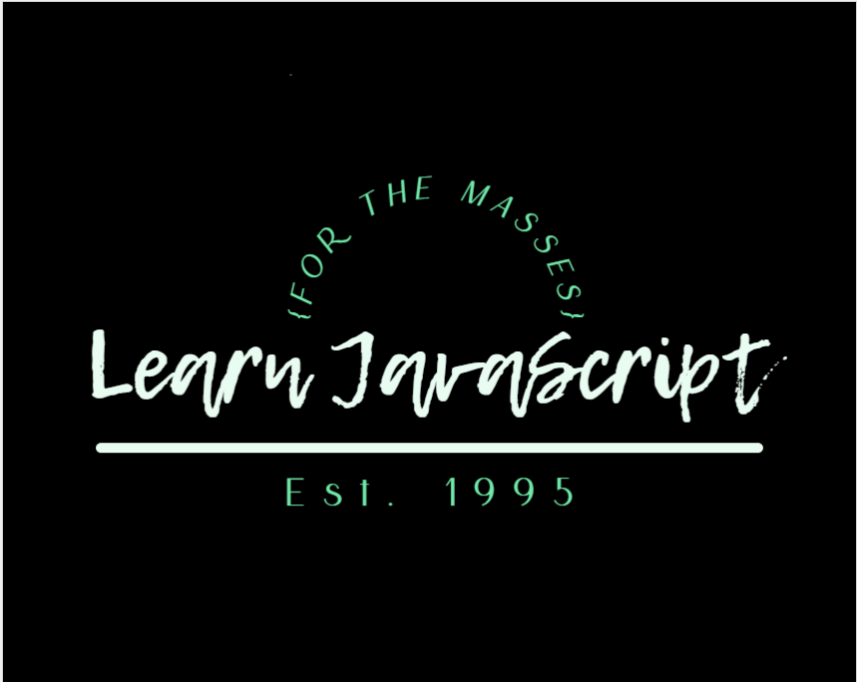
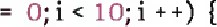

<h1 align="center">Learn JavaScript</h1>

<h6 align="center">(by Brian Bauska, educator)</h6>
<!--~~~~~~~~~~~~~~~~~~~~~~~~~~~~~~~~~~~~~~~~~~~~~~~~~~~~~~~~~~~~~~~~~~~~~~~~~~~~~~~~~~~~~~~~~~~~-->
<!--~~~~~~~~~~~~~~~~~~~~~~~~~~~ readme.md of js-learn-js.bauska.org ~~~~~~~~~~~~~~~~~~~~~~~~~~~~-->
<!--~~~~~~~~~~~~~~~~~~~~~~~~~~~~~~~~~~~~~~~~~~~~~~~~~~~~~~~~~~~~~~~~~~~~~~~~~~~~~~~~~~~~~~~~~~~~-->
<!--~~~~~~~~~~~~~~~~~~~~~~~~~~~~~~~~ 01. js learn js logo (01) ~~~~~~~~~~~~~~~~~~~~~~~~~~~~~~~~~-->

  

<h2>Table of Contents</h2>

<h3 id="JSStmts">JavaScript Statements</h3>

<h4>Examples of JavaScript Statements:</h4>
<ol type="1" start="1">
  <li>Variable Declaration:</li>
  <li>Conditional Statement:</li>
  <li>Loops</li>
</ol>

<h3 id="JSSyntax">JavaScript Syntax</h3>

[Examples of JavaScript Syntax :]
<ol type="1" start="1">

1.  [. Function Definition :]

2.  [. Object Literal :]

3.  [. Array Declaration :]

<h3 id="JSComments">JavaScript Comments</h3>
<h4>Examples of TavaScript Comments:</h4>
<ol type="1" start="1">
  <li>Single Line Comment:</li>
  <li>Multi - line Comment:</li>
  <li>Commenting Out Code:</li>
</ol>

<h3 id="JSVars">JavaScript Variables</h3
<h4>Examples of JavaScript  Variables</h4>
<ol type="1" start="1">
  <li>Declaring and Assigning a Variable:</li>
  <li>String Variable:</li>
  <li>Object Variable:</li>
</ol>

<h3 id="JSVars">JavaScript Variables</h3>
<h4>Examples of JavaScript  Variables</h4>
<ol type="1" start="1">
  <li>Declaring and Assigning a Variable:</li>
  <li>String Variable:</li>
  <li>Object Variable:</li>
</ol>

<h3 id="JSlet">JavaScript let</h3>
<h4>Example of let in JavaScript</h4>
<ol type="1" start="1">
  <li>String Variable</li>
  <li>Object Variable</li>
</ol>
<h3 id="JSconst">JavaScript const</h3>
<h4>Example of const in JavaScript</h4>

<h3 id="JSOper">JavaScript Operators</h3>
<h4>Examples of JavaScript  Operators</h4>
<ol type="1" start="1">
  <li>Arithmetic Operators:</li>
  <li>Comparison Operators:</li>
  <li>Logical Operators:</li>
</ol>

<h3 id="JSArithmetic">JS Arithmetic</h3>
<h4>Examples of JavaScript  Arithmetic</h4>
<ol type="1" start="1">
  <li>Addition:</li>
  <li>Subtraction:</li>
  <li>Multiplication:</li>
  <li>Division:</li>
  <li>Modulus (Remainder):</li>
</ol>

<h3 id="JSAssign">JS Assignment</h3>
<h4>Examples of JavaScript Assignment</h4>
<ol type="1" start="1">
  <li>Assigning a Value to a Variable:</li>
  <li>Assigning the Result of an Expression:</li>
</ol>

<h3 id="JSDataTypes">JS Data Types</h3>
<h4>Examples of JS Data Types:</h4>
<ol type="1" start="1">
  <li>Primitive Data Tvpes:</li>
  <li>Complex Data Types:</li>
</ol>

<h3 id="JSFunctions">JS Functions</h3>
<h4>Examples of JS Functions:</h4>
<ol type="1" start="1">
  <li>Function Declaration:</li>
  <li>Function Call:</li>
  <li>Arrow Function:</li>
</ol>

<h3 id="JSObjects">JS Objects</h3>
<h4>Examples of JS Objects:</h4>
<ol type="1" start="1">
  <li>Object Declaration:</li>
  <li>Accessing Object Properties:</li>
  <li>Calling Object Method:</li>
</ol>

<h3 id="JSEvents">JS Events</h3>
<h4>Examples of JS Events:</h4>
<ol type="1" start="1">
  <li>Click Events:</li>
  <li>Input Events:</li>
</ol>

<h3 id="JSStrings">JS Strings</h3>
<h4>Examples of JS String:</h4>
<ol type="1" start="1">
  <li>Declaring a String Variable:</li>
  <li>Concatenating Strings:</li>
</ol>

<h3 id="JSStringMethods">JS String Methods</h3>
<h4>Examples of JS String Methods:</h4>
<ol type="1" start="1">
  <li>toUpperCase() Method:</li>
  <li>substring() Method:</li>
</ol>

<h3 id="JSStringMethods">JS String Templates</h3>
<h4>Examples of JS String Templates:</h4>
<ol type="1" start="1">
  <li>Basic Template Literal:</li>
  <li>Multi-line Template Literal:</li>
</ol>

<h3 id="JSNumbers">JS Numbers</h3>
<h4>Examples of JS Numbers:</h4>
<ol type="1" start="1">
  <li>Whole Numbers:</li>
  <li>Decimal Numbers:</li>
</ol>

<h3 id="JSBigInt">JS BigInt</h3>
<h4>Examples of JS BigInt:</h4>
<ol type="1" start="1">
  <li>Creating a BigInt:</li>
  <li>Performing Operations with BigInt:</li>
</ol>

<h3 id="JSNumProperties">JS Number Properties</h3>
<h4>Examples of JS Number Properties:</h4>
<ol type="1" start="1">
  <li>Number_MAX_VALUE Property:</li>
  <li>Number_MIN_VALUE Property:</li>
</ol>

<h3 id="JSArrays">JS Arrays</h3>
<h4>Examples of JS Arrays:</h4>
<ol type="1" start="1">
  <li>Declaration:</li>
  <li>Accessing Elements:</li>
  <li>Modifying Elements:</li>
</ol>

<h3 id="JSArrayMethods">JS Array Methods</h3>
<h4>Examples of JS Array Methods:</h4>
<ol type="1" start="1">
  <li>push() Method:</li>
  <li>pop() Method:</li>
  <li>splice() Method:</li>
</ol>

[Function Declaration :]
>
[Function Call :]
>
[Arrow Function :]
>
Objects

Objects :
>
[Obiect Declaration :]
>
[Accessing Object Properties :]
>
[Calling Obiect Method :]

[JS Events]

[Examples of JS Events :]
>
[Click Event :]
>
[Input Event :]

[JS Strings]

[Examples of JS Strings :]
>
[Declaring a String Variable :]
>
[Concatenating Strings :]

[JS String Methods]

[Examples of JS String Methods :]
>
[toUpperCase () Method :]
>
[substring ( ) Method :]
>
String Search

Objects :
>
[Obiect Declaration :]
>
[Accessing Object Properties :]
>
[Calling Obiect Method :]

[JS Events]

[Examples of JS Events :]
>
[Click Event :]
>
[Input Event :]

[JS Strings]

[Examples of JS Strings :]
>
[Declaring a String Variable :]
>
[Concatenating Strings :]

[JS String Methods]

[Examples of JS String Methods :]
>
[toUpperCase () Method :]
>
[substring ( ) Method :]
>
String Search

String Search :
>
[indexOf () Method :]
>
[includes () Method :]

[JS String Templates]

[Examples of JS String Templates :]
>
[Basic Template Literal :]
>
[Multi - line Template Literal :]

[JS Numbers]

[Examples of JS Numbers :]
>
[Whole Numbers :]
>
[Decimal Numbers :]
>
[Scientific Notation :]

[JS Biglnt]

[Examples of JS Biglnt :]
>
[Creating a Biglnt :]
>
[Performing Operations with Biglnt :]
>
[Number Methods]

Number Methods :
>
[toFixed () Method :]
>
[parselnt ( ) Method :]

[JS Number Properties]

[Examples of JS Number Properties :]
>
[Number MAX VALUE Propertv :]
>
[Number . MIN VALUE Propertv :]

[JS Arrays]

[Examples of JS Arrays :]
>
[Declaration :]
>
[Accessing Elements :]
>
[Modifving Elements :]

[JS Array Methods]

[Examples of JS Array Methods :]
>
[push () Method :]
>
[pop ( ) Method :]
>
[splice ( ) Method :]

[JS Array Sort]

[Examples Array Sort :]

[Sorting Numbers :]
>
[Sorting Strings :]

[JS Array Iteration]

[Examples of JS Array Iteration :]
>
[forEach ( ) Method :]
>
[map () Method :]

[JS Array Const]

[Examples of JS Array Const :]

[JS Dates]

[Examples of JS Dates :]
>
[Creating a Date Obiect :]
>
[Creating a Specific Date :]

[JS Date Formats]

[Examples of JS Date Formats :]
>
[Formatting to String :]

[Formatting to Locale String :]

[JS Date Get Methods]

[Examples of TS Date Get Methods :]

[getFullYear ( ) Method :]
>
[getMonth ( ) Method :]

[JS Date Set Methods]

[Examples of TS Date Set Methods :]

[setFullYear () Method :]
>
[setMonth () Method :]

[JS Math]

[Examples of JS Math :]
>
[Math . PI Propertv :]
>
[Math . sqrt Method :]

[JS Random]

[Examples of JS Random :]
>
[Generating Random Number :]
>
[Generating Random Integer :]

[JS Booleans]

[Examples of JS Booleans :]
>
[Declaration :]
>
[Comparison :]

[JS Comparisons]

[Examples of JS Comparisons :]

Equality Operator j.&apos; Strict Equalitv Operator j:

[JS If Else]
[Examples of JS If Else :]
>
[Basic if else :]
>
[Nested if &period;.. else :]

[JS Switch]

[Examples of JS Switch :]
>
[Basic switch] •
>
[JS Loop For]
>
[Examples of TS Loop For :]

  
<!-- {width="9.57638888888889in" height="11.805555555555555in"} -->

[Basic for Loop :]
>
[Looping Array Elements :]

<h2 id="JSLoop">JS Loop For In</h2>

[Examples of JS Loop For In :]
>
[Iterating Object Properties :]
>
[JS Loop For Of]
>
[Examples of JS Loop For Of :]
>
[Iterating Over Array Elements :]

  
<!-- {width="5.213582677165354e-2in" height="3.125984251968504e-2in"}[JS Loop While] -->

[Examples of JS Loop While :]
>
[Basic while Loop :]
>
[JS Break]
>
[Examples of JS Break :]
>
[Using break in a Loop :]

[JS Iterables]

[Examples of JS Iterables :]
>
<!--~~~~~~~~~~~~~~~~~~~~~~~~~~~~~~~~~~~~~~~~~~~~~~~~~~~~~~~~~~~~~~~~~~~~~~~~~~~~~~~~~~~~~~~~~~~~-->
<!--~~~~~~~~~~~~~~~~~~~~~~~~~~~~~ 20. (xx) ~~~~~~~~~~~~~~~~~~~~~~~~~~~~~~-->
<!--~~~~~~~~~~~~~~~~~~~~~~~~~~~~~~~~~~~~~~~~~~~~~~~~~~~~~~~~~~~~~~~~~~~~~~~~~~~~~~~~~~~~~~~~~~~~-->

  
<!-- [Using Iterables with for of]{width="5.213582677165354e-2in" height="5.209864391951006e-2in"} -->
<!--~~~~~~~~~~~~~~~~~~~~~~~~~~~~~~~~~~~~~~~~~~~~~~~~~~~~~~~~~~~~~~~~~~~~~~~~~~~~~~~~~~~~~~~~~~~~-->
<!--~~~~~~~~~~~~~~~~~~~~~~~~~~~~~ 21. (xx) ~~~~~~~~~~~~~~~~~~~~~~~~~~~~~~-->
<!--~~~~~~~~~~~~~~~~~~~~~~~~~~~~~~~~~~~~~~~~~~~~~~~~~~~~~~~~~~~~~~~~~~~~~~~~~~~~~~~~~~~~~~~~~~~~-->

  

{width="9.722222222222221in"
height="11.805555555555555in"}

[JS Sets]

[Examples of JS Sets :]
>
[Creating a Set :]
>
[Iterating Over a Set :]

[JS Maps]

[Examples of JS Maps :]
>
[Creating a Map :]
>
[Iterating Over a Map :]
<!--~~~~~~~~~~~~~~~~~~~~~~~~~~~~~~~~~~~~~~~~~~~~~~~~~~~~~~~~~~~~~~~~~~~~~~~~~~~~~~~~~~~~~~~~~~~~-->
<!--~~~~~~~~~~~~~~~~~~~~~~~~~~~~~ 22/23. (xx) ~~~~~~~~~~~~~~~~~~~~~~~~~~~~~~-->
<!--~~~~~~~~~~~~~~~~~~~~~~~~~~~~~~~~~~~~~~~~~~~~~~~~~~~~~~~~~~~~~~~~~~~~~~~~~~~~~~~~~~~~~~~~~~~~-->

  

<!-- {width="6.25e-2in" {width="6.25e-2in" height="2.083880139982502e-2in"}[JS Typeof] -->

[Examples of JS Typeof :]
>
[Using typeof :]

[JS Type Conversion]

[Examples of JS Type Conversion]
>
[String to Number : Number to String :]
>
[JS Bitwise]
>
[Examples of JS Bitwise :]
<!--~~~~~~~~~~~~~~~~~~~~~~~~~~~~~~~~~~~~~~~~~~~~~~~~~~~~~~~~~~~~~~~~~~~~~~~~~~~~~~~~~~~~~~~~~~~~-->
<!--~~~~~~~~~~~~~~~~~~~~~~~~~~~~~ 24. (xx) ~~~~~~~~~~~~~~~~~~~~~~~~~~~~~~-->
<!--~~~~~~~~~~~~~~~~~~~~~~~~~~~~~~~~~~~~~~~~~~~~~~~~~~~~~~~~~~~~~~~~~~~~~~~~~~~~~~~~~~~~~~~~~~~~-->

  
<!-- (./images/image024.jpg){width="9.875in" height="11.805555555555555in"} -->

[Bitwise AND Operator :]
>
[Bitwise OR Operator :]
>
[JS RegExp]
>
[Examples of JS RegExp :]
>
[Creating a Reeular Expression :]
>
[Testing a String with RegExp :]

[JS Precedence]

[Examples of TS Precedence :]
>
[Arithmetic Precedence :]

[JS Errors]

[Examples of JS Errors :]
>
[Syntax Error :]
>
[Reference Error :]

<h2>[JS Scope]</h2>

[Examples of JS Scope :]
>
[Global Scope :]

[JS Hoisting]
<!--~~~~~~~~~~~~~~~~~~~~~~~~~~~~~~~~~~~~~~~~~~~~~~~~~~~~~~~~~~~~~~~~~~~~~~~~~~~~~~~~~~~~~~~~~~~~-->
<!--~~~~~~~~~~~~~~~~~~~~~~~~~~~~~ 25. (xx) ~~~~~~~~~~~~~~~~~~~~~~~~~~~~~~-->
<!--~~~~~~~~~~~~~~~~~~~~~~~~~~~~~~~~~~~~~~~~~~~~~~~~~~~~~~~~~~~~~~~~~~~~~~~~~~~~~~~~~~~~~~~~~~~~-->

  
<!-- (./images/image025.jpg){width="9.743055555555555in" height="11.805555555555555in"} -->

[Examples JS Hoisting :]
>
[Variable Hoisting :]
>
[Function Hoisting :]

[JS Strict Mode]

[Examples of JS Strict Mode :]
>
[Enabling Strict Mode :]
>
[using Strict Mode Inside a Function :]

<h3>JS this Keyword</h3>

[Examples of JS this Keyword :]
>
[Using this in an Obiect :]

<h3>JS Arrow Function</h3>

[Examples of JS Arrow Function :]
>
[Basic Arrow Function :]
>
[Arrow Function with Multiple Lines :]
>
[JS Classes]
>
[Examples of JS Classes :]
>
[Class Declaration :]
<!--~~~~~~~~~~~~~~~~~~~~~~~~~~~~~~~~~~~~~~~~~~~~~~~~~~~~~~~~~~~~~~~~~~~~~~~~~~~~~~~~~~~~~~~~~~~~-->
<!--~~~~~~~~~~~~~~~~~~~~~~~~~~~~~ 26. (xx) ~~~~~~~~~~~~~~~~~~~~~~~~~~~~~~-->
<!--~~~~~~~~~~~~~~~~~~~~~~~~~~~~~~~~~~~~~~~~~~~~~~~~~~~~~~~~~~~~~~~~~~~~~~~~~~~~~~~~~~~~~~~~~~~~-->

  
<!-- (./images/image026.jpg){width="9.347222222222221in" height="11.805555555555555in"} -->

<h2>JS Modules</h2>

[Examples JS Modules : Exporting a Module :]
>
[Importing a Module :]

<h2>JS JSON</h2>

[Examples of JS JSON :]
>
[Parsing JSON :]
>
[Stringify Obiect to JSON :]

[JS Debugging]

[Examples of JS Debugging :]
>
[Using console . log ( ) for Debugging :]
>
[Using Browser Developer Tools :]

[JS Style Guide]

[Examples of JS Style Guide :]
>
[Naming Conventions :]
>
[Indentation :]

[JS Best Practices]
<!--~~~~~~~~~~~~~~~~~~~~~~~~~~~~~~~~~~~~~~~~~~~~~~~~~~~~~~~~~~~~~~~~~~~~~~~~~~~~~~~~~~~~~~~~~~~~-->
<!--~~~~~~~~~~~~~~~~~~~~~~~~~~~~~ 27. (xx) ~~~~~~~~~~~~~~~~~~~~~~~~~~~~~~-->
<!--~~~~~~~~~~~~~~~~~~~~~~~~~~~~~~~~~~~~~~~~~~~~~~~~~~~~~~~~~~~~~~~~~~~~~~~~~~~~~~~~~~~~~~~~~~~~-->

  
<!-- ./images/image027.jpg){width="9.222222222222221in" height="11.805555555555555in"} -->

[Examples TS Best Practices :]
>
[Use Meaningful Variable Names :]
>
[Avoid Global Variables :]

[JS Mistakes]

[Examples of JS Mistakes :]
>
[Missing Semicolon :]
>
[Uninitialized Variables :]

[JS Performance]

[Examples of TS Performance :]
>
[Reduce DOM Manipulations :]
>
[Use EffcientAl orithms :]

[JS Reserved Words]

[Examples of JS Reserved Words :]
>
[let const function class etc .]

[JS Objects]

[Object Definitions :]
>
[Creating an Obiect Literally :]

{width="9.604166666666666in"
height="11.805555555555555in"}

[using the Obiect Constructor :]

[Obiect Properties]

[Obiect Properties Examples :]
>
[Accessing Obiect Properties :]
>
[Adding or Modifying Properties :]

[Obiect Methods]

[Obiect Methcds Examples :]
>
[Accessing Obiect Methods :]
>
[Adding Methods to an Obiect :]

[Obiect Display]

[Obiect Display Examples :]
>
[Using console . Ice O:]
>
[Stringify with JSON :]

[Obiect Accessors]

[Obiect Accessors Examples :]
>
[using Getters and Setters :]

[Object Constructors]

{width="9.645833333333334in"
height="11.805555555555555in"}

[Obiect Constructors Examples :]
>
[Vsing Constructor Functions :]

[Obiect Prototypes]

[Obiect Protctypes Examples :]
>
[Adding Methods to the Protctype :]

[Obiect Iterables]

[Obiect Iterables Examples : Using for .. . in Loop :]
>
{width="6.253062117235346e-2in"
height="6.251859142607175e-2in"}{width="5.21084864391951e-2in"
height="4.167979002624672e-2in"}[Ušing Obiect . keys O:]

[Obiect Sets]

[Obiect Sets Examples :]
>
[Creating a Set :]
>
[Checking Set Membership :]

[Obiect Maps]

[Obiect Maps Examples :]
>
[Creating a Map :]
>
[Getting Values from a Map]

{width="9.54861111111111in"
height="11.805555555555555in"}

[Object Reference]

[Object Reference Examples]
>
[Referencing an Obiect :]
>
[Changing Obiect through Reference :]

[JS Functions]

[Function Definitions :]
>
[Function Declaration :]
>
[Function Expression :]
>
[Arrow Function :]
>
[Function Parameters]
>
[Function Parameters Examples :]
>
[Single Parameter :]
>
[Multiple Parameters :]
>
[Function Invocation]
>
[Function Invocation Examples :]
>
[Calling a Function :]

[Function Call]

{width="9.38888888888889in"
height="11.805555555555555in"}

[Function Call Examples]

  -----------------------------------------------------------------------
  Using call
  -----------------------------------------------------------------------

  -----------------------------------------------------------------------

[Function Apply]

[Function Apply Examples :]

  -----------------------------------------------------------------------
  Using apply
  -----------------------------------------------------------------------

  -----------------------------------------------------------------------

[Function Bind]
>
[Function Bind Examples :]

bind

[Function Closures]

[Function Closures Examples :]

[Closure Example :]

[JS Classes]

[Class Intro :]
>
[Class Declaration :]
>
[Creating Instances :]

[Class Inheritance]

[Class Inheritance Example :]

{width="10.11111111111111in"
height="11.805555555555555in"}

[Extending a Class]
>
[Using Inherited Methods :]

[Class Static]

[Class Static Example :]
>
[Adding a Static Method :]

<h2>[JS Async]</h2>

[JS Callbacks]
>
[Callbacks Example :]

<h3>[JS Asynchronous]</h3>

[Asynchronous Example :]

[JS Promises]

[Promises Example :]
>
[Creating a Promise :]
>
[IS Async / Await]
>
[Async / Await Example :]
>
[Using Async / Await :]
>
[JS HTML DOM]

{width="10.090277777777779in"
height="11.805555555555555in"}

[DOM Intro :]

[Accessing an Element by ID :]

[DOM Methods]

[Changing Element Content :]

<h2>[DOM Document]</h2>

[Accessing Document Properties :]

[DOM Elements]

       Element Styles :

<h2>DOM HTML</h2>

[Changing HTML Attributes :]

[DOM Forms]

[Accessing Form Elements :]

<h2>[DOM CSS]</h2>

[Changing CSS Classes :]

<h3>[DOM Animations]</h3>

[Animating an Element :]

[DOM Events]

[Click Event Handling :]

{width="9.645833333333334in"
height="11.805555555555555in"}

[DOM Event Listener]
>
[Mouseover Event Handling :]
>
[DOM Navigation]
>
[Traversing Child Elements :]

<h3>[DOM Nodes]</h3>

[Creating a New Node :]
>
[DOM Collections]
>
[Accessing Collection Elements :]
>
[DOM Node Lists]
>
[Accessing Node List Elements :]

[JS Browser BOM]

[JS Window]
>
[Accessing Window Properties :]
>
[JS Screen]
>
[Accessing Screen Properties :]
>
[JS Location]
>
[Accessing Location Information :]
>
[JS History]

{width="9.61111111111111in"
height="11.805555555555555in"}

[Accessing History Methods :]
>
[JS Navigator]
>
[Accessing Navigator Properties :]
>
[JS Popup Alert]
>
[Displaying an Alert :]
>
[JS Timing]
>
Using setTimeout

  Using setlnterval                                                  

[JS Coclcies]
>
[Setting a Cookie :]
>
[Accessing a Cookie :]

<h3>[JS web APIs]</h3>

[Web API Intro]
>
[Accessing the Web API :]
>
[Web Forms API]
>
[Accessing Form Elements :]
>
[Web History API]
>
[Changing Browser History :]

{width="9.680555555555555in"
height="11.805555555555555in"}

[Web Storage API]
>
[Using localStorage :]
>
[web Worker API]
>
[Creating a Web Worker :]
>
[Web Fetch API]
>
[Making a GET Request :]
>
[Web Geolocation API]
>
[Getting User&apos;s Location :]
>
[JS AJAX]

<h3>[AJAX Intro]</h3>

[Simple AJAX Request :]
>
[AJAX XMLHttp using XMLHttpRequest :]
>
[AJAX Request]
>
[Sending POST Request :]
>
[AJAX Response]
>
[Handling JSON Response :]
>
[AJAX XML File]

{width="10.083333333333334in"
height="11.805555555555555in"}

[Fetching XML File :]

[AJAX PHP]

[Handling AIAX in PHP :]

<h3>[AJAX ASP]</h3>
with ASP :
[AJAX Database]

[Database Interaction with ATAX :]

[AJAX Applications]

[Real - time Chat Application :]

[AJAX Examples]

[AIAX Example 1 :]
>
[AIAX Example 2 :]
>
[AIAX Example 3 :]
>
[AIAX Example 4 :]
>
[AJAX Example 5 :]
>
[AIAX Example 6 :]

<h3>[Dynamic Content Loading]</h3>

[Form Submission with AJAX]

[Fetching JSON Data]

 Example 7 :  | Autocomplete Search

[Image Gallery with ATAX]

{width="8.618055555555555in"
height="11.805555555555555in"}

[AJAX Example 8 : Live Data Update]
>
[AIAX Example 9 : Infinite Scroll]
>
[ATAX Example 10 : File Upload with Progress Bar]
>
[AIAX Example 11 : Displaying Time Dynamically]

<h3>[JS JSON]</h3>

<h3>[JSON Intro]</h3>

[Example of JSON Data :]
>
[JSON Syntax]
>
[Example of JSON Syntax :]

<h3>[JSON vs XML]</h3>

[Example ComparJSON between JSON and XML :]
>
[JSON Data Types]
>
[Example of Different Data Types in JSON :]

<h3>[JSON Parse]</h3>

[Example of JSON Parsing :]
>
[JSON Stringify]
>
[Example of JSON Stringification :]
>
[JSON Objects]

[Example of a JSON Obiect :]
>
[JSON Arrays]
>
[Example of a JSON Array :]
>
[JSON Server]
>
[Example of JSON Data from a Server :]
>
[JSON PHP]
>
[Example of Encoding and Decoding JSON in PHP :]
>
[JSON HTML]
>
[Example of Usine JSON Data in HTML :]

<h3>[JSON JSONP]</h3>

[Example of JSONP Request :]

1.  [. Creating a JSON Obiect :]

2.  [. Accessing JSON Obiect Properties :]

3.  [. Nested JSON Obiects :]

4.  [. JSON Array of Obiects :]

5.  [. Converting TSON to String :]

6.  [. Parsing JSON String to Object :]

7.  . Fetching JSON Data from URL ( using Fetch API

8.  [. Displaying JSON Data Dynamically in HTML :]

9.  [. Handling JSON Data in Forms :]

10. . [Stringifying and Parsing a More Complex Obiect]

[1 1 . Filtering JSON Array Data :]

12. . [Updating JSON Object Properties :]

13. [. Removing a Propertv from JSON Object :]

14. [Using JSON with Local Storage    :]

[1 5 . Handling TSON Date Strings :]

16. [. Using JSON in Asynchronous Functions :]

17. [. JSON Serialization with Custom Functions :]

18. . Handling TSON Data from an API ( Using Axios

19. [. Merging JSON Obiects :]

20. [. Mappinz JSON Data to Another Structure :]

[JayaScript vs iOuery : A Comprehensive ComparJSON]

[JavaScript Overview]

[Example of JavaScript Functionality :]

[jQuery Overview]

[Example of jQuery Functionality : Differences Between JavaScript and jQuery]

1.  [. Syntax :]

2.  [. DOM Manipulation :]

3.  [Browser Compatibility :]

4.  [. Learning Curve :]

[jQuery Selectors]

[Example of jQuery Selectors :]

[jQuery HTML Manipulation]

[Example of jQuery HTML Manipulation :]

<h4>[jQuery CSS Manipulation]</h4>

[Example ofiOuery CSS Manipulation :]

[jQuery DOM Traversal]

[Example of jQuery DOM Traversal :]

<h4>[Conclusion]</h4>

1.  [. Selecting an Element by ID :]

{width="9.125in"
height="11.805555555555555in"}

2.  [. Selecting Multiple Elements by Class :]

3.  [. Adding Event Listeners :]

4.  [. Handling Document Ready Event :]

5.  [. Creating a New Element :]

6.  [. Removine an Element :]

7.  [. Manipulating CSS Class :]

8.  [. Changing Text Content :]

9.  [. Hidinz an Element :]

10. [. Fading In an Element :]

[1 1 . AIAX GET Request :]

[12 . AIAX POST Request :]

[1 3 . Getting Attribute Value :]

[14 . Setting Attribute Value :]
>
[1 5 . Getting Form Values :]

16. [. Checking Checkbox State :]

17. [. Iteratine Over NodeList :]

{width="9.090277777777779in"
height="11.805555555555555in"}

18. [. Handling Form Submission :]

19. [. Animating Element :]

20. [. Changing Background Color on Click :]

[JavaScript Graphics Libraries : Explained]

1.  [. JavaScript Graphics]

2.  [. JS Canvas]

3.  [. JS Plotly]

{width="0.469174321959755in"
height="0.2500732720909886in"}IS Chart is

5.  [. JS Google Chart]

6.  [. JS D3 . is]

[Conclusion]
>
[Canvas Examples :]
>
[Plotly Examples :]
>
[Chart . JS Examples
:]{width="1.0426509186351705e-2in"
height="3.125984251968504e-2in"}
>
[Google Charts Examples :]
>
[D3 . JS Examples :]

{width="8.993055555555555in"
height="11.805555555555555in"}

[Canvas Examples :]

[Plotly Examples :]
>
[Chart . JS Examples :]

[Google Charts Examples :]

[D3 . JS Examples :]
>
[Basic Examples :]

[String Manipulation :]

[Array Manipulation :]

[Functions :]

[Obiect Manipulation :]

[Loops and Iterations :]

[Error Handling :]

[Asynchronous JavaScript :]

[DOM Manipulation :]

[Regular Expressions :]

[Advanced Functions]

{width="10.069444444444445in"
height="11.805555555555555in"}

[Advanced Array Manipulation :]

[Advanced Obiect Manipulation :]

[Advanced Loops and Iterations :]

[Promises and Async / Await :]

[Advanced DOM Manipulation :]

[ES6 + Features :]

[Error Handling and Regular Expressions :]

[Advanced Functions and Functionality :]

[Advanced Array Manipulation :]

[Advanced Object Manipulation : Advanced Loops and Iterations
:]

[Advanced Error Handling :]

[Advanced Object Manipulation :]

[Advanced Array Manipulation :]

[Advanced Functicnality : Advanced Error Handling]

{width="9.07638888888889in"
height="11.805555555555555in"}

[ES6 + Features :]

[Advanced Functions and Operations :]

[Advanced Array Manipulation :]

[Advanced Object Manipulation :]

[Advanced Promises and Async / Await :]

[ES6 + Features :]

[Advanced Functions and Operations :]

[Advanced Array Manipulation :]

[Advanced Object Manipulation :]

[Advanced Promises and Async / Await :]

[ES6 + Features :]

[Advanced Functions and Operations :]

[Advanced Array Manipulation :]

[Advanced Obiect Manipulation :]

[Advanced Promises and Async / Await :]

[ES6 + Features]

{width="9.131944444444445in"
height="11.805555555555555in"}

[Advanced Functions and Operations :]

[Advanced Array Manipulation :]

[Advanced Object Manipulation :]

[Advanced Promises and Async / Await :]

[ES6 + Features :]

[Advanced Functions and Operations :]

[Advanced Array Manipulation :]

[Advanced Obiect Manipulation :]

[Advanced Promises and Async / Await : ES6 + Features :]

[Advanced Functions and Operations :]

[Advanced Array Manipulation :]

[Advanced Object Manipulation :]

[Advanced Promises and Async / Await : ES6 + Features :]

[Advanced Functions and Operations :]

[Advanced Array Manipulation :]

[Advanced Obiect Manipulation :]

[Advanced Promises and Async / Await :]

[ES6 + Features :]

[Advanced Functions and Operations :]

[Advanced Array Manipulation :]

[Advanced Obiect Manipulation :]

[Advanced Promises and Async / Await :]

[ES6 + Features :]

[Advanced Functions and Operations :]

[Advanced Array Manipulation :]

[Advanced Obiect Manipulation :]

[Advanced Promises and Async / Await :]

[ES6 + Features :]

[Advanced DOM Manipulation :]

[DOM Traversal and Manipulation :]

[Advanced Event Handling :]

[DOM Content Manipulation :]

[Input Event Handling :]

[Form Validation and Submission :]

<h4>[Advanced Input Handling]</h4>

[DOM Obiect Creation and Manipulation :]

[Advanced Obiect Manipulation :]

[Styling HTML Obiects :]

[Event Handling and Interaction :]

[Advanced Content Manipulation :]

[Event Handling :]

[Event Delegation and Bubbling :]

[Window and Docurnent Events :]

[Form Events :]

[Browser Object Model ( BOM ) Manipulation :]

[Navigator Obiect Exploration :]

[Location Obiect Manipulation :]
>
[Screen Obiect Attributes :]
>
[Installing JavaScript :]
>
[Setting Up Visual Studio Code for JavaScript Development
:]
>
[Conclusion :]

<h3>Statements</h3>

JavaScript statements are individual commands or instructions that the
browser executes . They form the logic of a program and can be simple
or complex .

Examples of JavaScript Statements :

I Variable Declaration :
>
javascript code let x; // Declaring a variable &Hat;i&Hat;x&Hat;i&Hat;

2.  . Conditional Statement :

javascript code

// Executed if x is equal to 5 console . log ( is 5&apos; ) ;
>
} else {
>
// Executed if x is not equal to 5 console . log ( &apos;x is not 5 ) ;

3.  Loops :

javascript code for ( let i O; i &lt; 5; i + + ) { // Executed 5 times
console . log ( i ) ;

<h2>Syntax</h2>

JavaScript syntax refers to the rules that define the structure of
valid JavaScript code . It includes rules for writing statements,
variables, and functions in a way that the interpreter or browser can
understand . Examples ofJavaScript Syntax :

1.  Function Definition :

javascript code function greet ( name ) { return &apos;Hello, name
+

2.  . Object Literal javascript code const person
    firstName : &apos;John&apos;, lastName &apos;Doe&apos;, age 30

3.  Array Declaration :

javascript code constnumbers

<h3>Comments</h3>

Comments in JavaScript are used to add explanatory notes within the
code They are ignored by the interpreter and are only meant for human
readers

Examples of JavaScript Comments :

1.  Single Line Comment :

javascript code
>
// This is a single line comment

2.  . Multi - line Comment :

javascript code

This is a multi - line comment

3.  Commenting Out Code :

javascript code
>
// This code won&apos;t be executed
>
// const x 10;

<h3>JavaScript Variables</h3>

Variables in JavaScript are used to store data values . They can hold
various types of data such as numbers, strings, objects, and more ,

Examples ofJavaScript Variables :

1.  Declaring and Assigning a Variable :

javascript code let age = 25; // Declaring &apos;age&Hat;i&Hat; and assigning a
value of 25

2.  . String Variable :

javascript code let name &apos;Alice&apos;; // A variable holding a string
value

3.  Object Variable :

javascript code let person {name : &apos;Bob, age : 30 // A variable
holding an object

<h3>JavaScript let</h3>

The let keyword is used to declare variables in JavaScript . It allows
the declared variable to be reassigned a new value if
needed

Example of let in JavaScript :

java script code let x 5;
>
10; // Reassigning &apos;x&apos; to a new value

<h3>JavaScript const</h3>

The const keyword is used to declare constants in JavaScript . Once
assigned, the value of a const cannot be
changed

Example of const in JavaScript :

java script code const PI = 3 . 14159; // Declaring a constant PI
>
// PI - - 3; // This will throw an error as reassignment is not
allowed

<h3>JavaScript Operators</h3>

JavaScript operators are symbols used to perform operations on
operands, such as arithmetic operations, assignment, comparison,
logical operations, etc .

Examples ofJavaScript Operators :

1.  . Arithmetic Operators :

javascript code let a = 10; let b
difference = a - b; // Subtraction let product = a &ast; b; //
Multiplication let quotient = a / b; // Division

2.  . Comparison Operators :

javascript code let x 5; let

console . log ( x y ) ; // Equality check
console . log ( x y) ; // Inequality check

console . log ( x y) ; // Greater than console . log ( x &lt; y) ; //
Less than

3.  Logical Operators :

javascript code let p true; let q false; console . log ( p &&q); //
Logical AND console . log ( p Il q ) ; // Logical OR console . log (!
p ) ; // Logical NOT
>
This comprehensive guide covers various aspects of JavaScript
statements, syntax, comments, variables ( let and const ) , and
operators, offering examples and explanations to aid understanding ,

<h2>JS Arithmetic</h2>

JavaScript provides arithmetic operators to perform mathematical
calculations on numbers ,

Examples ofJS Arithmetic :

Addition :
>
javascript code let sum = 5 4 3• // sum = 8
>
Subtraction :
>
javascript code let difference = 10 - 4; // difference 6
>
Multiplication :
>
javascript code let product 7; // product 42
>
Division java script code let quotient = 20/ 5;
// quotient = 4
>
Modulus ( Remainder ):
>
javascript code let remainder = 15 % 4; // remainder
<h3>JS Assignment</h3>

In JavaScript, the assignment operator (z) is used to assign values to
variables . Examples ofJS Assignment :
>
Assigning a Value to a Variable :
>
javascript code let x = 10; // Assigning the value 10 to variable •x&apos;
>
Assigning the Result of an Expression :
>
javascript code let y = x 4 5; // Assigning the result of an
expression to &Hat;l&Hat;y&Hat;r&Hat;

<h3>JS Data Types</h3>

JavaScript has several data types that define the kinds of values it
can work with . Examples ofJS Data Types : Primitive Data Types :

Number : letnum - 10;

-   String : let text - &apos;Hello&apos;;

-   Boolean : let isTrue true;

-   Undefined let value;

-   Null T. let emptyValue null;

Complex Data Types :

-   Object . let person = (name : &apos;Alice&apos;, age : 25 1;

-   Array: let numbers &lbrack; 1, 2, 3, 41 5 &rbrack; ;

<h2>JS Functions</h2>

Functions in JavaScript are reusable blocks of code that perform a
specific task when called .

Examples ofJS Functions :

Function Declaration :
>
javascript code function greet ( name ) { return &apos;Hello, + name
+
>
Function Call javascript code let message = greet (
&apos;John&apos; ) ; // message = &apos;Hello, John ! &apos;
>
Arrow Function :
>
javascript code const multiply ( a, b ) = &gt; a
let result multiply ( 5, 3 ) ; // result
15

<h3>JS Objects</h3>

Objects in JavaScript are containers for named values called
properties and methods . Examples ofJS Objects :
>
Object Declaration :
>
javascript code let person { name : &apos;Alice&apos;, age : 30,
>
greet : function
return &apos;Helloj my name is &Hat;i&Hat; -v this .
name 
>
Accessing Object Properties :
>
javascript code console . log ( person . name ) ; // Output : Alice
>
Calling Object Method :
>
javascript code console . log ( person greet ; // Output : Hello, my
name is Alice !

<h2>JS Events</h2>

JavaScript events are actions that occur when a user interacts with a
web page, like clicking a button or typing in a form
field!

Examples ofJS Events :

Click Event :
>
javascript code document . getElementById ( &apos;myButton&apos; ).
addEventListener ( &apos;click&apos;, function
console . log ( &apos;Button clicked ! ) ;
>
Input Event :
>
javascript code
>
document . getElementById ( &apos;mylnput&Hat;i&Hat; addEventListener ( &apos;input&apos;,
function console . log ( &apos;Input changed ! &Hat;i&Hat; )
•

<h2>JS Strings</h2>

Strings in JavaScript are sequences of characters enclosed in single
or double quotes
Examples ofJS Strings :
>
Declaring a String Variable :
>
javascript code let message = &quot;Helloj World
>
Concatenating Strings :
>
javascript code let greeting &apos;Hello, &Hat;I&Hat;; let name &apos;Alice&apos;; let
welcomeMessage greeting + name; // welcomeMessage - &apos;Hello, Alice

<h3>JS String Methods</h3>

JavaScript provides various methods to manipulate strings . Examples
ofJS String Methods :
>
toUpperCase () Method :
>
javascript code let text = &apos;hello&apos;;
>
let upperCaseText = text . toUpperCase () ; // upperCaseText = &apos;HELLO
substring () Method :
>
javascript code let sentence - This is a sentence&apos;; let subSentence
sentence . substring( 5, 10 ) ; // subSentence - &apos;is a &apos;

<h3>JS String Search</h3>

JavaScript provides methods to search for substrings within a string .
Examples ofJS String Search :
>
indexOf () Method :

javascript code let text = &apos;Hello, World ! &apos;i let position text .
indexOf ( &apos;Worldl ) ; // position = 7 includes Method :

javascript code let sentence This is a sentence&apos;; let containsWord
sentence . includes ( &apos;sentence&apos; ) ; // containsWord true

<h3>JS String Templates</h3>

Template literals allow embedding expressions and variables into
strings
Examples ofJS String Templates :
>
Basic Template Literal :
>
javascript code let name = &apos;Alice&apos;; let message = Hello, &dollar;{name) •
// message = &ast;Hello, Alice !
>
Multi - line Template Literal :
>
javascript code let multiLineMessage -
>
This is a multi - line message

<h3>JS Numbers</h3>

JavaScript handles numeric data using the number data type .
>
Examples ofJS Numbers :
>
Whole Numbers :
>
javascript code let integerNumber
Decimal Numbers :
>
javascript code let decimalNumber 3 .
14
>
Scientific Notation :
>
javascript code let scientificNumber = 2e3; // scientificNumber &dash;-
2000

<h4>JS Biglnt</h4>

Biglnt is a numeric data type in JavaScript that can represent
integers with arbitrary
precision

Examples ofJS Biglnt :

Creating a Biglnt :
>
javascript code let bigNumber 123456789012345678901234567890n;
>
Performing Operations with Biglnt :
>
javascript code let bigSum = bigNumher In;

<h6>JS Number Methods</h6>

JavaScript provides methods for performing operations and
manipulations with numbers . Examples ofJS Number Methods :
>
toFixed () Method :
>
java script code let number = 3. 14159; let roundedNumber = number .
toFixed ( 2 ) ; // roundedNumber = &Hat;i&Hat; 3 • 14
parselnt () Method :

javascript code let stringNumber &apos;42; let parsedNumber = parselnt (
stringNumber) ; // parsedNumber 42

<h3>JS Number Properties</h3>

JavaScript has some built - in properties associated with numbers .
Examples ofJS Number Properties :
>
Number . MAX_VALUE Property :
>
javascript code console . log ( Number . MAX_VALUE); // Output: 1 .
7976931348623157e 308

Number . MIN_VALUE Property :

javascript code console . log ( Number . MIN_VALUE // Output: 324
>
This comprehensive guide covers various aspects of JavaScript,
including arithmetic operations, assignment, data types, functions,
objects, events, strings, string methods, string search, string
templates, numbers, Biglnt, number methods, and number properties,
providing examples and explanations for each topic .

<h4>JS Arrays</h4>

Arrays in JavaScript are used to store multiple values in a single
variable . Examples ofJS Arrays :
>
Declaration java script code let numbers 1, 2, 3,
&rbrack; ; // Array of numbers let fruits &apos;apple&apos;, &apos;banana&apos;, &apos;orange&apos;
I ; // Array of strings
>
Accessing Elements :
>
javascript code console . log ( fruits I O &rbrack;) ; // Output : &apos;apple&apos;
>
Modifying Elements :
>
javascript code fruits &lbrack; 1 &vert; = &apos;grapes&apos;; // Changing banana&apos; to
&apos;grapes&apos;

<h4>JS Array Methods</h4>

JavaScript provides various methods to manipulate arrays effciently .
Examples ofJS Array Methods :
>
push () Method :
>
javascript code fruits . push ( &apos;melonl ) ; // Adds Imelonl to the
end of the array pop Method :
>
javascript code let removedFruit = fruits . POP ) ; // Removes and
returns the last element ( &apos;melon&apos; ) splice () Method :
>
javascript code numbers splice ( 2, 1 ) ; // Removes 1 element at
index 2 ( removes 131 )

<h6>JS Array Sort</h6>

JavaScript offers methods to sort arrays in various ways
Examples ofJS Array Sort :
>
Sorting Numbers :
>
java script code numbers . sort (( a, b )
b ) // Ascending order
>
Sorting Strings javascript code fruits . sortO ; //
Alphabetical order

<h2>JS Array Iteration</h2>

Array iteration involves looping through arrays to perform operations
on each element . Examples ofJS Array Iteration :
>
forEach () Method :
>
javascript code numbers . fcrEach ( number
console . log ( number ) ;
>
map () Method :
>
javascript code let doubledNumbers numbers . map ( number &gt; number &ast;
2 );

<h3>JS Array Const</h3>

Arrays declared with const can&apos;t be reassigned but their elements can
be modified .

Examples ofJS Array Const :

javascript code constweekdays = &lbrack; &apos;Monday&apos;, &apos;Tuesday&apos;,
&apos;Wednesday&apos; I ; weekdays &vert; 1 &vert; = &apos;Thursday&apos;; // Modifying an
element is allowed
>
// weekdays = &apos;Monday&apos;, &apos;Thursday&apos;, &Hat;i&Hat;Wednesday&apos; &rbrack; ; // This
will throw an error

<h3>JS Dates</h3>

JavaScript provides a Date object to work with dates and times
<h4>Examples ofJS Dates :</h4>
>
<h5>Creating a Date Object :</h5>

javascript code

let currentDate = newDate();  // Current date and time.

<h5>Creating a Specific Date :</h5>

javascript code
<h6>let specificDate new Date(&apos;2023&dash;12&dash;31&apos;); // December 31, 2023.</h6>

<h4>JS Date Formats</h4>

Date formatting in JavaScript involves converting dates to different formats.

Examples ofJS Date Formats :
>
<h4>Examples of JS Date Formats:</h4>
<h4>Formatting to String :</h4>
javascript code
let dateString = specificDate.toDateString(); // Convert to a human-readable string.

<h4>Formatting to Locale String :</h4>
javascript code
let localString = specificDate.toLocaleString(); // Converts to local date and time string.

<h4>JS Date Get Methods</h4>

JavaScript Date object provides various methods to retrieve specific date.

components{width="4.1666666666666664e-2in"
height="4.167869641294838e-2in"}

Examples of JS Date Get Methods :

getFu11Year () Method
{width="6.25e-2in"
height="0.14587598425196852in"}javascript code let year = specificDate
. getFullYearO; // Get the year ( 2023 ) getMonth () Method :
>
javascript code let month = specificDate . getMonth ; // Get the month
( 11 for December )

<h3>JS Date Set Methods</h3>

JavaScript Date object also has methods to set specific date
components .

Examples ofJS Date Set Methods :

setFuIIYear () Method :
>
javascript code specificDate . setFullYear ( 2024 ) ; // Set the year
to 2024 setMonth () Method :
>
javascript code specificDate . setMonth ( O ) ; // Set the month to
January ( O index )

<h3>Math</h3>

JavaScript Math object provides mathematical constants and functions
{width="4.1666666666666664e-2in"
height="4.167869641294838e-2in"}

Examples ofJS Math :

Math . PI Property :
>
javascript code let piValue = Math . PI; // Value ofPl (3 .
141592653589793 )
>
Math . sqrt () Method :
>
javascript code let squareRcot Math . sqrt ( 25 ) ; // Square root of
25 ( 5 )

<h4>JS Random</h4>

JavaScript Math . random () generates pseudo - random numbers .

Examples ofJS Random :

Generating Random Number :
>
javascript code let randomNumber = Math . random &apos; // Random number
between O and 1
>
Generating Random Integer :
>
javascript code let randomlnteger = Math . floor ( Math . random 10 )
; // Random integer between O and 9

<h4>Booleans</h4>

Booleans in JavaScript represent true or false values . Examples ofJS
Booleans :
>
Declaration :

javascript code let isTrue = true
let isFalse = false; Comparison :

javascript code let greaterThan // true let equalTo 5 5; // true

<h3>JS Comparisons</h3>

JavaScript offers various comparison operators to compare values .
Examples ofJS Comparisons :
>
==( Equality Operator ):
>
javascript code console . log ( 5 ) ; // true ( coerces types )
>
Strict Equality Operator ):
>
javascript code console . log ( 5
151 ) ; // false ( compares both value
and type )
>
This comprehensive guide covers various aspects of JavaScript
including arrays, array methods, array sort, array iteration; array
const, dates, date formats, date get methods, date set methods, math,
random, booleans, and comparisons, providing examples and explanations
for each topic .

<h4>JS If Else</h4>

The if else statement in JavaScript executes a block of code if a
specified condition is true and another block of code if the condition
is false

Examples ofJS If Else :

Basic if else :

java script code let num = 10;
>
If ( num &gt; O) { console . log ( &quot;Number is
positive&apos;
>
) else f console . log ( &apos;Number is not
positive&apos;
>
Nested if &period;.. else:
>
javascript code let x 5; if (x &gt; O) { console .
logis
positive&apos;
} else if ( x &lt; O )
console log
 &quot;x is
negativel
>
) else f console . log ( is zeroi ) ;

<h3>JS Switch</h3>

The switch statement in JavaScript executes different actions based on
different conditions
Examples of JS Switch :
>
Basic switch :
>
javascript code let day
{width="0.5104166666666666in"
height="0.2500732720909886in"}switch ( day ) &lbrack; case 1
{width="4.1666666666666664e-2in"
height="0.13545603674540682in"}console . log ( iMonday• ) ; break;
case 2 :
>
console . log ( &Hat;i&Hat; Tuesday ) ; break; default :
>
console . log ( Other day&apos; ) ;

<h4>JS Loop For</h4>

The for loop in JavaScript repeatedly executes a block of code until a
specified condition evaluates to false
{width="4.1666666666666664e-2in"
height="4.167869641294838e-2in"}

Examples of JS Loop For :

Basic for Loop :

javascript code for ( let i = + + ) I console . log ( i) ;
>
Looping Array Elements :
>
javascript code let arr &apos;applet, banana&apos;, &apos;orange&apos; &rbrack; ; for ( let
i O; i &lt; arr . length; i ++) { console . log ( arr &lbrack; i &rbrack;) ;

<h4>JS Loop For In</h4>

The for &period;.. in loop in JavaScript iterates over the enumerable
properties of an object .

Examples ofJS Loop For In :

Iterating Object Properties
{width="6.25e-2in"
height="0.15629702537182852in"}javascript code let person = { name :
IAIiceI, age 30, gender : female&apos;

for ( let prop in person ) { console . log ( prop + person &lbrack; prop l)
;

<h4>JS Loop For Of</h4>

The for of loop in JavaScript iterates over iterable objects such as
arrays, strings, etc
{width="4.1666666666666664e-2in"
height="4.167869641294838e-2in"}Examples ofJS Loop For Of :
>
Iterating Over Array Elements :
>
java script code let numbers
{width="1.8125in"
height="0.2813331146106737in"}for ( let num of numbers ) f console .
log ( num ) ;

<h4>JS Loop While</h4>

The while loop in JavaScript executes a block of code while a
specified condition is true
{width="4.1666666666666664e-2in"
height="4.167979002624672e-2in"}Examples ofJS Loop While :

Basic while Loop :

java script code let count = o; while ( count &lt;
5{width="0.3229166666666667in"
height="0.26049431321084865in"}
>
console . log ( count) ;
>
{width="1.3020833333333333in"
height="0.21881452318460193in"}

<h4>JS Break</h4>

The break statement in JavaScript terminates the current loop or
switch statement
{width="4.1666666666666664e-2in"
height="4.167869641294838e-2in"}Examples ofJS Break :
>
Using break in a Loop :
>
javascript code
>
for ( let 1
{width="2.2604166666666665in"
height="0.2813331146106737in"}if ( i 5) {
>
break;
>
console . log ( i ) ;

<h3>JS Iterables</h3>

Iterables in JavaScript are objects that can be iterated over using
loops {width="4.1666666666666664e-2in"
height="4.167979002624672e-2in"}Examples ofJS Iterables :
>
Using Iterables with for of :
>
javascript code let iterable = I 10, 20,
30{width="0.19791666666666666in"
height="0.2813331146106737in"}
>
for ( let value of iterable ) { console . log ( value ) ;

<h3>JS Sets</h3>

Sets in JavaScript are collections of unique values
{width="4.1666666666666664e-2in"
height="4.167869641294838e-2in"}Examples ofJS Sets :
>
Creating a Set :
>
javascript code let mySet = new Set () ; mySet . add ( 1
{width="0.21875in"
height="0.2813331146106737in"}mySet . add ( 2
{width="0.21875in"
height="0.2813331146106737in"}mySet . add ( 3
{width="0.21875in"
height="0.2813331146106737in"}Iterating Over a Set :
>
java script code for ( letitem of mySet)
{width="8.333333333333333e-2in"
height="0.26049431321084865in"}console log ( item ) ;

<h4>JS Maps</h4>

Maps in JavaScript are collections of key - value pairs where keys can
be any type .

Examples ofJS Maps :

Creating a Map {width="6.25e-2in"
height="0.14587598425196852in"}javascript code let myMap = new Map ;
myMap . set ( &apos;key 1&apos;, &apos;valueli ) ; myMap . set ( ikey2i, &apos;value2i
) ;
>
Iterating Over a Map :
>
javascript code for ( let &lbrack; key, value I of myMap ) { console . log (
key &lowbar; • value ) ;

<h4>JS Typeof</h4>

The typeof operator in JavaScript returns the data type of its operand
. Examples ofJS Typeof :
>
Using typeof :
>
javascript code console . log ( typeof5 ) // Output : &apos;numberl
console . log ( typeof&apos;Hello&apos; ) ; // Output : &apos;string&apos; console .
log ( typeoftrue ) ; // Output : boolean&apos;

<h6>JS Type Conversion</h6>

Type conversion in JavaScript involves converting values from one data
type to another . Examples ofJS Type Conversion :
>
String to Number :
>
javascript code let strNumber = &apos;10
{width="0.11458333333333333in"
height="0.1146172353455818in"}let num = parselnt ( strNumber ) ;
>
Number to String {width="6.25e-2in"
height="0.15629593175853018in"}javascript code let number
{width="0.6979166666666666in"
height="0.19797462817147857in"}let str = number .
toString{width="0.3229166666666667in"
height="0.270913167104112in"}

<h6>JS Bitwise</h6>

Bitwise operators in JavaScript perform operations on the binary
representations of numeric values .

Examples ofJS Bitwise :

Bitwise AND Operator :
>
javascript code let result 5 & 3; // Output: 1

Bitwise OR Operator {width="6.25e-2in"
height="0.15629702537182852in"}javascript code let result 5 1 3; //
Output: 7

<h6>JS RegExp</h6>

Regular expressions in JavaScript are used for pattern matching within
strings . Examples ofJS RegExp :
>
Creating a Regular Expression :
>
javascript code let pattern = / hello / i; // Case - insensitive
&apos;hello&Hat;i&Hat;
>
Testing a String with RegExp :
>
javascript code let str = &apos;Hello, World
!{width="0.11458333333333333in"
height="0.2604932195975503in"}
>
console . log ( pattern . test ( str )) ; // Output : true

<h5>JS Precedence</h5>

Operator precedence in JavaScript determines the order of operations
in an expression .

Examples of JS Precedence :

Arithmetic Precedence :
>
java script code let result 5 3&ast; 2; // Output: 11 ( Multiplication
has higher precedence )

<h4>JS Errors</h4>

Errors in JavaScript can be generated when an incorrect code is
encountered during execution .

Examples ofJS Errors :

Syntax Error :
>
javascript code let x = 10
>
This will throw a syntax error due to the missing semicolon .
>
Reference Error :
>
javascript code console . log ( undefinedVariable ) ;
>
This will throw a reference error as undefinedVariable is not defined
.

<h5>JS Scope</h5>

Scope in JavaScript defines the visibility and accessibility of
variables . Examples ofJS Scope :
>
Global Scope {width="6.25e-2in"
height="0.15629593175853018in"}javascript code let globalVar Il am
global&apos;;
>
function test f console . log ( globalVar ) ; // Accessible inside
function
>
console . log ( globalVar ) ; // Accessible outside function

<h3>JS Hoisting</h3>

Hoisting in JavaScript allows variables and functions to be used
before they are declared Examples ofJS Hoisting :
>
Variable Hoisting :
>
javascript code console . log ( myVar ) ; // Outputs : undefined
varmyVar &dash;- 10; Function Hoisting :

javascript code sayHellc ; // Outputs : &apos;Hello&apos; function sayHello
{width="0.4166666666666667in"
height="0.2604932195975503in"}console . log ( &apos;Hello&apos; ) ;

<h2>JS Strict Mode</h2>

Strict mode in JavaScript enforces stricter rules and better error
handling . Examples ofJS Strict Mode :
>
Enabling Strict Mode
{width="6.25e-2in"
height="0.15629593175853018in"}javascript code &apos;use strict&apos;;
>
Using Strict Mode Inside a Function
{width="6.25e-2in"
height="0.15629593175853018in"}javascript code function myFunction {
>
&apos;use strict&apos;;
>
// Strict mode only applies inside this function

<h3>JS this Keyword</h3>

The this keyword in JavaScript refers to the object it belongs to .
Examples ofJS this Keyword :
>
Using this in an Object
{width="6.25e-2in"
height="0.15629593175853018in"}javascript code let person = { name :
&apos;Alice&apos;, greet : function
{width="0.4166666666666667in"
height="0.26049431321084865in"}console . log ( &apos;Hello, my name is &apos;
this . name ) ;
>
person . greet ; // Outputs : &apos;Hello, my name is Alice&apos;

<h3>JS Arrow Function</h3>

Arrow functions in JavaScript provide a concise syntax for writing
functions .

Arrow Function :

Basic Arrow Function :
>
javascript code let multiply = ( aj b) = s a &ast; b;
>
Arrow Function with Multiple Lines
{width="6.25e-2in"
height="0.15629593175853018in"}javascript code let greet ( name ) &gt; {
return &apos;Hello, &apos; + name +
{width="0.375in"
height="0.2604932195975503in"}

<h3>JS Classes</h3>

Classes in JavaScript provide a way to create objects using a
blueprint .

Examples ofJS Classes :

Class Declaration :
>
javascript code class Person { constructor ( name ) { this . name
name;
>
greet () { console . log ( &apos;Hello, my name is &apos; this . name ) ;
>
let alice = new Person ( &apos;Alice&apos;
{width="0.21875in"
height="0.2604932195975503in"}alice . greet ; // Outputs : &apos;Hello, my
name is Alice&apos;

<h3>JS Modules</h3>

Modules in JavaScript allow splitting code into separate files or
modules for better organization
{width="4.1666666666666664e-2in"
height="4.167869641294838e-2in"}Examples ofJS Modules :
>
Exporting a Module {width="6.25e-2in"
height="0.14587598425196852in"}javascript code // Module . js export
function greet ( name) { console . log ( &apos;Hello, i 4
name{width="0.8854166666666666in"
height="0.2813331146106737in"}
>
Importing a Module :
>
java script code // Main . js import &lbrack; greet } from ./ Module . js&apos;;
greet ( &apos;Alice&apos; ) ; // Outputs : &apos;Hello, Alice ! I

<h4>JS JSON</h4>

JSON ( JavaScript Object Notation ) is a lightweight data interchange
format .
>
JSON :
>
Parsing JSON :

javascript code let jsonStr = name Alice j age u: 30)&Hat;i&Hat;; let obj = JSON
. parse ( jsonStr ) ; console . log ( obj . name ) ; // Output :
&apos;Alice&apos;

Stringify Object to JSON :
>
javascript code let obj {name : Alice&apos;, age: 30 l; let jsonString =
JSON . stringify (obj ) ;

<h3>JS Debugging</h3>

Debugging in JavaScript involves identifying and fixing errors or
issues in the code . Examples ofJS Debugging :
>
Using console . log () for Debugging :

javascript code let x 5; console . log ( x ) ;

Using Browser Developer Tools :
>
Inspect elements, view console logs, set breakpoints, etc .

<h3>JS Style Guide</h3>

A JavaScript style guide defines a set of rules and conventions for
writing clean and maintainable code . Examples ofJS Style Guide :
>
Naming Conventions :
>
Use camelCase for variable and function names .
>
Indentation :
>
Use consistent spaces or tabs for indentation .

<h3>JS Best Practices</h3>

Best practices in JavaScript ensure code quality, readability, and
maintainability . Examples ofJS Best Practices :
>
Use Meaningful Variable Names :
>
javascript code letd new Date () ; // Instead, use let currentDate new
Date () ;
>
Avoid Global Variables :
>
Encapsulate code to avoid polluting the global scope .

<h3>JS Mistakes</h3>

Common mistakes in JavaScript and how to avoid thern .
>
Mistakes :
>
Missing Semicolon :
>
javascript code let x = 5
>
Remember to add a semicolon at the end of the
statement
>
Uninitialized Variables :

javascript code let y; console . log ( y) ; // Outputs : undefined

<h3>JS Performance</h3>

Improving performance in JavaScript involves optimizing code for speed
and emciency . Examples ofJS Performance :
>
Reduce DOM Manipulations :
>
Combine multiple DOM updates into one to reduce reflows .
>
Use Eficient
Algorithms
>
Choose algorithms that have better time complexity for operations .

<h4>JS Reserved Words</h4>

Reserved words in JavaScript have special meanings and cannot be used
as identifiers ( variable or function
names

Examples ofJS Reserved Words :

let , const function class , etc .
>
This comprehensive guide covers a wide range of JavaScript topics
including conditional statements, loops, data structures, type
handling, advanced features, error handling, best practices, common
mistakes, and performance optimization . JS Objects
>
Objects in JavaScript are collections of key - value pairs . They
store data as properties ( variables ) and functionality as methods (
functions

Object Definitions :

Creating an Object Literally :
>
javascript code let person = f name : &apos;Alice% age 30, greet :
function return &apos;Helloj my name is &Hat;i&Hat; -v this
. name;
>
Using the Object Constructor :
>
javascript code let car new Object O;
>
car . brand = &apos;Toyota&apos;; car . model = &apos;Camry&apos;; Object Properties
>
Properties in JavaScript objects are variables that hold values
Object Properties Examples :
>
Accessing Object Properties :
>
javascript code console . log ( person name ) // Accessing property
&apos;namet
>
Adding or Modifying Properties :
>
javascript code car . color &apos;blue&apos;; // Adding property &apos;color&apos; car
. model &apos;Corolla&apos;; // Modifying property &apos;model&apos;

<h4>Object Methods</h4>

Methods in JavaScript objects are functions that define behavior .
Object Methods Examples :
>
Accessing Object Methods
javascript code console . log ( person
. greet ; // Accessing method greet&apos;
>
Adding Methods to an Object :
>
java script code
>
car . start = function return &apos;Car started&apos;; l;

<h5>Object Display</h5>

Displaying objects in JavaScript can be done using various methods .
Object Display Examples :
>
Using console . log javascript code console . log ( person )
; // Output the entire object
>
Stringify with JSON :
>
javascript code let carString JSON . stringify ( car ) ; console . log
( carString ) ; // Output the string representation of the object

<h3>Object Accessors</h3>

Accessors in JavaScript objects provide a way to get and set the
values of object properties . Object Accessors Examples :
>
Using Getters and Setters :
>
javascript code let user --- firstName : &apos;John&apos;,
>
lastName : &apos;Doe&apos;, get fullName () f return this . firstName + + this
lastName;
>
set fullName ( name ) f let parts = name . split ; this . firstName =
parts &lbrack; O this . lastName = parts &lbrack; 1 &rbrack; ;

console . log ( user. fullName ) ; // Output : John Doe&apos; user .
fullName = &apos;Alice Smith&apos;; // Setting fiillName using setter console .
log ( user. firstName ) ; // Output : &apos;Alice&apos;

<h3>Object Constructors</h3>

Constructors in JavaScript are functions used for creating objects and
setting initial values
Object Constructors Examples :
>
Using Constructor Functions :
>
javascript code function Person ( name, age ) { this . name name; this
. age age; this . greet = function
return &apos;Helloj my name is &Hat;i&Hat; -v this .
name;
>
let newPerson &ast; new Person ( &apos;Bob&apos;, 25
console . log ( newPerson . greet ()) ;
// Output : &apos;Hello, my narne is Bob&apos;

<h3>Object Prototypes</h3>

Prototypes in JavaScript are a mechanism to share properties and
methods between objects . Object Prototypes Examples :
>
Adding Methods to the Prototype :
>
javascript code
>
Person . prototype . info function
return &apos;Name: + this . name +
this . age;
>
console . log ( newPerson . info ()) ; // Output: &apos;Name : Bob, Age
251

<h3>Object Iterables</h3>

Iterables in JavaScript are objects that can be iterated using loops .

Object Iterables Examples :

Using for &period;.. in Loop :
>
javascript code
>
for ( let key in person ) { console . log ( key person &lbrack; key l) ;
>
Using Object . keys C):
>
java script code let keys = Object . keys ( person ) ; // Get an array
of object keys

<h4>Object Sets</h4>

Sets in JavaScript are collections of unique values .

Object Sets Examples :

Creating a Set :
>
javascript code let mySet = new Set ; mySet . add ( 1
mySet . add ( 2
mySet . add (
3!
>
Checking Set Membership :
>
javascript code console . log ( mySet . has ( 2 )) ; // Output : true

<h4>Object Maps</h4>

Maps in JavaScript are collections of key - value pairs where keys can
be any type .

Object Maps Examples :

Creating a Mapjavascript code let myMap = new Map ;
myMap . set ( ikeyli, &apos;valueli ) ; myMap . set ( ikey2&apos;, ivalue2i )
; Getting Values from a Map :
>
javascript code console . log ( myMap . get ( &apos;key Il )) ; // Output
: &apos;value?

<h4>Object Reference</h4>

In JavaScript, objects are stored and passed by reference . Object
Reference Examples :
>
Referencing an Object :

javascript code let objectl - {name: &apos;John&apos;&rbrack;
let object2 = objectl; // object2 points
to the same object as objectl

Changing Object through Reference :

javascript code object2 name = &apos;Alice&apos;; console . log ( objectl . name
) ; // Output : &apos;Alice&apos;

This comprehensive guide covers various aspects of JavaScript objects,
including definitions, properties, methods, display, accessors,
constructorsj prototypes, iterables, sets; maps, and object
references, with examples and explanations for each concept .

<h3>JS Functions</h3>

Functions in JavaScript are reusable blocks of code that perform a
specific task when
called

Function Definitions :
Function Declaration :
javascript code function greet () &lbrack; return &apos;Hello ! &apos;i
Function Expression javascript code let greet function {
return &apos;Hello
Arrow Function :
javascript code let greet &gt; {
return &apos;Hello ! &apos;;
<h3>Function Parameters</h3>
Function parameters are placeholders for values that a function will
receive when it&apos;s called
Function Parameters Examples :
Single Parameter :
javascript code function greet ( name ) { return &apos;Hello, + name
+
Multiple Parameters javascript code function sum ( a, b) {
return
<h3>Function Invocation</h3>
Function invocation means calling a function to execute its code .
Function Invocation Examples :
Calling a Function :
>
javascript code greet O ; // Function call let result sum ( 5, 3 ) ;
// Function call with arguments

<h4>Function Call</h4>

The call () method in JavaScript allows a function to be called with a
specified this value and arguments provided individually .

Function Call Examples :

Using call javascript code function greet () &lbrack;
return &apos;Hello, + this . name + t&apos;
>
let person { name : &apos;Alice&apos;
let message greet . call ( person) ;

<h4>Function Apply</h4>

The apply () method in JavaScript allows a function to be called with
a specified this value and arguments provided as an
array

Function Apply Examples :

Using apply C):
>
javascript code function greet ()
return &apos;Hello, + this . name +

>
let person name
let args = &lbrack;l ; let message = greet .
apply ( person, args ) ;

<h4>Function Bind</h4>

The bind () method in JavaScript creates a new function that, when
called, has its this keyword set to a specified value . Function Bind
Examples :
Using bind C):
javascript code function greet () &lbrack; return &apos;Hello, &apos; + this . name
+
let person {name: &apos;Charlie&apos;
let newGreet greet . bind (person ) ;
let message = newGreet () ;

<h4>Function Closures</h4>

Closures in JavaScript are functions that retain access to variables
in the scope where they were defined , Function Closures Examples :
Closure Example :
javascript code function outerFunction let outerVariable = &apos;I am from
the outer function&apos;;
function innerFunction () { console . log ( outerVariable ) ;
return innerFunction;
let closure = outerFunction
closure () ; // Output : il am from
the outer functioni
This comprehensive guide covers various aspects of JavaScript
functions, including definitions, parameters, invocation, call, apply,
bind, and closures, with examples and explanations for each concept
<h5>JS Classes</h5>
Classes in JavaScript provide a way to create objects using a
blueprint Class Intro : Class Declaration :
javascript code class Animal constructor ( name, age ) { this . name =
name;
this age = age;
sound () f return &apos;Animal sound&apos;;
Creating Instances javascript code let dog = new Animal(
&apos;Buddy&apos;, 3 ) ; console . log ( dog . sound ; // Output : &apos;Animal
soundl

<h2>Class Inheritance</h2>

Inheritance in JavaScript classes allows a subclass to inherit
properties and methods from a superclass .

Class Inheritance Example :

Extending a Class :
javascript code class Dog extends Animal { constructor ( name, age,
breed ) &lbrack; super ( name, age ) ; this . breed breed;
sound () f return &Hat;i&Hat;Woof
Using Inherited Methods :

javascript code let puppy = new Dog ( &apos;Max&apos;, 1, &apos;Labrador&apos; ) ;
console . log ( puppy. sound ; // Output &apos;Woof !

<h3>Class Static</h3>
Static methods in JavaScript classes are called on the class itself
rather than on instances of the class .
Class Static Example :
Adding a Static Method :
javascript code class Calculator static add ( a, b) { returna 4 b;
let result = Calculator . add ( 5, 3
console . log ( result) ; // Output: 8

<h3>JS Async</h3>

Asynchronous programming in JavaScript involves handling operations
that don&apos;t execute immediately .

JS Callbacks

Callbacks in JavaScript are functions passed as arguments to another
function to be executed later
Callbacks Example :
javascript code function fetchData ( callback ) { setTimeout = &gt; let
data = &apos;Some data&apos;; callback ( data ) ;
2000 ) ;
function processData ( data ) { console . log ( &apos;Data received + data
) ;
fetchData ( processData ) ; // Output after 2 seconds &apos;Data received
: Some data&apos;

<h3>JS Asynchronous</h3>

Asynchronous operations in JavaScript allow non - blocking execution
of code
Asynchronous Example :
javascript code console . log (
&apos;Start&apos;>
setTimeout (O = &gt;

console . log ( &apos;Inside setTimeout&apos; ) ;
console . log ( &apos;End&apos; ) ;
// Output : &apos;Start&apos;, &apos;End&apos;, &apos;Inside setTimeoutI ( After 2 seconds
) JS Promises
Promises in JavaScript represent a value that might not be available
yet but will resolve or reject in the future .
Promises Example :
Creating a Promise :
javascript code let myPromise &ast; new Prornise (( resolve, reject ) &gt;
{ setTimeout (O &gt;
resolve ( &apos;Promise
resolvedl
2000 ) ;
myPromise . then result) = &gt;
console . log ( result) ; // Output
after 2 seconds : &apos;Promise resolved&apos;

<h3>JS Async / Await</h3>

Async / await in JavaScript provides a more synchronous way to write
asynchronous code using promises .

Async / Await Example :

Using Async / Await :

javascript code async function fetchData { return new Promise resolve
) setTimeout(Oof resolve ( &apos;Data
fetched&apos; ) ; l,2000
async function processData () { let data await fetchData () ; console .
log ( data ) ; // Output after 2 seconds : Data fetched&apos;

processDatao;
>
This comprehensive guide covers JavaScript classes, including an
introduction to classes, inheritance, and static methods, as well as
asynchronous programming concepts such as callbacks, asynchronous
operations, promises, and async / await, with examples and
explanations for each concept .

<h4>JS HTML DOM</h4>

JavaScript interacts with HTML documents through the Document Object
Model ( DOM ) , representing the document as a tree structure .

DOM Intro :

Accessing an Element by ID :
>
html code
! DOCTYPE html&gt;
html &gt; ebodY&gt;
>
&lt;hl id heading &gt;Welcome to the DOM&lt; / hl &gt;
>
&lt; script&gt; let element document . getElementById (I&apos; heading l&apos;) ;
console . log ( element . innerHTML ) ; // Output : &apos;Welcome to the
DOM&apos;
>
&lt; / script&gt;
>
/ bodY&gt;
>
/ html&gt;

<h5>DOM Methods</h5>

DOM methods provide various ways to manipulate HTML elements
>
Changing Element Content :
>
html code
! DOCTYPE html&gt;
html &gt;
>
epid - &Hat;i&Hat;&apos; demo &gt;This is a paragraph . &lt;
/
>
&lt;script&gt; document . getE1ementById (Il demo &quot;). innerHTML = &quot; This
is a new paragraph
>
&lt; / script&gt;
>
&lt; / bodY&gt;
>
&lt; / html&gt;

<h6>DOM Document</h6>

The document object represents the entire HTML document .
>
Accessing Document
Properties
>
html code
>
&lt; ! DOCTYPE html&gt;
>
&lt; html &gt;
>
escript&gt; console . log ( document . title ) ; // Output : Document
title console . log ( document . URL ) ; // Output : Document URL
>
/ scripts
>
&lt; / bodY&gt; html&gt;

<h5>DOM Elements</h5>

Elements in the DOM represent HTML tags .
>
Changing Element Styles :
>
html code
>
! DOCTYPE html&gt;
html &gt;
>
&lt;Pid demo &quot; &gt;This is a paragraph . &lt;
/
>
&lt; script&gt; let element document . getElementById demo
element . style . color red ; element .
style . fontSize = 20px ;
>
&lt; / script&gt;
>
/ bodY&gt;
>
/ html&gt;

<h5>DOM HTML</h5>

The DOM HTML includes properties that deal with the HTML content .
>
Changing HTML Attributes :
>
html code
>
! DOCTYPE html&gt;
>
html &gt;
>
&lt;img id mylmage &quot; src image . jpg &gt;
>
&lt; script&gt; let image = document . getElementById (41 mylmage
image . src new_image .
jpg>
&lt; / script&gt;
>
/ body)
>
 / html&gt;

DOM Forms

The DOM allows rnanipulation of HTML forms .

Accessing Form Elements :
>
html code
>
! DOCTYPE html&gt;
html &gt;
>
&lt;form id a&quot; myForm &gt;

&lt;input type text &quot; id username name - username

&lt;input type submit value z&quot; Submit &gt; form&gt;

&lt; script&gt; let form = document . getE1ementById (t&apos; myForm • let
username = form . elements username value;
>
/ script&gt;
>
&lt; / bodY&gt;
>
&lt; / html&gt;

<h6>DOM CSS</h6>

The DOM CSS allows manipulation of CSS styles .
>
Changing CSS Classes :

html code

&lt; ! DOCTYPE html&gt;
>
&lt; html &gt;
>
&lt;Pid demo &gt; This is a paragraph . &lt;
>
escript&gt; let element = document . getE1ementById demo
element classList . add (&apos;i new -
class &quot;)

>
/ script&gt;
>
&lt; / bodY&gt; html&gt;

<h6>DOM Animations

The DOM supports creating simple
animations
>
Animating an Element :
>
html code
>
! DOCTYPE html&gt;
html &gt;

&lt;d1V id box &apos;l style width : IOOpx;height : IOOpx;background - color :
red;position relative; &quot; / diV&gt;

&lt; script&gt; let elem = document . getElementById (Il box ; let pos
let id setlnterval ( frame, 10 ) ;
>
function frame ()
pos 350) f clearlnterval ( id) ;
>
elem style . top = pos -v &apos;px&Hat;i&Hat; ; elem style . left = pos + &Hat;i&Hat; px ;
/ script&gt;
>
&lt; / bodY&gt;
>
&lt; / html&gt;

DOM Events

Events in the DOM represent interactions by users or by the browser .
>
Click Event Handling :

html code

&lt; ! DOCTYPE html&gt;
>
&lt; html &gt;
>
&lt;button id z&quot; myButton &Hat;l&Hat; &apos; &gt;Click me&lt; / button&gt;
>
&lt; script&gt; document . getE1ementById (i&apos; myButton &quot;).
addEventListener ( &apos; click , function f alert (i&apos; Button clicked &quot;)
;D;

 / script&gt;
>
&lt; / bodY&gt;
>
&lt; / html&gt;

DOM Event Listener

The addEventListener method is used to attach an event to an element .
>
Mouseover Event Handling :

html code

&lt; ! DOCTYPE html&gt;
>
&lt; html &gt;
>
ed1V id myDiv &Hat;i&Hat;&apos; &gt;Mouse over mec / diV&gt;
>
&lt;script&gt; document . getElementById (I&apos; myDiv n). addEventListener
(&apos;l mouseover &quot; function
alert (I&apos; Mouse over event triggered Il)
;
>
&lt; / script&gt;
>
&lt; / bodY&gt;
>
&lt; / html&gt;

<h6>DOM Navigation</h6>

The DOM allows navigation between elements Traversing Child Elements :

html code

&lt; ! DOCTYPE html&gt;
>
&lt; html &gt;
>
eul id myList &gt;
>
>
&lt;script&gt; let list document . getElementById (VI myList
let items = list . getElementsByTagName
(&quot; li console . log ( items . length ) ; //
Output : 3
>
&lt; / script&gt;
>
&lt; / bodY&gt;
>
&lt; / html&gt;

<h6>DOM Nodes</h6>

Nodes are the fundamental building blocks in the DOM .
>
Creating a New Node :

html code

&lt; ! DOCTYPE html&gt;
>
&lt; html &gt;

edivid myDiv / divs

&lt;script&gt; let node = document . createE1ement (I&apos; p &apos;I) ;

let textNode = document . createTextNode (i&apos; New paragraph U) ; node
appendChild ( textNode ) ; document . getElementById myDiv &quot;).
appendChild ( node ) ;
>
 / script&gt;
>
&lt; / bodY&gt;
>
&lt; / html&gt;

<h6>DOM Collections</h6>

Collections in the DOM are arrays of HTML elements .
>
Accessing Collection Elements :

html code

&lt; ! DOCTYPE html&gt;
>
&lt; html &gt;
>
&lt;p&gt;Click the button to get the collection length . &lt; /
ebutton onclick getLength &gt;Get
Collection Length&lt; / buttons
>
&lt;script&gt; function getLength () { let elements document . links;
alert (I&apos; Number of links : + elements . length) ;
>
&lt; / script&gt;
>
 / bodY&gt;
>
 / html&gt;
>
DOM Node Lists
>
Node lists in the DOM are similar to collections and contain nodes or
elements .
>
Accessing Node List Elements :
>
html code
>
 ! DOCTYPE html&gt;
html &gt;
>
&lt;Pid demo &gt;This is a paragraph . &lt;
/
>
&lt; script&gt; let nodeList document . querySelectorAll (L&apos; #demo
console . log ( nodeList I O l. innerHTML
) ; // Output : &apos;This is a paragraph .

>
&lt; / script&gt;
>
 / bodY&gt;
>
 / html&gt;
>
This comprehensive guide covers JavaScript&apos;s HTML DOM, including an
introduction to the DOM, methods, document, elements, HTML forms, CSS,
animations, events, event listeners, navigation, nodes, collections,
and node lists, with examples and explanations for each topic .

<h4>JS Browser BOM</h4>

The Browser Object Model ( BOM ) in JavaScript represents the browser
window and its
components

<h5>JS Window</h5>

The window object is the global object in a browser&apos;s JavaScript
environment .
>
Accessing Window Properties :
>
javascript code console . log ( window . innerHeight ) ; // Output :
Inner height of the window console . log ( window . innerWidth ) ; //
Output : Inner width of the window

<h5>JS Screen</h5>

The screen object represents the screen of a device .
>
Accessing Screen Properties :
>
javascript code console . log ( screen . width ) ; // Output: Screen
width in pixels console . log ( screen . height ) ; // Output : Screen
height in pixels

<h5>JS Location</h5>

The location object contains information about the current URL .
>
Accessing Location Information :
>
java script code console . log ( location . href ) ; // Output : Full
URL ofthe current page console . log ( location hostname ) ; // Output
Hostname of the current URL

<h5>JS History</h5>

The history object contains the browsing history of the window .
>
Accessing History Methods :
>
javascript code history. back () ; // Go back to the previous page
history. forward () ; // Go forward to the next page

<h6>JS Navigator</h6>

The navigator object contains information about the browser .
>
Accessing Navigator Properties :
>
javascript code console . log ( navigator . userAgent ) ; // Output :
User - Agent header of the browser console . log ( navigator .
platform ) ; // Output : Platform of the browser

<h6>JS Popup Alert</h6>

Popup alerts in JavaScript display messages to users .
>
Displaying an Alert :
>
javascript code alert This is an alert
message

<h5>JS Timing</h5>

JavaScript&apos;s timing functions allow scheduling of code execution .
>
Using setTimeout javascript code setTimeout
console . log (l&apos; Delayed message I&apos;)
;
>
2000 ) ; // Execute after 2 seconds
>
Using setlnterval
javascript code setlnterval
console . log (l&apos; Repeated message &apos;J)
;
>
3000 ) ; // Execute every 3 seconds

<h6>JS Cookies</h6>

Cookies in JavaScript store small pieces of information on the
client&apos;s machine .
>
Setting a Cookie :
>
javascript code document . cookie username John Doe; expires - - Thu,
18 Dec 2023 12 : OO : OO UTC; path z/&quot; ;
>
Accessing a Cookie :
>
javascript code let username = document cookie . split ( o l. split (
console . log ( username ) ; // Output :
&apos;John Doe&apos;

This comprehensive guide covers JavaScript&apos;s Browser Object Model ( BOM
) , including the window object, screen, location, history, navigat0%
popup alerts; timing functions, and cookies, with examples and
explanations for each concept

<h5>JS Web APIs</h5>

Web APIs are sets of tools and interfaces provided by web browsers to
interact with various functionalities of the browser or device

<h6>Web API Intro</h6>

Web APIs enable web developers to access various browser features and
functionalities .
>
Accessing the Web API :
>
javascript code
>
// Example : Using the Geolocation API if (&apos;i geolocation in
navigator ) f navigator. geolocation . getCurrentPosition (( position
) = &gt; console.log (i Latitude : position
coords latitude ) ; console . log (&apos;i Longitude : , position . coords
longitude ) ;

<h6>D;

Web Forms API

The Web Forms API provides methods and properties to manipulate HTML
form elements .
>
Accessing Form Elements :
>
java script code let form = document . getElementById (&apos;i myForm v)
letinputFie1d = form . elements &lbrack;i&apos;
username ; console . log ( inputField value ) ;

<h6>Web History API

The Web History API allows manipulation ofthe browser&apos;s history .
>
Changing Browser History :
>
javascript code window . history. pushState ( { page 1 Title , ?page =
1 I) ;

<h6>Web Storage API

The Web Storage API provides methods to store data in the browser .
>
Using localStorage :
>
javascript code localStorage . setltem (&apos;i key &apos;&Hat;i&Hat;&apos; value
let data = localStorage . getltem (0
key

web Worker API

The Web Worker API enables running scripts in the background to handle
time - consuming tasks without blocking the
>
UI .
>
Creating a Web Worker :
>
javascript code // worker js self. onmessage = function ( event) f
console . log (t&apos; Message received from the main script • event data
) ; self. postMessage (0 Message from worker &quot;)

>
// main . js let worker = new Worker ( &Hat;i&Hat;&apos; worker js
worker onmessage = function ( event) {
console . log (t&apos; Message received from worker , event . data ) ;
>
worker . postMessage (&apos;i Message from main &quot;) j

<h6>web Fetch API

The Fetch API provides a way to make HTTP requests .
>
Making a GET Request :
>
javascript code fetch (&Hat;i&Hat;&apos; https api example com / data &quot;)
>
. then (( response ) ---- &gt; response . json 0)
>
. then (( data ) = &gt; console . log ( data ))
>
. catch error ) &dash;- &gt; console . log (t&apos; Error , error )) ;

<h6>Web Geolocation API

The Geolocation API retrieves geographical information about the
user&apos;s device .
>
Getting User&apos;s Location :
>
javascript code navigator . geolocation . getCurrentPosition ((
position ) =
console . log (&quot; Latitude : &apos;&Hat;i&Hat; ,
position . coords . latitude ) ; console . log (&quot; Longitude ,
position coords longitude ) ; This comprehensive guide covers various
Web APIs in JavaScript, including an introduction to Web APIs. Web
Forms API, Web History APL Web Storage API, Web Worker API, Web Fetch
API, and Web Geolocation API, with examples and explanations for each
concept .

JS AJAX

AJAX ( Asynchronous JavaScript and XML) is a technique used to send
and receive data asynchronously between a web browser and a
server

<h6>AJAX Intro

AJAX allows web pages to update content without reloading the entire
page .
>
Simple AJAX Request :
>
javascript code letxhttp = new XMLHttpRequest
xhttp . onreadystatechange = function0 1
if ( this . readyState 4 this . status 200)
document . getElementById demo &quot;).
innerHTML = this responseText;
>
xhttp . open GET &quot; ajax_info . txt , true
xhttp . send () ;

AJAX XMLHttp

The XMLHttpRequest object ( XHR ) is a core component of AJAX used to
exchange data between a web browser and a server .
>
Using XMLHttpRequest :
>
javascript code let xhttp new XMLHttpRequest () ; xhttp .
onreadystatechange function
if ( this . readyState 4 this . status
200) console . log ( this . responseText ) ;
>
xhttp . open GET data . txt , true ) ; xhttp . send () ;

AJAX Request

AJAX requests enable communication between the browser and the server
.
>
Sending POST Request :
>
javascript code let xhttp new XMLHttpRequest () ; xhttp .
onreadystatechange = function0 1 if (this . readyState 4 this . status
200) console . log ( this . responseText ) ;
>
xhttp . open POST , process . php true )
xhttp . setRequestHeader (&apos;d Content -
type &apos;I , &apos;i application / x - www - form - urlencoded I&apos;) ; xhttp
. send (0 name John&age =
30
>
Response
>
Handling AJAX responses involves processing data received from the
server .
>
Handling &apos;SON Response :
>
javascript code letxhttp = new XMLHttpRequest () ; xhttp .
onreadystatechange = function
if ( this readyState 4 this . status
200) et data = JSON . parse ( this .
responseText ) ; console . log ( data ) ;
>
xhttp . open GET &quot; data json &Hat;i&Hat; &apos; , true ) ; xhttp . send () ;

<h6>AJAX XML File

AJAX can be used to fetch and handle XML files .
>
Fetching XML File :
>
javascript code let xhttp = new XMLHttpRequest
xhttp . onreadystatechange = function
if ( this . readyState 4 this . status
200) let xmlDoc = this responseXML;
>
console . log ( xmlDoc ) ;
>
xhttp . open GET &quot; data . xml &quot; , true ) ; xhttp . send () ;

<h6>AJAX PHP

AJAX can interact with server - side technologies like PHP to exchange
data
>
Handling AJAX in PHP :
>
javascript code letxhttp = new XMLHttpRequest () ; xhttp .
onreadystatechange = function0 1 if ( this readyState 4 this . status
200) { console . log this . responseText) ;
>
xhttp . open &quot; GET &quot; &apos; process php &quot; , true
xhttp . send () ; php code
>
// process php
>
? php echo Hello from
PHP
>
ASP
>
SimilarlY% AJAX can communicate with server - side technologies like
ASP .
>
AJAX with ASP :
>
javascript code letxhttp = new XMLHttpRequest () ; xhttp .
onreadystatechange = function
if ( this readyState 4 this . status
200) 
>
console . log this . responseText) ;
>
1
>
xhttp . open &quot; GET &quot; &apos; process . asp , true
xhttp . send () ; asp code
process asp &dash;-
>
Response . Write (i&apos; Hello from ASP ! ii )

<h6>AJAX Database

AJAX can be used to interact with databases on the server .
>
Database Interaction with AJAX :
>
javascript code letxhttp = new XMLHttpRequest
xhttp . onreadystatechange = function
if ( this . readyState 4 this . status
200) console . log this . responseText) ;
>
xhttp . open GET &quot; , fetch_data . php true )
xhttp . send () ; php code
>
// fetch_data . php
>
? php
>
// Fetch data from database and return as JSON

<h6>AJAX Applications</h6>

AJAX enables building interactive web applications with real - time
data .
>
Real - time Chat Application :
>
javascript code setlnterval (O = &gt; {
>
// Fetch new messages and update chat interface l, 5000 ) ;

<h6>AJAX Examples</h6>

Here are more examples demonstrating various AJAX functionalities .
>
Example 1 :
>
javascript code
>
// Fetch weather data from an API and display on a webpage
>
AJAX Example 2 :
>
javascript code
>
// Fetch user - specific data and update profile information
dynamically
>
This comprehensive guide covers AJAX ( Asynchronous JavaScript and
XML) , including an introduction to AJAX, using XMLHttp, making AJAX
requests and handling responses, fetching XML files, interacting with
server - side technologies like PHP and ASP, working with databases,
building AJAX applications, and providing examples and explanations
for each concept .
>
AJAX Example 3 : Dynamic Content Loading
>
HTML :
>
html code &lt; ! DOCTYPE html&gt;
>
&lt; html &gt;
>
&lt; head&gt;
>
&lt;title&gt;AJAX Dynamic Content&lt; / title&gt;
>
&lt; script&gt; function loadContent () &lbrack; let xhttp = new XMLHttpRequest
() ; xhttp . onreadystatechange = function
}if( this . readyState 4 this . status
200 ) &lbrack; document . getElementById (&apos;l dynamicContent &quot;). innerHTML
this . responseText;
>
xhttp . open (&apos;&Hat;i&Hat; GET content . html , true
xhttp .
send
>
 / script&gt;
>
 / heads
>
&lt;button onclick z&quot; loadContent &gt;Load Content&lt; / button&gt;

{div id dynamicContent / dip

 / bodY&gt;

/ html&gt; content . html ( Sample Content
):

html code
>
<h2>Welcome to Dynamic Content</h2>
>
&lt;p&gt;This content was loaded dynamically using AJAX . &lt; / ps
>
This example demonstrates a simple button that triggers an AJAX
request to load content from an external HTML file and displays it on
the webpage without refreshing the entire page .
>
AJAX Example 4 : Form Submission with AJAX
>
HTML :
>
html code
>
 ! DOCTYPE html&gt;
html &gt;
>
ehead&gt;
>
&lt;title&gt;AJAX Form Submission &lt; / title&gt;
>
•script&gt; function submitForm let formData = new FormData ( document .
getElementById (t&Hat;i&Hat; myForm
let xhttp = new XMLHttpRequest ; xhttp .
onreadystatechange = function
if( this readyState 4 this status 200 )
&lbrack; document . getElementById (&apos;i response &quot; innerHTML = this .
responseText;
>
xhttp . open POST , processForm . php t&apos; , true
xhttp . send ( formData ) ;
>
 / scripts
>
 / heads
>
>
&lt;input type text name username placeholder Username &gt;
>
&lt;input type password t&apos; name password placeholder Password
&lt;button type button onclick submitForm
/ button&gt;
>
 / form&gt;

IV id response &apos;i / divs

 / bodY&gt;

 / html&gt; processForm php ( Server - side
Processing
php code

&lt; ? php

&dollar;&lowbar;SERVER &lbrack;l&apos; REQUEST_METHOD &apos;I&rbrack;
POST

&dollar;username &dollar;&lowbar;POST username
&quot;l
>
&dollar;password &dollar;&lowbar;POST &lbrack; l&apos;
password
>
// Perform validation or database operations echo Form submitted
successfully by
&dollar;username

} else { echo Invalid request •

This example demonstrates a form submission using AJAX . When the form
is submitted, the data is sent asynchronously to a server - side PHP
script for processing . The response from the server is displayed on
the webpage without refreshing the entire page .
>
AJAX Example 5 : Fetching JSON Data
>
JavaScript :
>
javascript code fetch ( &apos;data jsont
>
. then ( response = &gt; response . json 0)
>
. then ( data = { console . log ( data ) ;
>
// Process and use the retrieved JSON data
>
. catch ( error = &gt; console . error ( &apos;Error : error )) ; data json
( Sample JSON Data ):

json code

name &Hat;i&Hat;&apos;: John Doe
age 30,
>
&quot; city n: New York &quot;
>
This example utilizes the Fetch API to make an AJAX request to fetch
JSON data from a file . Upon successful retrievål, the JSON data is
processed and used within the JavaScript code .
>
These additional examples showcase various use cases of AJAX, such as
loading dynamic content, form submission without page refresh, and
fetching and using JSON data asynchronously .
>
AJAX Example 6 : Image Gallery with AJAX
>
HTML :
>
html code
>
 ! DOCTYPE html&gt;
html &gt;
>
&lt;title&gt;AJAX Image Gallery&lt; / title)
>
•script&gt; function
loadlmages
>
let xhttp = new XMLHttpRequest ; xhttp onreadystatechange = function
if( this readyState 4 this . status 200
) &lbrack; let images = JSON . parse ( this . responseText ) ; let gallery =
document . getElementById imageGallery t&apos;) ; images . forEach ( img =
{ let imageNode = document . createElement (i&apos; img &quot; ; imageNode .
src = img url; gallery appendChild ( imageNode ) ;
>
>
xhttp . open (0 GET o , images . json &quot; , true ) ; xhttp .
send
>
&lt; / script&gt;
>
 / heads
>
&lt;body onload loadlmages

IV id imageGallery &quot; / diV&gt;

 / bodY&gt;

 / html&gt; images . json ( Sample Image
Data in JSON Format ):

json code
>
url imagel . jpg ,
caption i&apos;. Image
1
>
url i&apos;: image2 . jpg
caption it. Image
2
>
// Add more image objects as needed
>
This example demonstrates loading images dynamically into an image
gallery on a webpage using AJAX . The images and their respective URLs
are stored in a JSON file, which is fetched asynchronously, and the
images are displayed in the gallery .
>
AJAX Example 7 : Autocomplete Search
>
HTML :

html code

&lt; ! DOCTYPE html&gt;
>
&lt; html &gt;
>
&lt;head&gt;
>
&lt;title&gt;Autocomplete Search&lt; / title&gt;
>
&lt;script&gt; function search () { let query = document . getElementById
searchlnput value; fetch ( &apos; search . php?q &dollar;(query} &apos;

-   then ( response = &gt; response . json 0)
     then ( data = &gt; { let results =
    document . getElementById (&apos;i searchResults &quot;)
    results . innerHTML =
    
let listltem = document .
    createE1ement (&apos;i li ; listltem textContent = item name; results .
    appendChild ( listltem ) ;

-   catch ( error = console . error ( &apos;Error : t, error ;

&lt; / script&gt;
>
/ heads
>
&lt;input type text id searchlnput onkeyup search (Y&apos; placeholder
Search cul id searchResu1ts /
/ bodY&gt;

/ html&gt; search php ( Server - side
Script Handling Search ):

php code
>
&lt; ? php
>
&dollar;searchTerm = &dollar;&lowbar;GET I &apos;q&apos; &rbrack; ; // Get search query
>
// Perform database or data search operations based on the query and
return results
>
&dollar;results = ame &gt; Result &vert; 4&apos;&rbrack; ,
name &gt; Result 2 &Hat;il&Hat; l ,
>
// Add more search results as needed
>
echojson_encode ( &dollar;results ) ; // Return results as JSON
>
This example demonstrates an autocomplete search feature using AJAX .
As the user types in the search input field, an AJAX request is made
to a server - side PHP script ( search . php) that processes the
search query and returns matching results in JSON format, which are
then displayed as autocomplete suggestions

>
These additional examples showcase different functionalities of AJAX,
such as creating an image gallery dynamically and implementing an
autocomplete search feature, using asynchronous data fetching and
manipulation on a webpage .
>
AJAX Example 8 : Live Data Update
>
HTML :

html code

&lt; ! DOCTYPE html&gt;
>
&lt; html &gt;
>
&lt;head&gt;
>
&lt;title&gt;Live Data Update&lt; / title&gt;
>
&lt;script&gt; function updateData () { setlnterval
fetch ( &apos;live_data , php•

>
. then ( response = response json0)
then ( data = &lbrack; document .
getElementById ( &Hat;i&Hat; liveData&apos; inner Text = data . value;
>
. catch ( error = &gt; console . error ( &apos;Error : j, error ;
>
5000 ) ; // Update every 5 seconds
>
window . onload = updateData;
>
 / scripts
>
/ heads

Data &lt; spanid liveData / span&gt;&lt; /
h

 / bodY&gt;
>
 / html&gt; live_data . php ( Server -
side Script Providing Live Data
php code
>
&lt; ? php
>
// Simulate live data update
>
&dollar;data &lbrack; &apos;value&apos; &gt; rand ( 1, 100 ; // Generate random value echo
json_encode ( &dollar;data ) ; // Return live data as JSON
>
This example demonstrates updating live data on a webpage at regular
intervals using AJAX . The JavaScript function updateData uses
setlnterval to fetch updated data from the server - side PHP script (
live_data . php ) every 5 seconds and displays it on the webpage .
>
AJAX Example 9 : Infinite Scroll
>
HTML : html code
>
&lt; ! DOCTYPE html&gt;

&lt; html &gt;

&lt;head&gt;
>
&lt;title&gt;lnfinite Scroll&lt; / titles
>
&lt; style &gt;
>
#content height : 200px; overflow - y:
scroll;
>
&lt; / style&gt; &lt;script&gt; let page
function loadMoreContent { let content
document . getElementById ( &apos;content&apos; ) let scrollHeight content .
scrollHeight; let scrollTop content . scrollTop; let offsetHeight
content . offsetHeight; if( scrollHeight - scrollTop offsetHeight) {
fetch ( content , php?page &dollar;{page} ) then ( response &gt; response text
C)) then ( data &gt;

content . innerHTML +- data; page +4 .
>
. catch ( error = &gt; console . error &apos;Error : , error )) ;
>
window . onscroll = loadMoreContent;
/ script&gt;
>
/ heads
>
IV id content t&apos; onscroll
loadMoreContent (Y&Hat;i&Hat; 
>
&lt; !&dash;- Initially loaded content &dash;- &gt;

<h6>&lt; / dip

 / bodY&gt;

/ html&gt; content . php ( Server - side
Script Providing Content
php code

&lt; ? php
>
&dollar;page = &dollar;&lowbar;GET I &apos;page&apos; I ; // Get page number
>
&dollar;limit= 10; // Number of items per page

&dollar;start --- &dollar;page- 1 &dollar;limit; // Calculate starting index

// Fetch content based on page number and limit
>
// Example : &dollar;results = fetchDataFromDatabase ( &dollar;start, &dollar;limit ) ;
>
// Generate sample content for demonstration
>
&dollar;results = range ( &dollar;start 1, &dollar;start + &dollar;limit ) ; foreach (
&dollar;results as &dollar;result) { echo cp&gt;ltem &dollar;result&lt;

>
This example demonstrates an infinite scroll functionality using AJAX
. As the user scrolls down the pagej the loadMoreContent function
detects when the user reaches the bottom of the content area and
triggers an AJAX request to fetch more content ( content . php ) from
the server - side PHP script, which is then dynamically appended to
the existing content on the webpage

>
These additional examples showcase different functionalities of AJAX,
such as live data updates and implementing infinite scroll behavior on
a webpage, demonstrating how AJAX can be used to fetch and display
data dynamically without page reloads .
>
AJAX Example 10 File Upload with Progress Bar
>
HTML :

html code

&lt; ! DOCTYPE html&gt;
>
&lt; html &gt;
>
&lt;head&gt;
>
&lt;title&gt;File Upload with Progress&lt; / title&gt;
>
&lt;script&gt; function uploadFile { let filelnput document .
getElementById ( &apos;filelnput&apos; ) ; let file filelnput . files I O ;
>
let formData = new FormData ; formData . append ( file&apos;, file ) ;
>
let xhr = new XMLHttpRequest () ; xhr . open ( &apos;POST&apos;, &apos;upload .
phpl, true ) xhr , upload . onprogress function ( e
) { e lengthComputab1e ) { let
percentComplete ( e . loaded / e . total ) &ast; 100; document .
getElementById ( &apos;progressBar&apos; style . width percentComplete
+
>
Xhr . onload function if( xhr . status
alert ( &apos;File uploaded successfully !
) ;
>
alert ( &apos;Error uploading file
,
>
xhr . send ( formData ) ;
>
&lt; / scripts
>
&lt; / heads
>
&lt;input type file &quot; id filelnput &quot; &gt;
>
&lt;button onclick uploadFile (YI &gt;Upload&lt; / button&gt;
>
&lt;div id progressBarContainer &Hat;0&Hat; &gt;

&lt;div id progressBar / diV&gt;

 / dip

 / bodY&gt;

} / html&gt; upload php ( Server - side
Script for File Upload ):

php code &lt; ? php
>
&dollar;&lowbar;SERVER I &apos;REQUEST_METHOD I TOSTI
isset ( &dollar;&lowbar;FILES &lbrack; &apos;file&apos; l)) { &dollar;targetDir = &apos;uploads / I;
>
&dollar;targetFile = &dollar;targetDir . basename ( &dollar;&lowbar;FILES &lbrack; &apos;file&apos; Inamel
l) if ( move_uploaded_file ( &dollar;&lowbar;FILES &lbrack;
&ast;filet Il &apos;tmp_name• I &dollar;targetFile )) &lbrack; echo &apos;File uploaded
successfully ! I;
>
} else &lbrack; echo &apos;Error uploading file

This example demonstrates a file upload functionality using AJAX with
a progress bar . When a user selects a file and clicks the Upload I&apos;
button, the file is uploaded asynchronously to the server using an
XMLHttpRequest . The progress bar visually indicates the upload
progress .
>
AJAX Example 11 : Displaying Time Dynamically
>
HTML :
>
html code
>
 ! DOCTYPE html&gt;
html &gt;
>
&lt;title&gt;Displaying Time Dynamically&lt; / title&gt;
>
•script&gt; function displayTime () { let timeDisp1ay = document .
getE1ementById ( &apos;timeDisplay&Hat;i&Hat; ) ; setlnterval
fetch ( &apos;getTime php &Hat;i&Hat; )
then ( response = response text C))
>
. then ( data = &lbrack; timeDisplay. innerHTML = data;
>
. catch ( error = &gt; console . error ( &apos;Error : i, error ;
>
1000 ) ; // Update every second
>
window . onload = displayTime;
 / script&gt;
>
 / heads

Chl &gt;Current Time (span id timeDisplay / span&gt;&lt; / 111b

 / bodY&gt;
>
 / html&gt;

getTime . php ( Server - side Script to Get Current Time ):

php code
>
&lt; ? php echo date ( &apos;h : i : s A&apos; ) ; // Return current time
>
This example demonstrates dynamically displaying the current time on a
webpage using AJAX . The displayTime function fetches the current time
from the server - side PHP script ( getTime . php ) at intervals of
one second and updates the time display on the webpage .
>
These examples showcase different functionalities of AJAX, including
file uploads with progress tracking and displaying dynamic content (
such as current time ) on a webpage . AJAX allows for seamless
interactions between the client and server without page reloads,
enhancing user experience and providing dynamic content updates .

<h6>JS JSON

JSON ( JavaScript Object Notation ) is a lightweight data interchange
format that is easy for humans to read and write and easy for machines
to parse and generate . It is commonly used to transmit data between a
server and a web application .

<h6>JSON Intro

JSON serves as a language - independent data format derived from
JavaScript object literals It&apos;s widely used for data exchange between
web servers and web clients
>
Example of JSON Data
json code
>
name John Doe
age n: 30, &Hat;i&Hat;&quot; email john@example com
t&apos; isStudent i&apos;: false,
address
street i&apos;: 123 Main St
city
Anytown
l, hobbies reading coding , traveling &quot;l

<h6>JSON Syntax

JSON syntax is derived from JavaScript object notation, consisting of
key - value pairs enclosed in curly braces O , and values can be
strings, numbers, objects, arrays, booleans, or null .
>
Example of JSON Syntax :
>
json code
>
&quot; keyl &apos;4: valuel 
>
&quot; key2 &apos;i: 123,
>
&quot; key3 &apos;&Hat;i&Hat; : true,
>
&quot; key4 &apos;i: null,
>
&quot; key5 &apos;i: {
nestedKey &apos;t:
nestedValue

key6 &quot;: &apos;i arrayVa1ue1 arrayVälue2
&Hat;t&Hat;&apos; &rbrack;

<h6>JSON vs XML</h6>

JSON and XML are both used for data interchange, but JSON is generally
more lightweight and easier to read and parse than XML .
>
Example Comparison between JSON and XML :
>
json code
>
// JSON
>
name John , age 25,
city New
York
>
xml code
>
XML
euser&gt;
>
•namesJohn&lt; / name&gt;
>
/ ago
>
•citY&gt;New York&lt; / citY&gt;
>
>
/ user)

JSON Data Types

JSON supports several data types : strings, numbers, booleans,
objects, arrays, null ,
>
Example of Different Data Types in JSON :

json code

&quot; string Hello, World
number &Hat;Il&Hat;: 42,
>
&quot; boolean I&apos;: true,
>
&quot; nullValue &Hat;it&Hat;: null,
object ( &quot; key &apos;l: &quot; value
l&apos
>
&quot; array &lbrack; 1, 2, 3

JSON Parse

JSON . parse () is a method in JavaScript used to parse JSON data into
a JavaScript object

>
Example ofJSON Parsing :
>
javascript code let jsonString - name &quot; Alice age •r: 28B; letjsonObj
= JSON . parse ( jsonString ) ; console . log ( jsonObj . name); //
Output : Alice

<h6>JSON Stringify

JSON . stringify () is a method in JavaScript used to convert a
JavaScript object into a JSON string .

Example of JSON Stringification :
>
javascript code let obj {name Bob age: 30
let jsonString = JSON . stringify ( obj
) ; console . log (jsonString ) ; // Output : { &apos;&Hat;i&Hat; name Bob , age
30)

<h6>JSON Objects

JSON objects contain key - value pairs enclosed in curly braces f} .
Keys must be strings, and values can be of any JSON data type .
>
Example of a JSON Object :
>
json code
>
name Sarah t&apos; age 35,
city &apos;i:
London

JSON Arrays

JSON arrays are ordered lists of values enclosed in square brackets
l&rbrack;, The values can be of any JSON data type

>
Example of a JSON Array :
>
json code apple , banana ,
orange

###<h6>JSON Server

JSON is commonly used to transfer data between a server and a web
client in web development . Servers often provide data in JSON format
through APIs .
>
Example of JSON Data from a
Server

json code

// Received from a server API endpoint
>

>
title &apos;I: Sample
Post
>
&quot; content it: &quot; This is a sample post content .11

JSON PHP

In PHP, JSON data can be encoded and decoded using json_encode () and
json_decode () functions respectively, to convert data to and from
JSON format .
>
Example of Encoding and Decoding JSON in PHP
php code
>
// Encoding PHP array to JSON

&dollar;data array (It name &quot; Peter&quot; &quot; age &gt; 28 ) ;

&dollar;jsonData = json_encode ( &dollar;data) ;
>
// Decoding JSON to PAP array

&dollar;jsonString= name t&apos;: Alice , age &apos;i: 30}i;

&dollar;decodedData = json_decode ( &dollar;jsonString, true
)

JSON HTML

JSON data can be used in HTML to dynamically generate content on
webpages using JavaScript .
>
Example of Using JSON Data in
HTML
>
html code id userList

>
&lt; script&gt; const users
name &apos; John &quot; age 25 1,
name Alice &quot; age 301,
name Bob &quot; , age 28

&Hat;I&Hat;

const userList = document . getElementByld (&apos;i userList ; users .
forEach ( user = &gt; f let listltem = document . createElement (&apos;i li
t&apos;) ; listltem . textContent = &dollar;fuser name} - &dollar;{user. age) years
old , userList . appendChi1d ( listltem ) ;
>
 / script&gt;

JSON JSONP

JSONP ( JSON with Padding) is a technique for requesting JSON data
from a different domain in web development to bypass the same - origin
policy limitations .
>
Example of JSONP Request :
>
javascript code function handleData ( data ) f console . log ( data )
;
>
let script document . createElement ( &apos;script&apos; ) ; script , src
&apos;https :// example . com / data?callback handleData&apos;; document .
head . appendChild ( script ) ;
>
This comprehensive guide covers JSON ( JavaScript Object Notation ) in
detail, including an introduction, syntax, comparison with XML, data
types, parsing, stringifying, JSON objects and arrays, working with
JSON in server - side technologies like FHP, HTML, and JSONP, with
examples and explanations for each topic JSON plays a crucial role in
data interchange in web development due to its simplicity, ease of
use, and widespread support .
>
I Creating aJSON Object :
>
javascript code let person = {
name John , age 30, t&apos; city &apos;i: i&apos;
New York
l;

2.  . Accessing JSON Object Properties :

javascript code console . log ( person . name ) ; // Output : John
console . log ( person . age ) ; // Output : 30

3.  Nested JSON Objects :

java script code
>
let employee
>
name Alice
position &apos;i: Engineer
contact
email : alice@example com t&apos;
phone &quot; 123 - 456 -
7890

4.  JSON Array of Objects :

javascript code let
books
>
&quot; title .
&apos;  Book
1, &quot; author Author 1
title 0: Book 2
 ,
author Author 2
&quot;
title  Book3  &quot; author &apos;l: Author 3

5.  Converting JSON to String :

javascript code let jsonString z JSON . stringify ( person ) ; console
. log (jsonString) ; // Output : { name &quot; John&apos; , &quot; age 1&apos;• 30, &quot;
city New York

6.  Parsing JSON String to Object :

javascript code let jsonObject = JSON . parse ( name Alice j age •t: 25,
city London y ) ; console . log (jsonObject . name ) ; // Output : Alice

7.  . Fetching JSON Data from URL ( using Fetch API
javascript code fetch ( &apos;data .
    json&apos;

. then ( response &gt; response . json C))
>
. then ( data &gt; console . log ( data ))
>
. catch ( error = &gt; console . error ( &apos;Error : error )) ;

8.  Displaying JSON Data Dynamically in HTML : javascript code
    letjsonData { &quot; name &apos;1: Bob &quot; , age
    28

let displayDiv document . getElementById ( &apos;jsonDataDisplay&apos; ) ;
displayDiv. innerHTML = &lt;p&gt;Name: &dollar;fjsonData . name}&lt; / p&gt;&lt;p&gt;Age
: &dollar;&lbrack;jsonData . / •

9.  Handling JSON Data in Forms :

javascript code let form - document . getElementById ( ImyForm&apos; ) ;
form . addEventListener ( &apos;submit&apos;, function ( event) { event .
preventDefault () ; let formData = new FormData ( form ) ;
letjsonObject O; formData . forEach (( value, key ) &gt; { jsonObject &lbrack;
key I value;
>
console . log (jsonObject ) ;

10. . Stringifying and Parsing a More Complex Object :

javascript code let complexObj &lbrack;
>
&quot; name Sam &quot; ,
>
&quot; age 35,
addresses
type &Hat;1&Hat;&apos;: &quot; home address 123 Main St
&quot;type u: &quot; work &quot; , &quot; address 456
Business
Ave
>
let complexString = JSON . stringify ( complexObj ) ; let parsedObj =
JSON . parse ( complexString ) ; console . log ( parsedObj . addresses
I O l. address ) ; // Output : 123 Main St

11. . Filtering JSON Array Data :

java script code let
employees
>
&quot; name n: &quot; John , department HR }
&quot; name &Hat;n&Hat; : &quot; Alice , department
IT
>
&quot; name n: &quot; Bob &quot; ,
department
>
let hrEmployees = employees . filter ( employee &dash;- &gt; employee
department HR &apos;)
console . log ( hrEmployees ) ; //
Output : name John
department name &apos;i &quot; Bob
department &apos;i: HR I &rbrack;

12. . Updating JSON Object Properties :

javascript code let product &lbrack; name Chair price 50
product . price 60; console . log (
product) ; // Output: &lbrack; name &quot; Chair u price 60)

13. . Removing a Property from JSON Object :

javascript code let data { &quot; name &apos;t: Kate &quot;age&quot;: 25 }
delete data , age; console . log ( data
) ; // Output: f &quot; name .
Kate

14. Using JSON with Local Storage :

javascript code let userData = f username i&apos;: user 123 email
user@example . com localStorage . setltem ( •userData&Hat;i&Hat; &dollar;
JSON . stringify ( userData )) ; let storedData = JSON . parse (
localStorage . getltem ( iuserData&Hat;i&Hat;
console . log ( storedData email ) ; //
Output : user@example . com

15. . Handling JSON Date Strings :

java script code letjsonData date n: 2023 - 12 - 31T08 : OO : OOZ
let date = new Date (jsonData . date ) ;
console . log ( date . toDateString ; // Output: Fri Dec 31 2023 16 .
Using JSON in Asynchronous Functions :
>
javascript code async function fetchData O
try &lbrack; let response = await fetch (
&apos;data . jsonl let data await response . json
console . log ( data ) ;
>
} catch ( error) { console . error ( &apos;Error l, error ) ;
>
fetchData ;

17. . JSON Serialization with Custom Functions
javascript code let obj - {

&quot; name &apos;l Joe  birthday n: new Date ( &apos;1990 - 01 -
15TOO : OO : OOZ ) ,
>
&quot; toJson function &lbrack; return &quot; name &dollar;{this . name} &quot; birthday 1&apos;:
&quot; &dollar;{this . birthday , tolSOString ()
l&apos;
>
let jsonString obj . toJson
console . log (jsonString) ; // Output :
{ &quot; name &Hat;I&Hat; &apos; . &quot; Joe &quot; &quot; birthday l&apos; 1990 - 01 - 15TOO : 00 :
00 OOOZ

18. . Handling JSON Data from an API ( Using Axios ):

javascript code axios . get ( lhttps api . example . com / datal )
>
. then ( response &gt; console . log ( response . data )) . catch (
error = &gt; console . error ( &apos;Error : error )) ;

19. . Merging JSON Objects :

javascript code let 0b) 1 name &quot; Tom age &Hat;u&Hat; : 30
letobj2 { &quot; city &apos;l: Paris , country
France let mergedObj &lbrack; • objl, &period;.. obj2
console . log ( mergedObj ) ; // Output: {
&quot; name &apos;I: &quot; Tom &quot; , I&apos; age
1&apos;
20. Mapping JSON Data to Another Structure :

javascript code let data = I
>
name . Item 1 name &apos;i: Item 2 name Item
3
>
let mappedData = data . map ( item = &gt; ( &lbrack; itemld : item . idi
itemName  console . log ( mappedData ) ;
>
// Output: &lbrack; { itemld 1, &quot;itemName Item 1 Ij itemld &Hat;i&Hat; &apos;: 2,
itemName Item 3 I
>
city 1&apos;: Paris &apos;l country &quot;: &Hat;F&Hat;&apos;
France
>
item . name} )) ;

itemName Item
2 itemld 0: 3,

These examples showcase different aspects of using JSON in JavaScript,
including creating, manipulating; parsingj and working with JSON data
in various scenarios .

<h3>JavaScript vs jQuery : A Comprehensive Comparison</h3>

JavaScript and jQuery are both powerful tools used in web development
JavaScript is a programming language, while jQuery is a library built
with JavaScript . Understanding their differences, capabilities, and
usage scenarios is crucial for developers .

JavaScript Overview

JavaScript is a versatile programming language primarily used for
enhancing interactivity on web pages . It&apos;s a core technology in web
development, enabling dynamic content updates, user interactions, and
handling client - side functionalities .
>
Example of JavaScript Functionality :
>
javascript code
>
// JavaScript code to change text color on button click function
changeColor
document . getElementById text I&apos;).
style , color &quot; blue ,
>
JavaScript offers native methods and APIs to interact with the
Document Object Model ( DOM ) and manipulate HTML elements, enabling
developers to create dynamic web applications .

<h3>jQuery Overview</h3>

jQueryj on the other hand, is a fast, lightweight JavaScript library
designed to simplify the process of client - side scripting and DOM
manipulation It abstracts many complexities of JavaScript and provides
a concise syntax for common tasks .
>
Example of jQuery Functionality :
>
javascript code
>
// jQuery code to change text color on button click

&dollar; (&apos;I #text &Hat;0&Hat; ). CSS (&Hat;I&Hat;&apos; color &apos;l blue &apos;&Hat;l&Hat;) ;

jQuery simplifies common JavaScript tasks, such as event handling,
animations, AJAX requests, and DOM manipulation, offering a more
concise syntax compared to native JavaScript . Differences Between
JavaScript and jQuery
>
I . Syntax :

-   JavaScript : Uses native syntax and methods provided by the language
    .

-   jQuery : Offers a simpler syntax and concise methods for common
    tasks, making code shorter and more readable ,

2.  DOM Manipulation :

    -   JavaScript : Provides direct DOM manipulation using methods like
        getElementById and querySe1ector
 jQuery : Simplifies DOM
        traversal and manipulation with methods like &dollar; () allowing
        easier element selection and modification .

3.  Browser Compatibility :

    -   JavaScript : Works across all modern browsers, but handling
        cross - browser compatibility may require additional code .

    -   jQuery: Provides cross - browser compatibility out - of- the -
        box, reducing the need for explicit compatibility
        handling

4.  Learning Curve :

    -   JavaScript : Requires understanding core language concepts,
        which might have a steeper learning curve for beginners
 jQuery : Offers a simpler
        learning curve due to its concise syntax and abstraction of
        complex JavaScript operations .

<h3>jQuery Selectors</h3>

jQuery provides powerful selectors that allow developers to effciently
target and manipulate HTML elements

>
Example of jQuery Selectors :
>
javascript code
>
// Selecting elements with class iexample&Hat;i&Hat;

. example CSS (&apos;t font - size &Hat;i&Hat;
16px

// Selecting all elements inside &lt;div&gt; with ID &apos;content&apos; &dollar; (&quot;
#content p addClass highlight &quot;) ; jQuery selectors, similar to CSS
selectors, enable developers to target elements based on IDs, classes,
attributes, element types, and more
jQuery HTML Manipulation
>
jQuery simplifies HTML content manipulation by providing methods to
insert, remove, and modify HTML elements and their content .
>
Example of jQuery HTML Manipulation
javascript code

// Appending a new element to an unordered list

ul append (t&apos; &lt;li&gt;New Item&lt; / t&apos;)

// Changing text content inside a &lt;div&gt; element
>
&dollar; #content text (I&apos; Updated
content
>
With jQuery&apos;s methods like append, html text and remove , developers
can effciently modify HTML content on the fly .

<h3>jQuery CSS Manipulation</h3>

jQuery facilitates CSS maniptilation, allowing changes to element
styles dynamically .
>
Example of jQuery CSS Manipulation :
>
javascript code
>
// Changing the background color of an element
>
&dollar; (&apos;I #box Il). CSS background - color , #f2f2f2
&quot;)
>
// Toggling a CSS class on an element
>
&dollar; (&apos;I #toggleBtn Il). click ( function {
>
#content toggleClass (I&apos; active &apos;1) ;
>
jQueryls css , addClass , removeClass and toggleClass methods simplify
applying, removing, and toggling CSS styles .

<h3>jQuery DOM Traversal</h3>

jQuery simplifies DOM traversal, enabling easy navigation between
elements and their relationships within the
DOM
>
Example of jQuery DOM Traversal :
>
javascript code
>
// Finding the next sibling element
>
&dollar; (&quot; #current next addClass highlight &apos;&Hat;i&Hat;) ;
>
// Traversing up the DOM to find parent elements
>
&dollar; (&quot; a &apos;l). closest div Il). addClass (&apos;I parent - div
u)

Using methods like next, prev. find, closest and siblings jQuery
provides effcient ways to navigate and manipulate elements within the
DOM .

<h3>Conclusion</h3>

JavaScript and jQuery each have their strengths and use cases in web
development . JavaScript is the foundation language that provides
extensive capabilities for building complex applications . jQuery, as
a library built on JavaScript, simplifies common tasks, particularly
DOM manipulation, offering a more concise syntax .
>
For modern development, JavaScript&apos;s native features are often
preferred due to advancements in web standards, while jQuery remains
relevant for legacy projects or when compatibility with older browsers
is a concern . Understanding both JavaScript and jQuery empowers
developers to choose the right tool for the job and build robust,
interactive web applications .
>
JavaScript and jQuery in various Examples :
>
I Selecting an Element by ID :
>
JavaScript :
>
javascript code let element = document . getElementById (t&apos; myElement
&quot;) ; element . style color = blue ; jQuery :
>
javascript code
>
#myElement &ast; &Hat;I&Hat;). CSS (&apos;i color blue
t&apos;) ; 2 . Selecting Multiple Elements by Class :

JavaScr ipt :

javascript code let elements document . getElementsByClassName (&apos;t
myClass &apos;l) , for ( let i O; i &lt; elements . length; i +4) { elements
I i style fontWeight &quot; bold l&apos; ,
>
j Query :
>
javascript code
myClass CSS (t&apos; font - weight , bold
&apos;
>
3 . Adding Event
Listeners

JavaScr ipt :

java script code document . getElementById (I&apos; myButton
addEventListener (&apos;l click function
alert Button clicked !&quot;
>
j Query :
>
javascript code
>
&dollar; (&quot; #myButtan on (t&apos; click &apos;&Hat;i&Hat; function
alert (t&apos; Button clicked l&quot;) •
>
4 . Handling Document Ready
Event

JavaScr ipt :

java script code document . addEventListener (&apos;l DOMContentLoaded n
function () {
>
// Code to execute when DOM is ready
>
j Query :
>
javascript code
document ready (
function
>
// Code to execute when DOM is ready
>
5 . Creating a New Element :

JavaScr ipt :

java script code let newElement = document . createElement (&apos;I div
&quot;) newElement . textContent &quot; New Content
document . body. appendChild (
newElement ) ;
>
j Query :
>
javascript code
>
&dollar; (&apos;i body 0). append (&apos;i &lt;div&gt;New Content&lt; / divs &apos;&Hat;i&Hat;)

>
6 . Removing an Element :

JavaScript :

javascript code let elementToRemove = document . getElementById (i&apos;
toBeRemoved i&apos;) ; elementToRemove . parentNode . removeChild (
elementToRemove ) ; jQuery :
>
javascript code
>
&dollar; #toBeRemoved &apos;). remove
7 Manipulating CSS Class :
>
JavaScript :
>
javascript code document . getElementById (&apos;i myDiv classList . add
active jQuery :
>
javascript code
>
&dollar; #myDiv addClass (&apos;I active
I&apos;)

8.  Changing Text
    Content

JavaScript :
>
javascript code document . getElementById (0 mySpan ) textContent =
Updated Text ,
>
jQuery :
>
javascript code
>
&dollar; (&quot; #mySpan text (&apos;l Updated Text o) ;

9.  Hiding an Element :

JavaScript :
>
javascript code document . getE1ementById toHide i). style . display =
none jQuery :
>
javascript code
>
&dollar; #toHide 0). hide () ;

10. . Fading In an
    Element

JavaScript :
>
javascript code let elementToFade = document . getElementById toFade
&quot;) ; elementToFade . style . opacity
elementToFade style . transition =
opacity Is elementToFade . style . opacity = 1;
jQuery :
>
javascript code
>
&dollar; #toFade fadeln ( 1000
)

11. . AJAX GET Request :

JavaScript :
>
javascript code let xhr = new XMLHttpRequest () ; xhr.
onreadystatechange = function
if ( this . readyState 4 this . status
200 ) { console . log this . responseText) ;

l; xhr. open GET data . txt
xhr. send ; jQuery :

javascript code
>
&dollar; . get (&apos;l data . txt ,function ( data ) { console . log ( data ) ;
>
12 . AJAX POST Request :
>
JavaScript :
>
java script code let xhr = new XMLHttpRequest () ; xhr. open POST
saveData true xhr. setRequestHeader Content - Type &quot;
, application / json &Hat;i&Hat;&apos;) ; xhr. send ( JSON . stringify ( { name :
John , age : 30 )) ; jQuery :
>
javascript code

&dollar; . ajax( &lbrack; url saveData
method : &quot; POST &quot; , contentType :
application / json I
data : JSON . stringify ( &lbrack; name : &quot;
John , age : 301 )
success : function ( response ) {

console . log ( response ) ; 1
>
13 . Getting Attribute Value :

JavaScr ipt :

javascript code let linkHref &ast; document . getElementById (l&apos; myLink
getAttribute ( href ;
>
j Query :
>
javascript code let linkHref = &dollar; (&apos;i #myLink attr (i&apos; href &quot;) ;
>
14 . Setting Attribute Value :

JavaScr ipt :

javascript code document . getElementById (&apos;l mylmage &Hat;Il&Hat; ).
setAttribute (&apos;l src l&apos; new-image jpg &apos;I ) ;
>
j Query :
>
javascript code
>
#mylmage attr (&apos;t src new_image jpg
N&apos;) ; 15 . Getting Form Values :

JavaScr ipt :

javascript code let inputValue document . getElementById (&apos;l mylnput
value;

jQuery :

javascript code let inputValue = &dollar; (&Hat;I&Hat;&apos; #mylnput &quot;) val ;

16. . Checking Checkbox State :

JavaScript :
>
javascript code let isChecked = document . getElementById myCheckbox
checked;

jQuery :

javascript code let isChecked = &dollar; (&Hat;Il&Hat; #myCheckbox &apos;I). prop
checked &quot;) ;

17. . Iterating Over NodeList :

JavaScript :

javascript code let elements = document . querySelectorAll myClass
elements . forEach ( function ( element )
{ console . log ( element . textContent ) ;

jQuery :
>
javascript code
myClass each ( function
console . log ( &dollar; ( this ).
text

18. . Handling Form Submission :

JavaScr ipt :

java script code document . getElementById C&apos; myForm addEventListener
(Q submit I , function ( event ) { event . preventDefau.lt () ; let
formData new FormData (
this
>
// Process form data

j Query :

javascript code
>
&dollar; (&quot; #myForm submit ( function ( event ) f event . preventDefault ()
; let formData &dash;- &dollar; (this serialize () ; // Process form data
>
19 . Animating Element :

JavaScr ipt :

javascript code let element = document . getElementById (&apos;I myElement
; element . style transition = transform 2s &apos;i ; element . style
transform &quot; rotate (
360deg

j Query :

javascript code
>
&dollar; (&apos;i #myElement animate ( {rotate : 360deg 2000
)
>
20 . Changing Background Color on Click :

JavaScr ipt :

javascript code let myDiv document . getElementById myDiv I
myDiv. addEventListener (Il click &Hat;I&Hat;&apos;
, function this . style backgroundC010r Il&quot; red ;

j Query :

javascript code
>
&dollar; (&apos;i #myDiv click ( function () f

&dollar; ( this css (&Hat;i&Hat;&apos; background - color red ;

These examples demonstrate how JavaScript and jQuery can achieve
similar tasks, showcasing the differences in syntax and complexity
between the two when performing common web development operations
JavaScript Graphics Libraries : Explained
>
I JavaScript Graphics
>
JavaScript is a versatile language that allows developers to create
interactive graphics and visualizations on the web
Several libraries and tools empower
developers to generate captivating graphics for data representation,
animations, games, and more .

2.  . JS Canvas

The HTML &lt;canvas&gt; element is a powerful tool in JavaScript for
drawing graphics on a web page dynamically . It provides a bitmap area
where JavaScript code can be used to create animations, render shapes,
images, and complex visualizations .
>
Example - Drawing a Circle on Canvas :
>
javascript code const canvas = document . getElementById &apos;myCanvasI )
; constctx = canvas . getContext ( &apos;2dl ) ; ctx . beginPath ( ) ; ctx
. arc( 100, 100, 50, O, 2&ast; Math . PI ) ; ctx . stroke () ;

3.  JS Plotly

Plotly is a JavaScript graphing library that allows developers to
create interactive and publication - quality graphs . It supports
various chart types, including line plots, bar charts, pie charts,
scatter plots, and more . Plotly provides easy to - use APIs for
customization and interactivity .
>
Example - Creating a Line Chart with Plotly
javascript code constdata = &lbrack; 1, 2,
 10, 15, 13,
18&apos;scatteril I ; Plotly . newPlot (
&apos;myDivi, data ) ;

4.  JS Chart . js

Chart . js is a popular JavaScript library for creating simple yet
flexible charts . It supports various chart types and provides easy
integration . With Chart . js, developers can create responsive and
visually appealing charts .
>
Example - Creating a Bar Chart with Chart . js :
>
javascript code const ctx - document . getElementById ( &apos;myChartI ).
getContext ( &apos;2d&apos; ) ;
>
constmyChart = new Chart ( ctx, { type : &apos;barf, data
labels : &lbrack; &apos;Red&apos;, &apos;Blue, tYellow&apos;,
&apos;Green&apos;, &apos;Purple&apos;, &apos;Orange&apos; datasets .
>
label : of Votes&apos;, data &lbrack; 12, 19, 3, 5, 2, 3
backgroundColor .

>
132, 0 2
)
>
•rgba ( 54, 162, 235, 0 2
)
86, 0 2
)
>
•rgba ( 75, 192, 192, 0 2
)
>
&apos;rgba ( 153, 102, 255,0 ) t,

•rgba ( 255, 159, O . 2 ) t

borderColor : I
>
&apos;rgba ( 255, 99, 132, 1
)
>
•rgba ( 54, 162, 235, 1
)
>
•rgba ( 255, 206, 86, 1
)
>
•rgba ( 75, 192, 192, 1
)
>
&apos;rgba ( 153, 102, 255, 1 ) i,
>
•rgba ( 255, 159, 64, 1 ) &apos;
>
borderWidth : 1

1,

5 . JS Google Chart

Google Charts is a feature - rich JavaScript charting library that
offers a wide range of visualization options . It allows the creation
of interactive charts, maps, and graphs using declarative JavaScript
syntax .
>
Example - Creating a Pie Chart with Google Charts : javascript code
google . charts . load ( &apos;current&apos;, { packages : &lbrack; &apos;corechart&apos;
google . charts . setOnLoadCallback (
drawChart) ;
>
function drawChart f constdata = google . visualization .
arrayToDataTable (l
>
 &apos;Task&apos;, &apos;Hours per Day&apos; &rbrack;
>
&lbrack; &apos;Work&apos;, 1 1
>
I Eat&apos;, 2
>
 &apos;Commute&apos;, 2 &rbrack;
&lbrack; &apos;Watch TV&apos;, 2
>
1 &apos;Sleep&apos;, 7
>
constoptions = &lbrack; title : &apos;My Daily Activities&apos;, pieHole : O 4,

const chart new google . visualization . PieChart ( document .
getElementById ( &apos;donutchartl )) ; chart . draw ( data, options ) ;
>
6 . JSD3 . js
>
D3 js ( Data - Driven Documents ) is a powerful JavaScript library
used for creating data visualizations in SVG, HTML, and CSS . It
provides comprehensive functionalities to manipulate documents based
on data, enabling the creation of interactive and dynamic
visualizations .
>
Example - Creating a Basic SVG Circle with D3 js :
>
java script code constsvg = d3 . select ( &apos;body&apos; )
>
. append ( Isvg&apos; )
>
. attr ( &apos;width&apos;, 100 )
attr ( &quot;height&apos;, 100 ) ;
>
svg . append ( &Hat;i&Hat;circle&Hat;i&Hat;

>
. attr ( &Hat;i&Hat; cxt,
50
>
. attr ( &Hat;i&Hat; cy&apos;&ast;
50
>
. attr ( iri,
40

. attr ( ibluei ) ;

Conclusion
>
JavaScript graphics libraries and tools like Canvas, Plotly, Chart .
js, Google Charts, and D3 . js offer diverse capabilities for creating
stunning visualizations and interactive graphics on the web . Each
library has its strengths, from simplicity and ease of use to
extensive customization and advanced features, catering to various
needs in data representationj UI / UX enhancements, and more in web
development . Understanding and leveraging these libraries empower
developers to craft visually compelling and data - driven web
applications
>
You
>
Canvas Examples :

1.  Draw Rectangle :

javascript code const canvas = document . getElementById ( &apos;myCanvasl
const ctx = canvas . getContext ( &apos;2d&apos;
ctx . fillStyle &apos;blue&apos;; ctx . fillRect
( 10, 10, 100,
50

2.  Draw Circle :

javascript code const canvas = document . getE1ementById ( imyCanvasi
) ; const ctx = canvas . getContext ( i2di ) ; ctx . beginPath () ;
ctx . arc ( 100, 100, 50, OJ Math . PI &ast; 2 ) ; ctx . fillStyle =
iredi; ctx . fill O ;
>
Plotly Examples :

3.  Create Line Chart :

javascript code const data = &lbrack; { x : &lbrack; 1,
2, 10, 15, 13, 18 1 , type : &apos;scatter) I
; Plotly . newP10t ( &Hat;i&Hat; myDivt, data ) ;

4.  Create Bar Chart :

javascript code const data - ( { x : I &apos;A, &apos;B, &apos;Cl l , y ,
 10, 20, 15 &vert; , type : &apos;bar&apos;) ; Plotly
. newPlot ( &apos;myDiv&apos;, data ) ;
>
Chart . js Examples :

5.  Bar Chart :

javascript code const ctx - document . getElementById ( &apos;myChart&apos;
getContext ( &apos;2d&apos; ) ; constmyChart - new Chart ( ctx, { type :
&apos;bar&apos;, data : { labels ( &apos;Red&apos;, &apos;Blue&apos;, &apos;Yellow&apos;, &apos;Green&apos;,
&apos;Purple&apos;, &apos;Orange&apos;
datasets .
>
label : of Votes&apos;, data 12, 19, 3, 5, 2, 3 1 , backgroundC010r :

>
&apos;rgba ( 255, 99, 132. 0 . 2
)
>
&apos;rgba ( 54, 162, 235, 0 . 2
)
>
// more colors
>
borderWidth • 1

6.  Line Chart javascript code const ctx - document
    getElementById ( ImyChart&ast; getContext ( &ast;2d&apos; ) ; constmyChart -
    new Chart ( ctx, ( type : &apos;line&apos;, data
    labels : ( &apos;January&apos;, &apos;February,
    &apos;March&apos;, April&apos;, &apos;May&apos;, &apos;June&apos;, &apos;July&apos; I , datasets
    label : &apos;My First Dataset&apos;, data
    65, 59, 80, 81, 56, 55, 40 &vert;
    borderColor : &apos;rgb ( 75, 192, 192 )
    g, borderWidth : 1

Google Charts Examples :

7.  Pie Chart :

javascript code google charts . load ( &quot;current&apos;, { packages :
&dollar;corechart&apos; I ) ) ;
>
google . charts . setOnLoadCa11back ( drawChart ) ;
>
function drawChart { constdata = google , visualization .
arrayToDataTab1e (l
>
&lbrack; &apos;Task&apos;, &apos;Hours per
Day&Hat;l&Hat;
>
&lbrack; &apos;Work&apos;, 1 1 &rbrack; ,
>
&lbrack; &apos;Eat&apos;,
2
>
( &apos;Commute&apos;,
2
>
( &apos;Watch TV&apos;, 2 &rbrack; ,
>
&lbrack; &apos;Sleep&apos;, 7 &vert;
>
constoptions title : &apos;My Daily Activities&apos;, pieHole
: O . 4,
>
const chart = new google . visualization . PieChart ( document .
getElementById ( idonutcharti )) ; chart . draw ( data, options ) ;
>
8&period; Area Chart :
>
javascript code google . charts . load ( &apos;current&apos;, { packages : &lbrack;
&apos;corechart&apos; I ) ; google . charts . setOnLoadCallback ( drawChart )
;
>
function drawChart () { constdata = google . visualization .
arrayToDataTab1e (i
>
I &Hat;i&Hat;Year&apos;, &apos;Sales&apos;, &apos;Expenses&apos; &rbrack; ,
>
&vert; &apos;2013&apos;, 1000, 400 &rbrack; ,
>
&lbrack; 1 170, 460 &rbrack; , &vert; &apos;2015&apos;, 660, 1120 &rbrack; ,
>
&vert; &apos;2016&apos;, 1030, 540 &rbrack;
>
constoptions { title : &apos;Company Performance&apos;, curveType :
function&apos;, legend: {position :
&apos;bottoml
>
const chart = new google . visualization . AreaChart ( document .
getElementById ( &apos;curve_chartl )) ; chart . draw ( data, options ) ;
>
D3 . js Examples :

9.  Create SVG Circle :

javascript code const svg = d3 . select ( &apos;body&apos; )
>
. append ( &apos;svg&apos; )
>
. attr ( &apos;width&apos;, 100 )
>
. attr ( &apos;height&apos;, 100 ) ;
>
svg . append ( &apos;circle&apos; )

. attr (
50

. attr ( Icy&apos;, 50 )
>
. attr ( tri, 40 )
>
. attr ( lfilll, &apos;blue&apos; ) ;

10. Create SVG Rectangle :

javascript code const svg = d3 . select ( &apos;body&apos; )
>
. append ( &apos;svg&apos; )
>
. attr ( &apos;width&apos;, 100 )
>
. attr ( &apos;height&apos;, 100 ) ;
>
svg . append ( irect&Hat;i&Hat;

. attr ( 10 . attr ( 10 

. attr ( •width&apos;, 80 )
>
. attr ( &apos;height&apos;, 50 )

. attr ( &apos;filli, &apos;greeni ) ; Canvas Examples :

1.  Draw a Rectangle :

javascript code const canvas document . getElementById ( &apos;myCanvasl )
; const ctx = canvas . getContext i2d&apos; ) ; ctx . fillStyle =
&apos;blue&apos;; ctx . fillRect ( 10, 10, 100,
50

2.  Draw a Circle :

javascript code const canvas - document . getElementById (
&apos;myCanvas&apos; ) ; const ctx - canvas , getContext ( &apos;2d&apos; ) ; ctx ,
beginPath
ctx arc ( 100, 100, 50, O, Math
ctx , fillStyle - &apos;red&apos;; ctx . fill ;
>
Plotly Examples :

3.  Create a Line Chart :

javascript code const data -
10, 15, 13, 18 , type : &apos;scatter&apos;) I
; Plotly . newP10t ( &apos;myDivt, data ) ;
>
4, Create a Bar Chart :
>
javascript code const data = &lbrack; { x : &lbrack; 1B&apos;, &apos;Cl l , y
•10, 20, 15 &vert; , type : bar
Plotly . newPlot ( ImyDiv&apos;, data ) ;
>
Chart . js Examples :
>
5&period; Create a Bar Chart :
>
javascript code const ctx = document . getElementById imyCharti ).
getContext ( i2di ) ; const myChart = new Chart ( ctx,
type : &apos;bar&apos;, data .
>
labels : I &apos;Red&apos;, iB1ue% &apos;Yellow&apos;, &apos;Green% iPurp1ei, &apos;Orange&apos;
&rbrack; j datasets .
>
label : of Votes&apos;, data 12, 19, 3, 5, 2, 3 1, backgroundColor .

>
trgba ( 99, 132, o . 2 )
trgba ( 54, 162, 235, o . 2 ) &Hat;i&Hat;,
>
// more colors
>
borderWidth : 1

6.  Create a Line Chart :

javascript code const ctx - document . getElementById ( &apos;myChart&apos; ).
getContext ( &apos;2d&apos; ) ; constmyChart - new Chart ( ctx, ( type :
&apos;line&apos;, data :
>
labels : &lbrack; &apos;January, &apos;February, &apos;March&apos;, &apos;Aprilt, &apos;May&apos;,
&apos;June, &apos;Julyt
datasets : &lbrack; { label : &apos;My First
Dataset&apos;, data : &lbrack; 65, 59, 80, 81, 56, 55, 40
borderColor . ( 75, 192, 192 ) g,
borderWidth • 1
>
Google Charts Examples :

7.  Create a Pie Chart :

javascript code google . charts . load ( dcurrenti, &lbrack; packages : &lbrack;
&apos;corecharti I ) ; google . charts . setOnLoadCa11back ( drawChart ) ;
>
function drawChart
constdata --- google . visualization .
arrayToDataTab1e (l
>
( &apos;Task&apos;, &apos;Hours per
Day&apos;
>
( &apos;Work&apos;, 1 1 1 ,
>
( &apos;Eat&apos;,
2
>
( &apos;Commute&apos;, 2 &rbrack; ,
>
( &apos;Watch TV&apos;, 2 ,
>
( &apos;Sleep&apos;, 7 &vert;
>
constoptions =
title : &apos;My Daily Activities &Hat;i&Hat;,
pieHole : O 4, l;
>
const chart = new google . visualization . PieChart ( document .
getElementById ( &apos;donutchartl )) ; chart . draw ( data, options ) ;
>
8&period; Create an Area Chart :
>
javascript code google . charts . load ( &quot;current&apos;, { packages : &lbrack;
Icorechart&apos; I ) ; google . charts . setOnLoadCallback ( drawChart ) ;
>
function drawChart ()
constdata = google . visualization .
arrayToDataTable (l
&Hat;i&Hat;Year&apos;, &apos;Sales&apos;,
Expenses&apos;
>
&vert; &apos;2013% 1000, 400 &rbrack; ,
>
&vert; &apos;2014% 1170, 460 &rbrack; ,
>
&lbrack; &apos;2015, 660, 1120 &rbrack; ,
>
&vert; &apos;2016% 1030, 540 &rbrack;
>
constoptions f title : &apos;Company Performance&apos;, curveType :
function&apos;,
>
legend : {position : &apos;bottomi
l;
>
const chart new google . visualization . AreaChart ( document .
getElementById ( &apos;curve_chartl )) ; chart . draw ( data, options ) ;
>
D3 . js Examples :

9.  Create an SVG Circle :

javascript code const svg d3 . select ( &apos;body&apos; )
 append ( &apos;svg&apos; )
 attr( &apos;width&apos;, 100 )
attr ( &ast;height&apos;, 100 ) ;
>
svg . append ( &apos;circle&apos; )
>
. attr ( Icx&apos;, 50 )
attr ( Icy&apos;, 50 )
attr ( 40

>
. attr ( Ifilll, bluel ) ;

10. Create an SVG Rectangle :

javascript code const svg d3 . select ( &apos;body&apos; )
>
. append ( &apos;svg&apos; )
>
. attr ( &apos;width&apos;, 100 )
>
. attr ( &apos;height&apos;, 100 ) ;
>
svg . append ( &apos;rect&apos; )
>
. attr ( ixi, 10 )
>
. attr ( tyl, 10

>
. attr ( &apos;width&apos;, 80

>
. attr ( &apos;height&apos;, 50 )
>
. attr ( &apos;fill&apos;, &apos;greenl ) ;
>
These examples demonstrate how to create basic graphics, charts, and
visualizations using different JavaScript libraries such as Canvas,
Plotly, Chart . js, Google Charts, and D3 . js . They serve as a
starting point for building more complex and customized graphical
representations in web applications ,
>
Basic Examples :
>
1&period; Convert Celsius to Fahrenheit :
>
javascript code function celsiusToFahrenheit ( celsius ) { return (
celsius  32;
>
let templnFahrenheit - celsiusToFahrenheit ( 25 ) ; // Output : 77
>
2, Calculate Area of a Circle :
>
javascript code function calculateCirc1eArea ( radius ) { return Math
. PI&ast; radius &ast; radius;

let area = calculateCircleArea ( 5 ) ; // Output .• . 54

String Manipulation :

3.  Reverse a String :

javascript code function reverseString ( str ) f returnstr split ( ).
reverse ( . join
>
let reversed = reverseString ( &apos;helloi ) ; // Output : iollehi

4.  Check for Palindrome :

javascript code function isPalindrome ( str ) { return str str . split
( reverse join (
)
>
let checkPa1indrome - isPalindrome ( &apos;madam&apos; ) ; // Output : true
>
Array Manipulation :

5.  Find Maximum Number in Array :

javascript code let numbers = I 5, 8, 3, 12, 6
let maxNumber = Math . max ( . ..
numbers ) ; // Output: 12

6.  Sort Array of Objects by Property :

javascript code let products I
>
name : &apos;Laptop&quot;, price
name : iPhonet, price : 600
name : &Hat;i&Hat;Tablet ,
price
>
products . sort (( aj b ) = &gt;a . price- b . price ) ;
>
Functions :

7.  Higher - Order Function - Map :

javascript code let numbers = I
let doubled = numbers . map ( num = num
 &ast; 2 ) ; // Output : &vert; 2, 4, 6

8.  Immediately Invoked Function Expression ( IIFE ):

javascript code
>
( function () f console . log ( &apos;IIFE executed . ;
>
Object Manipulation :

9.  Object Destructuring :

javascript code let person = name : &apos;Alice&apos;, age : 30
let { name, age} = person;

10. Merge Objects :

javascript code
>
a : 1,
let obj2 = {C 3 d
>
let mergedObj = { &period;.. objlj . obj2 1; Loops and Iterations :

11. For &period;.. Of Loop for Arrays :

javascript code let colors = &apos;red&apos;, •green&apos;, &apos;blue&apos; &rbrack; ; for (
let color of colors ) f console . log ( color ) ;

12. While Loop to Generate Random Numbers :

javascript code let randomNums - &lbrack;l ; while( randomNums - length &lt; 5
) { randomNums . push ( Math . floor ( Math . random &ast; 10 ) +
1
>
Error Handling :

13. Try Catch for Error Handling :

javascript code try &lbrack;
>
// Code that may throw an error
>
JSON . parse (
&apos;invalidJSON&apos;
} catch ( error )

console . error ( &apos;Error occurred : error. message

14. Custom Error Handling :

javascript code function throwError throw new Error ( &apos;Custom error
message&apos;
>
try throwError ;
catch ( error) { console . error (
error. message ) ;
>
Asynchronous JavaScript :

15. Promise Example :

javascript code function fetchData () { return new Promise (( resolve,
reject ) - &gt; {
>
// Simulate fetching data setTimeout (()
resolve ( &apos;Data fetched successfully&apos;
) ;
>

fetchData then ( data = console . log ( data )) ;

16. Async / Await Example :

javascript code async function fetchData () { let data - await fetch (
&apos;https api . example com / data&ast; ) ; let jsonData - await data .
json return jsonData;
>
fetchData then ( data &gt; console . log ( data )) ; DOM Manipulation :
>
Create Element and Append to DOM :

javascript code let newElement - document createE1ement ( &apos;div&ast; ) ;
newE1ement . textContent - &apos;New Element% document body. appendChild (
newE1ement ) ;

18, Add Event Listener to Button Click :

javascript code let button document . getElementById ( ImyButton&apos;
button . addEventListener ( &apos;click&apos;,
() &gt; { console . log ( &apos;Button clicked ! ) ;

Regular Expressions :

19. Regular Expression Test :

javascript code let pattern
let isMatch = pattern . test ( &apos;Hello
123i ) ; // Output . true

20. Replacing String with Regex :

javascript code let str - &apos;Hello 123&apos;; let replaced - str . replace
(/ Nd +/ , &apos;456&apos;) ; // Output &apos;Hello 456&apos;
>
These examples cover a range of JavaScript functionalities, including
basic operations, string / array manipulations, functions, objects,
loops, error handling, asynchronous operations, DOM manipulations, and
regular expressions .
>
Advanced Functions :
>
1&period; Closure Example :
>
javascript code function outerFunction ( outerValue ) { return
function ( innerValue ) { returnouterValue -v innerVa1ue;

let addFive = outerFunction ( 5
let result = addFive ( 3 ) ; // Output
: 8

2.  Currying Example :

javascript code function multiply ( a ) { return function (b ) {
return a &ast; b; l;
>
let multiplyByTwo = multiply ( 2 ) ; let product = multiplyByTwo ( 5 )
; // Output: 10
>
Advanced Array Manipulation :

3.  Using Reduce to Sum Array
javascript code let numbers = I
et sum = numbers . reduce (( acc,
    curr ) = acc + curr // Output: 15

4.  Using Filter and Map Together :

javascript code let numbers - 1, 2, 3, 4,
5
>
let filteredAndDoubled - numbers filter ( num --- &gt; num % 2 O ). map
(num &dash;- &gt; num
Output : &vert; 4, 8 &rbrack;
>
Advanced Object Manipulation :

5.  Object Destructuring with Default Values :

javascript code let person = name : iAlicei
let { name, age = 30 I = person;

6.  Computed Property Names :

javascript code let key - &apos;dynamicKey&apos;; let obj --- ( I key l:
&apos;value&apos; // (dynamicKey : &apos;value&apos; )
>
Advanced Loops and Iterations :

7.  For &period;.. In Loop for Objects :

javascript code let obj ---
for ( let keyin obj ) ( console . log (
key, obj &lbrack; key l) ;
>
8, Using For Of with Iterables :
>
javascript code let iterable &lbrack;
for ( let value of iterable ) f console
. log ( value ) ;
>
Promises and Async / Await :
>
9&period; Promise Chaining
javascript code function asyncFunction
() { return new Promise (( resolve, reject ) - {
>
setTimeout resolve ( &apos;First part
done&apos;

1000 ) ;

asyncFunction
>
. then ( result = &gt; &lbrack; console . log ( result ) ; return &apos;Second
part donei;
>
. then ( result = &gt; console . log ( result )) ;
>
10. Async / Await with Error Handling
javascript code function fetchData () { return new Promise (( resolve,
reject ) &gt;
setTimeout (() &gt; { reject ( &apos;Failed to
fetch data&apos; ) ;
>
, 2000 ) ;

<h2>) ;</h2>

async function getData () { try f let data - await fetchData () ;
console . log ( data ) ;

I catch ( error ) { console . error ( error ) ;
>
getData
>
Advanced DOM Manipulation :

11. Creating and Appending Multiple Elements :

javascript code let fragment = document . createDocumentFragment () ;
for ( let let newElement = document . createE1ement
( &apos;divi ) ; newE1ement . textContent = Element &dollar;1i)
fragment . appendChild ( newE1ement ) ;
>
document . body . appendChild ( fragment ) ;

12. Event Delegation :

javascript code document addEventListener ( &apos;click&apos;, function (
event ) { if( event . target . matches ( &apos;button&apos; )) f console log (
&apos;Button clicked ) ;

<h2>D;</h2>

ES6 + Features :

13. Template Literals :

javascript code let name = &apos;Alice&apos;; let message = • Hello, &dollar;{name)

14. Spread Operator :

javascript code letarr let newArr - arr, 4, 5 ) ; // &lbrack; 1, 2, 3, 4, 5
Error Handling and Regular Expressions :

15. Throwing Custom Errors :

javascript code function validateNumber ( num ) f if ( typeofnum
&apos;number&apos; ) { throw new Error ( &apos;Invalid number&apos; ) ;
>
try &lbrack; validateNumber (
&apos;abc&Hat;i&Hat;
>
} catch ( error ) { console . error ( error. message ) ;

16. Regular Expression to Validate Email :

javascript code let emailPattern
let isVa1idEmail - emailPattern . test
( &apos;test@example , com&apos; ) ; // Output : true

These examples delve deeper into JavaScript&apos;s functionalities,
including advanced functions, array and object manipulation, iteration
methods, async operations, DOM manipulation, and newer ES6 + features ,

Advanced Functions and Functionality :
>
1&period; Higher - Order Function - Filter :
>
javascript code let numbers - I
let evenNumbers - numbers . filter ( num
--- &gt; num % 2 O ) ; // Output 2, 4 &rbrack;
>
2, Immediately Invoked Arrow Function Expression ( IIAFE
javascript code
>
console . log ( &apos;IIAFE executed , ) ;
>
Advanced Array Manipulation :
>
3&period; Using FlatMap :
>
javascript code let arr 1, 2
let flatArray - arr , flatMap ( innerArr
&gt; innerArr map ( item &gt; item &ast; 2 )) ; // Output 6, 8, 10, 12 &rbrack;
>
4, Using Reduce to Flatten Arrays :
>
javascript code let nestedArrays = l, 2 1 , &lbrack; 3/ 4 1 , 1 5, 6 11 ;
let flattenedArray = nestedArrays . reduce (( acc; curr ) = &gt; acc .
concat ( curr ) , // Output:1 1, 2, 3, 4, 5, 6 &rbrack;
>
Advanced Object Manipulation :
>
5&period; Object Sealing and Freezing :
>
javascript code let obj = &lbrack; name : Alice&apos;
Object . seal ( obj ) ; obj age = 30; //
This change is not allowed in a sealed object
>
let frozenObj - ( name : &apos;Bob
Object . freeze ( frozenObj ) ;
frozenObj . age 25; // This change won&apos;t affect a frozen object
>
6, Optional Chaining
javascript code let user
name: &apos;Alice&apos;, address :
>
street : &apos;123 Main st&apos;, city : &apos;New York&apos;
>
let city - user? . address? . city; // Output : &quot;New York&apos;
>
Advanced Loops and Iterations :
>
7&period; For &period;.. Await Loop for Asynchronous Operations
javascript code async function
asyncOperation ( value ) &lbrack; return new Promise ( resolve =
setTimeout (() = &gt; { console . log (
value ) ; resolve () ;

async function executeAsyncOperations
let values = I
for await ( letvalue of values )
await asyncOperation ( value ) ;
>
executeAsyncOperations

8.  Using Array. from with Mapping :

javascript code let newArray --- Array . from( length : 5 ), index) -
&gt; index &ast; 2 ) ; // Output : I o, 2, 4, 6, 8 &vert;
>
Advanced Error Handling :

9.  Using Finally Block :

javascript code function tryCatchFinally () &lbrack; try f console . log (
&apos;Try block&apos; ) ; throw new Error ( &apos;Error
occurred&apos;
>
I catch ( error) { console . error ( error message ) ;
>
I finally
console . log ( &apos;Finally block&apos; ) ;
>
tryCatchFinally O ;

10&period; Custom Error Class :

javascript code class CustomError extends Error { constructor (
message ) ( super ( message ) ; this name this . constructor. name;
>
throw new CustomError ( &apos;Custom error message&apos; ) ;
>
These additional code snippets expand on various JavaScript concepts
such as higher - order functions, array methods, object manipulation,
advanced loops, error handling, and new features like optional
chaining and async /
await
>
Advanced Object Manipulation
>
1 . Object . defineProperty for Property Definition javascript code
let obj =
>
Object . defineProperty ( obj, &Hat;i&Hat;fu11Name &Hat;i&Hat; /
value : &apos;Alice Smith&ast;, writable :
false, configurable : true

<h2>D;</h2>

2.  Object . setPrototypeOf for Setting Prototype :

javascript code let animal - f
makeSound f console . log ( &apos;Animal
sound&apos;
let dog - f};
>
Object . setProtctypeOf ( dog, animal ) ; dog makeSound () ; // Output
&apos;Animal sound&apos;
>
Advanced Array Manipulation :

3.  Using Set to Get Unique Values :

javascript code let numbers

let uniqueNumbers = new Set ( numbers ; // Output : &vert; 1, 2 j 3, 4, 5
&vert;

4.  Array .. find to Get First Matching Element :

javascript code let users
fid : 1, name : &apos;Alice&apos;
}f id : 2, name : &apos;Bob&apos; ) , fid : 3, name
: &apos;Charlie&apos; }

let user - users find ( user &gt; user ,
Id// Output • 2, name
&apos;Bob&apos;

Advanced Functionality :

5.  Generator Function :

javascript code function &ast; generatorFunction
yield 1; yield 2; yield 3;
>
let generator - generatorFunction
console . log ( generator . next value )
; console . log ( generator . next value ) ; 6, Async Generator
Function :
>
javascript code async function &ast; asyncGenerator () {
>
// Output : 1
>
// Output : 2
>
yield &apos;First&quot;; await new Promise ( resolve = &gt; setTimeout (
resolve, 1000 )) ; yield &apos;Second&apos;;
>
async for await ( let item of asyncGenerator
onsole . log ( item ) ; // Output :
&apos;First&apos; after Oms, &apos;Secondi after 1000ms
>
Advanced Error Handling :

7.  Handling Rejected Promises with catch :

javascript code
>
Promise . reject ( Error message&apos;

>
. catch ( error = console . error ( &apos;Caught error : i, error )) ;

8.  Handling Multiple Promises with Promise all :

javascript code let promise 1 - Promise . resolve ( &apos;First&apos; ) ; let
promise2 - Promise . resolve ( &apos;Second&apos; ) ; Promise . all (l
promisel, promise2 1)
>
. then ( values - &gt; console . log ( values )) ; // Output : I
&apos;First&apos;, &apos;Second&apos; I
>
ES6 + Features :

9.  Destructuring Nested Objects :

javascript code
>
let user = {
>
details :
>
name : &apos;Alice&apos;, age: 30
>
let { details : &lbrack;name, age} I = user;

10. Biglnt Data Type :

javascript code const bigNumber Biglnt ( Number . MAVSAFE_INTEGER )
Biglnt ( l ) ;Biglnt :
>
9007199254740992n + In

These code snippets expand on JavaScript functionalities like object
manipulation, array methods, generator functions, async operations,
error handling with promises, and ES6 + features like destructuring and
Biglnt data type .

Advanced Functions and Operations :
>
1&period; Memoization using Closure :
>
javascript code function memoize ( fn) f const cache
return function args ) { constkey -
JSON . stringify( args ) ; if( cache I key l) { returncache &lbrack; key I ;
>
const result = fn . apply ( this, args ) ; cache &lbrack; key I = result;
return result;

<h2>l;</h2>

function factorial
f ( n 0 11 n 1 ) { return 1;
>
return n &ast;
factorial
>
const memoizedFactorial = memoize ( factorial ) ;

2.  Function Composition :

javascript code const add = x = &gt; x + 5; const multiply = x = &gt; x &ast;
2; const compose = fns ) = x = fns . reduceRight (( acc, fn ) = &gt; fn
( acc ) , x ) ; constaddAndMultip1y = compose ( multiply, add ) ;
>
Advanced Array Manipulation :

3.  Using Flat to Flatten Nested Arrays :

javascript code
>
let nestedArr = &vert; 1, 1 2, &lbrack; 3, 4 1 , 5
}let flattenedArr = nestedArr . flat (
Infinity ) ;

4.  Using Some and Every Methods :

javascript code let numbers (
let allEven numbers . every ( num - &gt;
num let hasOdd numbers . some ( num- &gt; num
>
Advanced Object Manipulation :

5.  Object . fromEntries Method :

javascript code let entries - - &apos;name&apos;, &apos;Alice&apos; &apos;age&apos;,
30

// Output:1 3, 4, 5, 6 1

O); // Output: false

O); // Output true

let obj --- Object . fromEntries ( entries ) ; // Output : { name :
&apos;Alicei, age : 30}

6, Object . getOwnPropertyDescriptors :
>
javascript code const obj {name: &apos;Alice&apos;
const descriptors Object .
getOwnPropertyDescriptors ( obj ) ;
>
Advanced Promises and Async /
Await

7.  Promise . race for Fastest Response :

javascript code function fetchData ( url, timeout ) { return Promise .
race (l fetch ( url ) ,

new Promise reject ) = setTimeout = &gt; reject ( new Error ( &Hat;i&Hat;
Timeout&apos; )) j timeout ))

8.  Async / Await with Promise . allSettled :

javascript code async function fetchData () { constpromises
fetch ( &apos;https api example com /
endpoint V ) , fetch ( &apos;https api example com / endpoint? )
>
const results await Promise . allSettled ( promises ) ; console , log
( results ) ;
>
ES6 Features :

9.  Optional Chaining with Ntillish Coalescing :

javascript code const data - { user .
>
name : &apos;Alice&apos;, age : null
>
const userName - data? - user? name ?? &apos;Unknown&apos;; // Output .•
&apos;Alice&apos;
>
const userAge = data? . user? . age ?? 25; // Output : 25

10. Array Buffer and Typed Arrays :

javascript code const buffer new ArrayBuffer ( 16
constintArray --- new Int32Array ( buffer
) ; intArray 42;

These additional JavaScript code snippets demonstrate advanced function
techniques, arr@Y methods, object manipulation, promises and async /
await functionality, ES6 + features like optional chaining and array
buffer with typed arrays ,

Advanced Functions and Operations :
>
1&period; Function Bind Method :
>
javascript code
>
const x : 42, getX : function
return this . x;
>
constunboundGetX - obj - getX; const boundGetX - unboundGetX . bind (
obj ) ; console . log ( boundGetX ; // Output: 42
>
2, Immediately Resolved Promises :
>
javascript code
>
const immediatePromise = Promise . resolve ( &quot;Immediate resolution&Hat;i&Hat;
immediatePromise . then ( result = &gt;
console . log ( result )) ; // Output : &apos;Immediate resolution&apos;
>
Advanced Array Manipulation :

3.  Using Array. findlndex :

javascript code constarray = &lbrack; 5, 12, 8, 130,44
constindex = array. findlndex ( element =
element &gt; 10 ) ; // Output : 1 ( index of first element &gt; 10 )

4.  Using Array. fill :

javascript code constarray 2,
array fill ( O, 2, 4 ) ; // Fills array
from index 2 to index 4 with value O
>
Advanced Object Manipulation :

5.  Using Object . entries :

javascript code const obj = {foo : &Hat;i&Hat;bar% baz: 42
constentries = Object . entries ( obj )
; // Output : &apos;fool, &apos;bari I j I &Hat;i&Hat;baz&Hat;i&Hat;, 42 Il

6.  Object . preventExtensions :

javascript code constobj {prop : &apos;value&apos;
)
>
Object . preventExtensions ( obj ) ; obj newProp 10; // Cannot add new
properties to obj
>
Advanced Promises and Async / Await :

7.  Promise . allSettled for All Promise States :

javascript code const promises = I
>
Promise . resolve ( &quot;Resolved&quot; ) , Promise . reject ( &quot;Rejected&apos;
new Promise ( resolve = &gt; setTimeout
(C) = &gt; resolve &apos;Resolved after timeouti ) , 1000 ))
>
Promise . allSettled ( promises )
>
. then ( results = &gt; console . log ( results )) ;

8.  Async Function Returning Rejected promise :

javascript code async function throwError () { throw new Error (
&apos;Error thrown from async
function&apos;
>
throwError O. catch ( error - &gt; console . error ( error message )) ;
// Output : &apos;Error thrown from async function&apos;
>
ES6 + Features :

9.  Numeric Separators for Readability :

javascript code const billion =
onst binary = ob1010_0001;

10. Promise . finally Method :

Promise . resolve ( &apos;Success&apos; )
finally ) &gt; console log ( &apos;Finally
block executed&ast; ))
 then ( result --- &gt; console , log (
result )) ; // Output : &apos;Success&apos;

These JavaScript code snippets showcase more advanced function
operations, array manipulations, object methods, promises and async /
await functionalities, and ES6 + features like numeric separators and
Promise , finally method ,

Advanced Functions and Operations :
>
1&period; Function Caching using Memoization :
>
javascript code const memoize --- ( fn ) - &gt; { const cache
return args )
const stringifiedArgs - JSON . stringify
( args ) ; return cache &lbrack; stringifiedArgs &rbrack; Il ( cache &lbrack;
stringifiedArgs &rbrack; - fn args ;
>
const sum console log ( &apos;Calculating sum &period;.. &apos;
)

returna + b

const memoizedSum - memoize ( SUm ) ;

console . log ( memoizedSum ( 2, 3 )) ; console . log ( memoizedSum ( 2,
3 )) ;

2&period; Function Throttling :
>
javascript code const throttle - (func, limit ) - &gt; ( let inThrottle;
return function const args arguments; const context this; if (!
inThrott1e) f func apply ( context, args ) ; inThrottle true;
setTimeout (() &gt; inThrottle
>
function throttledFunc {
>
// Output Calculating sum 5
>
// Output 5 ( Retrieved from cache )

-   false, limit ) ;

console . log ( &apos;Throttled function executed&apos; ) ;
>
const throttled = throttle ( throttledFunc, 3000 ) ; Advanced Array
Manipulation :

3.  Using Array. from with Mapping and Filtering :

numbers =
constnewArray = Array . from ( numbers,
x = x &ast; 2
filter // Output: &lbrack; 6, 8, 10, 12 &vert;

4.  Using Array reduceRight :

javascript code constarray - 1 1, 2, 3,4
const sum - array. reduceRight (( acc,
curr ) - &gt; acc + curr // Output : 10
>
Advanced Object Manipulation :

5.  Object . fromEntries with Map :

javascript code const entries - new
Map

-   &apos;name&apos;, &apos;Alice&ast; I ,

&apos;age&apos;, 30
>
constobj - Object . fromEntries ( entries ) ; // Output : { name
&apos;Alice&apos;, age : 30)
>
6, Object . seal and Object. isSealed :
>
javascript code const { name :
&apos;Alice&apos;
>
Object . seal ( obj ) ; console log ( Object . isSealed ( obj )) ; //
Output : true
>
Advanced Promises and Async /
Await
7.  Promise . any for the First Fulfilled Promise :

promises = I
>
Promise . reject ( &quot;Rejected li )
>
Promise . resolve ( &quot;Resolved
2&apos;
>
Promise . resolve ( &apos;Resolved
3&apos;
>
Promise . any ( promises )

. then ( result = &gt; console . log ( result )) ; // Output : &apos;Resolved
2t

8.  Async Function Using for await of :

javascript code async function processltems ( items ) { for await (
letitem of items ) { console . log ( &apos;Processing item : &dollar;{item} ) ;
>
ES6 Features :

9.  Dynamic Import for Modules :

javascript code async function loadModule () { const module - await
import &apos; ./ module . js&apos; ) ; module doSomething () ;

10. Nullish Coalescing Operator :

x = null; const y = x ?? &apos;default value&apos;; // Output : &apos;default
value&Hat;i&Hat;
>
These JavaScript code snippets introduce advanced function operations,
array manipulations, object methods, promises and async / await
functionalities, and ES6 features like dynamic import and nullish
coalescing operator .
>
Advanced Functions and Operations :

1.  . Partial Application of Functions :

javascript code const multiply = ( a, b ) = &gt; a &ast; b; const
partialMultiplyByTwo = multiply. bind ( null, 2
console . log ( partialMultiplyByTwo ( 5
)) ; // Output : 10

2.  Debouncing Function :

javascript code const debounce - ( func, delay ) - &gt;
let timeout; return function const
context --- this; const args - arguments; clearTimeout ( timeout ) ;
timeout - setTimeout (() - &gt; func . apply ( context, args ) , delay )
; function handlelnput
console . log ( &apos;Input event handled&apos;
) ;
>
const debouncedInputHand1er = debounce ( handlelnput, 300 ) ;
>
Advanced Array Manipulation :

3.  Using Array flat to Flatten Arrays :

javascript code const nestedArray - ( 1, 1 2, 3 Il , 4, &lbrack; 5
const flatArray nestedArray. flat (
Infinity ) ; // Output : 1 1, 2, 3, 4, 5 1
>
4, Using Array. slice to Clone Arrays :
>
javascript code const originalArray &lbrack; 1, 2, 3, 4 1
const clonedArray originalArray. slice
() ; // Clones the originalArray
>
Advanced Object Manipulation :
>
5, Using Object . keys with Mapping :
>
javascript code const constmappedObj = Object . fromEntries (
Object . keys ( obj ). map ( key
&gt; &lbrack; key, obj &lbrack; key &rbrack; &quot;
2

6.  Object . is for Strict Equality Comparison :

javascript code console . log ( Object . is ( 5, 5 )) ; // Output :
true console . log ( Object . is ( 5, &apos;51 )) ; // Output : false
>
Advanced Promises and Async / Await :

7.  Promise . allSettled with Optional Chaining
    javascript code const promises = I

Promise . resolve ( { name : Alice&apos;, age : 301 ) ,
>
Promise . reject ( new Error ( &apos;Something went wrong )) ,
>
Promise . resolve ( null )
>
const results = await Promise . allSettled ( promises ) ;

8.  Async Generator Function :

javascript code async function asyncGenerator () { yield &apos;First&apos;;
await new Promise ( resolve - &gt; setTimeout ( resolve, 1000 )) ; yield
&apos;Second&apos;;
>
( async O
for await ( let item of asyncGenerator
()) { console . log ( item ) ; // Output &apos;First&apos; after Oms,
&apos;Second&apos; after 1000ms
>
ES6 + Features :

9.  Optional Chaining for Nested Properties
    javascript code const user = {address
    : ( city : iNew York&apos;
    const city = user. address? . city; //
    Output : &apos;New York
    const zipCode = user. address? .
    zipCode ?? &apos;Not available&apos;; // Output : &quot;Not available&apos;

10. Biglnt for Large Integer Values :

javascript code const bigNumber Biglnt (
Number Biglnt ( 1 )
Biglnt :
>
9007199254740992n + In
>
These JavaScript code snippets explore advanced function operations,
array manipulations, object methods, promises and async / await
functionalities, and ES6 + features like optional chaining and Biglnt

>
Advanced Functions and Operations :

1.  Currying Function :

javascript code const multiply
constmultiplyByTwo = multiply ( 2 ) ;
console . log ( multiplyByTwo ( 5 )) ; // Output • 10

2.  Function Memoization Using Closures :

javascript code const memoize - ( func ) &gt; ( const
cache>
return args ) - - f&gt; const stringifiedArgs = JSON . stringify ( args
) ; return cache &lbrack; stringifiedArgs &rbrack; Il ( cache &lbrack; stringifiedArgs
&rbrack; - func args )) ; l;
>
const sum = ( a, b ) = &gt;
console . log ( &apos;Calculating sum
returna +
b
>
const memoizedSum = memoize ( sum ) ; console log ( memoizedSum ( 2, 3
)) ; // Output Calculating sum &period;.. 5 console log ( memoizedSum ( 2.3
; // Output 5 ( Retrieved from cache )
>
Advanced Array Manipulation :

3.  Using Array. reduce with Initial Value :

javascript code constarray = &vert; 1, 2, 3, 4, 5
const sum = array. reduce (( acc, curr )
= &gt; acc + curr,O) ; // Output: 15

4.  Array. findlndex with Custom Predicate :

javascript code const numbers - &lbrack; 10, 20, 30, 40, 50 &rbrack; ; const
index - numbers . findlndex ( num - &gt; num &gt; 25 ) ; // Output : 2 (
Index of first element &gt; 25 )
>
Advanced Object Manipulation :

5.  Object . entries with Object . fromEntries :

javascript code const { name : &apos;Alice&apos;, age : 30
const entries = Object . entries ( obj )
; // Output : &lbrack;l •name&apos;, &apos;Alicei I , I iagei, 30 Il const
reconstructedObj = Object . fromEntries ( entries ) ;

6.  Object . freeze for Immutable Objects :

javascript code constobj - {prop : •value&apos;)
Object . freeze ( obj ) ; obj prop -
&apos;newValue&dollar;; // Assignment not allowed in a frozen object
>
Advanced Promises and Async / Await :

7.  Promise . resolve and Promise . reject :

javascript code const resolvedPromise = Promise . resolve ( Resolved&apos;
) ; constrejectedPromise = Promise . reject ( &apos;Rejected&apos; ) ;
>
resolvedPromise . then ( result &gt; console . log ( result )) ; //
Output : Resolved&apos; rejectedPromise . catch ( error &gt; console . error
( error )) ; // Output : &apos;Rejected&apos;

8.  Async Function Returning Resolved Promise :

javascript code async function returnResolved () { return Resolved
from async function&apos;;
>
returnResolved then ( result = &gt; console . log ( result )) ; //
Output : &apos;Resolved from async functioni
>
ES6 + Features :

9.  Array Destructuring :

javascript code const &lbrack; first, second, rest I =
console . log ( first, second, rest ) ;
// Output : 1 2 3, 4, 5 1

10. Rest Parameters in Functions :

javascript code const sum - args ) - &gt; args . reduce (( acc, curr) -
&gt; acc + curr, O) ; console . log ( sum ( 1, 2, 3, 4, 5 )) ; //
Output: 15
>
These JavaScript code snippets demonstrate advanced function
operations, array manipulations, object methods, promises and async /
await functionalities,
>
Advanced Functions and Operations :

1.  Function Composition with Multiple Functions :

javascript code const add = ( x, y)
const multiply = (x, y) = &gt; x y
const compose funcs ) &gt; funcs . reduce
(( f, g) &gt; args ) - f ( g args ))) ;
>
constaddAndMultiply = compose ( multiply, add ) ; console log (
addAndMultiply( 3, 4 )) ; // Output: 21 ( 3 +
4

2.  Using Function . toString () to Get Function Source Code :

javascript code function greet () { console , log ( &apos;Hello ! ) ;
>
constfunctionSource greet . toString
console , log ( functionSource ) ; //
Output : &quot;l function greet ( ) { console log ( &apos;Hello ! ) ; )
I
>
Advanced Array Manipulation :

3.  Array. flatMap for Flattening and Mapping :

javascript code constarr 1, 2, 3 &rbrack; ; constmappedAndFlattened - arr.
flatMap ( x - &gt; &lbrack;x 2, 3 1); console . log ( mappedAndFlattened) ; //
Output 2, 3, 4, 6, 6, 9 &vert;
>
4, Using Array some with Custom Predicate :
>
javascript code constnumbers &lbrack; 5, 10, 15, 20 &rbrack; ; const isEvenPresent
numbers . some ( num &gt; num
%// Output : true
>
Advanced Object Manipulation :

5.  Using Object . keys to Get Object&apos;s Own Properties :

javascript code const constkeys - Object . keys ( obj ) ; //
Output : &lbrack; la&apos;, &apos;c&apos; I

6.  Object . setPrototypeOf for Dynamic Prototype Setting :

javascript code const protoObj ( greet () { console . log (
&apos;Greetings ! ) ;
>
const newObj O;
>
Object . setPrototypeOf ( newObj, protoObj ) ; newObj greet ; //
Output : Greetings !

>
Advanced Promises and Async / Await :

7.  Promise . race to Get Fastest Resolved Promise :

javascript code const promise 1 - new Promise (( resolve ) - &gt;
setTimeout ( resolve, 1000, &apos;First&apos; )) ; constpromise2 - new Promise
(( resolve ) - &gt; setTimeout ( resolve, 500, &ast;Second&apos; )) ;
>
Promise . race ( promisel, promise2 1). then value )
console . log ( value ) ; // Output :
&apos;Secondl ( Resolved earlier )

8.  Async Function Using try &period;.. catch for Error Handling .

javascript code async function fetchData () { try &lbrack;
>
const response = await fetch ( ihttps api . example com / data&apos; ) ;
const data = awaitresponse . json () ; console . log ( data ) ;
catch ( error) { console . error (
&apos;Error fetching data : t, error) ;
>
ES6 + Features :

9.  Template Literals for Dynamic Strings :

javascript code constname = &apos;Alice&apos;; constage = 30; console . log (
My name is &dollar; {name} and lim &dollar;{age} years old

10. Array Spread Operator for Concatenation :

javascript code constarrl - 1 1, 2, 3 1 ; constarr2 5, 6 1 ; const
combined - arrl, arr2 1; // Output : &lbrack; 1, 2, 3, 4, &vert;
>
These JavaScript code snippets explore advanced function operations,
array manipulations, object methods, promises and async / await
functionalities, and ES6 + features like template literals and array
spread operator .
>
Advanced Functions and Operations :

1.  Function Returning Functions - Higher - Order Functions :

javascript code const add = ( x ) = &gt; ( y) =
+ y; constaddTwo = add ( 2 ) ; console
. log ( addTwo ( 3 )) ; // Output : 5

2.  Function That Delays Execution :

javascript code const delayExecution ( time ) &gt; { return new Promise
(( resolve )
setTimeout ( resolve, time ) ; n;
>
delayExecution ( 2000 ). then (0 = &gt; console . log ( Delayed
execution&apos; )) ; // Output after 2 seconds
>
Advanced Array Manipulation :
>
3, Array. every with Custom Predicate :
>
javascript code constnumbers &lbrack; 10, 20, 30
const allGreaterThanFive numbers . every
( num &gt; num &gt; 5 ) ; // Output : true

4.  Using Array. reverse to Reverse an Array :

javascript code const array = &lbrack; 1, 2, 3, &rbrack; ; const reversedArray
array. slice O. reverse // Output:1
3, 2, 1 &rbrack;
>
Advanced Object Manipulation :

5.  Using Object . fromEntries to Convert Array to Object :

javascript code const entries = &lbrack;l I l , I &apos;b, 2 1 , I 3 ; constobj
= Object . fromEntries ( entries ) ; // Output : { a : 1, b : 2, c :
31

6.  Object . assign for Merging Objects :

javascript code constobJ1
constobj2 - { b : 3, c : 4 }
constmergedObj - Object . assign ( f},
objl, obj2 ) ; // Output : { a : li b
:
>
Advanced Promises and Async / Await :

7.  Promise . resolve with Then Method :

javascript code

Promise . resolve ( &apos;Resolved value&apos; then ( value = &gt; console . log (
value )) ; // Output : Resolved value&ast;

8.  Async Function with Promise .. all for Parallel Execution :

javascript code async function fetchData () { const I datal, data2 1
await Promise , all (l fetch ( &apos;https api example com / datal&apos; fetch
( &apos;https api example com / data2&apos;
>
console , log ( datal, data2 ) ;
>
then ( res &gt; res , json
then ( res
&gt; res , json 0)
>
ES6 + Features :

9.  Computed Property Names in Objects :

javascript code constkey --- &Hat;d&Hat; dynamicKey&Hat;i&Hat;;
>
const
>
&lbrack; key l: &apos;Value based on dynamic key&Hat;i&Hat;
>
console . log ( obj . dynamicKey) ; // Output : &quot;Value based on
dynamic key&apos;

10. Array . find for Finding Elements in an Array :

javascript code const users fid : 1, name :
&apos;Alice&apos;
>
{id 2, name : &apos;Bob&apos;

id : 3, name:
&apos;Charlie&apos;

const user - users . find ( user - &gt; user. id 2 ) ; // Output: fid : 2,
name: &apos;Bob&apos; )

These JavaScript code snippets explore advanced function operations,
array manipulations, object methods, promises and async / await
functionalities, and ES6 + features like computed property names and
array . find
method
>
Advanced Functions and Operations :

1.  Function Returning Another Function - Closure Example :

javascript code
>
function outerFunction ( x ) { function innerFunction ( y) &lbrack; return x
-v y;
>
returninnerFunction;
>
const addFive outerFunction ( 5 ) ; console log ( addFive ( 3 )) ; //
Output: 8

2.  Recursive Function for Factorial Calculation :

javascript code function factorial ( n) { if (n = = 0 11 n =
return 1;
>
returnn &ast; factorial ( n - 1 ) ;
>
console . log ( factorial ( 5 )) ; // Output: 120 Advanced Array
Manipulation :

3.  Using Array. slice () for Subarray Creation :

javascript code constarr = &lbrack; 1, 2, 3, 4, 5 1; const subArray arr .
slice ( 2,4 ) ; // Output : &lbrack; 3, 4 &rbrack;

4.  Using Array includes for Checking Array Elements :

javascript code const fruits &apos;apple&apos;, &apos;banana&apos;, •orange&apos; &rbrack; ;
const hasBanana fruits . includes ( &apos;banana&apos; ) ; // Output : true
>
Advanced Object Manipulation :

5.  Object . keys to Get Object Keys :

javascript code const const keys - Object . keys ( obj ) ; //
Output: &lbrack; &apos;c&apos; I

6, Object . defineProperty () for Object Property Definition :

javascript code
const>
Object . defineProperty ( obj, &apos;prop&apos;,
value : &apos;some value&apos;, writable : false
>
Advanced Promises and Async /
Await

7.  Promise .. all for Multiple Promises Handling :

javascript code const promisel Promise . resolve ( &apos;Resolved 1&apos; ) ;
const promise2 Promise . resolve ( &apos;Resolved 2&apos; ) ;
>
Promise . all ( promisel, promise2 1). then (
values
>
console . log ( values ) ; // Output : &lbrack; &apos;Resolved &apos;Resolved 2&apos; &vert;

8.  Async / Await with Promise . catch () for Error Handling :

javascript code async function fetchUserData () { try f const
response - await fetch ( &apos;https api example com / users&apos; ) ; const
data - await response , json ; console . log ( data ) ;
catch ( error) { console . error (
&apos;Error fetching user data : error ) ;
>
ES6 Features :

9.  Object Destructuring for Variable Assignment :

javascript code const user - {name : &apos;Alice&apos;, age : 30
const { name, age) - user; console . log
( name, age ) ; // Output: &apos;Alice&apos; 30

10. Arrow Functions for Concise Function Definitions :

javascript code const sum = ( a, b ) = &gt; a + b; console log ( sum (
2, 3 ; // Output : 5
>
These JavaScript code snippets delve into advanced function
operations, array manipulations, object methods, promises and async /
await functionalities, and ES6 features like object destructuring and
arrow functions

>
Advanced Functions and Operations :

1.  IIFE ( Immediately Invoked Function Expression ):

javascript code
>
( function () f const localVar = Local variablei; console . log (
localVar ) ;

2.  Function that Returns Multiple Values :

javascript code function calculateValues ( x, y) { return &lbrack;x + y, x
y, x /
yl
>
const &lbrack; sum, product, division &rbrack; calculateValues ( 10, 5
console log ( sum, product, division ) ;
// Output: 15 50 2
>
Advanced Array Manipulation :
>
3, Using Array map () for Transformation :
>
javascript code constnumbers &lbrack;
const doubledNumhers numbers . map ( num
&gt; num &ast; 2 ) ; // Output : &vert; 2, 4, 6, 8, 10 &rbrack;

4.  Array. find () to Get First Matching Element :

javascript code const users = fid : 1, name: &apos;Alice&apos;
&lbrack; id : 2, name : &Hat;i&Hat;Bob&Hat;i&Hat;
fid : 3, name :
&apos;Charlie&apos;
>
const user = users . find ( user = &gt; user Id
console . log ( user ) ; // Output : {id
: 2 j name &apos;Bobi
Advanced Object Manipulation :

5.  Object . freeze to Prevent Object Modification :

javascript code constObj = {prop : &apos;value&ast;
Object . freeze ( obj ) ; obj prop = •new
value&apos;; // This change won&apos;t take effect due to object freezing

6.  Using Object . values ( ) to Get Object Values :

javascript code const const values --- Object . values ( obj )
; // Output: &lbrack; 1, 2, 3
Advanced Promises and Async / Await :

7.  Promise chaining with . then and . catch C):

javascript code async function fetchData () { return fetch ( ihttps
:// api . example . com / data&apos; )
then ( response = &gt; response . json
0)
>
. catch ( error = console . error ( &apos;Error fetching data : i, error
)) ;

8.  Async Function with Error Handling :

javascript code async function fetchData () {
>
const response await fetch ( &apos;https api example com / data&apos; ) ;
const data - await response , json ; console . log ( data ) ;
catch ( error) { console . error (
&apos;Error fetching data : error ) ;
>
ES6 Features :

9.  Optional Chaining for Object Properties :

javascript code const user - {profile : {email : &apos;user@example com&apos;
} ); const userEmail - user? . profile? . email; // Output :
&apos;user@example . com&apos;

10. Promise finally () for Cleanup Tasks :

javascript code fetch ( &apos;https :// api . example . com / data&apos; )
>
. then ( response &gt; response . json 0)
>
. finally console . log ( &Hat;i&Hat; Data fetching completed! )) ; // Runs
irrespective of resolution / rejection These JavaScript code snippets
explore advanced function operations, array manipulations, object
methods, promises and async / await functionalities, and ES6 +
features like optional chaining and promise
finally
>
Advanced DOM Manipulation :

1.  Creating and Appending DOM Elements :
javascript code

// Create a new paragraph element const paragraph = document .
createElement ( &apos;p&apos;
paragraph . textContent = This is a new
paragraphi;
// Append the paragraph to an existing element with id &ast;container&apos;
const container - document . getE1ementById ( &apos;container&apos; ) ;
container , appendChild ( paragraph ) ;
2.  Adding Event Listeners :
javascript code const button document . getElementById ( &apos;myButtonl )
; button . addEventListener ( &apos;click ()
console . log ( &apos;Button clicked&apos; ) ;
D;
DOM Traversal and Manipulation :
3 , Querying Elements and Modifying Styles :
javascript code
// Select all elements with class &apos;box&apos; and change their background
color
const boxes = document . querySelectorA11 ( box ) ; boxes . forEach (
box = { box . style . backgroundColor = &Hat;i&Hat; lightblue&apos;;
4.  Removing Elements from the DOM :
javascript code const elementToRemove - document . getElementById (
&apos;elementToRemove&apos; ) ; if ( elementToRemove ) { elementToRemove ,
remove () ;
Advanced Event Handling :
5.  Delegating Events using Event Bubbling :
javascript code const list --- document getElementById ( tmyList&apos; ) ;
list . addEventListener ( &apos;click&apos;, ( event )
if( event . target . tagName
console log ( Clicked on list item :
&dollar;{event . target .
textContent}

6, Creating and Dispatching Custom Events :
javascript code const customEvent &dash;- new Custom Event (
•customEventName•, detail &apos;Some datal} ) ; document . dispatchEvent (
customEvent ) ;
// Listening for the custom event document . addEventListener (
icustomEventNamei, ( event) = &gt; { console . log ( Custom event
triggered with data : &dollar;fevent . detail}
D;
DOM Content Manipulation :
7.  Changing Inner HTML of Elements :
javascript code const element = document . getElementById (
imyElement&apos; ) ; element . innerHTML = icstronpNew HTML content&lt; /
strong» &Hat;i&Hat;;
8.  Working with Forms and Input Elements :

    javascript code const form - document . getElementById ( &apos;myForrn&ast;
form addEventListener ( &apos;submit&apos;, (
event ) &gt; f event . preventDefault () ; const formData --- new
FormData ( event . target ) ; constvalue - formData . get (
&apos;inputFieldName&apos; console . log ( Form submitted with
value : &dollar;{value) ) ;
>
These JavaScript snippets demonstrate advanced techniques for
interacting with the HTML DOM, including creating elements, event
handling, manipulation, traversal, form interactions, and custom event
creation .
>
Input Event Handling :

1.  Input Event for Live Character Count :

javascript code const inputField = document . getElementById (
•textlnput&Hat;i&Hat; ) ; const charCount = document . getE1ementById (
icharCounti ) ;
>
inputField . addEventListener ( &apos;input&apos;, oof charCount . textContent
&apos; Character count : &dollar;finputField , value , length} ,

2.  Detecting Changes in Input Fields :

javascript code constinputField document . getElementById (
•textlnputl ) ;
>
inputField . addEventListener ( &apos;change&apos;, ( event ) = &gt;
console . log ( Input value changed to :
&dollar; {event . target .
value)
>
Form Validation and Submission :

3.  Real - time Password Strength Checker :

javascript code const passwordField document . getElementById (
&apos;password&apos; ) ; const strengthlndicator --- document . getE1ementById
( &apos;passwordStrengthl ) ;
>
passwordField . addEventListener ( &apos;input&apos;, () - &gt;
constpassword - passwordFie1d . value;
let strength -
i&apos;
>
// Perform password strength checks
>
// Update the &apos;strength&apos; variable based on password complexity
strengthlndicator textContent Password Strength : &dollar;{strengthl
&quot;

4.  Form Submission with Validation :

javascript code const form = document . getElementById ( &apos;myForm&Hat;I&Hat;
const emailField - document .
getElementById ( &apos;email&apos; ) ;
>
form . addEventListener ( &apos;submit&rbrack; ( event)
event .
preventDefau1t
>
// Validate the email input before submission if (! validateEmai1 (
emailField , value )) { console . error ( &apos;Invalid email addresS ) ;
return;
>
// Form is valid, proceed with submission form . submit () ;
D,

function validateEmai1 ( email ) {
>
// Regular expression or other validation logic for email validation
return/ + + \\ . NS +1. test ( email ) ;
>
Advanced Input Handling :
>
5&period; Using Range Input for Dynamic UI Updates
javascript code constrangelnput =
document . getElementById ( •rangeSlideri ) ; constvalueDisp1ay =
document . getElementById (
&Hat;i&Hat;rangeVa1ue&apos;
>
rangelnput . addEventListener ( &apos;input&apos;,
valueDisplqy , textContent- Value : &dollar;
{rangelnput . value)
// Update UI based on range input value
changes

6, Input Masking for Phone Number Input :
>
javascript code const phonelnput document . getElementById (
&apos;phoneNumber&apos; ) ;
>
phonelnput addEventListener ( &apos;input&apos;, - &gt;
let value phonelnput . value . replace
(/ / g, ) ; value value . slice ( OJ 10 ) ; // Limit to 10 digits for
a phone number phonelnput . value value;

These JavaScript snippets demonstrate input event handling, form
validation, real - time UI updates based on input changes, and
advanced input manipulation like input masking and range input
handling in HTML forms .
>
DOM Object Creation and Manipulation :

1.  Creating and Appending a New Image Element :

javascript code const image = document . createE1ement ( iimgi
image . src = &apos;path / to / image .
jpg&apos;; image alt = &apos;Image Description&apos;;
>
const container document . getElementById ( &apos;imageContainer&apos; ) ;
container. appendChild ( image ) ;

2.  Adding a New Option to Select Element :

javascript code const select = document . getElementById ( ImySelect&apos;
) ; constoption = document . createElement ( &apos;option&quot;
option . value - &apos;valuell; option .
text = Option Text &Hat;l&Hat; ; select . appendChild ( option ) ;
>
Advanced Object Manipulation :

3.  Setting Custom Attributes to HTML Elements :

javascript code const element document . getElementByTd (
&apos;myElement&apos; ) ; element . setAttribute ( data - custom&apos;,
&apos;customValuel ) ;

4.  Removing Specific Attribute from an Element :

javascript code const element = document . getElementByld (
&apos;myElementi ) ; element . removeAttribute ( &apos;data - custom&apos; ) ;
>
Styling HTML Objects :

5.  Modifying CSS Properties of an Element :

javascript code const element = document . getElementById (
&apos;myElementI ) ; element . style . backgroundColor = &apos;blue&apos; element
. style . color = &apos;white&apos;;

6.  Adding and Removing CSS Classes :

javascript code const element - document . getElementById
&apos;myElement&apos; ) ; element . classList . add ( &apos;newClass&apos; ) ; element
. classList . remove (
•oldClass&apos;
>
Event Handling and Interaction :

7.  Creating and Handling Mouse Hover Effects :

javascript code const element = document . getElementByld (
tmyElementi ) ; element . addEventListener ( &apos;mouseenter
element . style backgroundC010r =
red
>
element . addEventListener ( &apos;mouseleavel, () &gt; { element . style ,
backgroundC010r blue&apos;;

8.  Triggering Click Event Programmatically :

javascript code const button = document . getElementById (
trnyButton&Hat;i&Hat;
button . click () ; // Triggering click
event on the button element
>
Advanced Content Manipulation :

9.  Setting HTML Content Using InnerHTML :

javascript code const element = document . getElementById (
&apos;myElement&apos; ) ; element . innerHTML = &apos;€strong»New HTML Content&lt; /
strong)&quot;

10. Appending Text Node to an Element :

javascript code const element - document . getElementById (
&apos;myElement&apos; ) ; const textNode - document . createTextNode ( &apos;Text
Content&apos; ) ; element . appendChild ( textNode ) ;
>
These JavaScript snippets demonstrate advanced techniques for
creating, manipulating, and interacting with HTML objects, including
DOM creation, object manipulation, styling, event handling, and
content manipulation .
>
Event Handling :

1.  Keyboard Event Handling - Key Press :

javascript code document . addEventListener ( ikeypressi, ( event ) =
&gt; f console . log ( • Key pressed : &dollar;{event keyl &apos; ) ; D;

2.  Handling Focus Events - Input Focus and Blur :

javascript code const inputField = document getElementById ( imylnput
&Hat;i&Hat; ) ;
>
inputField . addEventListener ( &apos;focus&apos;, () &gt; { console . log (
&apos;Input field focused&apos; ) ;
>
inputField addEventListener ( &apos;blur ()
console . log ( &apos;Input field
blurred&apos;

Event Delegation and Bubbling :

3.  Event Delegation with Click Events :

javascript code const list --- document . getElementById ( ImyListl )
;
>
list . addEventListener ( &apos;click, ( event ) = &gt;
if ( event . target . tagName &apos;Ll &Hat;i&Hat;
) { console . log ( &quot; Clicked on list item : &dollar;{event . target .
textContent}

4.  Event Bubbling - Click Event on Parent Element :

javascript code constparent - document . getElementById (
&apos;parentE1ement&apos; ) ;
>
parent . addEventListener ( &apos;click&apos;, ( event) - &gt; {

console . log ( • Clicked on parent element • ) ;

Window and Document Events :

5.  Window Load Event :

javascript code window . addEventListener( &apos;load, () = { console .
log ( &apos;Page fully loaded ) ;

6.  Document Ready Event ( DOMContentLoaded
    javascript code document
    addEventListener ( &apos;DOMContentLoaded&apos;,
    console . log ( &apos;DOM fully loaded and
    parsed&apos; ) ;

Form Events :

7.  Form Submission and Preventing Default Behavior :

javascript code const form = document . getElementById (
imyFormi
>
form . addEventListener ( &apos;submit&apos;, ( event) - &gt;
event . preventDefault () ; console . log
( &apos;Form submitted&apos; ) ;

// Perform form data handling or validation

8.  Input Event for Real - time Validation :

javascript code const emailFie1d - document . getE1ementById (
&apos;email&apos; ) ;
>
emailField . addEventListener ( &apos;input&apos;, = &gt; { if (! emailField .
validity. valid ) ( emailField . setCustomValidity ( Enter a valid
email address&apos;
>
) else { emailField . setCustomValidity ( ) ;

<h3>D;</h3>

These JavaScript snippets showcase various event handling techniques,
including keyboard events, focus and blur events, event delegation,
bubbling, window and document events, and form - related events for
submission and input validation .

Browser Object Model ( BOM ) Manipulation :
>
I. Opening a New Browser Window :
>
javascript code constopenWindowButton document . getElementById (
&apos;openWindowButton&apos; ) ;
>
openWindowButton . addEventListener •click &gt;
window . open ( &apos;https :// example .
com&apos;, Lblank&apos;, dwidth 500,height = 5001 ) ; D;

2.  Closing a Browser Window :

javascript code const closeWindowButton = document getElementById (
&apos;closeWindowButton&Hat;i&Hat; ) ;
>
closeWindowButton . addEventListener ( &apos;click&apos;, () &gt; { window .
close () ;
>
Navigator Object Exploration :

3.  Accessing Browser Information :

javascript code console . log (
Browser name : &dollar;{navigator , appName}
) ; console log ( Browser version : &dollar;{navigator .
appVersion) ) ; console log (
User Agent : &dollar;{navigator , userAgent}
console log (
Language : &dollar;{navigator , language) )
;
>
4, Checking Geolocation Availability :
>
javascript code if ( geolocation&apos; in navigator ) { console . log (
&apos;Geolocation is supported ) ; else console . log ( &apos;Geolocation is
not supported ) ;
>
Location Object Manipulation :
>
5 , Redirecting to Another Page :
>
javascript code
>
function redirectToPage
window location . href= ihttps ://
example com&quot;;

6.  Accessing Current URL Information :

javascript code console log (
Current URL : &dollar;fwindow location href)
) ; console log ( Hostname : &dollar;fwindow , location ,
hostname} ) ; console , log (
Protocol : &dollar;{window . location ,
protocol} ) ; console log (
Pathname : &dollar;{window . location ,
pathname} ) ;
>
Screen Object Attributes :

7.  Retrieving Screen Dimensions :

javascript code console . log ( Screen width : &dollar;{window . screen .
width) console . log ( Screen height :
&dollar;{window . screen . height) ) ;
>
8, Opening in Full Screen Mode :
>
javascript code const fullScreenButton document . getElementById (
&apos;fullScreenButtonI ) ;
>
fullScreenButton . addEventListener &apos;click
if ( document . fullscreenEnabled ) &lbrack;
document . documentElement .
requestFullscreen

<h3>D;</h3>

These JavaScript snippets showcase browser manipulation using the
Browser Object Model (BOM) exploring navigator and location objects,
screen attributes, opening / closing windows, accessing browser
information, geolocation availability, URL manipulation, and full -
screen mode functionality .
>
Installing JavaScript :
>
JavaScript is an interpreted programming language that runs in web
browsers . As it&apos;s not a separate entity that needs to be installed,
you don&apos;t install JavaScript itself; instead, you work with
JavaScript within environments that support its execution, such as web
browsers and server - side platforms like Node . js .
>
Setting Up Visual Studio Code for JavaScript Development :

1.  . Download and Install Visual Studio
    Code

Visit the [Visual Studio Code website] and download the
installer for your operating system . Run the installer and follow the
installation instructions .

2.  . Install Node js ( Optional but Recommended for Development ):

Node . js is a JavaScript runtime environment that allows executing
JavaScript outside a web browser . You can download Node . js from the
[omcial website] install it, and it will include the Node
Package Manager ( npm ) with it . This is useful for running
JavaScript programs locally and managing dependencies .

3.  . Install Visual Studio Cade Extensions :

    -   JavaScript ( ES6 ) Code Snippets : Provides handy code snippets
        for JavaScript development . Search for it in the Extensions tab
        in VS Code and install it .

    -   Prettier - Code formatter : For auto - formatting your code
        according to predefined rules . It&apos;s optional but highly
        recommended .

4.  . Create a JavaScript Project :

    -   Open Visual Studio Code .

    -   Create a new folder for your project or open an existing one .

    -   Inside the folder, create a new JavaScript file with the . js
        extension . Right - click in the Explorer panel &gt; New File &gt;
        script . js .

5.  . writing and Running JavaScript
    Code

    -   Write your JavaScript code in the script . js file .

    -   To run JavaScript code, open the integrated terminal in Visual
        Studio Code ( Terminal &gt; New Terminal ) , navigate to your
        project directory, and run the JavaScript file using Node . js .
        For example :

bash code node script js

-   To execute JavaScript code in a browser, create an HTML file ( index
    . html ) and link your JavaScript file in it using the «script&gt; tag
    . Open the HTML file in your preferred web browser .

6.  . Debugging JavaScript :

    -   Visual Studio Code has a powerful built - in debugger . You can
        set breakpoints in your code, inspect variables, and step
        through your code execution line by line .

    -   To use the debugger, add breakpoints by clicking in the margin
        next to your code line numbers . Then, run your JavaScript code
        in debug mode ( click the Debug icon in the left sidebar ).

Conclusion :
>
That&apos;s a basic setup to start coding in JavaScript with Visual Studio
Code Remember, JavaScript development often involves web development,
where you&apos;ll need to write JavaScript code within HTML / CSS files .
For web - based development, you&apos;d generally use VS Code to manage
the entire project structure .
>
Additionally, for more advanced development or working on larger
projects, using a module bundler like Webpack or a task runner like
Gulp might be beneficial to enhance your development environment
further
